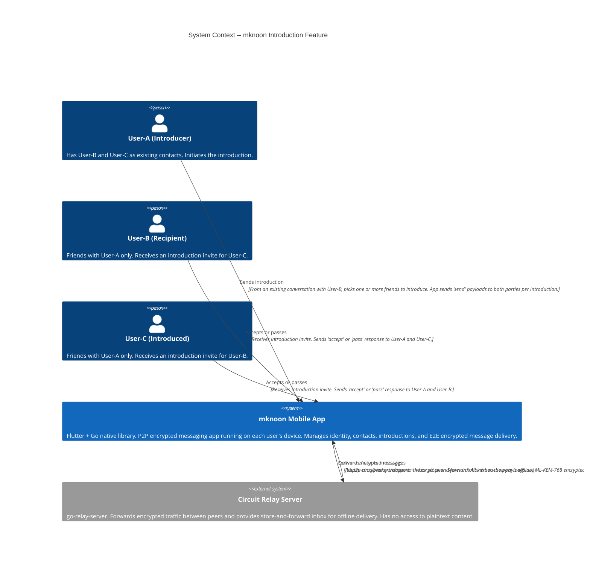

# C4 Model -- Level 1: System Context -- Intro Feature

## Scope

The Introduction feature allows a mutual friend (User-A) to connect two people
(User-B and User-C) who do not yet know each other. Both parties must accept
the introduction before they become contacts.

---

## Diagram



---

## Actors

| Actor | Role | Pre-condition |
|-------|------|---------------|
| **User-A (Introducer)** | Initiates the introduction | Has both User-B and User-C as existing contacts |
| **User-B (Recipient)** | Receives the introduction invite | Friends with User-A only; not friends with User-C |
| **User-C (Introduced)** | Receives the introduction invite | Friends with User-A only; not friends with User-B |

---

## Systems

### mknoon Mobile App (primary system)

- Runs on each user's device (Flutter UI + Go native library via MethodChannel)
- Each instance holds the user's identity: Ed25519 keypair + ML-KEM-768 post-quantum keys
- Manages the local encrypted database (SQLCipher) with introductions table, outbox, and pending-response tracking
- Handles all introduction logic locally: send, accept, pass, mutual-acceptance contact creation
- Encrypts every introduction payload with ML-KEM-768 + AES-256-GCM before transmission (v2 envelope); falls back to v1 plaintext envelope only when the target lacks an ML-KEM public key

### Circuit Relay Server (external system)

- `go-relay-server` -- a libp2p relay that facilitates peer connectivity
- **No application logic**: does not parse, validate, or store introduction state
- **No plaintext access**: only sees encrypted envelopes (type + version + encrypted block)
- Two delivery paths flow through the relay:
  - **Direct relay**: real-time forwarding via libp2p circuit-relay when both peers are online
  - **Inbox store-and-forward**: persists the encrypted envelope for later retrieval when the target peer is offline
- Provides relay-probe capability so the sender can check whether the target has an active reservation

---

## Data Flows (Introduction Lifecycle)

### 1. Send Introduction (User-A -> User-B, User-A -> User-C)

```
User-A's App                  Relay Server              User-B's App / User-C's App
     |                             |                              |
     |-- "send" payload (v2) ---->|------- forward/store ------->|
     |   (encrypted with          |                              |
     |    target's ML-KEM key)    |                              |
     |                             |                              |
```

- From an existing conversation with User-B, User-A taps "Introduce to your circle" and multi-selects one or more friends (User-C, User-D, ...) to introduce
- For each selected friend, the app creates a single `introductionId` (UUID) shared by both sides — each introduction has its own independent lifecycle
- App builds two `send` payloads per introduction, each containing both parties' public keys (Ed25519 + ML-KEM)
- Each payload is encrypted with the target's ML-KEM public key (already known from existing contact)
- Delivery uses a multi-strategy fallback: already-connected fast path -> local WiFi (1.5 s budget) racing direct P2P dial (4 s budget) -> relay probe -> inbox store-and-forward

### 2. Accept / Pass (User-B -> User-A + User-C, User-C -> User-A + User-B)

```
User-B's App                  Relay Server              User-A's App / User-C's App
     |                             |                              |
     |-- "accept" payload (v2) -->|------- forward/store ------->|
     |                             |                              |
```

- Each party independently decides to accept or pass
- An `accept` or `pass` payload is sent to both the introducer (User-A) and the other party
- When sending to the other party (not yet a contact), the ML-KEM key from the introduction record is used for encryption

### 3. Mutual Acceptance (automatic -- both accepted)

```
[Both accept payloads received]
     |
     v
Local app derives status = mutualAccepted
     |
     v
Creates new ContactModel for the other party
(using public keys exchanged via the introduction)
     |
     v
User-B and User-C are now contacts
```

- When both `recipientStatus` and `introducedStatus` reach `accepted`, the overall status becomes `mutualAccepted`
- The app creates a new contact record with the other party's Ed25519 + ML-KEM public keys (carried in the original `send` payload)
- A system message "You and [name] are now connected — introduced by [introducer]" is inserted into the new conversation
- No additional key exchange or QR scan is required -- the introducer already vouched for and transmitted the keys

---

## Key Constraints

- **No central authority**: The relay server is a dumb pipe. All introduction state lives on each user's device.
- **Both must accept**: A single acceptance is not enough. The overall status remains `pending` until both parties accept (or one passes / the introduction expires after 30 days). An `alreadyConnected` guard status prevents duplicate introductions when the two parties are already contacts.
- **Introducer vouches for keys**: User-A transmits User-B's public keys to User-C and vice versa. This is the trust bridge that replaces QR-code scanning.
- **E2E encryption preserved**: Introduction payloads between User-A and User-B/C use existing contact keys. Payloads between User-B and User-C (who are not yet contacts) use keys carried in the introduction record.
- **Offline delivery**: If a peer is offline, the encrypted envelope is stored in the relay's inbox for later retrieval. An outbox with retry logic ensures delivery.
