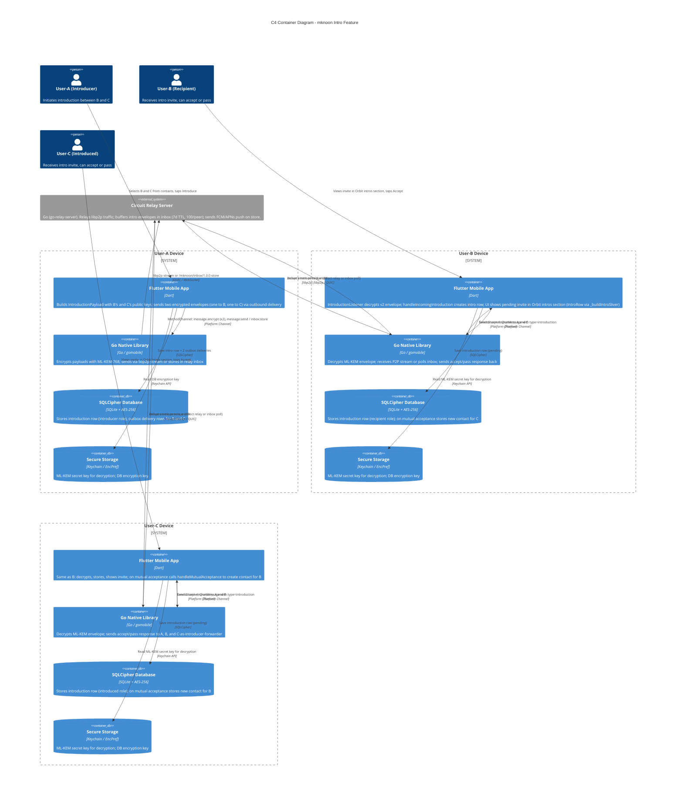

# C4 Model -- Level 2: Container Diagram -- Intro Feature

**System:** mknoon P2P Messaging App
**Scope:** Introduction feature -- User-A introduces User-B to User-C; both accept to become contacts.
**Notation:** C4 Container level. All containers run on-device except the Circuit Relay Server.

---

## Containers

### 1. Flutter Mobile App (Dart)

UI layer, application logic, and local data orchestration. Each user (A, B, C) runs their own instance.

**Key components involved in the intro feature:**

| Layer | Component | Responsibility |
|-------|-----------|----------------|
| Presentation | `IntroRow`, `IntroGroupHeader` | Display pending / accepted / passed introductions in the Orbit screen (inlined via `_buildIntroSliver()` in `OrbitScreen`) |
| Presentation | `IntrosTab` | Standalone reusable widget grouping `IntroRow` and `IntroGroupHeader`; not used in production code (exercised only in dedicated widget tests) |
| Presentation | `IntroBanner` | Conversation-screen and Orbit-screen banner prompting the user to introduce a contact to their circle ("Make introductions" / "Maybe later" in conversation; pending-count variant in Orbit via `_buildIntroBanner()`) |
| Presentation | `IntroductionConnectionCard` | Renders introduction events in the Feed |
| Presentation | `IntroSystemMessage` | Inline system message inside a conversation ("Connected through ...") |
| Application | `IntroductionListener` | Subscribes to the typed introduction stream from `IncomingMessageRouter`; decrypts v2 envelopes or parses v1 payloads; dispatches to `handleIncomingIntroduction` |
| Application | `sendIntroductions` (use case) | Initiator flow: builds `IntroductionPayload` for both parties, calls `deliverIntroductionPayloadReliably` twice (to B and C), persists `IntroductionModel`; supports batch processing up to 10 concurrent chains |
| Application | `acceptIntroduction` (use case) | Accept flow: updates own party's status, derives overall status, sends accept payload to both introducer and other party, triggers `handleMutualAcceptance` if warranted |
| Application | `passIntroduction` (use case) | Decline flow: updates own party's status, sends pass payload to introducer and other party |
| Application | `handleIncomingIntroduction` (use case) | Processes incoming `send`, `accept`, `pass` actions; creates/updates `IntroductionModel`; defers out-of-order responses via `PendingIntroductionResponse` |
| Application | `handleMutualAcceptance` (use case) | When both parties accept: creates a `ContactModel` for the other party, inserts a system message, triggers fire-and-forget avatar download with retry |
| Application | `deliverIntroductionPayloadReliably` (outbound delivery) | Builds v1/v2 envelope, stages in outbox, attempts direct send -> race (local/direct) -> relay probe -> inbox fallback |
| Application | `retryPendingIntroductionDeliveries` | Retries failed/pending outbox rows via inbox store-and-forward |
| Application | `insertIntroSystemMessage` (helper) | Creates system messages in conversation history with `transport: 'system'` marker |
| Application | `shouldShowIntroBanner` (use case) | Determines whether the intro banner appears in a conversation based on contact state (not blocked, not archived, banner not dismissed, intros not sent), message count (< 3), and available contacts (≥ 1 other) |
| Application | `loadIntroductionsForUser` (use case) | Loads pending introductions for a user (as recipient or introduced party); includes `groupByIntroducer` helper for UI display grouping |
| Application | `expireOldIntroductions` (use case) | Lifecycle reconciliation: derives status from timestamps, heals stale rows, reruns missed mutual-acceptance side effects |
| Application | `resolveUnknownInboxSender` (use case) | Edge-case handler for inbox messages from unknown senders during introduction handshake; returns `rejected`, `retryable`, or `contactRecovered` |
| Application | `IntroductionCopy` | Human-readable strings for notifications and system messages |
| Domain | `IntroductionPayload` | Wire-format model; v1 JSON envelope `{"type":"introduction","version":"1","payload":{...}}`; v2 encrypted envelope with ML-KEM KEM ciphertext |
| Domain | `IntroductionModel` | Persistent model with `recipientStatus`, `introducedStatus`, `overallStatus`; derives `mutualAccepted` / `passed` / `expired` |
| Domain | `IntroductionOutboxDelivery` | Durable outbox row tracking per-target delivery status and transport path |
| Domain | `PendingIntroductionResponse` | Staged accept/pass that arrived before the `send` row exists |
| Domain | `IntroductionRepository` | Abstract repo; CRUD for introductions, pending responses, and outbox deliveries |
| Infrastructure | `IntroductionRepositoryImpl` | Delegates to DB helper functions against the `introductions`, `pending_introduction_responses`, and `introduction_outbox_deliveries` tables |

### 2. Go Native Library (go-mknoon)

Compiled via gomobile into `.xcframework` (iOS) / `.aar` (Android). Provides all networking and cryptography. Communicates with Flutter via MethodChannel / EventChannel.

**Intro-feature responsibilities:**

| Capability | Bridge Command | Role in intro flow |
|------------|---------------|--------------------|
| ML-KEM-768 key encapsulation | `message.encrypt` | Encrypts inner introduction JSON with the target's ML-KEM public key to produce a v2 envelope (KEM ciphertext + AES-256-GCM ciphertext + nonce) |
| ML-KEM-768 decapsulation | `message.decrypt` | Decrypts a received v2 introduction envelope back to inner JSON |
| P2P direct send | `message:send` (bridge) / `sendMessageWithReply` (Dart P2PService) | Delivers introduction envelope directly to online peer over libp2p stream |
| Peer discovery | `rendezvous:discover` | Finds target peer via rendezvous on the relay |
| Peer dial | `peer:dial` | Establishes libp2p connection (direct or relayed) to target |
| Inbox store | `inbox:store` | Stores introduction envelope in the relay inbox for offline target |
| Relay probe | `relay:probe` | Checks whether target peer has an active relay reservation before attempting relay send |
| Local send | `sendLocalMessage` (Dart P2PService) | Delivers to a peer on the same LAN (mDNS discovered). **Not a Go bridge command** — handled entirely at the Dart service layer (`P2PService.sendLocalMessage()`). Listed here for delivery-strategy completeness. |
| Direct-ack confirm | `message:confirm` | Confirms receipt of a direct-stream message (nonce-based) |
| Event stream | EventChannel | Forwards incoming `ChatMessage` events (including introduction type) to Dart |

### 3. SQLCipher Database

Local encrypted SQLite database (AES-256, random key stored in Secure Storage). Stores all persistent state on-device.

**Intro-feature tables:**

| Table | Key Columns | Purpose |
|-------|-------------|---------|
| `introductions` | `id`, `introducer_id`, `recipient_id`, `introduced_id`, `introducer_username`, `recipient_username`, `introduced_username`, `recipient_status`, `introduced_status`, `status`, `created_at`, `recipient_responded_at`, `introduced_responded_at`, `recipient_public_key`, `recipient_ml_kem_public_key`, `introduced_public_key`, `introduced_ml_kem_public_key` | Persists each introduction with per-party and overall status, including response timestamps. Key columns exist only for recipient and introduced parties (not the introducer). |
| `pending_introduction_responses` | `response_key`, `introduction_id`, `action`, `responder_id`, `responder_username`, `created_at` | Stages accept/pass messages that arrive before the introduction `send` row |
| `introduction_outbox_deliveries` | `delivery_id`, `introduction_id`, `action`, `target_peer_id`, `sender_peer_id`, `raw_envelope`, `delivery_status`, `delivery_path`, `last_error`, `created_at`, `updated_at` | Durable outbox for reliable outbound delivery with retry |
| `contacts` | `peer_id`, `public_key`, `ml_kem_public_key`, `username`, `introduced_by`, `introduced_by_peer_id`, `intros_banner_dismissed`, `intros_sent_at` | Stores new contact created on mutual acceptance; tracks intro banner state per contact |
| `messages` | `id`, `contact_peer_id`, `sender_peer_id`, `text`, `timestamp`, `status`, `is_incoming`, `transport`, `created_at` | Stores system messages ("Connected through [introducer]") with `transport = 'system'` to distinguish from regular messages |

**DB helper functions:**

| Helper file | Functions |
|-------------|-----------|
| `introductions_db_helpers.dart` | `dbInsertIntroduction`, `dbDeleteIntroduction`, `dbLoadIntroduction`, `dbLoadIntroductionsByRecipient`, `dbLoadIntroductionsByIntroduced`, `dbLoadIntroductionsByIntroducer`, `dbLoadIntroductionsForRecipientAndIntroducer`, `dbUpdateRecipientStatus`, `dbUpdateIntroducedStatus`, `dbUpdateOverallStatus`, `dbLoadPendingIntroductionsForUser`, `dbCountPendingIntroductions` |
| `pending_introduction_responses_db_helpers.dart` | `dbUpsertPendingIntroductionResponse`, `dbLoadPendingIntroductionResponses`, `dbDeletePendingIntroductionResponse` |
| `introduction_outbox_db_helpers.dart` | `dbUpsertIntroductionOutboxDelivery`, `dbDeleteIntroductionOutboxDelivery`, `dbDeleteIntroductionOutboxDeliveriesForIntroduction`, `dbLoadIntroductionOutboxDeliveriesForIntroduction`, `dbLoadRetryableIntroductionOutboxDeliveries` |
| `contacts_db_helpers.dart` (intro-related) | `dbDismissIntroBanner`, `dbSetIntrosSentAt` |

### 4. Secure Storage (iOS Keychain / Android EncryptedSharedPreferences)

Platform-native credential store. Never leaves the device.

**Intro-feature data accessed:**

| Key | Usage in intro flow |
|-----|---------------------|
| `identity_ml_kem_secret_key` | Decrypting incoming v2 introduction envelopes (ML-KEM decapsulation) |
| `db_encryption_key` | Unlocking the SQLCipher database that stores introduction rows |

### 5. Circuit Relay Server (go-relay-server)

Go server deployed externally. Relays libp2p traffic between peers. No message content storage beyond the short-lived inbox buffer.

**Intro-feature responsibilities:**

| Capability | Protocol | Role |
|------------|----------|------|
| Circuit relay | libp2p `/p2p-circuit` | Forwards introduction packets between User-A, B, C when direct connections are not possible |
| Inbox store-and-forward | `/mknoon/inbox/1.0.0` | Buffers introduction envelopes (up to 100 per peer, 7-day TTL, 128 KB max frame) for offline recipients |
| Push notification trigger | FCM / APNs via Firebase | Sends push notification on inbox store: title = "New Introduction", body = "Open Mknoon to review" |
| Peer rendezvous | libp2p rendezvous | Allows peers to discover each other by peer ID for direct connection establishment |
| Deduplication | `messageId` field on envelope | Prevents duplicate inbox entries when retries occur |

---

## Container Diagram (Mermaid C4)



---

## Data Flow by Phase

### Phase A: User-A Sends Introduction

```
User-A taps "Introduce" selecting User-B and User-C
         |
         v
[Flutter App - User-A]
  1. Reads B's contact (peer_id, public_key, ml_kem_public_key) from SQLCipher
  2. Reads C's contact (peer_id, public_key, ml_kem_public_key) from SQLCipher
  3. Constructs IntroductionPayload (action: 'send') with:
     - introductionId (UUID)
     - introducerId: A's peer_id
     - recipientId: B's peer_id, recipientPublicKey, recipientMlKemPublicKey
     - introducedId: C's peer_id, introducedPublicKey, introducedMlKemPublicKey
     - introducerUsername, recipientUsername, introducedUsername
     - timestamp (UTC ISO 8601)
  4. Calls deliverIntroductionPayloadReliably() TWICE (once for B, once for C):
         |
         v
[Go Native Library - User-A]
  5. For each target (B, C):
     a. If target has ml_kem_public_key:
        - Bridge command: message.encrypt(recipientMlKemPublicKey, innerJson)
        - Produces v2 envelope: {"type":"introduction","version":"2","messageId":...,"senderPeerId":...,"encrypted":{"kem":...,"ciphertext":...,"nonce":...}}
     b. Else: v1 envelope (plaintext JSON)
  6. Delivery strategy (tiered):
     a. If already connected to target: sendMessageWithReply (direct stream, 4s timeout)
     b. Interactive race: local peer (LAN) vs rendezvous:discover + peer:dial + sendMessageWithReply
     c. If race fails: relay:probe, then dial + retry send (up to 2 attempts, 250ms backoff)
     d. Final fallback: inbox:store on relay server
  7. Updates IntroductionOutboxDelivery status in SQLCipher (delivered/sent/failed)
  8. Saves IntroductionModel to SQLCipher (status: pending) — after delivery attempts
         |
         v
[Circuit Relay Server]
  9. If inbox:store path: buffers envelope (deduped by messageId, max 100/peer, 7d TTL)
  10. Sends push notification: title="New Introduction", body="Open Mknoon to review"
```

### Phase B: User-B and User-C Receive Invite

```
[Circuit Relay Server] or [direct libp2p stream]
  1. Delivers introduction envelope to target's Go library
         |
         v
[Go Native Library - User-B/C]
  2. Receives ChatMessage via P2P stream or inbox poll
  3. Forwards to Flutter via EventChannel
         |
         v
[Flutter App - User-B/C]
  4. IncomingMessageRouter routes message with type="introduction" to IntroductionListener
  5. IntroductionListener.processIncomingMessage():
     a. Tries v2 decryption first:
        - Reads own ML-KEM secret key from Secure Storage
        - Bridge command: message.decrypt(ownMlKemSecretKey, kem, ciphertext, nonce)
        - Produces inner JSON
     b. Falls back to v1 envelope parsing if not v2
     c. Parses IntroductionPayload from inner JSON
     d. Block check: rejects 'send' from blocked contacts
  6. handleIncomingIntroduction() use case:
     a. Checks for duplicate (same introductionId or same pair from same introducer)
     b. Creates IntroductionModel in SQLCipher (recipientStatus: pending, introducedStatus: pending)
     c. Checks if the other party is already a contact -> sets status to alreadyConnected
     d. Replays any PendingIntroductionResponses that arrived before this 'send'
  7. IntroductionListener broadcasts on introReceivedStream
  8. Inserts system message in introducer's conversation: "[Introducer] introduced [Name] to you" (or "[Introducer] introduced you to [Name]" if you are the introduced party)
  9. Shows local notification: title="New Introduction"
  10. UI updates: Orbit intros section shows pending invite with Accept/Pass actions via IntroRow (rendered by `_buildIntroSliver()` in OrbitScreen)
         |
         v
[User-B/C sees invite, can Accept or Pass]
```

### Phase C: Both Accept -> Become Contacts

```
User-B taps "Accept" in Orbit intros section
         |
         v
[Flutter App - User-B]
  1. Constructs IntroductionPayload (action: 'accept'):
     - introductionId (same UUID)
     - responderId: B's peer_id
     - responderUsername: B's username
     - timestamp
  2. Calls deliverIntroductionPayloadReliably() to BOTH User-A and User-C
  3. Updates own introduction row: recipientStatus -> accepted
         |
         v
[Go Native Library - User-B]
  4. Encrypts + sends accept envelope to A and C (same delivery strategy as Phase A)
         |
         v
[Circuit Relay Server]
  5. Relays accept envelope to A and C (or buffers in inbox)

---

User-C taps "Accept" in Orbit intros section (may happen before or after B)
         |
         v
[Flutter App - User-C]
  6. Same flow: builds accept payload, delivers to A and B
  7. Updates own introduction row: introducedStatus -> accepted

---

When SECOND accept arrives at any node:
         |
         v
[Flutter App - receiving node]
  8. handleIncomingIntroduction() -> _handleResponse():
     a. Updates the responding party's status (accepted)
     b. Calls IntroductionModel.deriveStatus():
        - recipientStatus == accepted AND introducedStatus == accepted
        - => IntroductionOverallStatus.mutualAccepted
     c. Updates overall status in SQLCipher
  9. handleMutualAcceptance() is triggered:
     a. Determines other party's identity:
        - If I am recipient (B): other = introduced (C)
        - If I am introduced (C): other = recipient (B)
     b. Reads other party's public keys from the IntroductionModel
        (these were embedded in the original 'send' payload by User-A)
     c. Creates ContactModel:
        - peerId: other's peer_id
        - publicKey: other's Ed25519 public key
        - mlKemPublicKey: other's ML-KEM public key
        - username: other's username
        - introducedBy: introducer's username
        - introducedByPeerId: introducer's peer_id
     d. Saves new contact to SQLCipher contacts table
     e. Fires background avatar download for new contact
     f. Inserts system message: "You and [Name] are now connected — introduced by [introducer]"
  10. IntroductionListener broadcasts on introStatusChangedStream
  11. Shows local notification: title="New Connection", body="[X] also accepted! You're now connected."
  12. UI updates: Orbit intros section shows completion state; new contact appears in contacts list
```

---

## Relationship Summary

| From | To | Protocol / Mechanism | Data in Intro Flow |
|------|----|---------------------|--------------------|
| Flutter App | Go Native Library | MethodChannel (sync request/response) | `message.encrypt`, `message.decrypt`, `message:send`, `rendezvous:discover`, `peer:dial`, `inbox:store`, `relay:probe`, `message:confirm` |
| Go Native Library | Flutter App | EventChannel (async stream) | Incoming `ChatMessage` with `type=introduction` content |
| Flutter App | SQLCipher Database | sqflite_sqlcipher API | INSERT/UPDATE/SELECT on `introductions`, `pending_introduction_responses`, `introduction_outbox_deliveries`, `contacts`, `messages` |
| Flutter App | Secure Storage | flutter_secure_storage API | READ `identity_ml_kem_secret_key` (decrypt), `db_encryption_key` (unlock DB) |
| Go Native Library (peer A) | Circuit Relay Server | libp2p QUIC/WebSocket + `/mknoon/inbox/1.0.0` | Introduction envelope (v1 or v2 encrypted) |
| Circuit Relay Server | Go Native Library (peer B/C) | libp2p circuit relay or inbox poll | Buffered introduction envelope + FCM/APNs push |
| Go Native Library (peer A) | Go Native Library (peer B/C) | libp2p direct stream (when both online) | Introduction envelope delivered without relay involvement |

---

## Envelope Formats

**v1 (plaintext, fallback):**
```json
{
  "type": "introduction",
  "version": "1",
  "messageId": "<introductionId>",
  "payload": {
    "action": "send|accept|pass",
    "introductionId": "<uuid>",
    "introducerId": "<peer-id>",
    "introducerUsername": "Alice",
    "recipientId": "<peer-id>",
    "recipientUsername": "Bob",
    "recipientPublicKey": "<ed25519-pub-b64>",
    "recipientMlKemPublicKey": "<mlkem768-pub-b64>",
    "introducedId": "<peer-id>",
    "introducedUsername": "Carol",
    "introducedPublicKey": "<ed25519-pub-b64>",
    "introducedMlKemPublicKey": "<mlkem768-pub-b64>",
    "timestamp": "2026-04-08T12:00:00.000Z"
  }
}
```

**v2 (ML-KEM-768 encrypted, preferred):**
```json
{
  "type": "introduction",
  "version": "2",
  "messageId": "<introductionId>",
  "senderPeerId": "<sender-peer-id>",
  "encrypted": {
    "kem": "<mlkem768-kem-ciphertext-b64>",
    "ciphertext": "<aes256gcm-ciphertext-b64>",
    "nonce": "<aes256gcm-nonce-b64>"
  }
}
```

The inner plaintext (after decryption) has the same structure as the v1 `payload` object.

> **Note:** Introduction envelopes use `"messageId"` at the envelope level, whereas other message types (e.g., `chat_message`, `group_invite`) use `"id"`. This is intentional -- relay-side inbox deduplication cannot inspect encrypted introduction payloads, so retries must carry a cleartext message ID at the envelope level for dedupe purposes.

---

## Outbound Delivery Strategy

Each introduction envelope follows a tiered delivery strategy with durable outbox persistence:

```
1. Already connected?  --> sendMessageWithReply (direct stream, 4s timeout)
2. Interactive race:
   a. Local peer (LAN)?  --> sendLocalMessage via mDNS (Dart service layer, no bridge command)
   b. rendezvous:discover + peer:dial + sendMessageWithReply (direct, 4s timeout)
3. Relay probe:
   - relay:probe checks if target has active relay reservation
   - If connected: dial + retry send (up to 2 attempts with backoff)
4. Inbox fallback:
   - inbox:store on relay server (store-and-forward, 7d TTL)
5. All failed:
   - OutboxDelivery row persisted with status=failed
   - retryPendingIntroductionDeliveries() runs on app resume and retries via inbox
```

Each step is tracked in the `introduction_outbox_deliveries` table with `delivery_status` (sending/sent/delivered/failed) and `delivery_path` (pending/local/direct/relay/inbox).
