# C4 Model -- Level 3: Component Diagram -- Introduction Feature

**System:** mknoon (Flutter + Go P2P messaging app)
**Container:** Flutter Mobile App
**Scope:** All components involved in introducing two contacts who do not yet know each other.

---

## Mermaid Diagram

```mermaid
C4Component
    title Component Diagram — Introduction Feature (Flutter Mobile App)

    Container_Boundary(flutter_app, "Flutter Mobile App") {

        Boundary(presentation, "Presentation Layer") {
            Component(friendPickerWired, "FriendPickerWired", "StatefulWidget", "User-A selects friends to introduce to recipient. Manages selection state, triggers sendIntroductions use case.")
            Component(friendPickerScreen, "FriendPickerScreen", "StatelessWidget", "Pure rendering: contact list with checkboxes, search filter, send button with progress.")
            Component(sentConfirmationWired, "SentConfirmationWired", "StatelessWidget", "Post-send confirmation. Shows count and names of introduced friends.")
            Component(sentConfirmationScreen, "SentConfirmationScreen", "StatelessWidget", "Pure rendering: success checkmark, introduced usernames, back-to-conversation button.")
            Component(orbitWired, "OrbitWired", "StatefulWidget", "Orbit screen. Manages _groupedIntros state and passes OrbitIntrosViewData (grouped intros, callbacks, blocked peers) to OrbitScreen for rendering. IntrosTab widget exists but is not used in the active rendering path.")
            Component(introRow, "IntroRow", "StatelessWidget", "Single introduction card. Shows introduced person's name, introducer, status, accept/pass buttons.")
            Component(introGroupHeader, "IntroGroupHeader", "StatelessWidget", "Section header: 'From [introducer username]'.")
            Component(introBanner, "IntroBanner", "StatelessWidget", "Banner in 1:1 conversation suggesting User-A introduce the contact to others.")
            Component(introSystemMessage, "IntroSystemMessage", "StatelessWidget", "Generic in-conversation system message renderer for all introduction events: introducer confirmations ('You introduced X to Y'), incoming intro notifications, and mutual acceptance ('Connected through [introducer]').")
        }

        Boundary(application, "Application Layer") {
            Component(sendIntroUC, "sendIntroductions", "Top-level fn", "User-A picks contacts. Creates IntroductionPayload per pair, persists IntroductionModel, sends encrypted P2P messages to both parties via deliverIntroductionPayloadReliably.")
            Component(acceptIntroUC, "acceptIntroduction", "Top-level fn", "Updates own party status to accepted. Derives overall status. Sends 'accept' payload to introducer AND other party. If mutual: triggers handleMutualAcceptance.")
            Component(passIntroUC, "passIntroduction", "Top-level fn", "Updates own party status to passed. Derives overall status. Sends 'pass' payload to introducer AND other party.")
            Component(handleIncomingIntroUC, "handleIncomingIntroduction", "Top-level fn", "Dispatches by action: 'send' creates IntroductionModel row. 'accept'/'pass' updates party status, derives overall, triggers handleMutualAcceptance if mutualAccepted. Defers responses that arrive before the intro row. Replays deferred responses.")
            Component(handleMutualUC, "handleMutualAcceptance", "Top-level fn", "On mutual acceptance: creates ContactModel for the other party via ContactRepository.addContact (with introducedBy/introducedByPeerId metadata). Inserts system message. Downloads avatar (fire-and-forget with 5s retry). Idempotent (skips if contact exists).")
            Component(introListener, "IntroductionListener", "Class", "Subscribes to an injected introductionStream (wired from IncomingMessageRouter in main.dart). Decrypts v2 envelopes via Bridge or parses v1. Rejects 'send' from blocked contacts. Calls handleIncomingIntroduction. Broadcasts to introReceivedStream and introStatusChangedStream. Shows local notifications. Confirms direct-message nonces. ML-KEM secret key retrieved via injected closure (not SecureKeyStore directly).")
            Component(outboundDelivery, "deliverIntroductionPayloadReliably", "Top-level fn", "Durable outbound delivery. Builds v1/v2 envelope, stages in outbox table, attempts delivery cascade: connected-direct > race(local || discover+dial) > relay-probe > inbox fallback. Records delivery path and status.")
            Component(retryDeliveries, "retryPendingIntroductionDeliveries", "Top-level fn", "Retries failed/stale outbox rows via inbox-only fallback on app resume. Does not re-attempt the full delivery cascade. Returns Future<int> (count of successfully delivered items).")
            Component(loadIntrosUC, "loadIntroductionsForUser / groupByIntroducer", "Top-level fns", "loadIntroductionsForUser loads pending and already-connected introductions. groupByIntroducer groups them by introducer for OrbitWired display.")
            Component(checkIntroBannerUC, "shouldShowIntroBanner", "Top-level fn", "Decides whether to show the 'Introduce this friend' banner in a 1:1 conversation.")
            Component(expireOldIntrosUC, "expireOldIntroductions", "Top-level fn", "Startup reconciliation. Re-derives stale overall statuses. Heals upgrade-path rows. Reruns mutual acceptance for missed contacts.")
            Component(resolveUnknownUC, "resolveUnknownInboxSender", "Top-level fn", "Decides fate of inbox messages from unknown senders. If sender is part of an accepted intro, keeps message retryable until contact materializes.")
            Component(insertSystemMsg, "insertIntroSystemMessage", "Top-level fn", "Inserts 'Connected through [name]' system message into the new conversation thread.")
            Component(introCopy, "formatIntroducerIntroductionSystemMessage / formatIncomingIntroductionMessage / formatMutualAcceptanceSystemMessage", "Top-level fns", "Copy-text formatters for system messages and notifications. Introducer variant produces 'You introduced X to Y'.")
        }

        Boundary(domain, "Domain Layer") {
            Component(introModel, "IntroductionModel", "Data class", "id, introducerId, recipientId, introducedId, recipientStatus, introducedStatus, status (overall: pending/mutualAccepted/passed/expired/alreadyConnected), createdAt, responded-at timestamps, usernames, public keys (Ed25519 + ML-KEM) for recipient and introduced parties only (no introducer keys). deriveStatus() computes overall from party statuses + 30-day expiry; alreadyConnected is set externally, not derived.")
            Component(introPayload, "IntroductionPayload", "Data class", "Wire-format model. Actions: send, accept, pass. Serializes to v1 JSON envelope or v2 encrypted envelope. Parses both directions. Fields: action, introductionId, introducer/recipient/introduced IDs + usernames, recipient/introduced public keys (Ed25519 + ML-KEM; no introducer keys), responderId, responderUsername, timestamp.")
            Component(pendingResponse, "PendingIntroductionResponse", "Data class", "Durable staging for accept/pass responses that arrive before the 'send' intro row exists locally. responseKey = introductionId::responderId::action.")
            Component(outboxDelivery, "IntroductionOutboxDelivery", "Data class", "Durable outbox row. deliveryId, introductionId, action, targetPeerId, senderPeerId, rawEnvelope, deliveryStatus (sending/sent/delivered/failed), deliveryPath (pending/local/direct/relay/inbox), lastError, createdAt, updatedAt. Status/path are String fields backed by static-const helper classes (IntroductionOutboxDeliveryStatus, IntroductionOutboxDeliveryPath), not Dart enums.")
            Component(introRepo, "IntroductionRepository", "Abstract", "Interface: saveIntroduction, getIntroduction, deleteIntroduction, updateRecipientStatus, updateIntroducedStatus, updateOverallStatus, getPendingIntroductionsForUser, countPendingIntroductions, savePendingResponse, loadPendingResponses, saveOutboxDelivery, loadRetryableOutboxDeliveries, etc.")
            Component(introRepoImpl, "IntroductionRepositoryImpl", "Class", "Implements IntroductionRepository. Constructor-injected DB helper functions (not raw DB). Delegates all persistence to typed function references.")
        }

        Boundary(data, "Data Layer") {
            Component(introDbHelpers, "introductions_db_helpers", "Plain fns", "dbInsertIntroduction, dbLoadIntroduction, dbDeleteIntroduction, dbLoadIntroductionsByRecipient/Introduced/Introducer, dbLoadIntroductionsForRecipientAndIntroducer, dbUpdateRecipientStatus, dbUpdateIntroducedStatus, dbUpdateOverallStatus, dbLoadPendingIntroductionsForUser, dbCountPendingIntroductions.")
            Component(pendingResponseDbHelpers, "pending_introduction_responses_db_helpers", "Plain fns", "dbUpsertPendingIntroductionResponse, dbLoadPendingIntroductionResponses, dbDeletePendingIntroductionResponse. Separate file for pending_introduction_responses table operations.")
            Component(outboxDbHelpers, "introduction_outbox_db_helpers", "Plain fns", "dbUpsertIntroductionOutboxDelivery, dbLoadIntroductionOutboxDeliveriesForIntroduction, dbLoadRetryableIntroductionOutboxDeliveries, dbDeleteIntroductionOutboxDelivery, dbDeleteIntroductionOutboxDeliveriesForIntroduction.")
            Component(introMigration019, "019_introductions_table", "Migration", "CREATE TABLE introductions with CHECK constraints on status enums. Indexes on introducer_id, recipient_id, introduced_id.")
            Component(introMigration022, "022_introduction_keys / 023 / 025", "Migrations", "Adds introduced_public_key, introduced_ml_kem_public_key, recipient_public_key, recipient_ml_kem_public_key columns. Adds already_connected to status CHECK.")
        }

        Boundary(existing, "Existing Shared Components") {
            Component(contactRepo, "ContactRepository", "Abstract", "addContact, getContact, getAllContacts, contactExists, blockContact, setIntrosSentAt, dismissIntroBanner.")
            Component(messageRepo, "MessageRepository", "Abstract", "Used to insert system messages into conversation threads.")
            Component(p2pService, "P2PService", "Abstract", "messageStream, sendMessageWithReply, sendLocalMessage, discoverPeer, dialPeer, storeInInbox, probeRelay, isLocalPeer, isConnectedToPeer.")
            Component(messageRouter, "IncomingMessageRouter", "Class", "Single subscription on P2PService.messageStream. Parses type field, dispatches to typed broadcast streams. Routes type='introduction' to introductionStream.")
            Component(bridge, "bridge.dart module", "Abstract + helpers", "Bridge abstract class (send, initialize, checkHealth, etc.) + module-level helper functions callEncryptMessage/callDecryptMessage (take Bridge as param) for ML-KEM-768 + AES-256-GCM encryption. GoBridgeClient impl uses MethodChannel to Go native layer.")
            Component(secureKeyStore, "SecureKeyStore", "Abstract", "Generic key-value store (read/write/delete/containsKey). Stores and retrieves identity_ml_kem_secret_key used for decryption of incoming v2 envelopes.")
            Component(notificationService, "NotificationService", "Class", "showNotification for local push on new introduction or mutual acceptance.")
            Component(identityRepo, "IdentityRepository", "Abstract", "loadIdentity() for own peerId, username, keys during send flow.")
            Component(sqlcipher, "SQLCipher DB", "Encrypted DB", "introductions, pending_introduction_responses, introduction_outbox_deliveries tables.")
        }
    }

    Boundary(external, "External") {
        Component(goRelay, "Go Relay Server", "Go process", "Inbox store-and-forward. Circuit relay for P2P connectivity.")
        Component(otherPeer, "Other Peer (User-B / User-C)", "Flutter App", "Receives introduction payloads. Sends accept/pass responses.")
    }

    %% === SEND INTRODUCTION FLOW (User-A) ===
    Rel(friendPickerWired, friendPickerScreen, "Delegates rendering")
    Rel(friendPickerWired, identityRepo, "loadIdentity() for own peerId/username before send")
    Rel(friendPickerWired, sendIntroUC, "Calls with selected contacts + resolved identity")
    Rel(sendIntroUC, contactRepo, "getContact() for recipient keys")
    Rel(sendIntroUC, outboundDelivery, "Calls per party with IntroductionPayload")
    Rel(sendIntroUC, introRepo, "saveIntroduction()")
    Rel(sendIntroUC, contactRepo, "setIntrosSentAt() on recipient")
    Rel(outboundDelivery, bridge, "callEncryptMessage for v2 ML-KEM envelope")
    Rel(outboundDelivery, introRepo, "saveOutboxDelivery / deleteOutboxDelivery")
    Rel(outboundDelivery, p2pService, "connected-direct > race(local || discover+dial) > relay-probe > inbox")
    Rel(friendPickerWired, sentConfirmationWired, "onIntroductionsSent callback -> ConversationWired navigates")
    Rel(sentConfirmationWired, sentConfirmationScreen, "Delegates rendering")

    %% === RECEIVE INTRODUCTION FLOW (User-B / User-C) ===
    Rel(p2pService, messageRouter, "Raw ChatMessage stream")
    Rel(messageRouter, introListener, "Typed introductionStream")
    Rel(introListener, bridge, "callDecryptMessage for v2 envelope")
    Rel(introListener, secureKeyStore, "getOwnMlKemSecretKey() via injected closure (not direct)")
    Rel(introListener, handleIncomingIntroUC, "Parsed IntroductionPayload")
    Rel(handleIncomingIntroUC, introRepo, "saveIntroduction / updateStatus / savePendingResponse")
    Rel(handleIncomingIntroUC, contactRepo, "contactExists() for already-connected check")
    Rel(introListener, notificationService, "showNotification on new intro")
    Rel(introListener, insertSystemMsg, "Insert system message in conversation")
    Rel(introListener, orbitWired, "introReceivedStream / introStatusChangedStream -> UI refresh")

    %% === ACCEPT INTRODUCTION FLOW (User-B or User-C) ===
    Rel(orbitWired, acceptIntroUC, "User taps Accept on IntroRow")
    Rel(acceptIntroUC, introRepo, "updateRecipientStatus / updateIntroducedStatus / updateOverallStatus")
    Rel(acceptIntroUC, outboundDelivery, "Send accept payload to introducer + other party")
    Rel(acceptIntroUC, handleMutualUC, "If both accepted")
    Rel(handleMutualUC, contactRepo, "addContact() -- creates new friendship")
    Rel(handleMutualUC, messageRepo, "Insert 'Connected through [name]' system message")
    Rel(handleMutualUC, bridge, "downloadProfilePicture use case (internally calls bridge)")

    %% === PASS INTRODUCTION FLOW ===
    Rel(orbitWired, passIntroUC, "User taps Pass on IntroRow")
    Rel(passIntroUC, introRepo, "updateStatus to passed")
    Rel(passIntroUC, outboundDelivery, "Send pass payload to introducer + other party")

    %% === DATA LAYER WIRING ===
    Rel(introRepoImpl, introDbHelpers, "Constructor-injected fn refs")
    Rel(introRepoImpl, pendingResponseDbHelpers, "Constructor-injected fn refs")
    Rel(introRepoImpl, outboxDbHelpers, "Constructor-injected fn refs")
    Rel(introDbHelpers, sqlcipher, "SQL queries on introductions table")
    Rel(pendingResponseDbHelpers, sqlcipher, "SQL queries on pending_introduction_responses table")
    Rel(outboxDbHelpers, sqlcipher, "SQL queries on introduction_outbox_deliveries table")

    %% === EXTERNAL ===
    Rel(p2pService, goRelay, "Circuit relay + inbox store-and-forward")
    Rel(outboundDelivery, otherPeer, "Encrypted introduction payloads via P2P")
    Rel(otherPeer, p2pService, "Accept/pass response messages")
```



---

## Component Inventory

### Presentation Layer

| Component | Type | File | Role |
|---|---|---|---|
| FriendPickerWired | StatefulWidget | `lib/features/introduction/presentation/screens/friend_picker_wired.dart` | State management for friend selection. Loads contacts, filters out recipient/blocked, manages checkbox state, calls `sendIntroductions`. Fires `onIntroductionsSent` callback on success; navigation to SentConfirmationWired is handled by the parent (`ConversationWired`), not FriendPickerWired itself. |
| FriendPickerScreen | StatelessWidget | `lib/features/introduction/presentation/screens/friend_picker_screen.dart` | Pure rendering: search bar, scrollable contact list with checkboxes, send button with progress indicator. |
| SentConfirmationWired | StatelessWidget | `lib/features/introduction/presentation/screens/sent_confirmation_wired.dart` | Passthrough wired wrapper for consistency with Wired/Screen pattern. |
| SentConfirmationScreen | StatelessWidget | `lib/features/introduction/presentation/screens/sent_confirmation_screen.dart` | Post-send success screen showing count and names of introduced friends. |
| IntrosTab | StatelessWidget | `lib/features/introduction/presentation/widgets/intros_tab.dart` | Standalone widget for rendering intros grouped by introducer. **Not used in active rendering path** -- OrbitWired manages `_groupedIntros` state and passes `OrbitIntrosViewData` to OrbitScreen for rendering. IntrosTab is referenced only in tests. |
| IntroRow | StatelessWidget | `lib/features/introduction/presentation/widgets/intro_row.dart` | Single introduction card with introduced person's name, status, and action buttons. Props: `introduction`, `displayUsername`, `displayPeerId?`, `showActions`, `onAccept?`, `onPass?`, `ownPartyStatus?`, `waitingForUsername?`, `onSendMessage?`, `isOtherBlocked`. |
| IntroGroupHeader | StatelessWidget | `lib/features/introduction/presentation/widgets/intro_group_header.dart` | Section header: "From [introducer username]". |
| IntroBanner | StatelessWidget | `lib/features/introduction/presentation/widgets/intro_banner.dart` | Banner in 1:1 conversation prompting User-A to introduce this contact to others. Props: `contactUsername`, `onMakeIntroductions`, `onMaybeLater`. Visibility controlled by parent (ConversationWired). |
| IntroSystemMessage | StatelessWidget | `lib/features/introduction/presentation/widgets/intro_system_message.dart` | Generic in-conversation system message renderer for all introduction events: introducer confirmations, incoming intro notifications, and mutual acceptance. |
| IntroductionConnectionCard | StatefulWidget | `lib/features/feed/presentation/widgets/introduction_connection_card.dart` | Renders introduction events (new intro, mutual acceptance) as animated cards in the Feed screen. Uses AnimationController for entry animations. Located in the feed feature, not the introduction feature directory. |

### Application Layer

| Component | Type | File | Role |
|---|---|---|---|
| sendIntroductions | Top-level fn | `lib/features/introduction/application/send_introduction_use_case.dart` | Orchestrates the introducer's send flow. Creates payloads for each pair, sends to both parties, persists IntroductionModel, sets introsSentAt on contact. Batches concurrent sends (max 10). |
| acceptIntroduction | Top-level fn | `lib/features/introduction/application/accept_introduction_use_case.dart` | Handles a user accepting an introduction. Updates own party status, derives overall, sends accept payload to introducer + other party. Calls `handleMutualAcceptance` if both parties accepted. |
| passIntroduction | Top-level fn | `lib/features/introduction/application/pass_introduction_use_case.dart` | Handles a user declining an introduction. Updates own party status, derives overall, sends pass payload to introducer + other party. |
| handleIncomingIntroduction | Top-level fn | `lib/features/introduction/application/handle_incoming_introduction_use_case.dart` | Processes incoming payloads. For 'send': creates IntroductionModel, checks already-connected, replays deferred responses. For 'accept'/'pass': updates party status, derives overall, triggers handleMutualAcceptance if mutualAccepted. Defers responses that arrive before the intro row. |
| handleMutualAcceptance | Top-level fn | `lib/features/introduction/application/handle_mutual_acceptance_use_case.dart` | Creates a ContactModel (with `introducedBy`/`introducedByPeerId` metadata) for the other party when both have accepted. Inserts "Connected through [name]" system message. Downloads avatar (fire-and-forget with 5s retry). Idempotent (skips if contact exists). |
| IntroductionListener | Class | `lib/features/introduction/application/introduction_listener.dart` | Subscribes to an injected `introductionStream` (wired from `IncomingMessageRouter` in `main.dart`). Decrypts v2 envelopes via Bridge, parses v1. Rejects 'send' from blocked contacts. Calls `handleIncomingIntroduction`. Broadcasts to `introReceivedStream` (new intros) and `introStatusChangedStream` (accept/pass updates). Shows local notifications. Confirms direct-message nonces. ML-KEM secret key retrieved via injected closure, not `SecureKeyStore` directly. |
| deliverIntroductionPayloadReliably | Top-level fn | `lib/features/introduction/application/introduction_outbound_delivery.dart` | Durable outbound delivery pipeline. Builds envelope (v2 encrypted or v1 plaintext), stages in outbox table, attempts delivery cascade: connected-direct > race(local \|\| discover+dial) > relay-probe > inbox fallback. Records delivery path and status. |
| retryPendingIntroductionDeliveries | Top-level fn | `lib/features/introduction/application/introduction_outbound_delivery.dart` | On app resume, retries failed/stale outbox deliveries via **inbox-only fallback** (does not re-attempt the full delivery cascade). Returns `Future<int>` (count of successfully delivered items). |
| loadIntroductionsForUser / groupByIntroducer | Top-level fns | `lib/features/introduction/application/load_introductions_use_case.dart` | `loadIntroductionsForUser` loads pending and already-connected introductions (DB query filters on both statuses). `groupByIntroducer` groups them by introducer for OrbitWired display. |
| shouldShowIntroBanner | Top-level fn | `lib/features/introduction/application/check_intro_banner_use_case.dart` | Determines whether to show the "Introduce this friend" banner in a 1:1 conversation. |
| expireOldIntroductions | Top-level fn | `lib/features/introduction/application/expire_old_introductions_use_case.dart` | Startup reconciliation. Re-derives stale overall statuses from party statuses + age. Heals upgrade-path rows. Reruns mutual acceptance for missed contacts. |
| resolveUnknownInboxSender | Top-level fn | `lib/features/introduction/application/resolve_unknown_inbox_sender_use_case.dart` | For inbox messages from unknown senders: checks if sender is part of an introduction. If mutually accepted, opportunistically creates the missing contact. |
| insertIntroSystemMessage | Top-level fn | `lib/features/introduction/application/insert_intro_system_message.dart` | Inserts a system message into a conversation thread for introduction events. |
| introduction_copy | Top-level fns | `lib/features/introduction/application/introduction_copy.dart` | `formatIntroducerIntroductionSystemMessage` ("You introduced X to Y"), `formatIncomingIntroductionMessage`, and `formatMutualAcceptanceSystemMessage` -- copy-text formatters for notifications and system messages. |

### Domain Layer

| Component | Type | File | Role |
|---|---|---|---|
| IntroductionModel | Data class | `lib/features/introduction/domain/models/introduction_model.dart` | Local DB model. Fields: id, introducerId, recipientId, introducedId, recipientStatus, introducedStatus, status (overall: pending/mutualAccepted/passed/expired/alreadyConnected), createdAt, recipientRespondedAt, introducedRespondedAt, usernames (introducer/recipient/introduced), Ed25519 + ML-KEM public keys for **recipient and introduced parties only** (no introducer keys). Static `deriveStatus()` computes overall from individual statuses and 30-day expiry; `alreadyConnected` is set externally via `dbUpdateOverallStatus`, not derived. |
| IntroductionPayload | Data class | `lib/features/introduction/domain/models/introduction_payload.dart` | Wire-format model. Envelope: `{"type":"introduction","version":"1"/"2","payload":{...}}`. Three actions: `send` (introducer to both parties, includes keys), `accept` (responder to introducer + other party), `pass` (responder to introducer + other party). Fields: introducer/recipient/introduced IDs + usernames, recipient/introduced public keys (Ed25519 + ML-KEM; no introducer keys), responderId + responderUsername for accept/pass actions. v2 carries `encrypted: {kem, ciphertext, nonce}`. |
| PendingIntroductionResponse | Data class | `lib/features/introduction/domain/models/pending_introduction_response.dart` | Durable staging for accept/pass responses that arrive before the 'send' intro row exists locally. Keyed by `introductionId::responderId::action`. |
| IntroductionOutboxDelivery | Data class | `lib/features/introduction/domain/models/introduction_outbox_delivery.dart` | Durable outbox row. Tracks deliveryId, introductionId, action, target/sender peerIds, raw envelope, deliveryStatus (sending/sent/delivered/failed), deliveryPath (pending/local/direct/relay/inbox), lastError, createdAt, updatedAt. Status/path are String fields backed by static-const helper classes (`IntroductionOutboxDeliveryStatus`, `IntroductionOutboxDeliveryPath`), not Dart enums. |
| IntroductionRepository | Abstract | `lib/features/introduction/domain/repositories/introduction_repository.dart` | 20 methods covering: CRUD on introductions, query by recipient/introduced/introducer, update recipient/introduced/overall status, pending intro queries, pending-response staging, outbox delivery CRUD and retry loading. |
| IntroductionRepositoryImpl | Class | `lib/features/introduction/domain/repositories/introduction_repository_impl.dart` | Implements IntroductionRepository. Constructor takes 20 injected DB helper function references. Delegates all persistence. emitFlowEvent at save/update boundaries. |

### Data Layer

| Component | Type | File | Role |
|---|---|---|---|
| introductions_db_helpers | Plain fns | `lib/core/database/helpers/introductions_db_helpers.dart` | All SQL operations on `introductions` table: dbInsertIntroduction, dbLoadIntroduction, dbDeleteIntroduction, dbLoadIntroductionsByRecipient/Introduced/Introducer, dbLoadIntroductionsForRecipientAndIntroducer, dbUpdateRecipientStatus, dbUpdateIntroducedStatus, dbUpdateOverallStatus, dbLoadPendingIntroductionsForUser, dbCountPendingIntroductions. Each function takes `Database db` as first arg. emitFlowEvent at DB layer. |
| pending_introduction_responses_db_helpers | Plain fns | `lib/core/database/helpers/pending_introduction_responses_db_helpers.dart` | SQL operations on `pending_introduction_responses` table: upsert, load by introduction_id, delete by response_key. Each function takes `Database db` as first arg. |
| introduction_outbox_db_helpers | Plain fns | `lib/core/database/helpers/introduction_outbox_db_helpers.dart` | SQL operations on `introduction_outbox_deliveries` table: dbUpsertIntroductionOutboxDelivery, dbLoadIntroductionOutboxDeliveriesForIntroduction, dbLoadRetryableIntroductionOutboxDeliveries, dbDeleteIntroductionOutboxDelivery, dbDeleteIntroductionOutboxDeliveriesForIntroduction. |
| 019_introductions_table | Migration | `lib/core/database/migrations/019_introductions_table.dart` | Creates `introductions` table with CHECK constraints on status enums. Creates indexes on introducer_id, recipient_id, introduced_id. |
| 022 / 023 / 025 | Migrations | `lib/core/database/migrations/022_introduction_keys.dart`, `023`, `025` | Add public key columns (introduced + recipient Ed25519 and ML-KEM keys). Add `already_connected` to status CHECK constraint. |

### Existing Shared Components Used

| Component | File | Relationship to Intro Feature |
|---|---|---|
| ContactRepository | `lib/features/contacts/domain/repositories/contact_repository.dart` | `addContact()` creates new friendship on mutual acceptance. `getContact()` looks up keys for encryption. `contactExists()` for already-connected check. `setIntrosSentAt()` records when intros were sent. |
| MessageRepository | `lib/features/conversation/domain/repositories/message_repository.dart` | Insert "Connected through [name]" system messages. |
| P2PService | `lib/core/services/p2p_service.dart` | Transport: `sendMessageWithReply`, `sendLocalMessage`, `discoverPeer`, `dialPeer`, `storeInInbox`, `probeRelay`, `isLocalPeer`, `isConnectedToPeer`. |
| IncomingMessageRouter | `lib/core/services/incoming_message_router.dart` | Routes `type: "introduction"` messages to `introductionStream`, consumed by IntroductionListener. |
| bridge.dart module | `lib/core/bridge/bridge.dart` | `Bridge` abstract class + module-level `callEncryptMessage` / `callDecryptMessage` helper functions (take Bridge as param) for ML-KEM-768 + AES-256-GCM encryption of introduction payloads. `GoBridgeClient` impl via MethodChannel. |
| SecureKeyStore | `lib/core/secure_storage/secure_key_store.dart` | Generic key-value store (`read`/`write`/`delete`/`containsKey`). Stores and retrieves `identity_ml_kem_secret_key` for decryption of incoming v2 introduction envelopes. |
| IdentityRepository | `lib/features/identity/domain/repositories/identity_repository.dart` | `loadIdentity()` for own peerId, username, keys during send flow. |
| NotificationService | `lib/core/notifications/notification_service.dart` | `showNotification` for local push on new introduction or mutual acceptance. |
| SQLCipher DB | `lib/core/database/` | Encrypted database storing introductions, pending_introduction_responses, introduction_outbox_deliveries tables. |

---

## Data Flow Narratives

### Flow 1: User-A Sends Introduction (User-B meets User-C)

```
FriendPickerWired
  -> loads contacts via ContactRepository.getActiveContacts()
  -> user selects friends to introduce
  -> IdentityRepository.loadIdentity() for own peerId/username (called in FriendPickerWired._onSend())
  -> calls sendIntroductions(introducerPeerId, introducerUsername, ...)
    -> ContactRepository.getContact(recipientPeerId) for recipient keys
    -> For each friend in batch (max 10 concurrent):
      -> Delete any existing intro for same pair
      -> Generate UUID introductionId
      -> Build IntroductionPayload(action:'send') for recipient with introduced friend's keys
      -> Build IntroductionPayload(action:'send') for introduced friend with recipient's keys
      -> deliverIntroductionPayloadReliably() to recipient (User-B):
        -> Bridge.callEncryptMessage() if ML-KEM key available -> v2 envelope
        -> Else v1 plaintext envelope
        -> Stage in outbox table
        -> Attempt: connected-direct > race(local || discover+dial) > relay-probe > inbox
        -> Record delivery status/path
      -> deliverIntroductionPayloadReliably() to introduced friend (User-C):
        -> Same encryption + delivery cascade
      -> IntroductionRepository.saveIntroduction(IntroductionModel)
    -> ContactRepository.setIntrosSentAt(recipientPeerId, now)
  -> Fires onIntroductionsSent callback
  -> ConversationWired receives callback, navigates to SentConfirmationWired
```

### Flow 2: User-B Receives Introduction

```
Go Relay / Direct P2P
  -> P2PService.messageStream emits ChatMessage
  -> IncomingMessageRouter parses type: "introduction"
  -> Routes to introductionStream
  -> IntroductionListener._onMessage():
    -> Try v2: IntroductionPayload.parseEncryptedEnvelope()
      -> getOwnMlKemSecretKey() via injected closure (wired to SecureKeyStore in main.dart)
      -> Bridge.callDecryptMessage() -> innerJson
    -> Or v1: IntroductionPayload.fromJson() -> IntroductionPayload -> .toInnerJson() -> innerJson
    -> IntroductionPayload.fromInnerJson(innerJson)
    -> Block check: reject 'send' from blocked contacts
    -> handleIncomingIntroduction(payload):
      -> action == 'send':
        -> Check existing intro for same pair (newer-wins)
        -> Create IntroductionModel from payload fields
        -> IntroductionRepository.saveIntroduction()
        -> ContactRepository.contactExists(otherPeerId) -> already-connected check
        -> Replay any deferred pending responses
      -> Return (success, IntroductionModel)
    -> Broadcast on introReceivedStream -> UI refresh in IntrosTab
    -> insertIntroSystemMessage() into the introducer's conversation thread
    -> NotificationService.showNotification("New Introduction")
    -> Confirm direct-message nonce
```

### Flow 3: User-B Accepts Introduction

```
OrbitWired / IntroRow (user taps Accept)
  -> OrbitWired calls acceptIntroduction():
    -> IntroductionRepository.getIntroduction(id)
    -> Determine if own peerId == recipientId or introducedId
    -> IntroductionRepository.updateRecipientStatus(id, accepted)
      OR updateIntroducedStatus(id, accepted)
    -> Re-fetch, derive overall status
    -> IntroductionRepository.updateOverallStatus(id, derived)
    -> Build IntroductionPayload(action:'accept', responderId, responderUsername)
    -> deliverIntroductionPayloadReliably() to introducer (User-A)
    -> deliverIntroductionPayloadReliably() to other party (User-C)
      -> Uses ML-KEM key from intro record (not contact, since not a contact yet)
    -> If overall == mutualAccepted:
      -> handleMutualAcceptance():
        -> ContactRepository.contactExists() check (idempotent)
        -> Create ContactModel with other party's keys from IntroductionModel
        -> ContactRepository.addContact() -- NEW FRIENDSHIP CREATED (with introducedBy/introducedByPeerId)
        -> Insert "Connected through [introducer]" system message
        -> Download profile picture (fire-and-forget with 5s retry)
```

### Flow 4: User-A (Introducer) Receives Accept/Pass Response

```
IncomingMessageRouter -> introductionStream -> IntroductionListener
  -> Decrypt/parse as above
  -> handleIncomingIntroduction(payload):
    -> action == 'accept':
      -> IntroductionRepository.getIntroduction(id)
      -> If null: save PendingIntroductionResponse (deferred), return
      -> Determine responder is recipient or introduced
      -> updateRecipientStatus or updateIntroducedStatus to 'accepted'
      -> Derive overall status
      -> If overall == mutualAccepted:
        -> handleMutualAcceptance() (runs defensively but no-ops for introducer: contactExists() returns true since both parties are already contacts)
  -> Broadcast on introStatusChangedStream -> UI refresh
  -> If mutual acceptance: NotificationService.showNotification("New Connection")
```

### Flow 5: Deferred Response Replay

```
When 'accept'/'pass' arrives BEFORE the 'send' intro row:
  -> handleIncomingIntroduction detects no existing row
  -> Saves PendingIntroductionResponse to durable staging table
  -> Returns HandleIntroductionResult.deferred

Later, when 'send' arrives and creates the intro row:
  -> _replayPendingResponses():
    -> Load PendingIntroductionResponse rows for this introductionId
    -> For each: apply response to the now-existing IntroductionModel
    -> Delete PendingIntroductionResponse on success
    -> This can trigger mutual acceptance + contact creation
```

---

## Database Tables

| Table | Created by | Purpose |
|---|---|---|
| `introductions` | Migration 019 (+ 022, 023, 025) | Primary introduction records. Columns: id, introducer_id, recipient_id, introduced_id, usernames, recipient_status, introduced_status, status (overall), created_at, responded_at timestamps, public keys. |
| `pending_introduction_responses` | Migration 046 | Durable staging for accept/pass that arrive before the intro row. Columns: response_key (PK), introduction_id, action, responder_id, responder_username, created_at. |
| `introduction_outbox_deliveries` | Migration 047 | Durable outbound delivery tracking. Columns: delivery_id (PK), introduction_id, action, target_peer_id, sender_peer_id, raw_envelope, delivery_status, delivery_path, last_error, created_at, updated_at. |

---

## Wire Protocol

### v1 Envelope (Plaintext)
```json
{
  "type": "introduction",
  "version": "1",
  "messageId": "<uuid>",
  "payload": {
    "action": "send|accept|pass",
    "introductionId": "<uuid>",
    "introducerId": "<peerId>",
    "introducerUsername": "Alice",
    "recipientId": "<peerId>",
    "recipientUsername": "Bob",
    "introducedId": "<peerId>",
    "introducedUsername": "Charlie",
    "introducedPublicKey": "<base64 Ed25519>",
    "introducedMlKemPublicKey": "<base64 ML-KEM-768>",
    "recipientPublicKey": "<base64 Ed25519>",
    "recipientMlKemPublicKey": "<base64 ML-KEM-768>",
    "responderId": "<peerId, present on accept/pass>",
    "responderUsername": "<string, present on accept/pass>",
    "timestamp": "2026-04-08T..."
  }
}
```

### v2 Envelope (ML-KEM Encrypted)
```json
{
  "type": "introduction",
  "version": "2",
  "messageId": "<uuid>",
  "senderPeerId": "<peerId>",
  "encrypted": {
    "kem": "<base64 ML-KEM encapsulation>",
    "ciphertext": "<base64 AES-256-GCM ciphertext>",
    "nonce": "<base64 nonce>"
  }
}
```

The `encrypted.ciphertext` decrypts to the inner payload JSON (same fields as v1 payload).
