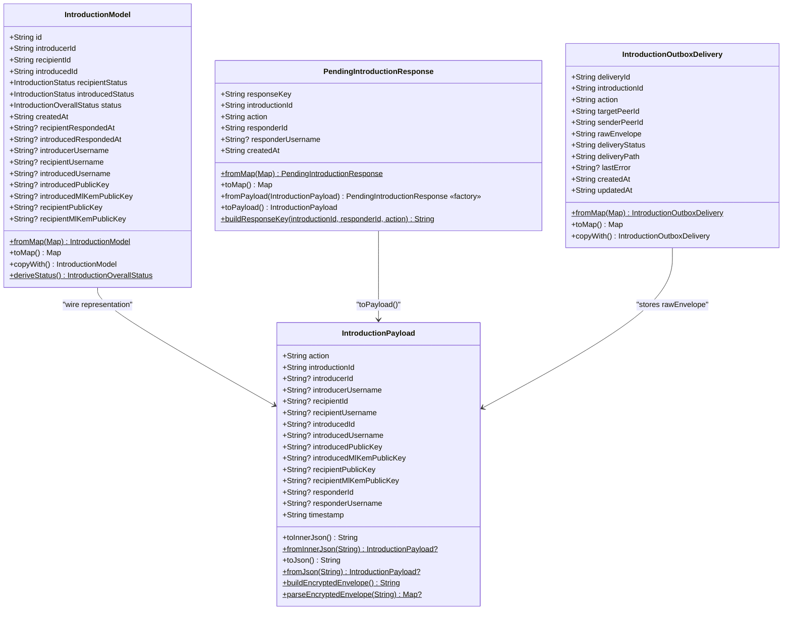
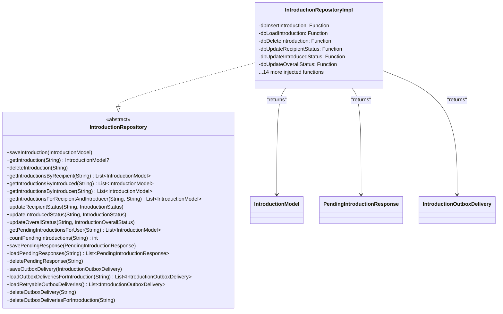
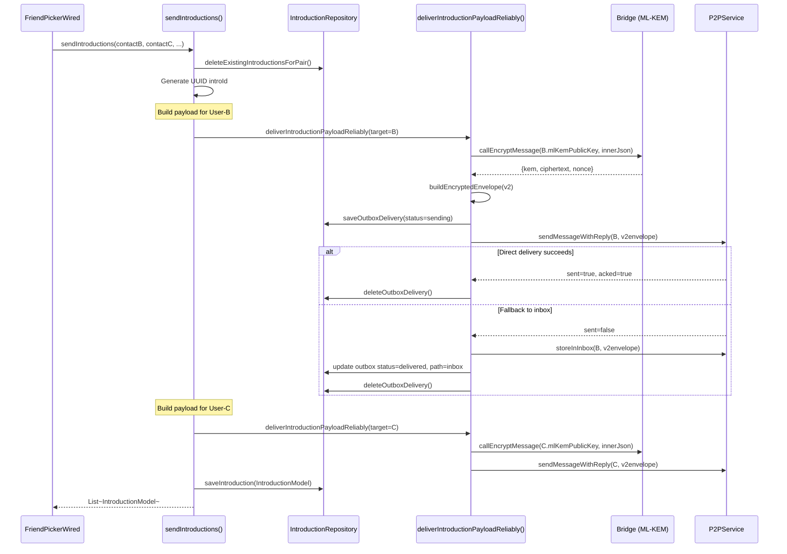
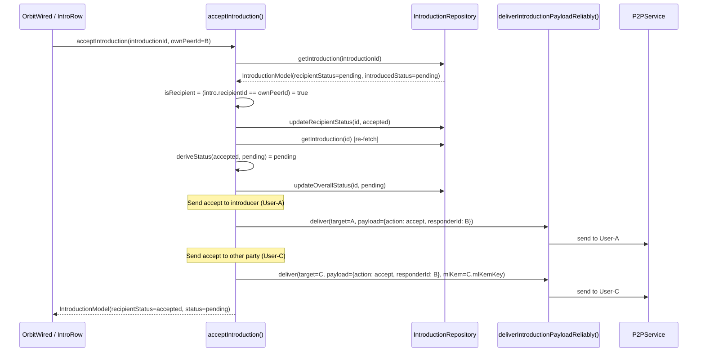
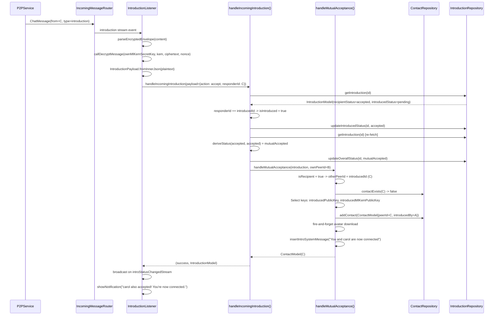
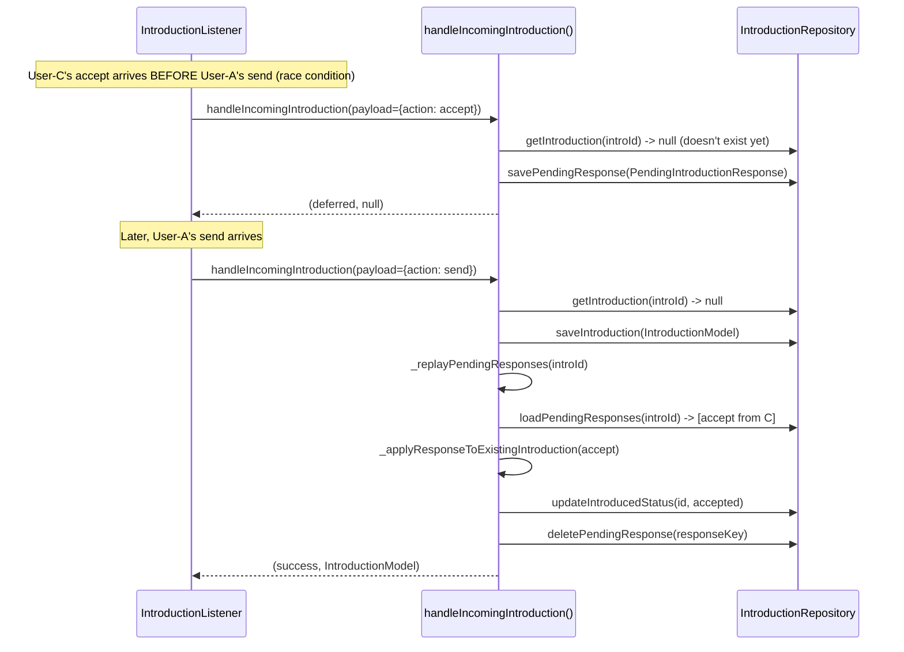
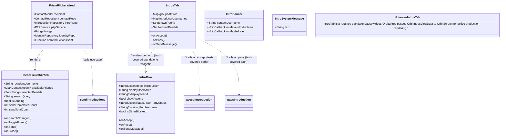

# C4 Model -- Level 4: Code

## Intro Feature -- mknoon Flutter + Go P2P Messaging App

---

## 1. Feature Overview

User-A (the **introducer**) has User-B and User-C as contacts. User-B and User-C do not know each other. User-A introduces User-B to User-C by sending an `introduction` message to both. When **both** accept, they become contacts of each other.

Three wire actions:
| Action   | Sender   | Recipients            |
|----------|----------|-----------------------|
| `send`   | User-A   | User-B **and** User-C |
| `accept` | User-B/C | User-A **and** the other party |
| `pass`   | User-B/C | User-A **and** the other party |

---

## 2. File Map -- Every File in the Feature

This map covers production/source files plus direct integration points for the feature. It does not attempt to enumerate the test suite.

```
lib/main.dart                                       # App-level DI wiring for IntroductionRepository and IntroductionListener

lib/features/introduction/
  domain/
    models/
      introduction_model.dart              # DB model -- IntroductionModel
      introduction_payload.dart            # Wire model -- IntroductionPayload
      introduction_outbox_delivery.dart    # Durable outbox row
      pending_introduction_response.dart   # Staged response (arrives before intro row)
    repositories/
      introduction_repository.dart         # Abstract repository interface
      introduction_repository_impl.dart    # Impl with injected DB helpers
  application/
    introduction_listener.dart             # Subscribes to P2P stream, decrypts, dispatches
    send_introduction_use_case.dart        # User-A sends introductions (top-level fn)
    accept_introduction_use_case.dart      # User-B/C accepts (top-level fn)
    pass_introduction_use_case.dart        # User-B/C passes (top-level fn)
    handle_incoming_introduction_use_case.dart  # Processes inbound payloads (top-level fn)
    handle_mutual_acceptance_use_case.dart # Creates contact on mutual accept (top-level fn)
    introduction_outbound_delivery.dart    # Reliable send: local/direct/relay/inbox cascade
    load_introductions_use_case.dart       # Two top-level fns: loadIntroductionsForUser() loads pending intros, groupByIntroducer() groups by introducer
    check_intro_banner_use_case.dart       # Controls in-conversation intro banner
    expire_old_introductions_use_case.dart # Reconciles stale pending intros -- re-derives status from party statuses, updates rows where stored 'pending' disagrees with derived truth, reruns handleMutualAcceptance for healed rows (contactRepo/bridge are optional params)
    resolve_unknown_inbox_sender_use_case.dart # Tri-state resolver (rejected/retryable/contactRecovered) for inbox replay -- opportunistically recreates contacts via handleMutualAcceptance
    introduction_copy.dart                 # Human-readable strings for system messages
    insert_intro_system_message.dart       # Inserts timeline system messages
  presentation/
    screens/
      friend_picker_wired.dart             # Wired: contact selection state
      friend_picker_screen.dart            # Screen: pure UI bottom sheet
      sent_confirmation_wired.dart         # Wired: post-send confirmation
      sent_confirmation_screen.dart        # Screen: pure UI confirmation
    widgets/
      intro_banner.dart                    # In-conversation intro banner
      intro_system_message.dart            # System message card in timeline
      intro_group_header.dart              # "From [username]" group header
      intro_row.dart                       # Single intro row with accept/pass
      intros_tab.dart                      # Orbit screen intros tab

lib/core/database/helpers/
  introductions_db_helpers.dart                  # SQL ops on introductions table
  introduction_outbox_db_helpers.dart             # SQL ops on introduction_outbox_deliveries table
  pending_introduction_responses_db_helpers.dart  # SQL ops on pending_introduction_responses table

lib/core/debug/
  intro_e2e_runner.dart                          # Debug/test runner for introductions
  smoke_test_runner.dart                         # E2E smoke test (exercises intro send/accept)

lib/core/services/
  incoming_message_router.dart                   # Routes incoming type='introduction' messages to IntroductionListener
  pending_message_retrier.dart                   # Periodic intro outbox retry integration

lib/core/lifecycle/
  handle_app_resumed.dart                        # Resume-time intro outbox retry integration

lib/features/conversation/presentation/screens/
  conversation_wired.dart                        # Opens FriendPicker, inserts introducer system message, routes to confirmation
  conversation_screen.dart                       # Renders IntroBanner and IntroSystemMessage in conversation UI

lib/features/orbit/presentation/screens/
  orbit_wired.dart                               # Loads intros, handles accept/pass/delete, subscribes to intro streams, and folds intro review state into Orbit
  orbit_screen.dart                              # Active production review renderer via OrbitIntrosViewData intro sliver (also hosts pending group invites)

lib/features/settings/presentation/widgets/
  settings_introduction_debug_card.dart           # Settings debug card for introductions

lib/features/feed/presentation/widgets/
  introduction_connection_card.dart               # Feed card for introduction-driven connections

lib/core/database/migrations/
  019_introductions_table.dart             # Main introductions table
  020_intro_banner_columns.dart            # Banner display columns
  021_contact_introduced_by.dart           # contacts.introduced_by column
  022_introduction_keys.dart               # introduced party key columns
  023_introduction_recipient_keys.dart     # recipient party key columns
  024_contact_introduced_by_peer_id.dart   # contacts.introduced_by_peer_id column
  025_introduction_already_connected_status.dart # 'already_connected' status value
  046_pending_introduction_responses.dart   # Deferred response staging table
  047_introduction_outbox.dart              # Durable outbox delivery table
```

---

## 3. Domain Models

### 3.1 IntroductionModel (DB model)

**File:** `lib/features/introduction/domain/models/introduction_model.dart`

```dart
enum IntroductionStatus { pending, accepted, passed }

enum IntroductionOverallStatus { pending, mutualAccepted, passed, expired, alreadyConnected }

class IntroductionModel {
  final String id;                          // UUID (shared by both parties)
  final String introducerId;                // User-A peer ID
  final String recipientId;                 // User-B peer ID
  final String introducedId;                // User-C peer ID
  final IntroductionStatus recipientStatus; // User-B's response
  final IntroductionStatus introducedStatus;// User-C's response
  final IntroductionOverallStatus status;   // Derived overall status
  final String createdAt;                   // ISO-8601 UTC
  final String? recipientRespondedAt;
  final String? introducedRespondedAt;
  final String? introducerUsername;
  final String? recipientUsername;
  final String? introducedUsername;
  final String? introducedPublicKey;        // Ed25519 hex (User-C)
  final String? introducedMlKemPublicKey;   // ML-KEM-768 hex (User-C)
  final String? recipientPublicKey;         // Ed25519 hex (User-B)
  final String? recipientMlKemPublicKey;    // ML-KEM-768 hex (User-B)

  // fromMap(Map<String, dynamic>) -- DB deserialization
  // toMap() -> Map<String, dynamic> -- DB serialization
  // copyWith({...}) -> IntroductionModel
  // deriveStatus({recipientStatus, introducedStatus, createdAt}) -> IntroductionOverallStatus [static]
}
```

Status derivation logic:
```
Both accepted          -> mutualAccepted
Either passed          -> passed
Pending > 30 days      -> expired
Otherwise              -> pending
```

### 3.2 IntroductionPayload (wire model)

**File:** `lib/features/introduction/domain/models/introduction_payload.dart`

```dart
class IntroductionPayload {
  final String action;               // 'send' | 'accept' | 'pass'
  final String introductionId;       // UUID (matches IntroductionModel.id)
  final String? introducerId;
  final String? introducerUsername;
  final String? recipientId;
  final String? recipientUsername;
  final String? introducedId;
  final String? introducedUsername;
  final String? introducedPublicKey;
  final String? introducedMlKemPublicKey;
  final String? recipientPublicKey;
  final String? recipientMlKemPublicKey;
  final String? responderId;         // Only for accept/pass actions
  final String? responderUsername;    // Only for accept/pass actions
  final String timestamp;            // ISO-8601 UTC

  // Serialization methods:
  String toInnerJson()                              // Inner payload only (for encryption input)
  static IntroductionPayload? fromInnerJson(String) // Parse decrypted inner JSON
  String toJson()                                   // Full v1 envelope string
  static IntroductionPayload? fromJson(String)      // Parse plaintext introduction envelope with payload (does not enforce version == '1')

  // V2 encrypted envelope helpers:
  static String buildEncryptedEnvelope({introductionId, senderPeerId, kem, ciphertext, nonce})
  static Map<String, dynamic>? parseEncryptedEnvelope(String)
  static String ensureEnvelopeMessageId(String rawEnvelope, String introductionId)
      // Patches messageId if missing; also accepts legacy 'id' field as equivalent
}
```

### 3.3 PendingIntroductionResponse (deferred response staging)

**File:** `lib/features/introduction/domain/models/pending_introduction_response.dart`

```dart
class PendingIntroductionResponse {
  final String responseKey;        // "$introductionId::$responderId::$action"
  final String introductionId;
  final String action;             // 'accept' | 'pass'
  final String responderId;
  final String? responderUsername;
  final String createdAt;

  // fromMap / toMap -- DB serialization
  // factory fromPayload(IntroductionPayload) -- factory constructor from wire payload
  // toPayload() -> IntroductionPayload -- reconstruct for replay
  // static buildResponseKey({introductionId, responderId, action}) -> String
}
```

### 3.4 IntroductionOutboxDelivery (durable outbox)

**File:** `lib/features/introduction/domain/models/introduction_outbox_delivery.dart`

```dart
class IntroductionOutboxDeliveryStatus {
  static const String sending   = 'sending';
  static const String sent      = 'sent';
  static const String delivered = 'delivered';
  static const String failed    = 'failed';
}

class IntroductionOutboxDeliveryPath {
  static const String pending = 'pending';
  static const String local   = 'local';
  static const String direct  = 'direct';
  static const String relay   = 'relay';
  static const String inbox   = 'inbox';
}

class IntroductionOutboxDelivery {
  final String deliveryId;        // UUID per delivery attempt
  final String introductionId;
  final String action;            // 'send' | 'accept' | 'pass'
  final String targetPeerId;
  final String senderPeerId;
  final String rawEnvelope;       // Full JSON envelope (v1 or v2)
  final String deliveryStatus;    // sending | sent | delivered | failed
  final String deliveryPath;      // pending | local | direct | relay | inbox
  final String? lastError;
  final String createdAt;
  final String updatedAt;

  // fromMap / toMap -- DB serialization
  // copyWith({...}) -- note: lastError uses Object? sentinel pattern to distinguish null from absent
}
```

### 3.5 Class Diagram -- Domain Models



---

## 4. Database Schema and Migrations

### 4.1 introductions table (migration 019)

**File:** `lib/core/database/migrations/019_introductions_table.dart`

```sql
CREATE TABLE IF NOT EXISTS introductions (
  id TEXT PRIMARY KEY,
  introducer_id TEXT NOT NULL,
  recipient_id TEXT NOT NULL,
  introduced_id TEXT NOT NULL,
  introducer_username TEXT,
  recipient_username TEXT,
  introduced_username TEXT,
  recipient_status TEXT NOT NULL DEFAULT 'pending'
    CHECK(recipient_status IN ('pending','accepted','passed')),
  introduced_status TEXT NOT NULL DEFAULT 'pending'
    CHECK(introduced_status IN ('pending','accepted','passed')),
  status TEXT NOT NULL DEFAULT 'pending'
    CHECK(status IN ('pending','mutual_accepted','passed','expired')),
  created_at TEXT NOT NULL,
  recipient_responded_at TEXT,
  introduced_responded_at TEXT
);

CREATE INDEX IF NOT EXISTS idx_introductions_recipient ON introductions(recipient_id);
CREATE INDEX IF NOT EXISTS idx_introductions_introduced ON introductions(introduced_id);
CREATE INDEX IF NOT EXISTS idx_introductions_introducer ON introductions(introducer_id);
```

### 4.2 Banner columns (migration 020)

**File:** `lib/core/database/migrations/020_intro_banner_columns.dart`

Adds two columns to the **contacts** table (not introductions):

```sql
ALTER TABLE contacts ADD COLUMN intros_banner_dismissed INTEGER DEFAULT 0;
ALTER TABLE contacts ADD COLUMN intros_sent_at TEXT;
```

- `intros_banner_dismissed`: 0 = shown, 1 = dismissed
- `intros_sent_at`: nullable ISO-8601 timestamp of last intro sent

Idempotent: checks `PRAGMA table_info(contacts)` before running.

### 4.3 Key columns (migrations 022, 023)

```sql
-- 022: introduced party keys
ALTER TABLE introductions ADD COLUMN introduced_public_key TEXT;
ALTER TABLE introductions ADD COLUMN introduced_ml_kem_public_key TEXT;

-- 023: recipient party keys
ALTER TABLE introductions ADD COLUMN recipient_public_key TEXT;
ALTER TABLE introductions ADD COLUMN recipient_ml_kem_public_key TEXT;
```

### 4.4 contacts.introduced_by columns (migrations 021, 024)

```sql
-- 021
ALTER TABLE contacts ADD COLUMN introduced_by TEXT;
-- 024
ALTER TABLE contacts ADD COLUMN introduced_by_peer_id TEXT;
```

### 4.5 already_connected status (migration 025)

Because SQLite does not support `ALTER CHECK`, this migration recreates the **entire table**: creates `introductions_new` (with the full schema including key columns from migrations 022/023), copies all rows, drops `introductions`, renames `introductions_new` to `introductions`, and recreates all 3 indexes. The new `status` CHECK constraint includes `'already_connected'`.

### 4.6 pending_introduction_responses table (migration 046)

```sql
CREATE TABLE IF NOT EXISTS pending_introduction_responses (
  response_key TEXT PRIMARY KEY,
  introduction_id TEXT NOT NULL,
  action TEXT NOT NULL CHECK(action IN ('accept', 'pass')),
  responder_id TEXT NOT NULL,
  responder_username TEXT,
  created_at TEXT NOT NULL
);

CREATE INDEX IF NOT EXISTS idx_pending_intro_responses_intro_id
  ON pending_introduction_responses(introduction_id, created_at, response_key);
```

### 4.7 introduction_outbox_deliveries table (migration 047)

```sql
CREATE TABLE IF NOT EXISTS introduction_outbox_deliveries (
  delivery_id TEXT PRIMARY KEY,
  introduction_id TEXT NOT NULL,
  action TEXT NOT NULL,
  target_peer_id TEXT NOT NULL,
  sender_peer_id TEXT NOT NULL,
  raw_envelope TEXT NOT NULL,
  delivery_status TEXT NOT NULL,
  delivery_path TEXT NOT NULL,
  last_error TEXT,
  created_at TEXT NOT NULL,
  updated_at TEXT NOT NULL
);

CREATE INDEX IF NOT EXISTS idx_intro_outbox_retry
  ON introduction_outbox_deliveries(delivery_status, updated_at ASC, delivery_id ASC);
CREATE INDEX IF NOT EXISTS idx_intro_outbox_intro
  ON introduction_outbox_deliveries(introduction_id);
CREATE INDEX IF NOT EXISTS idx_intro_outbox_target
  ON introduction_outbox_deliveries(target_peer_id);
```

### 4.8 DB Helper Functions (plain functions, `Database db` + args)

These are plain top-level functions invoked by the repository through constructor injection. Each takes `Database db` as the first argument.

```dart
// introductions table
Future<void> dbInsertIntroduction(Database db, Map<String, Object?> row);
Future<void> dbDeleteIntroduction(Database db, String id);
Future<Map<String, Object?>?> dbLoadIntroduction(Database db, String id);
Future<List<Map<String, Object?>>> dbLoadIntroductionsByRecipient(Database db, String recipientId);
Future<List<Map<String, Object?>>> dbLoadIntroductionsByIntroduced(Database db, String introducedId);
Future<List<Map<String, Object?>>> dbLoadIntroductionsByIntroducer(Database db, String introducerId);
Future<List<Map<String, Object?>>> dbLoadIntroductionsForRecipientAndIntroducer(
    Database db, String recipientId, String introducerId);
Future<void> dbUpdateRecipientStatus(Database db, String id, String status, String respondedAt);
Future<void> dbUpdateIntroducedStatus(Database db, String id, String status, String respondedAt);
Future<void> dbUpdateOverallStatus(Database db, String id, String status);
Future<List<Map<String, Object?>>> dbLoadPendingIntroductionsForUser(Database db, String peerId);
    // NOTE: queries status IN ('pending', 'already_connected') -- returns BOTH statuses
Future<int> dbCountPendingIntroductions(Database db, String peerId);
    // NOTE: queries only status = 'pending' -- narrower than dbLoadPendingIntroductionsForUser

// pending_introduction_responses table (separate file: pending_introduction_responses_db_helpers.dart)
Future<void> dbUpsertPendingIntroductionResponse(Database db, Map<String, Object?> row);
Future<List<Map<String, Object?>>> dbLoadPendingIntroductionResponses(
    Database db, String introductionId);
Future<void> dbDeletePendingIntroductionResponse(Database db, String responseKey);

// introduction_outbox_deliveries table
Future<void> dbUpsertIntroductionOutboxDelivery(Database db, Map<String, Object?> row);
Future<List<Map<String, Object?>>> dbLoadIntroductionOutboxDeliveriesForIntroduction(
    Database db, String introductionId);
Future<List<Map<String, Object?>>> dbLoadRetryableIntroductionOutboxDeliveries(
    Database db, {required String olderThan, int limit = 100});
    // NOTE: 3-condition WHERE clause (OR'd):
    //   1. delivery_status = 'failed' (unconditionally retryable)
    //   2. delivery_status IN ('sending', 'sent') AND updated_at <= olderThan (stalled in-flight)
    //   3. delivery_status = 'delivered' AND delivery_path = 'inbox' (selected so retrier can clean up prior inbox success rows)
Future<void> dbDeleteIntroductionOutboxDelivery(Database db, String deliveryId);
Future<void> dbDeleteIntroductionOutboxDeliveriesForIntroduction(
    Database db, String introductionId);
```

---

## 5. Repository

### 5.1 IntroductionRepository (abstract interface)

**File:** `lib/features/introduction/domain/repositories/introduction_repository.dart`

```dart
abstract class IntroductionRepository {
  Future<void> saveIntroduction(IntroductionModel intro);
  Future<IntroductionModel?> getIntroduction(String id);
  Future<void> deleteIntroduction(String id);
  Future<List<IntroductionModel>> getIntroductionsByRecipient(String recipientId);
  Future<List<IntroductionModel>> getIntroductionsByIntroduced(String introducedId);
  Future<List<IntroductionModel>> getIntroductionsByIntroducer(String introducerId);
  Future<List<IntroductionModel>> getIntroductionsForRecipientAndIntroducer(
      String recipientId, String introducerId);
  Future<void> updateRecipientStatus(String id, IntroductionStatus status);
  Future<void> updateIntroducedStatus(String id, IntroductionStatus status);
  Future<void> updateOverallStatus(String id, IntroductionOverallStatus status);
  Future<List<IntroductionModel>> getPendingIntroductionsForUser(String peerId);
  Future<int> countPendingIntroductions(String peerId);
  Future<void> savePendingResponse(PendingIntroductionResponse response);
  Future<List<PendingIntroductionResponse>> loadPendingResponses(String introductionId);
  Future<void> deletePendingResponse(String responseKey);
  Future<void> saveOutboxDelivery(IntroductionOutboxDelivery delivery);
  Future<List<IntroductionOutboxDelivery>> loadOutboxDeliveriesForIntroduction(String introductionId);
  Future<List<IntroductionOutboxDelivery>> loadRetryableOutboxDeliveries({
      Duration olderThan = const Duration(seconds: 60), int limit = 100});
  Future<void> deleteOutboxDelivery(String deliveryId);
  Future<void> deleteOutboxDeliveriesForIntroduction(String introductionId);
}
```

### 5.2 IntroductionRepositoryImpl (constructor-injected DB helpers)

**File:** `lib/features/introduction/domain/repositories/introduction_repository_impl.dart`

Constructor-injected function typedefs -- each field is a closure that curries the `Database db` argument away from the call site:

```dart
class IntroductionRepositoryImpl implements IntroductionRepository {
  // --- Constructor-injected DB helper closures ---
  final Future<void> Function(Map<String, Object?> row) dbInsertIntroduction;
  final Future<Map<String, Object?>?> Function(String id) dbLoadIntroduction;
  final Future<void> Function(String id) dbDeleteIntroduction;
  final Future<List<Map<String, Object?>>> Function(String recipientId)
      dbLoadIntroductionsByRecipient;
  final Future<List<Map<String, Object?>>> Function(String introducedId)
      dbLoadIntroductionsByIntroduced;
  final Future<List<Map<String, Object?>>> Function(String introducerId)
      dbLoadIntroductionsByIntroducer;
  final Future<List<Map<String, Object?>>> Function(String, String)
      dbLoadIntroductionsForRecipientAndIntroducer;
  final Future<void> Function(String id, String status, String respondedAt)
      dbUpdateRecipientStatus;
  final Future<void> Function(String id, String status, String respondedAt)
      dbUpdateIntroducedStatus;
  final Future<void> Function(String id, String status)
      dbUpdateOverallStatus;
  final Future<List<Map<String, Object?>>> Function(String peerId)
      dbLoadPendingIntroductionsForUser;
  final Future<int> Function(String peerId) dbCountPendingIntroductions;
  final Future<void> Function(Map<String, Object?> row)
      dbUpsertPendingIntroductionResponse;
  final Future<List<Map<String, Object?>>> Function(String introductionId)
      dbLoadPendingIntroductionResponses;
  final Future<void> Function(String responseKey)
      dbDeletePendingIntroductionResponse;
  final Future<void> Function(Map<String, Object?> row)
      dbUpsertIntroductionOutboxDelivery;
  final Future<List<Map<String, Object?>>> Function(String introductionId)
      dbLoadIntroductionOutboxDeliveriesForIntroduction;
  final Future<List<Map<String, Object?>>> Function({
      required String olderThan, int limit})
      dbLoadRetryableIntroductionOutboxDeliveries;
      // NOTE: The DB helper takes `olderThan` as a pre-formatted ISO-8601 String.
      // The repo impl converts the Duration param to String internally via
      // DateTime.now().subtract(olderThan).toIso8601String() before calling this closure.
  final Future<void> Function(String deliveryId)
      dbDeleteIntroductionOutboxDelivery;
  final Future<void> Function(String introductionId)
      dbDeleteIntroductionOutboxDeliveriesForIntroduction;

  // Every method wraps its injected function, converting between
  // Map rows and IntroductionModel instances.
  // emitFlowEvent() called at start, success, and error for write operations
  // (saveIntroduction, updateRecipientStatus, updateIntroducedStatus, updateOverallStatus).
  // Read, delete, pending-response, and outbox methods do NOT emit flow events.
  //
  // NOTE: deleteIntroduction() cascades:
  //   1. Loads all pending responses via loadPendingResponses(id)
  //   2. Deletes each pending response one-by-one in a loop (not bulk)
  //   3. Bulk-deletes all outbox deliveries via deleteOutboxDeliveriesForIntroduction(id)
  //   4. Deletes the introduction row itself
}
```

### 5.3 DI Wiring (main.dart)

In `main.dart`, the DB helpers are curried with the `Database` instance:

```dart
final introductionRepository = IntroductionRepositoryImpl(
  dbInsertIntroduction: (row) => dbInsertIntroduction(db, row),
  dbLoadIntroduction: (id) => dbLoadIntroduction(db, id),
  dbDeleteIntroduction: (id) => dbDeleteIntroduction(db, id),
  // ... all other helpers curried the same way
);
```

The local variable is `introductionRepository` (not `introRepo`). `MyApp` stores it as the **concrete** type `IntroductionRepositoryImpl`. That is consistent with several other repository fields in `MyApp`, not unique to the introduction feature. Downstream of `MyApp`, route/widget constructors typically widen the type to `IntroductionRepository?` (abstract + nullable).

**Representative DI threading chain** -- `introductionRepository` is threaded through the app shell and multiple route surfaces, including:

```
main.dart -> MyApp (IntroductionRepositoryImpl)
  -> StartupRouter (IntroductionRepository?)
    -> FeedWired
    -> OrbitWired
    -> ConversationWired
    -> QRScannerWired
    -> FirstTimeExperienceWired
    -> PostsWired
    -> SettingsWired
    -> ShareTargetPickerWired
    -> ShareTargetPickerRoute
```

### 5.4 Class Diagram -- Repository Layer



---

## 6. Use Cases (Top-Level Functions)

### 6.1 sendIntroductions -- User-A sends introductions

**File:** `lib/features/introduction/application/send_introduction_use_case.dart`

```dart
typedef IntroductionSendProgressCallback = void Function(int completed, int total);

Future<List<IntroductionModel>> sendIntroductions({
  required ContactRepository contactRepo,
  required IntroductionRepository introRepo,
  required P2PService p2pService,
  required Bridge bridge,
  required String introducerPeerId,
  required String introducerUsername,
  required String recipientPeerId,
  required String recipientUsername,
  required String? recipientMlKemPublicKey,
  required List<ContactModel> friendsToIntroduce,
  IntroductionSendProgressCallback? onProgress,
}) async { ... }
```

**Algorithm:**

1. Look up recipient contact via `contactRepo.getContact(recipientPeerId)` to resolve `recipientPublicKey` and `recipientMlKemPublicKey` for the **payload body** (these are the keys embedded in the introduction payload so both parties can create contacts on mutual acceptance)
2. Fire initial `onProgress?.call(0, total)` before the loop
3. For each friend in `friendsToIntroduce` (batched, max 10 concurrent):
   a. Delete any existing introductions for the same pair (recipient + introduced + introducer, checked in **both directions** -- recipient/introduced swapped)
   b. Generate a UUID `introId`
   c. Build `IntroductionPayload(action: 'send')` for the recipient (User-B)
   d. Build `IntroductionPayload(action: 'send')` for the introduced friend (User-C)
   e. Both payloads are **structurally identical** (same fields, same values, same `introductionId`) -- they differ only in delivery target (`targetPeerId`)
   f. Call `deliverIntroductionPayloadReliably()` for each target
   g. Save `IntroductionModel` locally
   h. Report progress via `onProgress` callback after each friend completes
4. After all batches complete: set `introsSentAt` **once** on the recipient contact (not per-introduction)

**Important -- two-key distinction:** The `recipientMlKemPublicKey` parameter on `sendIntroductions()` is used as the **wire encryption key** (passed to `deliverIntroductionPayloadReliably()` for v2 envelope encryption). The payload body's `recipientPublicKey` / `recipientMlKemPublicKey` fields come from a separate `contactRepo.getContact()` lookup. These are conceptually the same keys but resolved from different sources for different purposes.

### 6.2 acceptIntroduction -- User-B or User-C accepts

**File:** `lib/features/introduction/application/accept_introduction_use_case.dart`

```dart
Future<IntroductionModel?> acceptIntroduction({
  required IntroductionRepository introRepo,
  required ContactRepository contactRepo,
  required P2PService p2pService,
  required Bridge bridge,
  required String introductionId,
  required String ownPeerId,
  required String ownUsername,
  MessageRepository? messageRepo,
}) async { ... }
```

**Algorithm:**

1. Load `IntroductionModel` by `introductionId`
2. Determine if caller is `recipient` or `introduced`
3. Update the appropriate party's status to `accepted`
4. Re-fetch the introduction, derive new overall status via `IntroductionModel.deriveStatus()`
5. Persist the derived overall status via `updateOverallStatus()`
6. Build `IntroductionPayload(action: 'accept', responderId: ownPeerId)`
7. Send accept notification to:
   - The **introducer** (User-A) -- ML-KEM key resolved via `contactRepo.getContact()`
   - The **other party** (User-C if we are User-B, or vice versa) -- ML-KEM key first tried from the introduction model's stored key, falling back to `contactRepo.getContact()`
8. If `newOverall == mutualAccepted`: call `handleMutualAcceptance()` (uses default `downloadProfilePictureFn`)
9. Return updated `IntroductionModel?`

### 6.2b passIntroduction -- User-B or User-C passes

**File:** `lib/features/introduction/application/pass_introduction_use_case.dart`

```dart
Future<IntroductionModel?> passIntroduction({
  required IntroductionRepository introRepo,
  required ContactRepository contactRepo,
  required P2PService p2pService,
  required Bridge bridge,
  required String introductionId,
  required String ownPeerId,
  required String ownUsername,
}) async { ... }
```

**Algorithm:** Mirrors `acceptIntroduction` structurally (but note: `passIntroduction` does **not** take a `MessageRepository? messageRepo` parameter, unlike `acceptIntroduction`):

1. Load `IntroductionModel` by `introductionId`
2. Determine if caller is `recipient` or `introduced`
3. Update the appropriate party's status to `passed`
4. Re-fetch the introduction, derive new overall status via `IntroductionModel.deriveStatus()`
5. Persist the derived overall status via `updateOverallStatus()`
6. Build `IntroductionPayload(action: 'pass', responderId: ownPeerId)`
7. Send pass notification to:
   - The **introducer** (User-A) -- ML-KEM key resolved via `contactRepo.getContact()`
   - The **other party** -- ML-KEM key first tried from the introduction model's stored key, falling back to `contactRepo.getContact()` if null (same `_sendPayloadToContact` helper as `acceptIntroduction`)
8. Return updated `IntroductionModel?`

### 6.3 handleIncomingIntroduction -- Processes inbound payloads

**File:** `lib/features/introduction/application/handle_incoming_introduction_use_case.dart`

```dart
enum HandleIntroductionResult { success, alreadyExists, deferred, blocked, rejected, error }
// Note: `blocked` is never returned by handleIncomingIntroduction() itself -- the blocked-sender
// check happens in IntroductionListener.processIncomingMessage() before the use case is called.

Future<(HandleIntroductionResult, IntroductionModel?)> handleIncomingIntroduction({
  required IntroductionPayload payload,
  required IntroductionRepository introRepo,
  required ContactRepository contactRepo,
  required String ownPeerId,
  MessageRepository? messageRepo,
  Bridge? bridge,
}) async { ... }
```

**Routes by action:**

| Action   | Handler                        | Behavior                                                     |
|----------|--------------------------------|--------------------------------------------------------------|
| `send`   | `_handleSend()`                | Creates `IntroductionModel`, checks already-connected, replays deferred responses |
| `accept` | `_handleResponse()`            | Updates party status, derives overall, triggers mutual acceptance if both accepted |
| `pass`   | `_handleResponse()`            | Updates party status, derives overall                        |
| unknown  | _(fallthrough)_                | Returns `(rejected, null)` for unrecognized action values    |

**`_handleSend()` details:**

1. If an introduction with the same ID already exists: replays any pending responses via `_replayPendingResponses()`, then returns `alreadyExists`
2. **Timestamp-based pair deduplication:** Checks for existing introductions between the same pair (in either direction) from the same introducer. If the incoming introduction is **not newer** than the latest existing one, returns `alreadyExists`. If newer, deletes **all** existing pair introductions (wholesale replacement, not selective deletion of only older ones) before inserting.
3. Saves the new `IntroductionModel`
4. **Already-connected check:** If the other party is already a contact, immediately sets `overallStatus = alreadyConnected`
5. Replays any deferred responses via `_replayPendingResponses()`

**Deferred response handling:** If an `accept`/`pass` arrives before the `send` (race condition), the response is staged in `pending_introduction_responses` via `introRepo.savePendingResponse()`. When the `send` eventually arrives, `_replayPendingResponses()` applies all staged responses and deletes each pending response after applying. **Important:** if a replayed response returns any result other than `success` or `rejected`, `_replayPendingResponses()` throws a `StateError`.

### 6.4 handleMutualAcceptance -- Creates contact on mutual accept

**File:** `lib/features/introduction/application/handle_mutual_acceptance_use_case.dart`

```dart
Future<ContactModel?> handleMutualAcceptance({
  required IntroductionModel introduction,
  required ContactRepository contactRepo,
  required String ownPeerId,
  MessageRepository? messageRepo,
  Bridge? bridge,
  DownloadProfilePictureFn? downloadProfilePictureFn,
}) async { ... }
```

**Algorithm:**

1. Guard: `status != mutualAccepted` -> return null
2. Determine other party (if I am recipient, other = introduced; vice versa)
3. Check if contact already exists (idempotent)
4. Select correct keys: recipient gets introduced party's keys, introduced gets recipient's keys
5. Create `ContactModel` with `introducedBy` and `introducedByPeerId`
6. Add contact via `contactRepo.addContact()`
7. Fire-and-forget avatar download (if first attempt returns null, retries once after 5s delay). **Skipped entirely when `bridge` is null.**
8. Insert system message via `insertIntroSystemMessage()` using `formatMutualAcceptanceSystemMessage()`: "You and [name] are now connected — introduced by [introducer]". **Skipped when `messageRepo` is null.**

### 6.5 deliverIntroductionPayloadReliably -- Reliable P2P delivery

**File:** `lib/features/introduction/application/introduction_outbound_delivery.dart`

```dart
Future<void> deliverIntroductionPayloadReliably({
  required IntroductionRepository introRepo,
  required P2PService p2pService,
  required Bridge bridge,
  required String senderPeerId,
  required String targetPeerId,
  required String? targetMlKemPublicKey,
  required IntroductionPayload payload,
}) async { ... }
```

**Delivery cascade:**

```
1. Build raw envelope (v2 encrypted if ML-KEM key available, else v1 plaintext)
2. Normalize envelope via ensureEnvelopeMessageId() (patches messageId if missing)
3. Stage durable outbox row (deliveryStatus = 'sending', deliveryPath = 'pending')
4. Fast path: either-or connection check (isConnectedToPeer OR connections.any(peerId match))
   -> sendMessageWithReply directly, return on success
5. If the fast path does not return success, attempt delivery (conditionally a race):
   a. If target is local WiFi peer (isLocalPeer check) -> try local send (conditional arm, only added when local)
   b. Discover + dial + sendMessageWithReply (always present arm)
   NOTE: When the target is not a local peer, only arm (b) runs -- there is no race.
6. If race fails and relay probe eligible -> probe relay + retry send
7. If all direct paths fail -> storeInInbox (relay server offline inbox)
8. Update outbox row with final status + delivery path
9. On 'delivered': DELETE outbox row entirely
   On 'sent' or 'failed': UPDATE outbox row in place (retained for retry)
```

### 6.6 retryPendingIntroductionDeliveries -- Background retry (inbox-only)

```dart
Future<int> retryPendingIntroductionDeliveries({
  required IntroductionRepository introRepo,
  required P2PService p2pService,
}) async { ... }
```

Returns the number of outbox rows resolved in this pass. Loads retryable outbox rows via `introRepo.loadRetryableOutboxDeliveries()` -- this includes `failed` (unconditionally), stalled `sending`/`sent` (older than 60s, default `Duration` parameter in the repository layer), and `delivered` via `inbox` path (selected for cleanup after prior inbox delivery). For each row:
- If already `delivered` via `inbox` path: deletes the outbox row directly (cleanup, no network call).
- Otherwise: retries **only via `storeInInbox()`** -- does NOT re-attempt the full delivery cascade (no direct/local/relay retry). This is intentionally conservative.

### 6.7 loadIntroductionsForUser / groupByIntroducer -- UI data loading

**File:** `lib/features/introduction/application/load_introductions_use_case.dart`

Two separate top-level functions:

```dart
Future<List<IntroductionModel>> loadIntroductionsForUser({
  required IntroductionRepository introRepo,
  required String peerId,
}) async { ... }
// Calls introRepo.getPendingIntroductionsForUser(peerId) -- returns flat list

Map<String, List<IntroductionModel>> groupByIntroducer(List<IntroductionModel> intros)
// Pure synchronous helper -- groups a pre-loaded list by introducerId
```

### 6.8 shouldShowIntroBanner -- In-conversation intro banner gating

**File:** `lib/features/introduction/application/check_intro_banner_use_case.dart`

```dart
Future<bool> shouldShowIntroBanner({
  required ContactRepository contactRepo,
  required ContactModel contact,
  required int messageCount,
}) async { ... }
```

Returns `true` only when all six conditions are met (evaluated in order):
1. Contact is not blocked
2. Contact is not archived
3. `introsBannerDismissed` is false
4. `introsSentAt` is null (intros not yet sent to this contact)
5. `messageCount < 3` (early in the conversation)
6. At least one other active, non-blocked contact exists to introduce (fetched last to avoid unnecessary DB query)

### 6.9 expireOldIntroductions -- Reconciliation / healing

**File:** `lib/features/introduction/application/expire_old_introductions_use_case.dart`

```dart
Future<int> expireOldIntroductions({
  required IntroductionRepository introRepo,
  required String peerId,
  ContactRepository? contactRepo,   // optional -- needed for mutual acceptance rerun
  MessageRepository? messageRepo,   // optional
  Bridge? bridge,                   // optional
}) async { ... }
```

**Algorithm:**
1. Load all pending intros via `getPendingIntroductionsForUser(peerId)`
2. Skip rows whose stored status is not `pending`
3. Call `IntroductionModel.deriveStatus()` to compute the correct status from party statuses
4. Skip if derived status is still `pending`
5. Call `updateOverallStatus()` with the derived status
6. If derived status is `mutualAccepted` **and** `contactRepo` is provided: rerun `handleMutualAcceptance()` to recover the contact (also passes `messageRepo` and `bridge`, enabling system message insertion and avatar download during reconciliation)

Note: despite the name "expire", this function heals **all** stale statuses (not just to `expired`). It catches rows where party statuses changed but overall status was not updated, and returns the number of repaired rows.

### 6.10 resolveUnknownInboxSender -- Inbox replay recovery

**File:** `lib/features/introduction/application/resolve_unknown_inbox_sender_use_case.dart`

```dart
enum UnknownInboxSenderResolution { rejected, retryable, contactRecovered }

Future<UnknownInboxSenderResolution> resolveUnknownInboxSender({
  required IntroductionRepository introRepo,
  required ContactRepository contactRepo,
  required String ownPeerId,
  required String senderPeerId,
}) async { ... }
```

**Algorithm:**
1. Load all intros where `ownPeerId` is either recipient or introduced
2. For each, check if the other party matches `senderPeerId`
3. Based on intro status:
   - `mutualAccepted`: call `handleMutualAcceptance(introduction, contactRepo, ownPeerId)` to recreate the contact -> `contactRecovered` if contact now exists, else `retryable`. Does not pass `messageRepo`, `bridge`, or `downloadProfilePictureFn`, so no system message is inserted and no avatar download is attempted in this path.
   - `alreadyConnected`: `contactRecovered` if contact exists, else `retryable`
   - `pending`: `retryable` only if own side has already accepted
   - `passed`/`expired`: ignored
4. Return `retryable` if any retryable intro found, else `rejected`

---

## 7. Listener

### 7.1 IntroductionListener

**File:** `lib/features/introduction/application/introduction_listener.dart`

```dart
class IntroductionListener {
  // --- Dependencies ---
  final Stream<ChatMessage> introductionStream;  // From IncomingMessageRouter
  final IntroductionRepository introRepo;
  final ContactRepository contactRepo;
  final Bridge bridge;
  final Future<String?> Function() getOwnMlKemSecretKey;
  final Future<String?> Function() getOwnPeerId;
  final MessageRepository? messageRepo;
  final NotificationService? notificationService;

  // --- Output streams ---
  Stream<IntroductionModel> get introReceivedStream;      // New intros (action == 'send')
  Stream<IntroductionModel> get introStatusChangedStream;  // Status updates (accept/pass)

  // --- Lifecycle ---
  void start();   // Subscribe to introductionStream
  void stop();    // Cancel subscription
  void dispose(); // stop() + close StreamControllers
}
```

**Message processing pipeline (`processIncomingMessage`):**

`isIncoming` filtering happens in `IncomingMessageRouter` (which routes by message `type` field) before the message reaches this listener — the listener itself does not check `isIncoming`.

```
1. Try v2 decryption:
   - parseEncryptedEnvelope(message.content)
   - If v2: resolve own ML-KEM secret key (if null -> return retryableError with 'missing_mlkem_secret')
   - callDecryptMessage(bridge, ownMlKemSecretKey, kem, ciphertext, nonce)
   - If decryption fails -> reject with 'decryption_failed'
2. If not v2, try v1 parsing:
   - IntroductionPayload.fromJson(message.content)
   - Extract inner JSON via toInnerJson()
3. If innerJson == null -> reject with 'parse_failed'
4. IntroductionPayload.fromInnerJson(innerJson)
   - If payload == null -> reject with 'invalid_payload'
5. Block check: only reject 'send' from blocked contacts (accept/pass always pass through)
6. getOwnPeerId() -> if null, return retryableError with 'missing_own_peer_id'
7. Call handleIncomingIntroduction(payload, introRepo, contactRepo, ownPeerId)
8. Based on result:
   - success + 'send' -> broadcast on introReceivedStream, insert system message, show notification
   - success + 'accept'/'pass' -> broadcast on introStatusChangedStream, show notification if mutualAccepted
   - Nonce confirmation mapping (_confirmationValueForState):
     - stored -> true
     - deferred -> true
     - blockedSender -> true (acknowledged but not processed)
     - rejected -> false
     - retryableError -> false
9. Confirm direct message nonce (callP2PConfirmDirectMessage)
```

### 7.2 Process Outcome Model

```dart
enum IntroductionMessageProcessState { stored, deferred, blockedSender, rejected, retryableError }

class IntroductionMessageProcessOutcome {
  final IntroductionMessageProcessState state;
  final IntroductionModel? introduction;
  final String reasonCode;
  final String? reasonDetail;
}
```

---

## 8. Wire Protocol -- Exact JSON Envelopes

### 8.1 Introduction Send (User-A -> User-B)

**V1 plaintext envelope:**

```json
{
  "type": "introduction",
  "version": "1",
  "messageId": "a1b2c3d4-...",
  "payload": {
    "action": "send",
    "introductionId": "a1b2c3d4-...",
    "introducerId": "12D3KooW...userA",
    "introducerUsername": "alice",
    "recipientId": "12D3KooW...userB",
    "recipientUsername": "bob",
    "introducedId": "12D3KooW...userC",
    "introducedUsername": "carol",
    "introducedPublicKey": "3059301306072a8648ce3d...",
    "introducedMlKemPublicKey": "a0b1c2d3e4f5...",
    "recipientPublicKey": "3059301306072a8648ce3d...",
    "recipientMlKemPublicKey": "f5e4d3c2b1a0...",
    "timestamp": "2026-04-08T12:00:00.000Z"
  }
}
```

**V2 encrypted envelope (when User-B has ML-KEM public key):**

```json
{
  "type": "introduction",
  "version": "2",
  "messageId": "a1b2c3d4-...",
  "senderPeerId": "12D3KooW...userA",
  "encrypted": {
    "kem": "<ML-KEM-768 encapsulated key, base64>",
    "ciphertext": "<AES-256-GCM ciphertext of inner JSON, base64>",
    "nonce": "<AES-256-GCM nonce, base64>"
  }
}
```

The encrypted `ciphertext` decrypts to the same inner payload as v1's `payload` field:

```json
{
  "action": "send",
  "introductionId": "a1b2c3d4-...",
  "introducerId": "12D3KooW...userA",
  "introducerUsername": "alice",
  "recipientId": "12D3KooW...userB",
  "recipientUsername": "bob",
  "introducedId": "12D3KooW...userC",
  "introducedUsername": "carol",
  "introducedPublicKey": "3059301306072a8648ce3d...",
  "introducedMlKemPublicKey": "a0b1c2d3e4f5...",
  "recipientPublicKey": "3059301306072a8648ce3d...",
  "recipientMlKemPublicKey": "f5e4d3c2b1a0...",
  "timestamp": "2026-04-08T12:00:00.000Z"
}
```

### 8.2 Introduction Send (User-A -> User-C)

Identical structure to User-B's message. Same `introductionId`. Both recipients receive both parties' keys so they can create contacts on mutual acceptance.

### 8.3 Accept (User-B -> User-A and User-C)

For each target, the code sends a **v2 encrypted envelope when that target has an ML-KEM public key**. Otherwise it falls back to the same **v1 plaintext envelope shape** used by `payload.toJson()`. Example v2 envelope:

```json
{
  "type": "introduction",
  "version": "2",
  "messageId": "a1b2c3d4-...",
  "senderPeerId": "12D3KooW...userB",
  "encrypted": {
    "kem": "<...>",
    "ciphertext": "<...>",
    "nonce": "<...>"
  }
}
```

Decrypted inner payload:

```json
{
  "action": "accept",
  "introductionId": "a1b2c3d4-...",
  "responderId": "12D3KooW...userB",
  "responderUsername": "bob",
  "timestamp": "2026-04-08T12:05:00.000Z"
}
```

Equivalent v1 fallback envelope for the same accept payload:

```json
{
  "type": "introduction",
  "version": "1",
  "messageId": "a1b2c3d4-...",
  "payload": {
    "action": "accept",
    "introductionId": "a1b2c3d4-...",
    "responderId": "12D3KooW...userB",
    "responderUsername": "bob",
    "timestamp": "2026-04-08T12:05:00.000Z"
  }
}
```

### 8.4 Accept (User-C -> User-A and User-B)

Same envelope-selection rules, different `responderId` / `responderUsername`:

```json
{
  "action": "accept",
  "introductionId": "a1b2c3d4-...",
  "responderId": "12D3KooW...userC",
  "responderUsername": "carol",
  "timestamp": "2026-04-08T12:07:00.000Z"
}
```

When User-B's listener processes this, `recipientStatus` was already `accepted` (User-B accepted earlier), and now `introducedStatus` becomes `accepted`. `deriveStatus()` returns `mutualAccepted`. `handleMutualAcceptance()` fires and User-B creates User-C as a contact.

The `pass` action uses the same envelope-selection rules and the same inner schema, with `action: 'pass'` instead of `action: 'accept'`.

---

## 9. Sequence Diagrams

These diagrams intentionally compress some branches for readability. When the outbound-delivery path matters, Section 6.5 is the source of truth for the exact local/direct/relay/inbox cascade and outbox-state handling.

### 9.1 Send Introduction Flow (User-A initiates)



### 9.2 Accept Introduction Flow (User-B accepts)



### 9.3 Mutual Acceptance Flow (User-C accepts after User-B)



### 9.4 Deferred Response Handling (accept arrives before send)



---

## 10. UI Layer

### 10.1 FriendPickerWired + FriendPickerScreen

**Entry point:** Shown as a modal bottom sheet from the conversation screen.

#### FriendPickerWired (StatefulWidget)

**File:** `lib/features/introduction/presentation/screens/friend_picker_wired.dart`

```dart
class FriendPickerWired extends StatefulWidget {
  // --- Dependencies (passed from ConversationWired) ---
  final ContactModel recipient;
  final ContactRepository contactRepo;
  final IntroductionRepository introRepo;
  final P2PService p2pService;
  final Bridge bridge;
  final IdentityRepository identityRepo;
  final Function(List<IntroductionModel>) onIntroductionsSent;
}
```

**State:**
```dart
class _FriendPickerWiredState extends State<FriendPickerWired> {
  final Set<String> _selectedPeerIds = {};
  String _searchQuery = '';
  List<ContactModel> _availableFriends = [];
  bool _isLoading = true;
  bool _isSending = false;
  int _sendCompletedCount = 0;
  int _sendTotalCount = 0;
}
```

**State transitions:**
```
initState() -> _loadFriends():
  contactRepo.getActiveContacts()
  filter out: recipient, blocked contacts
  setState(_availableFriends, _isLoading = false)

_onToggleFriend(peerId):
  toggle peerId in _selectedPeerIds

_onSend():
  setState(_isSending = true)
  identityRepo.loadIdentity()
  sendIntroductions(
    friendsToIntroduce: selected contacts,
    onProgress: (completed, total) -> setState progress
  )
  onIntroductionsSent(results)
  setState(_isSending = false)
```

**Renders:** When `_isLoading` is true, renders a bare loading container. Otherwise renders `FriendPickerScreen` with all state and callbacks as props.

#### FriendPickerScreen (StatelessWidget)

**File:** `lib/features/introduction/presentation/screens/friend_picker_screen.dart`

```dart
class FriendPickerScreen extends StatelessWidget {
  final String recipientUsername;
  final List<ContactModel> availableFriends;
  final Set<String> selectedPeerIds;
  final String searchQuery;
  final bool isSending;
  final int sendCompletedCount;
  final int sendTotalCount;
  final ValueChanged<String> onSearchChanged;
  final ValueChanged<String> onToggleFriend;
  final VoidCallback onSend;
  final VoidCallback onClose;
}
```

**Widget tree:**
```
Container (dark background, rounded top corners)
  Column
    DragHandle (centered bar)
    Header ("Introduce to [recipientUsername]" + close button)
    SearchField (TextField with search icon)
    Flexible
      ListView.builder
        _FriendPickerRow (for each filtered friend)
          UserAvatar + username + AnimatedContainer circle checkbox
    Bottom action area (inline Container/Column, not a named widget)
      [if sending] LinearProgressIndicator
      ElevatedButton ("Introduce [count]" / disabled when no selection)
```

### 10.2 SentConfirmationWired + SentConfirmationScreen

**Files:**
- `lib/features/introduction/presentation/screens/sent_confirmation_wired.dart`
- `lib/features/introduction/presentation/screens/sent_confirmation_screen.dart`

`SentConfirmationWired` is a **StatelessWidget** (not StatefulWidget), acting as a pure pass-through to `SentConfirmationScreen` -- an exception to the usual Wired/Screen pattern where Wired components are stateful. Shown after introductions are sent. Displays confirmation with the list of introductions sent.

### 10.3 IntrosTab (Orbit screen tab) -- NOT used in active rendering path

**File:** `lib/features/introduction/presentation/widgets/intros_tab.dart`

`IntrosTab` exists as a standalone widget and is still covered by widget tests, but it is **not used in the active production rendering path**. `OrbitWired` manages `_groupedIntros` state and passes `OrbitIntrosViewData` (grouped intros, introducer usernames, callbacks, blocked peers) to `OrbitScreen` for rendering.

```dart
class IntrosTab extends StatelessWidget {
  final Map<String, List<IntroductionModel>> groupedIntros;  // grouped by introducerId
  final Map<String, String> introducerUsernames;
  final void Function(String introductionId) onAccept;
  final void Function(String introductionId) onPass;
  final String ownPeerId;
  final void Function(String peerId)? onSendMessage;
  final Set<String> blockedPeerIds;
}
```

**Widget tree:**
```
Column
  Explanatory text ("These are people your friends know well...")
  for each introducer group:
    IntroGroupHeader ("From [username]")
    for each intro in group:
      IntroRow
        displayUsername (the other party, not the introducer)
        showActions (only if own status == pending && overall == pending)
        Accept button / Pass button
        "Waiting for [name]" status (if own status == accepted)
        "Send Message" button (if mutualAccepted)
```

### 10.4 IntroBanner (in-conversation widget)

**File:** `lib/features/introduction/presentation/widgets/intro_banner.dart`

Shown in the conversation surface to prompt the user to introduce the contact to their friends. `ConversationScreen` renders it both above existing messages and in the empty-conversation state.

### 10.5 IntroSystemMessage (timeline widget)

**File:** `lib/features/introduction/presentation/widgets/intro_system_message.dart`

Renders system messages like:
- "alice introduced carol to you"
- "You and carol are now connected — introduced by alice"

### 10.6 Class Diagram -- UI Layer



---

## 11. System Message Copy

**File:** `lib/features/introduction/application/introduction_copy.dart`

| Function | Output |
|----------|--------|
| `formatIntroducerIntroductionSystemMessage(recipientUsername, introducedUsernames)` | "You introduced carol to bob" (empty list: "You made an introduction to bob") |
| `formatIncomingIntroductionMessage(introduction, ownPeerId)` | "alice introduced carol to you" (recipient) / "alice introduced you to bob" (introduced) / "alice sent you an introduction" (neither match). Appends " — you're already connected" when `status == alreadyConnected` |
| `formatMutualAcceptanceSystemMessage(otherUsername, introducerName)` | "You and carol are now connected — introduced by alice" (em dash `—`, U+2014) |

Name summarization for multiple introductions:
- 1 name: "carol"
- 2 names: "carol and dave"
- 3 names: "carol, dave, and eve"
- 4 names: "carol, dave, eve, and 1 more"
- 5+ names: "carol, dave, eve, and N more" (where N = total - 3)

---

## 12. Flow Event Logging

Intro-specific layers emit structured flow events via `emitFlowEvent()`; the current families are:

| Layer | Event Pattern | Events |
|-------|---------------|--------|
| `DB`  | `INTRODUCTIONS_DB_MIGRATION_*` / `INTRO_BANNER_COLUMNS_MIGRATION_*` / `CONTACT_INTRODUCED_BY_MIGRATION_*` / `INTRODUCTION_KEYS_MIGRATION_*` / `INTRODUCTION_RECIPIENT_KEYS_MIGRATION_*` / `CONTACT_INTRODUCED_BY_PEER_ID_MIGRATION_*` / `INTRODUCTION_ALREADY_CONNECTED_MIGRATION_*` / `PENDING_INTRO_RESPONSES_MIGRATION_*` / `INTRODUCTION_OUTBOX_MIGRATION_*` | Each migration emits `_START`, `_SUCCESS`, `_ERROR`; banner columns also emits `_ALREADY_DONE` |
| `DB`  | `INTRODUCTIONS_DB_*` | Insert/load/query/update/count families for `introductions` rows |
| `DB`  | `PENDING_INTRO_RESPONSES_DB_*` | `_UPSERT_START/SUCCESS/ERROR`, `_LOAD_START/SUCCESS/ERROR`, `_DELETE_START/SUCCESS/ERROR` |
| `FL`  | `INTRODUCTIONS_REPO_*` | `_SAVE_START/SUCCESS/ERROR`, `_UPDATE_RECIPIENT_STATUS_START/SUCCESS/ERROR`, `_UPDATE_INTRODUCED_STATUS_START/SUCCESS/ERROR`, `_UPDATE_OVERALL_STATUS_START/SUCCESS/ERROR` |
| `UC`  | `SEND_INTRODUCTIONS_*` / `SEND_INTRODUCTION_*` | `SEND_INTRODUCTIONS_START`, `SEND_INTRODUCTION_SENT` (note: singular), `SEND_INTRODUCTIONS_DONE` |
| `UC`  | `ACCEPT_INTRO_*` / `INTRO_MUTUAL_ACCEPTANCE` | `ACCEPT_INTRO_START`, `_NOT_FOUND`, `_DONE`; `INTRO_MUTUAL_ACCEPTANCE` (note: different prefix) |
| `UC`  | `PASS_INTRO_*` | `PASS_INTRO_START`, `_NOT_FOUND`, `_DONE` |
| `UC`  | `HANDLE_INCOMING_INTRO_*` | `_START`, `_UNKNOWN_ACTION`, `_ERROR`, `_ALREADY_EXISTS`, `_ALREADY_CONNECTED`, `_SAVED`, `_MISSING_RESPONDER`, `_RESPONSE_DEFERRED`, `_UNKNOWN_RESPONDER`, `_STATUS_UPDATED`, `_REPLAY_PENDING_RESPONSES_START/SUCCESS` |
| `UC`  | `MUTUAL_ACCEPTANCE_*` / `INTRO_AVATAR_*` | `MUTUAL_ACCEPTANCE_CONTACT_EXISTS`, `_CONTACT_CREATED`; `INTRO_AVATAR_DOWNLOAD_ERROR` |
| `UC`  | `LOAD_INTRODUCTIONS_*` / `EXPIRE_OLD_INTROS_*` / `INTRO_BANNER_ELIGIBLE` / `INSERT_INTRO_SYSTEM_MESSAGE` | `LOAD_INTRODUCTIONS_START/DONE`, `EXPIRE_OLD_INTROS_START/DONE`, plus singleton events for banner eligibility and system-message insertion |
| `FL`  | `INTRO_LISTENER_*` | `_START`, `_STREAM_ERROR`, `_STREAM_DONE`, `_STOP`, `_CONFIRM_NONCE_ERROR`, `_MESSAGE_RECEIVED`, `_DECRYPT_FAILED`, `_NO_SECRET_KEY`, `_PARSE_FAILED`, `_INVALID_PAYLOAD`, `_BLOCKED_REJECT`, `_NO_OWN_PEER_ID`, `_NEW_INTRO`, `_STATUS_CHANGED`, `_ERROR` |
| `FL`  | `INTRO_OUTBOX_*` | `INTRO_OUTBOX_RETRY_ERROR` (only event in outbox delivery) |

`introduction_outbox_db_helpers.dart` does not emit any flow events, unlike the other two introduction DB helper files.

---

## 13. DI Chain Integration

The introduction feature plugs into the existing DI chain in `main.dart`:

```
SecureKeyStore
  -> EncryptedDB
    -> DB helpers (curried with db)
      -> IntroductionRepositoryImpl
        -> IntroductionListener (+ Bridge, ContactRepository, MessageRepository,
             getOwnMlKemSecretKey, getOwnPeerId, NotificationService)
          -> MyApp
            -> StartupRouter
              -> OrbitWired (reads intro streams, passes OrbitIntrosViewData to OrbitScreen)
              -> ConversationWired (receives introductionRepository only, shows IntroBanner, navigates to FriendPickerWired)
```

`IntroductionListener` does NOT take `P2PService` — it receives `messageRouter.introductionStream` (already filtered by `IncomingMessageRouter`), plus `messageRepo` and `notificationService`. `ConversationWired` receives only `introductionRepository`, not `introductionListener`.

The `IntroductionListener` is started **last** among all listeners (after group listeners), not alongside `ContactRequestListener`/`ChatMessageListener`. It receives its stream from the `IncomingMessageRouter` which splits the unified `p2pService.messageStream` by `type` field:

```dart
// IncomingMessageRouter splits by message type
introductionStream  -> IntroductionListener   (type == 'introduction')
contactRequestStream -> ContactRequestListener (type == 'contact_request')
chatMessageStream    -> ChatMessageListener    (type == 'chat')
```

---

## 14. Edge Cases and Reliability

### 14.1 Already-connected detection

When a `send` arrives and the other party is already a contact, the overall status is set to `alreadyConnected`. Orbit intro rows show `Already connected` instead of accept/pass buttons, and incoming intro copy appends `— you're already connected`.

### 14.2 Deferred response replay

Accept/pass messages that arrive before the corresponding `send` are durably staged in `pending_introduction_responses` and replayed when the `send` arrives. This handles network ordering issues.

### 14.3 Duplicate send deduplication

The `_loadExistingPairIntroductions()` function checks for existing introductions between the same pair (in either direction) from the same introducer. A newer incoming introduction replaces all existing pair rows; an older-or-equal incoming introduction is ignored.

### 14.4 Outbox retry

Retryable outbox rows are stored in `introduction_outbox_deliveries` and processed via `retryPendingIntroductionDeliveries()`, which is currently invoked during app resume and by `PendingMessageRetrier`. That pass handles failed rows, stalled `sending`/`sent` rows, and cleanup of prior `delivered`+`inbox` rows.

### 14.5 Blocked sender filtering

New introduction offers (`action == 'send'`) from blocked contacts are rejected. Accept/pass messages always pass through since they complete the handshake and are not user content.

### 14.6 Key direction awareness

On mutual acceptance, the correct keys are selected based on role:
- Recipient (User-B) uses `introducedPublicKey` and `introducedMlKemPublicKey` (User-C's keys)
- Introduced (User-C) uses `recipientPublicKey` and `recipientMlKemPublicKey` (User-B's keys)

---

## 15. Complete Data Flow Summary

```
User-A (introducer)                User-B (recipient)                User-C (introduced)
        |                                  |                                  |
        |--[ send introduction ]---------->|                                  |
        |--[ send introduction ]--------------------------------->|           |
        |                                  |                                  |
        |                           [saves IntroductionModel]          [saves IntroductionModel]
        |                        [shows in Orbit intros UI]         [shows in Orbit intros UI]
        |                                  |                                  |
        |                           [User-B taps Accept]                      |
        |<-[ accept ]------------------|   |                                  |
        |                              |---[ accept ]------------------------>|
        |                                  |                                  |
        |                           [recipientStatus=accepted]                |
        |                           [status=pending]                          |
        |                                  |                                  |
        |                                  |                  [User-C taps Accept]
        |<-[ accept ]--------------------------------------------------|      |
        |                                  |<-[ accept ]---------------|      |
        |                                  |                                  |
        |                           [introducedStatus=accepted]               |
        |                           [status=mutualAccepted]                   |
        |                           [handleMutualAcceptance()]                |
        |                           [addContact(User-C)]                      |
        |                                  |                                  |
        |                                  |                  [status=mutualAccepted]
        |                                  |                  [handleMutualAcceptance()]
        |                                  |                  [addContact(User-B)]
        |                                  |                                  |
        |                           User-B and User-C are now contacts        |
```
