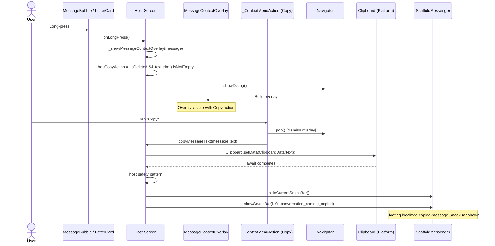

# C4 Model -- Copy Action (All 4 Levels)

## Feature: MessageContextOverlay -- Copy Action

**Scope:** The "Copy" action within the MessageContextOverlay context menu.
When a user long-presses a supported message bubble and taps "Copy", the
message text is written to the system clipboard and a localized SnackBar
confirmation is shown. In the current codebase, this flow is hosted by both the
direct conversation `LetterCard` path and the feed thread `MessageBubble` path.

Copy is the **simplest action** in the overlay -- purely local, no P2P
transmission, no database writes, no bridge encryption, no remote peer
involvement.

---

# Level 1 -- System Context

## 1.1 Diagram (PlantUML C4 Notation)

```plantuml
@startuml C4_Context_Copy
!include https://raw.githubusercontent.com/plantuml-stdlib/C4-PlantUML/master/C4_Context.puml

LAYOUT_WITH_LEGEND()

title System Context Diagram -- Copy Action

Person(user, "Local User", "Long-presses a message, taps Copy in the context menu.")

System(mknoon_app, "mknoon Flutter App", "Reads the message text from in-memory state and writes it to the system clipboard.")

System_Ext(clipboard, "System Clipboard", "iOS UIPasteboard / Android ClipboardManager. Receives text via Flutter platform channel.")

Rel(user, mknoon_app, "Long-press message -> tap Copy", "Touch gesture")
Rel(mknoon_app, user, "Shows SnackBar: 'Message copied to clipboard'", "Flutter UI")
Rel(mknoon_app, clipboard, "Clipboard.setData(ClipboardData(text: ...))", "Platform channel")

@enduml
```

## 1.2 What is NOT involved

| System | Involvement |
|--------|-------------|
| P2P Network / libp2p | None -- no wire message sent |
| Go Bridge / Native Layer | None -- no encryption or signing |
| SQLCipher Database | None -- no read or write |
| Secure Storage | None -- no secrets accessed |
| Remote Peer | None -- purely local operation |

## 1.3 Actors

**Local User** -- The only actor. Triggers the overlay via long-press, then
taps the Copy action. Receives visual feedback via localized SnackBar
confirmation (`conversation_context_copied`; English: "Message copied to
clipboard"). The copied text is now available for pasting in any app on the
device.

**Remote Peer** -- Not involved. Copy produces zero network traffic. The remote
peer is unaware that the local user copied a message.

---

# Level 2 -- Containers

## 2.1 Diagram

```
+-----------------------------------------------------------------------+
|                           mknoon Flutter App                          |
|                                                                       |
|  Presentation Layer (the ONLY app layer involved for Copy)            |
|                                                                       |
|  +-------------------+      +-------------------+                     |
|  | ConversationScreen|      | FeedScreen        |                     |
|  | (StatefulWidget)  |      | (StatefulWidget)  |                     |
|  | _showMessage...() |      | _showMessage...() |                     |
|  | _copyMessageText()|      | _copyMessageText()|                     |
|  +---------+---------+      +---------+---------+                     |
|            |                          |                               |
|            +------------+-------------+                               |
|                         v                                             |
|              +----------------------------+                           |
|              | MessageContextOverlay      |                           |
|              |  +--- _ContextMenuCard     |                           |
|              |  |     +--- _ContextMenuAction (Copy row)              |
|              |  +--- ReactionBar          |                           |
|              +--------------+-------------+                           |
|                             |                                         |
|                             v                                         |
|                    +-------------------+                              |
|                    | ScaffoldMessenger |                              |
|                    | showSnackBar(...) |                              |
|                    +-------------------+                              |
|                                                                       |
+-----------------------------------------------------------------------+
                             |
                             v
                    +-------------------+
                    | System Clipboard  |
                    | (Platform)        |
                    +-------------------+
```

## 2.2 Container Descriptions

### MessageContextOverlay (Widget)

Full-screen glassmorphic overlay rendered via `showDialog()`. Contains three
visual zones stacked vertically: ReactionBar, selected message preview, and
`_ContextMenuCard`. The Copy action lives inside the context menu card.

- `showCopyAction: bool` -- controls whether the Copy row appears
- `onCopyTap: VoidCallback?` -- callback fired when user taps Copy

### _ContextMenuCard (Widget)

Glassmorphic container with rounded corners (radius 24), dark translucent
background (RGBA 18, 20, 28, 0.95), and backdrop blur (sigma 20). Renders
a vertical list of `_ContextMenuAction` widgets separated by thin dividers.

Copy appears after Reply and optional Edit, and before optional Delete.

### _ContextMenuAction (Widget)

A single row in the context menu. For Copy:

- `Icon(Icons.copy_rounded, size: 18, color: RGBA(255, 255, 255, 0.78))`
- `Text("Copy", fontSize: 15, fontWeight: w500, color: RGBA(255, 255, 255, 0.78))`
- Wrapped in `Material(transparent) > InkWell(onTap) > Padding(h16, v14) > Row`

### ConversationScreen (StatefulWidget)

Hosts the direct-conversation overlay. Contains two key methods for Copy:

1. `_showMessageContextOverlay()` -- evaluates `hasCopyAction`, wires `onCopyTap`
2. `_copyMessageText(String text)` -- performs the actual clipboard write + SnackBar

`FeedScreen` contains a parallel host implementation for the feed thread
surface:

1. `_showMessageContextOverlay(...)` -- evaluates the same `hasCopyAction`, wires `onCopyTap`
2. `_copyMessageText(BuildContext context, String text)` -- performs the clipboard write + SnackBar using the feed host context

### ConversationWired (StatefulWidget)

**Not involved in the Copy tap execution path.** Copy is handled within the
presentation hosts (`ConversationScreen` and `FeedScreen`) plus the shared
overlay widget tree. `ConversationWired` / `FeedWired` host those screens, but
the Copy action itself does not invoke use cases, repositories, bridge calls,
or network transport.

## 2.3 Layers NOT involved

| Layer | Why not |
|-------|---------|
| Application (Use Cases) | No business logic needed -- clipboard write is a platform call |
| Domain (Models, Repos) | Domain models are read-only input (`isDeleted`, `text`); no repositories are accessed |
| Infrastructure (DB, Bridge, P2P) | No persistence, encryption, or network needed |

---

# Level 3 -- Components

## 3.1 Permission Gate

The Copy action is conditionally shown based on the same predicate in both
`ConversationScreen` and `FeedScreen`:

```dart
final hasCopyAction = !message.isDeleted && message.text.trim().isNotEmpty;
```

| Condition | Copy shown? | Rationale |
|-----------|-------------|-----------|
| Normal text message | Yes | Has non-empty text |
| Media-only message (empty text) | No | Nothing to copy |
| Deleted message (tombstone) | No | Content is gone |
| Whitespace-only text | No | `trim().isNotEmpty` filters it |
| Message with text + attachments | Yes | Text is still copyable |

## 3.2 ConversationScreen._showMessageContextOverlay

This direct-conversation host method is called when the user long-presses a
`LetterCard`. `FeedScreen` contains a parallel `_showMessageContextOverlay(...)`
implementation for feed `MessageBubble`s. For the Copy action specifically, the
host method:

1. Evaluates `hasCopyAction` from the message state
2. Passes `showCopyAction: hasCopyAction` to the overlay widget
3. Wires the `onCopyTap` callback:

```dart
// ConversationScreen
onCopyTap: hasCopyAction
    ? () async {
        Navigator.of(dialogContext).pop();
        await _copyMessageText(message.text);
      }
    : null,

// FeedScreen
onCopyTap: hasCopyAction
    ? () async {
        Navigator.of(dialogContext).pop();
        await _copyMessageText(context, message.text);
      }
    : null,
```

When `hasCopyAction` is false, `onCopyTap` is null and `showCopyAction` is
false, so the `_ContextMenuAction` for Copy is never built.

## 3.3 ConversationScreen._copyMessageText

The host methods that perform the actual work:

```dart
// ConversationScreen
Future<void> _copyMessageText(String text) async {
  await Clipboard.setData(ClipboardData(text: text));
  if (!mounted) return;
  final messenger = ScaffoldMessenger.maybeOf(context);
  messenger
    ?..hideCurrentSnackBar()
    ..showSnackBar(
      SnackBar(
        content: Text(
          AppLocalizations.of(context)!.conversation_context_copied,
        ),
        behavior: SnackBarBehavior.floating,
      ),
    );
}

// FeedScreen
Future<void> _copyMessageText(BuildContext context, String text) async {
  final messenger = ScaffoldMessenger.maybeOf(context);
  final copiedLabel = AppLocalizations.of(
    context,
  )!.conversation_context_copied;
  await Clipboard.setData(ClipboardData(text: text));
  messenger
    ?..hideCurrentSnackBar()
    ..showSnackBar(
      SnackBar(
        content: Text(copiedLabel),
        behavior: SnackBarBehavior.floating,
      ),
    );
}
```

### Mounted Guard Pattern

`ConversationScreen` uses `if (!mounted) return` after the async
`Clipboard.setData()` call. This guards against the scenario where the widget is
disposed during the async gap.

`FeedScreen` uses a different safety pattern: it resolves
`ScaffoldMessenger.maybeOf(context)` and the localized copied label before the
await, so it does not perform any new `context` lookups after the clipboard
platform call completes.

## 3.4 Execution Flow

```
1. User long-presses a supported message widget
   (`LetterCard` in direct conversation, `MessageBubble` in feed)
       |
2. Host `_showMessageContextOverlay(...)` called
       |
3. hasCopyAction evaluated: !message.isDeleted && message.text.trim().isNotEmpty
       |
4. showDialog() renders MessageContextOverlay with showCopyAction + onCopyTap
       |
5. User taps Copy row (_ContextMenuAction)
       |
6. onCopyTap fires:
       |
   6a. Navigator.of(dialogContext).pop()  -- dismiss overlay
       |
   6b. Host `_copyMessageText(...)` called
       |
   6c. Clipboard.setData(ClipboardData(text: text))  -- async platform channel
       |
   6d. Host safety pattern:
       - ConversationScreen: mounted check
       - FeedScreen: no post-await context lookup
       |
   6e. ScaffoldMessenger.hideCurrentSnackBar()  -- clear any existing snackbar
       |
   6f. ScaffoldMessenger.showSnackBar(l10n.conversation_context_copied)
       -- visual confirmation
```

## 3.5 Comparison with Other Actions

| Property | Copy | Reply | Edit | Delete | Reaction |
|----------|------|-------|------|--------|----------|
| P2P message sent | No | No (tap sets quote state only) | No (tap enters edit state only) | Maybe (delete-for-everyone path after follow-up sheet) | Yes |
| Bridge encryption | No | No | No | Maybe (delete-for-everyone path) | Yes |
| DB write | No | No | No | Maybe / Yes (delete flow) | Yes |
| Use case invoked | No | No | No | No at overlay tap; later delete flow may invoke transport / persistence helpers | Yes |
| Repository accessed | No | No | No | No at overlay tap; later delete flow may access repositories | Yes |
| Wired layer involved | No direct Copy callback after tap | Yes (quote/edit state host) | Yes (quote/edit state host) | Yes (follow-up delete flow) | Yes |
| Async platform call | Yes (clipboard) | No (sync dispatch) | No | No | No |
| Requires mounted guard | Conversation host only; feed host uses pre-await capture | No | No | No | No |

The table above describes what happens immediately when the user taps an action
inside `MessageContextOverlay`. Copy is the only overlay action whose full tap
path stays local to the presentation host and clipboard API.

---

# Level 4 -- Code

## 4.1 Widget Tree for Copy Action

```
_ContextMenuCard
  |
  +-- Column(mainAxisSize: min)
        |
        +-- _ContextMenuAction(Reply)
        +-- Divider(height:1, thickness:1, color: RGBA(255,255,255,0.08))
        +-- _ContextMenuAction(Edit)         <-- if showEditAction
        +-- Divider(...)                     <-- if showEditAction
        +-- _ContextMenuAction(Copy)         <-- if showCopyAction
        |     |
        |     key: ValueKey('message-context-copy-action')
        |     icon: Icons.copy_rounded
        |     label: l10n.conversation_context_copy   ("Copy")
        |     color: Color.fromRGBO(255, 255, 255, 0.78)
        |     onTap: onCopyTap
        |     |
        |     +-- Material(color: transparent)
        |           +-- InkWell(onTap: onCopyTap)
        |                 +-- Padding(h:16, v:14)
        |                       +-- Row(mainAxisSize: min)
        |                             +-- Icon(copy_rounded, size:18, color:0.78 white)
        |                             +-- SizedBox(width: 12)
        |                             +-- Flexible
        |                                   +-- Text(l10n.conversation_context_copy,
        |                                             fontSize:15, w500, 0.78 white)
        |
        +-- Divider(...)                     <-- if showDeleteAction
        +-- _ContextMenuAction(Delete)       <-- if showDeleteAction
```

## 4.2 Static Test Key

```dart
// In MessageContextOverlay class
static const copyActionKey = ValueKey('message-context-copy-action');
```

Used in widget tests to locate the Copy action:

```dart
expect(find.byKey(MessageContextOverlay.copyActionKey), findsOneWidget);
```

## 4.3 Complete onCopyTap Callback

As wired in the host `_showMessageContextOverlay(...)` methods:

```dart
// ConversationScreen
onCopyTap: hasCopyAction
    ? () async {
        Navigator.of(dialogContext).pop();
        await _copyMessageText(message.text);
      }
    : null,

// FeedScreen
onCopyTap: hasCopyAction
    ? () async {
        Navigator.of(dialogContext).pop();
        await _copyMessageText(context, message.text);
      }
    : null,
```

Note: The overlay is dismissed **before** the clipboard write. This ensures the
user sees the overlay disappear immediately. The SnackBar appears after the async
clipboard call completes.

## 4.4 _copyMessageText Implementation

```dart
// ConversationScreen
Future<void> _copyMessageText(String text) async {
  await Clipboard.setData(ClipboardData(text: text));
  if (!mounted) return;
  final messenger = ScaffoldMessenger.maybeOf(context);
  messenger
    ?..hideCurrentSnackBar()
    ..showSnackBar(
      SnackBar(
        content: Text(
          AppLocalizations.of(context)!.conversation_context_copied,
        ),
        behavior: SnackBarBehavior.floating,
      ),
    );
}

// FeedScreen
Future<void> _copyMessageText(BuildContext context, String text) async {
  final messenger = ScaffoldMessenger.maybeOf(context);
  final copiedLabel = AppLocalizations.of(
    context,
  )!.conversation_context_copied;
  await Clipboard.setData(ClipboardData(text: text));
  messenger
    ?..hideCurrentSnackBar()
    ..showSnackBar(
      SnackBar(
        content: Text(copiedLabel),
        behavior: SnackBarBehavior.floating,
      ),
    );
}
```

Key details:
- `Clipboard` is from `package:flutter/services.dart`
- `ClipboardData(text: text)` wraps the string for the platform channel
- both host implementations use `ScaffoldMessenger.maybeOf(...)` rather than `of(...)`
- `hideCurrentSnackBar()` clears any existing SnackBar before showing the new one
- `SnackBarBehavior.floating` renders the SnackBar above the bottom nav area
- localized string `conversation_context_copied` resolves to
  "Message copied to clipboard" in English

## 4.5 SnackBar Styling

The SnackBar uses Flutter defaults except where the repo explicitly overrides
properties:

| Property | Value |
|----------|-------|
| `behavior` | `SnackBarBehavior.floating` |
| `content` | `Text(l10n.conversation_context_copied)` → "Message copied to clipboard" |
| Background color | Not overridden in repo; falls back to Flutter / theme defaults |
| Duration | Not overridden in repo; uses Flutter default duration |
| Action | None |

## 4.6 Sequence Diagram (Mermaid)



## 4.7 Platform Channel Detail

At the repo level, Copy uses Flutter's `Clipboard.setData(...)` API:

```
HostScreen._copyMessageText(...)
  |
  v
Clipboard.setData(ClipboardData(text: "Hello"))
  |
  v
Flutter framework platform-channel dispatch
  |
  v
Device clipboard updated
```

The exact `flutter/platform` channel details and OS clipboard implementation are
owned by Flutter, not this repo. Within the codebase, this is the only
platform-facing API used by the Copy flow, and there are no Go bridge calls.

## 4.8 File Locations

| File | Role |
|------|------|
| `lib/features/conversation/presentation/widgets/message_context_overlay.dart` | `MessageContextOverlay`, `_ContextMenuCard`, `_ContextMenuAction` widgets; `copyActionKey` |
| `lib/features/conversation/presentation/screens/conversation_screen.dart` | Direct conversation host: `_showMessageContextOverlay()`, `_copyMessageText()`, permission gate |
| `lib/features/feed/presentation/screens/feed_screen.dart` | Feed host: `_showMessageContextOverlay()`, `_copyMessageText()`, same permission gate |
| `lib/features/feed/presentation/widgets/scrollable_message_preview.dart` | Wires feed message long-press into `FeedScreen._showMessageContextOverlay(...)` |
| `lib/features/feed/presentation/widgets/message_bubble.dart` | Feed message widget that exposes `onLongPress` for the overlay |
| `test/features/conversation/presentation/widgets/message_context_overlay_test.dart` | Widget tests for Copy action rendering when `showCopyAction` is true/false |
| `test/features/conversation/presentation/screens/conversation_screen_test.dart` | Widget tests for direct conversation Copy behavior: clipboard write, overlay dismissal, SnackBar, and media-only gating |
| `test/features/feed/presentation/screens/feed_screen_test.dart` | Widget tests for feed Copy behavior: clipboard write, overlay dismissal, SnackBar, and media-only gating |

---

## Summary

Copy is a presentation-layer action with a shared overlay widget and two host
screen implementations:

1. **Permission gate**: `!message.isDeleted && message.text.trim().isNotEmpty`
2. **Trigger**: User taps Copy in `_ContextMenuAction`
3. **Dismiss**: `Navigator.pop()` closes the overlay
4. **Write**: `Clipboard.setData()` via platform channel
5. **Host safety**: `ConversationScreen` uses `if (!mounted) return`; `FeedScreen` captures messenger + localization before `await`
6. **Feedback**: `ScaffoldMessenger.showSnackBar(Text(l10n.conversation_context_copied))`

No use cases. No repositories. No bridge. No P2P. No database. No encryption.
The flow lives in the shared `MessageContextOverlay` plus host-specific screen
helpers in `ConversationScreen` and `FeedScreen`.
