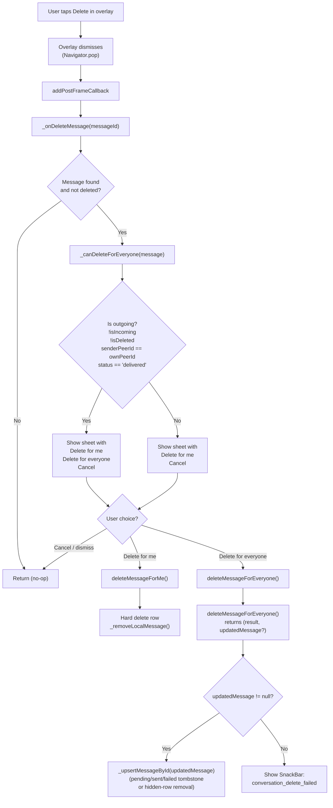
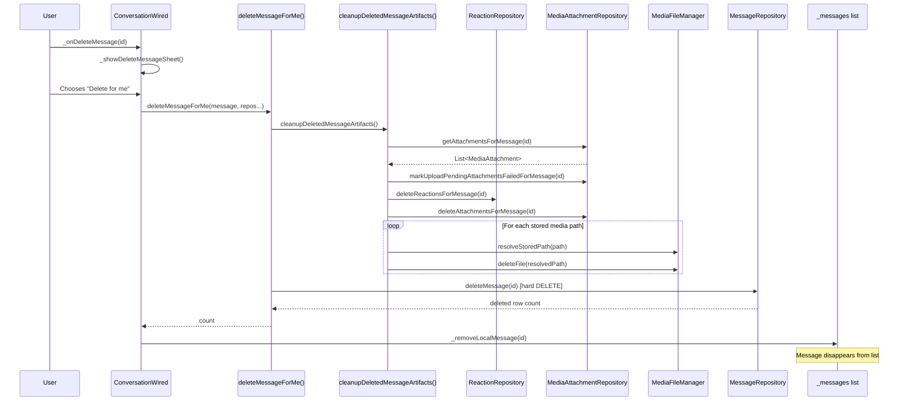
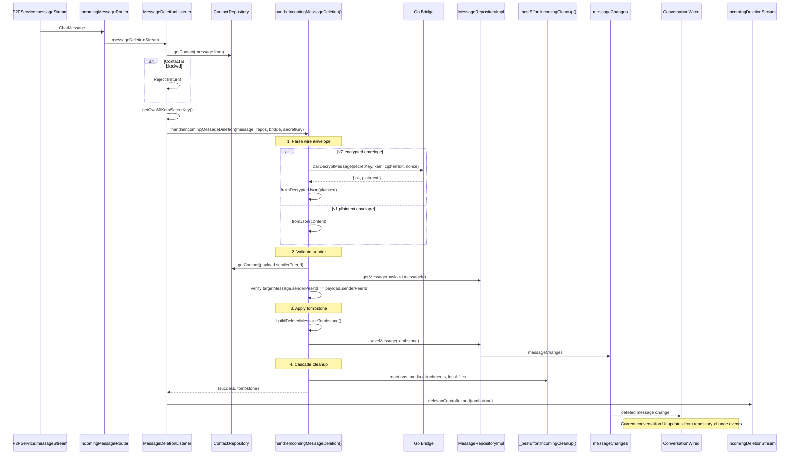
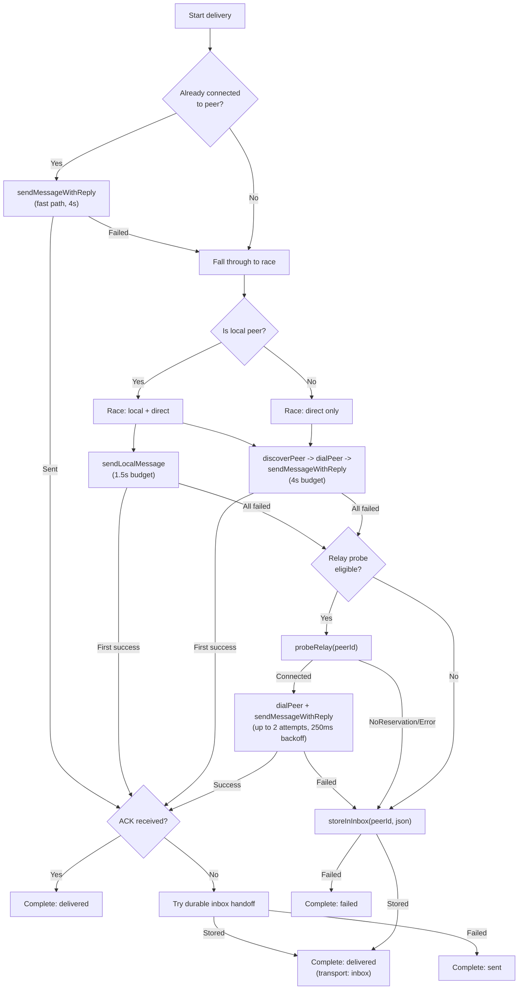
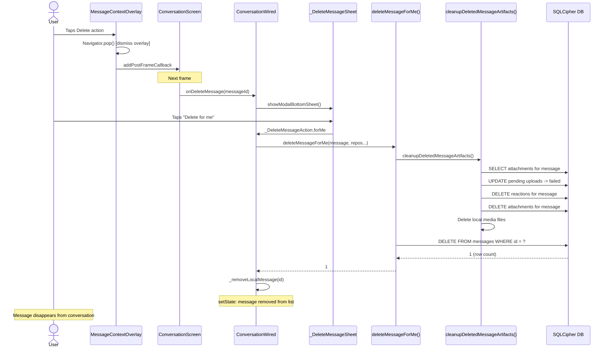

# C4 Model -- Delete Action (All 4 Levels)

## Feature: MessageContextOverlay -- Delete Action

**Scope:** The "Delete" action within the MessageContextOverlay context menu.
When a user long-presses a LetterCard and taps "Delete", a confirmation bottom
sheet always offers **Delete for me** and conditionally offers **Delete for
everyone** when the message is outgoing, authored by the local user, and
already `delivered`:

1. **Delete for me** -- local-only hard delete, removes the message row from the
   database. The peer still sees the message.
2. **Delete for everyone** -- builds a deletion tombstone payload, optionally
   encrypts it when bridge + recipient ML-KEM key are available, and sends it
   to the remote peer via P2P. The receiver sees "This message was deleted";
   the sender keeps a local tombstone only while status is `sending`, `sent`,
   or `failed`.

Delete is the **most complex context menu action** because it spans all
architectural layers: presentation (overlay + confirmation sheet), application
(two use cases + listener), domain (tombstone model fields), infrastructure
(DB hard delete vs. tombstone persistence, race delivery, optional
encryption), and the receive-side pipeline on the remote peer.

---

# Level 1 -- System Context

## 1.1 Diagram (PlantUML C4 Notation)

```plantuml
@startuml C4_Context_Delete
!include https://raw.githubusercontent.com/plantuml-stdlib/C4-PlantUML/master/C4_Context.puml

LAYOUT_WITH_LEGEND()

title System Context Diagram -- Delete Action (Both Modes)

Person(local_user, "Local User", "Long-presses message -> taps Delete -> chooses mode -> confirms.")
Person(remote_peer, "Remote Peer", "(Delete-for-everyone only) Receives a v2 encrypted or v1 plaintext deletion tombstone and sees 'This message was deleted'.")

System(mknoon_app, "mknoon Flutter App", "Permission checks, confirmation UI, two deletion paths, tombstone persistence, cleanup.")

System_Ext(p2p_network, "P2P Network / libp2p", "(Delete-for-everyone only) Transports deletion wire message via fast path, race delivery, relay probe, and inbox fallback.")
System_Ext(go_bridge, "Go Bridge", "(Delete-for-everyone only, optional) ML-KEM envelope encryption/decryption for v2 deletion payloads.")
System_Ext(sqlcipher_db, "SQLCipher DB", "Hard-deletes row (for-me) OR upserts a tombstone row (for-everyone).")
System_Ext(secure_storage, "Identity Repository / Secure Storage", "(Delete-for-everyone receive path, indirect) Loads the local ML-KEM secret key for v2 decryption.")

Rel(local_user, mknoon_app, "Long-press -> Delete -> choose mode -> confirm", "Touch gesture")
Rel(mknoon_app, local_user, "Message disappears, shows a tombstone, or hides after delivery", "Flutter UI")
Rel(mknoon_app, sqlcipher_db, "DELETE row / upsert tombstone row", "SQLCipher")
Rel(mknoon_app, go_bridge, "message.encrypt / message.decrypt (v2 only)", "MethodChannel")
Rel(mknoon_app, p2p_network, "Race delivery: local -> direct -> relay -> inbox", "libp2p")
Rel(mknoon_app, secure_storage, "loadIdentity() -> mlKemSecretKey", "IdentityRepository")
Rel(p2p_network, remote_peer, "Delivers deletion tombstone", "libp2p stream")

@enduml
```

## 1.2 System Involvement by Deletion Mode

| System | Delete for Me | Delete for Everyone |
|--------|:---:|:---:|
| P2P Network / libp2p | -- | Sends deletion envelope via fast path, race delivery, relay probe, and inbox fallback |
| Go Bridge / Native Layer | -- | Optional ML-KEM encryption/decryption for v2 payloads |
| SQLCipher Database | Hard DELETE row | Upserts tombstone row with deleted/hidden metadata and delivery state |
| Identity Repository / Secure Storage | -- | Indirectly loads the local ML-KEM secret key for v2 decryption |
| Remote Peer | Unaware | Receives tombstone, applies locally |

## 1.3 Actors

**Local User** -- Triggers the overlay via long-press, taps Delete, selects a
deletion mode in the confirmation bottom sheet, and receives visual feedback.
For delete-for-me the message disappears entirely. For delete-for-everyone the
message becomes a local tombstone while status is `sending`, `sent`, or
`failed`; once it reaches `delivered` (including inbox handoff), it is hidden
from the sender's conversation.

**Remote Peer** -- Only involved in delete-for-everyone. Receives a v2
encrypted or v1 plaintext deletion wire message, validates that the payload sender matches
the original author stored on the target message, applies the tombstone to the
local message row, and sees "This message was deleted" in their conversation.

---

# Level 2 -- Containers

## 2.1 Diagram

```
+-------------------------------------------------------------------------------------+
|                              mknoon Flutter App                                     |
|                                                                                     |
|  PRESENTATION                                                                       |
|  +--------------------+     +----------------------------+                          |
|  | ConversationScreen |---->| MessageContextOverlay      |                          |
|  | (StatefulWidget)   |     |  +--- _ContextMenuCard     |                          |
|  |                    |     |  |     +--- _ContextMenuAction(Delete)                |
|  | _canDeleteMessage()|     |  |          icon: delete_outline_rounded              |
|  | _showMessage...()  |     |  |          color: Color(0xFFFF8A80)                  |
|  +--------------------+     |  +--- ReactionBar          |                          |
|          |                  +----------------------------+                          |
|          | addPostFrameCallback                                                     |
|          v                                                                          |
|  +-------------------------+     +-------------------------------+                  |
|  | ConversationWired       |---->| _DeleteMessageSheet           |                  |
|  | (StatefulWidget)        |     |  - "Delete for me"    (always)|                  |
|  | _onDeleteMessage()      |     |  - "Delete for everyone"     |                  |
|  | _showDeleteMessageSheet()|    |     (outgoing+own+delivered)  |                  |
|  | _canDeleteForEveryone() |     |  - "Cancel"                   |                  |
|  | listens to messageChanges|    +-------------------------------+                  |
|  +-------------------------+                                                        |
|       |             |                                                               |
|  APPLICATION        |                                                               |
|  +------------------+--+    +----------------------------------+                    |
|  | deleteMessageForMe()|    | deleteMessageForEveryone()       |                    |
|  | (local only)        |    | (optional encrypt + race delivery)|                    |
|  +---------------------+    +----------------------------------+                    |
|       |                          |                |                                 |
|  +----+---+                +-----+-----+    +-----+------+                          |
|  |cleanup  |               |build      |    |race        |                          |
|  |artifacts|               |tombstone  |    |delivery    |                          |
|  +---------+               +-----------+    +------------+                          |
|                                                                                     |
|  DOMAIN                                                                             |
|  +---------------------------------------+                                          |
|  | ConversationMessage                   |                                          |
|  |  - deletedAt: String?                 |                                          |
|  |  - deletedByPeerId: String?           |                                          |
|  |  - hiddenAt: String?                  |                                          |
|  |  - isDeleted: bool (getter)           |                                          |
|  |  - isHidden: bool (getter)            |                                          |
|  +---------------------------------------+                                          |
|  +---------------------------------------+                                          |
|  | MessageDeletionPayload                |                                          |
|  |  - v1: plaintext envelope             |                                          |
|  |  - v2: encrypted envelope             |                                          |
|  +---------------------------------------+                                          |
|                                                                                     |
|  INFRASTRUCTURE                                                                     |
|  +---------------------+   +-----------+   +-------------------+                    |
|  | MessageRepositoryImpl|   | P2PService|   | Go Bridge         |                    |
|  | - deleteMessage()    |   | - race    |   | - message.encrypt |                    |
|  | - saveMessage()      |   |   delivery|   | - message.decrypt |                    |
|  | - messageChanges     |   |           |   |                   |                    |
|  +---------------------+   +-----------+   +-------------------+                    |
|                                                                                     |
|  RECEIVE SIDE                                                                       |
|  +-------------------------------+    +-------------------------------+             |
|  | IncomingMessageRouter         |--->| MessageDeletionListener       |             |
|  | - messageDeletionStream       |    | (typed delete stream)         |             |
|  +-------------------------------+    +-------------------------------+             |
|                                                    |                                 |
|                                                    v                                 |
|                                       +------------------------------------+        |
|                                       | handleIncomingMessageDeletion()    |        |
|                                       | (decrypt, validate, apply tombstone|        |
|                                       +------------------------------------+        |
+-------------------------------------------------------------------------------------+
```

## 2.2 Container Descriptions

### MessageContextOverlay (Widget)

Full-screen glassmorphic overlay rendered via `showDialog()`. Contains three
visual zones stacked vertically: ReactionBar, selected message preview, and
`_ContextMenuCard`. The Delete action lives at the bottom of the context menu
card, styled destructively with `Color(0xFFFF8A80)` for both icon and text.

Visibility is gated by `showDeleteAction: bool`. When tapped, the overlay
dismisses first and then the delete callback fires via `addPostFrameCallback`
-- this is critical to avoid framework conflicts from showing a new dialog
(the confirmation sheet) while another (the overlay) is being dismissed.

### _DeleteMessageSheet (Widget)

Modal bottom sheet rendered via `showModalBottomSheet()`. Glassmorphic design
matching the overlay aesthetic (`Color.fromRGBO(18, 20, 28, 0.96)` background,
`BorderRadius.circular(28)`, backdrop blur). Contains a drag handle, a prompt
text, and 2-3 action buttons:

| Action | Always visible? | Color | Icon |
|--------|:---:|:---:|:---:|
| Delete for me | Yes | `Color(0xFFFF8A80)` | `delete_outline_rounded` |
| Delete for everyone | Only if outgoing + delivered | `Color(0xFFFFB38A)` | `person_remove_alt_1_rounded` |
| Cancel | Yes | `Color.fromRGBO(255, 255, 255, 0.72)` | `close_rounded` |

### ConversationScreen (StatefulWidget)

Owns `_canDeleteMessage()` which gates whether the delete action appears in the
overlay. Owns the post-frame callback pattern that bridges the overlay dismiss
to the `onDeleteMessage` callback.

### ConversationWired (StatefulWidget)

Orchestrates the full delete flow: receives the `messageId` from the screen,
shows the confirmation sheet via `_showDeleteMessageSheet()`, checks
`_canDeleteForEveryone()`, and dispatches to either `deleteMessageForMe()` or
`deleteMessageForEveryone()` use case. Also handles post-delete UI state:
removing from the local list (for-me), upserting pending/failed/sent tombstones,
or removing a delivered outgoing tombstone once `hiddenAt` is set.

### deleteMessageForMe() (Use Case)

Local-only deletion. Cascades cleanup of reactions, media attachments, and
local media files, then hard-deletes the message row from the database. No P2P,
no bridge, no encryption.

### deleteMessageForEveryone() (Use Case)

Full network deletion. Validates the message is outgoing + delivered + not
already deleted. Builds a `MessageDeletionPayload`, optionally encrypts it via
the bridge when the bridge and a recipient ML-KEM key are available, persists a pending
tombstone, cascades artifact cleanup, then races delivery through
local/direct/relay/inbox paths. Updates tombstone status to
`delivered`/`sent`/`failed` based on outcome, and hides delivered outgoing
tombstones by setting `hiddenAt`.

### MessageDeletionListener (Listener)

Receive-side entrypoint. Subscribes to the typed delete stream exposed by
`IncomingMessageRouter`, rejects blocked contacts using `message.from`, fetches
the local ML-KEM secret
key, delegates parsing/validation/tombstone application to
`handleIncomingMessageDeletion()`, and publishes successful tombstones on
`incomingDeletionStream`. The current conversation UI updates from
`messageRepo.messageChanges`, not from `_deletionController`.

### handleIncomingMessageDeletion() (Use Case)

Core receive-side logic. Parses the wire envelope (v1 plaintext or v2
encrypted), resolves the payload sender contact, fetches the target message
from the database, validates `targetMessage.senderPeerId == payload.senderPeerId`,
builds and persists the tombstone, and cascades artifact cleanup.

---

# Level 3 -- Components

## 3.1 Permission Gate: _canDeleteMessage

The delete action appears in the context menu overlay for any non-deleted,
non-system message. Unlike Edit (restricted to the last sent message), Delete
is available on **both incoming and outgoing** messages.

```dart
bool _canDeleteMessage(ConversationMessage message) {
  if (widget.onDeleteMessage == null) return false;
  if (message.isDeleted) return false;
  return message.transport != 'system';
}
```

`ConversationWired` only shows the failure SnackBar when `updatedMessage ==
null`. If the use case persists a failed tombstone and returns it,
`_upsertMessageById()` renders that tombstone instead of showing the SnackBar.

**Decision table:**

| Message state | Delete visible? |
|---|:---:|
| Normal incoming message | Yes |
| Normal outgoing message | Yes |
| Already deleted (tombstone) | No |
| System message (transport = 'system') | No |
| onDeleteMessage callback is null | No |

## 3.2 Post-Frame Callback Pattern

Delete is unique among context menu actions because it needs to show a **second
dialog** (the confirmation bottom sheet) after the overlay dismisses. Showing a
new dialog while another is being popped causes Flutter framework errors. The
solution: `addPostFrameCallback` defers the callback to the next frame, after
the overlay's Navigator.pop() has fully completed.

```dart
onDeleteTap: hasDeleteAction
    ? () {
        Navigator.of(dialogContext).pop();
        WidgetsBinding.instance.addPostFrameCallback((_) {
          if (!mounted) return;
          widget.onDeleteMessage?.call(message.id);
        });
      }
    : null,
```

**Why this is necessary:**

1. User taps Delete in the overlay
2. `Navigator.of(dialogContext).pop()` begins dismissing the overlay
3. Without `addPostFrameCallback`, calling `onDeleteMessage` immediately would
   try to show `_showDeleteMessageSheet()` while the overlay dialog is still
   being removed from the Navigator stack
4. The callback defers execution to the next frame, after the pop has completed
5. The `mounted` guard protects against the widget being disposed between frames

Other actions (Reply, Edit, Copy) do not need this pattern because they either
modify local state directly or interact with the clipboard -- they do not show
a new dialog.

## 3.3 Confirmation Dialog Decision Tree



`ConversationWired` only shows the failure SnackBar when
`deleteMessageForEveryone()` returns `updatedMessage == null`. If the use case
persists a failed tombstone and returns it, the UI upserts that tombstone
instead of showing a SnackBar.

## 3.4 _canDeleteForEveryone Gate

This is the second permission gate, evaluated when building the confirmation
sheet. It determines whether the "Delete for everyone" option appears.

```dart
bool _canDeleteForEveryone(ConversationMessage message) {
  final ownPeerId = _identity?.peerId;
  if (ownPeerId == null) return false;
  if (message.isIncoming || message.isDeleted) return false;
  if (message.senderPeerId != ownPeerId) return false;
  return message.status == 'delivered';
}
```

**Decision table:**

| Condition | Delete for everyone available? |
|---|:---:|
| Own identity not loaded | No |
| Incoming message | No |
| Already deleted | No |
| senderPeerId does not match own peerId | No |
| Status is not 'delivered' (e.g., 'sending', 'sent', 'failed') | No |
| Outgoing + delivered + own message | Yes |

## 3.5 Delete for Me Path (Component Detail)



**Key characteristics:**
- No P2P transmission
- No bridge/encryption
- Hard DELETE from database (row is gone)
- Cascade cleanup runs first: reactions, media attachments, local media files
- Only `_removeLocalMessage()` is called (not upsert) -- message is fully gone
- Peer is completely unaware

## 3.6 Delete for Everyone Path (Component Detail)

```mermaid
sequenceDiagram
    participant User
    participant ConvWired as ConversationWired
    participant UseCase as deleteMessageForEveryone()
    participant Bridge as Go Bridge
    participant MsgRepo as MessageRepository
    participant Cleanup as _bestEffortCleanup()
    participant P2P as P2PService
    participant UI as _messages list

    User->>ConvWired: _onDeleteMessage(id)
    ConvWired->>ConvWired: _showDeleteMessageSheet()
    User->>ConvWired: Chooses "Delete for everyone"
    ConvWired->>UseCase: deleteMessageForEveryone(message, repos, bridge, mlKemKey...)

    Note over UseCase: 1. Validate
    UseCase->>UseCase: Check: !isIncoming, !isDeleted, status == 'delivered'

    Note over UseCase: 2. Build payload; encrypt only for v2
    UseCase->>UseCase: Build MessageDeletionPayload
    alt Bridge + recipient ML-KEM key available
        UseCase->>Bridge: callEncryptMessage(recipientMlKemPublicKey, innerJson)
        Bridge-->>UseCase: { ok, kem, ciphertext, nonce }
        UseCase->>UseCase: buildEncryptedEnvelope() -> jsonString
    else
        UseCase->>UseCase: payload.toJson() -> jsonString
    end

    Note over UseCase: 3. Persist pending tombstone
    UseCase->>UseCase: buildDeletedMessageTombstone(status: 'sending')
    UseCase->>MsgRepo: saveMessage(pendingTombstone)

    Note over UseCase: 4. Cascade cleanup (best-effort)
    UseCase->>Cleanup: reactions, media attachments, local files

    Note over UseCase: 5. Fast path, race, relay probe, then inbox fallback
    alt Already connected to peer
        UseCase->>P2P: sendMessageWithReply(peerId, json, timeout)
        P2P-->>UseCase: SendMessageResult
    else Run foreground transport race
        par Local send (1.5s budget, local peer only)
            UseCase->>P2P: sendLocalMessage()
        and Direct send (4s budget)
            UseCase->>P2P: discoverPeer() -> dialPeer() -> sendMessageWithReply()
        end
    end

    alt A live transport path returns a send result
        UseCase->>MsgRepo: saveMessage(final tombstone state: delivered / sent / inbox-delivered)
    else No live transport path succeeded
        UseCase->>P2P: storeInInbox(peerId, json)
        alt Inbox store succeeded
            UseCase->>MsgRepo: saveMessage(tombstone: delivered, transport: inbox)
        else Inbox store failed
            UseCase->>MsgRepo: saveMessage(tombstone: failed)
        end
    end

    UseCase-->>ConvWired: (result, updatedMessage?)
    alt updatedMessage != null
        ConvWired->>UI: _upsertMessageById(updatedMessage)
        Note over UI: Pending/sent/failed tombstones stay visible; delivered outgoing tombstones are removed once hiddenAt is set
    else result != success
        ConvWired->>UI: Show conversation_delete_failed SnackBar
    end
```

## 3.7 Receive Side Pipeline



## 3.8 Race Delivery Pattern (Detail)

The delete-for-everyone use case reuses the same race delivery strategy as
`sendChatMessage`. Delivery is attempted through progressively broader
transport layers, with the first success winning the race.



**Timing budgets (from `send_chat_message_use_case.dart`):**

| Constant | Value | Purpose |
|---|---|---|
| `interactiveLocalBudget` | 1,500 ms | Local WiFi send timeout |
| `interactiveDirectBudget` | 4,000 ms | Direct discover/dial/send timeout |
| `relayProbeSendAttempts` | 2 | Max retry attempts after relay probe |
| `relayProbeRetryBackoff` | 250 ms | Delay between relay probe retries |

## 3.9 Outgoing Tombstone Visibility Normalization

When a sender deletes their own message for everyone, the tombstone's
`hiddenAt` field is managed by `normalizeOutgoingDeleteTombstoneVisibility()`:

```dart
ConversationMessage normalizeOutgoingDeleteTombstoneVisibility(
  ConversationMessage message,
) {
  if (!isOutgoingDeletedTombstone(message)) return message;
  final hiddenAt = message.status == 'delivered' ? message.deletedAt : null;
  if (message.hiddenAt == hiddenAt) return message;
  return message.copyWith(hiddenAt: hiddenAt);
}
```

**Behavior:**
- If tombstone status is `delivered`: set `hiddenAt = deletedAt` (hide from
  sender's UI -- the peer will see the tombstone, sender does not need to)
- If tombstone status is `sending`, `sent`, or `failed`: `hiddenAt = null`
  (keep visible so sender can see the pending/failed state and retry)
- Open conversations enforce this immediately in `_upsertMessageById()`, and
  database-backed reloads enforce it through `_visibleMessageFilter =
  'hidden_at IS NULL'`

## 3.10 Message Lifecycle State Diagram

```mermaid
stateDiagram-v2
    [*] --> Normal : Message created

    Normal --> DeletedForMe : User selects "Delete for me"
    Normal --> DeletionPending : User selects "Delete for everyone"

    state "Delete for Me" as DeletedForMe {
        note right of DeletedForMe
            Hard DELETE from DB.
            Row is gone forever.
            Peer unaffected.
        end note
    }
    DeletedForMe --> [*] : Row removed

    state "Delete for Everyone (sender side)" as DeletionPending {
        [*] --> Sending : buildDeletedMessageTombstone(status: sending)
        Sending --> Delivered : Race delivery succeeded + acked
        Sending --> Sent : Race delivery succeeded, not acked
        Sending --> Delivered_Inbox : Stored in inbox
        Sending --> Failed : All delivery paths failed

        state "Delivered" as Delivered {
            note right of Delivered
                hiddenAt = deletedAt
                (hidden from sender UI)
            end note
        }
        state "Sent" as Sent {
            note right of Sent
                hiddenAt = null
                (visible for retry)
            end note
        }
        state "Delivered (inbox)" as Delivered_Inbox {
            note right of Delivered_Inbox
                hiddenAt = deletedAt
                transport = 'inbox'
            end note
        }
        state "Failed" as Failed {
            note right of Failed
                hiddenAt = null
                wireEnvelope preserved for retry
            end note
        }
    }

    Normal --> TombstoneApplied : Peer receives deletion tombstone

    state "Tombstone Applied (receiver side)" as TombstoneApplied {
        note right of TombstoneApplied
            deletedAt = timestamp from payload
            deletedByPeerId = sender's peerId
            text = '' (cleared)
            media = [] (cleared)
            LetterCard shows italic "This message was deleted"
        end note
    }
```

---

# Level 4 -- Code

## 4.1 Static Test Keys

```dart
// MessageContextOverlay (overlay menu)
static const deleteActionKey = ValueKey('message-context-delete-action');

// ConversationWired (confirmation bottom sheet)
static const deleteSheetKey = ValueKey('conversation-delete-message-sheet');
static const deletePromptKey = ValueKey('conversation-delete-message-prompt');
static const deleteForMeKey = ValueKey('conversation-delete-for-me-action');
static const deleteForEveryoneKey = ValueKey('conversation-delete-for-everyone-action');
static const deleteCancelKey = ValueKey('conversation-delete-cancel-action');
```

## 4.2 Destructive Styling

The delete action in the overlay uses a distinct red color to signal its
destructive nature:

```dart
// In _ContextMenuCard.build()
if (showDeleteAction)
  _ContextMenuAction(
    key: MessageContextOverlay.deleteActionKey,
    icon: Icons.delete_outline_rounded,
    label: l10n.conversation_context_delete,
    onTap: onDeleteTap,
    color: const Color(0xFFFF8A80),  // Destructive red
  ),
```

The `_ContextMenuAction` widget applies this color to both the icon and the
label text:

```dart
class _ContextMenuAction extends StatelessWidget {
  final IconData icon;
  final String label;
  final VoidCallback? onTap;
  final Color color;

  const _ContextMenuAction({
    super.key,
    required this.icon,
    required this.label,
    this.onTap,
    this.color = const Color.fromRGBO(255, 255, 255, 0.78),  // Default: white
  });

  @override
  Widget build(BuildContext context) {
    return Material(
      color: Colors.transparent,
      child: InkWell(
        onTap: onTap,
        child: Padding(
          padding: const EdgeInsets.symmetric(horizontal: 16, vertical: 14),
          child: Row(
            mainAxisSize: MainAxisSize.min,
            children: [
              Icon(icon, size: 18, color: color),
              const SizedBox(width: 12),
              Flexible(
                child: Text(
                  label,
                  style: TextStyle(
                    fontSize: 15,
                    fontWeight: FontWeight.w500,
                    color: color,  // Same color for text
                  ),
                ),
              ),
            ],
          ),
        ),
      ),
    );
  }
}
```

## 4.3 Post-Frame Callback (Full Context)

Located in `ConversationScreen._showMessageContextOverlay()`:

```dart
onDeleteTap: hasDeleteAction
    ? () {
        Navigator.of(dialogContext).pop();    // 1. Dismiss overlay
        WidgetsBinding.instance.addPostFrameCallback((_) {  // 2. Defer to next frame
          if (!mounted) return;               // 3. Guard: widget may be disposed
          widget.onDeleteMessage?.call(message.id);  // 4. Trigger confirmation sheet
        });
      }
    : null,
```

## 4.4 _canDeleteMessage (Permission Gate)

Located in `ConversationScreen`:

```dart
bool _canDeleteMessage(ConversationMessage message) {
  if (widget.onDeleteMessage == null) return false;
  if (message.isDeleted) return false;
  return message.transport != 'system';
}
```

## 4.5 _canDeleteForEveryone (Second Permission Gate)

Located in `ConversationWired`:

```dart
bool _canDeleteForEveryone(ConversationMessage message) {
  final ownPeerId = _identity?.peerId;
  if (ownPeerId == null) return false;
  if (message.isIncoming || message.isDeleted) return false;
  if (message.senderPeerId != ownPeerId) return false;
  return message.status == 'delivered';
}
```

## 4.6 Confirmation Bottom Sheet (_DeleteMessageSheet)

Located in `conversation_wired.dart`:

```dart
enum _DeleteMessageAction { forMe, forEveryone, cancel }

class _DeleteMessageSheet extends StatelessWidget {
  final bool canDeleteForEveryone;

  const _DeleteMessageSheet({required this.canDeleteForEveryone});

  @override
  Widget build(BuildContext context) {
    final l10n = AppLocalizations.of(context)!;
    final maxHeight = MediaQuery.of(context).size.height * 0.72;
    return SafeArea(
      child: Padding(
        padding: const EdgeInsets.fromLTRB(16, 0, 16, 16),
        child: ClipRRect(
          borderRadius: BorderRadius.circular(28),
          child: BackdropFilter(
            filter: ImageFilter.blur(sigmaX: 20, sigmaY: 20),
            child: Container(
              key: ConversationWired.deleteSheetKey,
              decoration: BoxDecoration(
                color: const Color.fromRGBO(18, 20, 28, 0.96),
                borderRadius: BorderRadius.circular(28),
                border: Border.all(
                  color: const Color.fromRGBO(255, 255, 255, 0.10),
                ),
              ),
              child: ConstrainedBox(
                constraints: BoxConstraints(maxHeight: maxHeight),
                child: SingleChildScrollView(
                  padding: const EdgeInsets.fromLTRB(20, 14, 20, 20),
                  child: Column(
                    mainAxisSize: MainAxisSize.min,
                    crossAxisAlignment: CrossAxisAlignment.stretch,
                    children: [
                      // Drag handle
                      Center(
                        child: Container(
                          width: 42,
                          height: 4,
                          decoration: BoxDecoration(
                            color: const Color.fromRGBO(255, 255, 255, 0.18),
                            borderRadius: BorderRadius.circular(999),
                          ),
                        ),
                      ),
                      const SizedBox(height: 18),
                      // Prompt text
                      Text(
                        l10n.conversation_delete_message_prompt,
                        key: ConversationWired.deletePromptKey,
                        textAlign: TextAlign.center,
                        style: const TextStyle(
                          fontSize: 15,
                          fontWeight: FontWeight.w600,
                          color: Color.fromRGBO(255, 255, 255, 0.94),
                          height: 1.35,
                        ),
                      ),
                      const SizedBox(height: 16),
                      // "Delete for me" -- always shown
                      _DeleteSheetAction(
                        key: ConversationWired.deleteForMeKey,
                        label: l10n.conversation_delete_for_me,
                        icon: Icons.delete_outline_rounded,
                        color: const Color(0xFFFF8A80),
                        onTap: () => Navigator.of(context).pop(_DeleteMessageAction.forMe),
                      ),
                      // "Delete for everyone" -- conditional
                      if (canDeleteForEveryone) ...[
                        const SizedBox(height: 10),
                        _DeleteSheetAction(
                          key: ConversationWired.deleteForEveryoneKey,
                          label: l10n.conversation_delete_for_everyone,
                          icon: Icons.person_remove_alt_1_rounded,
                          color: const Color(0xFFFFB38A),
                          onTap: () => Navigator.of(context).pop(_DeleteMessageAction.forEveryone),
                        ),
                      ],
                      // "Cancel" -- always shown
                      const SizedBox(height: 10),
                      _DeleteSheetAction(
                        key: ConversationWired.deleteCancelKey,
                        label: l10n.conversation_delete_cancel,
                        icon: Icons.close_rounded,
                        color: const Color.fromRGBO(255, 255, 255, 0.72),
                        onTap: () => Navigator.of(context).pop(_DeleteMessageAction.cancel),
                      ),
                    ],
                  ),
                ),
              ),
            ),
          ),
        ),
      ),
    );
  }
}
```

## 4.7 _onDeleteMessage (Orchestrator)

Located in `ConversationWired`:

```dart
Future<void> _onDeleteMessage(String messageId) async {
  if (!mounted) return;
  final message = _messages.where((m) => m.id == messageId).firstOrNull;
  if (message == null || message.isDeleted) return;

  final action = await _showDeleteMessageSheet(
    canDeleteForEveryone: _canDeleteForEveryone(message),
  );
  if (!mounted || action == null || action == _DeleteMessageAction.cancel) {
    return;
  }

  // Clear edit/quote state if this message was being edited or quoted
  if (_editingMessageId == messageId) {
    setState(() {
      _editingMessageId = null;
      _editingOriginalText = null;
      _draftText = '';
    });
  }
  if (_activeQuoteMessageId == messageId && mounted) {
    setState(() => _activeQuoteMessageId = null);
  }

  if (action == _DeleteMessageAction.forMe) {
    final deleted = await widget.deleteMessageForMeFn(
      message: message,
      messageRepo: widget.messageRepo,
      reactionRepo: widget.reactionRepo,
      mediaAttachmentRepo: widget.mediaAttachmentRepo,
      mediaFileManager: widget.mediaFileManager,
    );
    if (deleted > 0 && mounted) {
      _removeLocalMessage(messageId);
    }
    return;
  }

  final (result, updatedMessage) = await widget.deleteMessageForEveryoneFn(
    p2pService: widget.p2pService,
    messageRepo: widget.messageRepo,
    originalMessage: message,
    reactionRepo: widget.reactionRepo,
    mediaAttachmentRepo: widget.mediaAttachmentRepo,
    mediaFileManager: widget.mediaFileManager,
    bridge: widget.bridge,
    recipientMlKemPublicKey: _contact.mlKemPublicKey,
  );

  if (!mounted) return;
  if (updatedMessage != null) {
    setState(() => _upsertMessageById(updatedMessage));
    return;
  }
  if (result != SendChatMessageResult.success) {
    ScaffoldMessenger.maybeOf(context)
      ?..hideCurrentSnackBar()
      ..showSnackBar(
        SnackBar(
          content: Text(
            AppLocalizations.of(context)!.conversation_delete_failed,
          ),
          behavior: SnackBarBehavior.floating,
        ),
      );
  }
}
```

## 4.8 deleteMessageForMe() (Use Case)

Located in `lib/features/conversation/application/delete_message_use_case.dart`:

```dart
Future<int> deleteMessageForMe({
  required ConversationMessage message,
  required MessageRepository messageRepo,
  ReactionRepository? reactionRepo,
  MediaAttachmentRepository? mediaAttachmentRepo,
  MediaFileManager? mediaFileManager,
}) async {
  emitFlowEvent(
    layer: 'FL',
    event: 'CHAT_MSG_DELETE_FOR_ME_START',
    details: {
      'id': message.id.length > 8 ? message.id.substring(0, 8) : message.id,
    },
  );

  await cleanupDeletedMessageArtifacts(
    message: message,
    reactionRepo: reactionRepo,
    mediaAttachmentRepo: mediaAttachmentRepo,
    mediaFileManager: mediaFileManager,
  );
  final count = await messageRepo.deleteMessage(message.id);

  emitFlowEvent(
    layer: 'FL',
    event: 'CHAT_MSG_DELETE_FOR_ME_DONE',
    details: {'count': count},
  );

  return count;
}
```

## 4.9 Cascade Cleanup (Shared)

Both deletion modes call `cleanupDeletedMessageArtifacts()`:

```dart
Future<void> cleanupDeletedMessageArtifacts({
  required ConversationMessage message,
  ReactionRepository? reactionRepo,
  MediaAttachmentRepository? mediaAttachmentRepo,
  MediaFileManager? mediaFileManager,
}) async {
  // 1. Fetch stored media paths before deleting attachment records
  final attachments =
      await mediaAttachmentRepo?.getAttachmentsForMessage(message.id) ??
      const <MediaAttachment>[];
  final storedPaths = attachments
      .map((attachment) => attachment.localPath)
      .whereType<String>()
      .toList(growable: false);

  // 2. Mark pending uploads as failed (prevents orphaned upload tasks)
  await mediaAttachmentRepo?.markUploadPendingAttachmentsFailedForMessage(
    message.id,
  );

  // 3. Delete reactions from DB
  await reactionRepo?.deleteReactionsForMessage(message.id);

  // 4. Delete media attachment records from DB
  await mediaAttachmentRepo?.deleteAttachmentsForMessage(message.id);

  // 5. Delete local media files from disk
  if (mediaFileManager == null) return;
  for (final storedPath in storedPaths) {
    if (!_isOwnedMessageStoredPath(storedPath, message.id)) continue;
    final resolvedPath = await mediaFileManager.resolveStoredPath(storedPath);
    await mediaFileManager.deleteFile(resolvedPath);
  }
}
```

The `_isOwnedMessageStoredPath` guard prevents deletion of files that might be
shared across messages:

```dart
bool _isOwnedMessageStoredPath(String storedPath, String messageId) {
  final normalized = storedPath.replaceAll('\\', '/');
  return normalized.startsWith('media/') ||
      normalized.startsWith('pending_uploads/$messageId/') ||
      normalized.contains('/media/') ||
      normalized.contains('/pending_uploads/$messageId/');
}
```

## 4.10 deleteMessageForEveryone() (Use Case -- Key Sections)

### Validation

```dart
if (originalMessage.isIncoming ||
    originalMessage.isDeleted ||
    originalMessage.status != 'delivered') {
  return (SendChatMessageResult.invalidMessage, null);
}

if (!p2pService.currentState.isStarted) {
  return (SendChatMessageResult.nodeNotRunning, null);
}
```

### Payload Construction + Optional Encryption

```dart
final deletedAt = DateTime.now().toUtc().toIso8601String();
final payload = MessageDeletionPayload(
  messageId: originalMessage.id,
  senderPeerId: originalMessage.senderPeerId,
  timestamp: deletedAt,
);

String jsonString;
if (bridge != null && recipientMlKemPublicKey != null) {
  final innerJson = payload.toInnerJson();
  final encryptResult = await callEncryptMessage(
    bridge: bridge,
    recipientMlKemPublicKey: recipientMlKemPublicKey,
    plaintext: innerJson,
  );
  if (encryptResult['ok'] != true) {
    return (SendChatMessageResult.sendFailed, null);
  }
  jsonString = MessageDeletionPayload.buildEncryptedEnvelope(
    senderPeerId: originalMessage.senderPeerId,
    kem: encryptResult['kem'] as String,
    ciphertext: encryptResult['ciphertext'] as String,
    nonce: encryptResult['nonce'] as String,
  );
} else {
  jsonString = payload.toJson();
}
```

If encryption returns `ok != true` or throws, the use case returns
`(SendChatMessageResult.sendFailed, null)` before any tombstone is saved.

### Tombstone Persistence

```dart
final pendingTombstone = buildDeletedMessageTombstone(
  originalMessage: originalMessage,
  deletedAt: deletedAt,
  deletedByPeerId: originalMessage.senderPeerId,
  hiddenLocally: false,
  status: 'sending',
  transport: originalMessage.transport,
  wireEnvelope: jsonString,
);
await messageRepo.saveMessage(pendingTombstone);
await _bestEffortCleanup(...);
```

### buildDeletedMessageTombstone

```dart
ConversationMessage buildDeletedMessageTombstone({
  required ConversationMessage originalMessage,
  required String deletedAt,
  required String deletedByPeerId,
  required bool hiddenLocally,
  required String status,
  String? transport,
  String? wireEnvelope,
}) {
  return originalMessage.copyWith(
    text: '',                             // Clear content
    status: status,
    deletedAt: deletedAt,
    deletedByPeerId: deletedByPeerId,
    hiddenAt: hiddenLocally ? deletedAt : null,
    transport: transport ?? originalMessage.transport,
    wireEnvelope: wireEnvelope,
    media: const <MediaAttachment>[],     // Clear media
  );
}
```

## 4.11 Wire Format (MessageDeletionPayload)

### v1 -- Plaintext Envelope (no ML-KEM keys available)

```json
{
  "type": "message_deletion",
  "version": "1",
  "payload": {
    "messageId": "abc123...",
    "senderPeerId": "12D3KooW...",
    "timestamp": "2026-04-09T12:00:00.000Z"
  }
}
```

### v2 -- Encrypted Envelope (ML-KEM-768 + AES-256-GCM)

```json
{
  "type": "message_deletion",
  "version": "2",
  "senderPeerId": "12D3KooW...",
  "encrypted": {
    "kem": "<base64 ML-KEM encapsulated key>",
    "ciphertext": "<base64 AES-256-GCM encrypted payload>",
    "nonce": "<base64 GCM nonce>"
  }
}
```

### Inner Payload (after decryption of v2)

```json
{
  "messageId": "abc123...",
  "senderPeerId": "12D3KooW...",
  "timestamp": "2026-04-09T12:00:00.000Z"
}
```

## 4.12 handleIncomingMessageDeletion() (Receive Side)

Located in `lib/features/conversation/application/handle_incoming_message_deletion_use_case.dart`:

```dart
Future<(HandleMessageDeletionResult, ConversationMessage?)>
handleIncomingMessageDeletion({
  required ChatMessage message,
  required MessageRepository messageRepo,
  required ContactRepository contactRepo,
  ReactionRepository? reactionRepo,
  MediaAttachmentRepository? mediaAttachmentRepo,
  MediaFileManager? mediaFileManager,
  Bridge? bridge,
  String? ownMlKemSecretKey,
}) async {
  // 1. Parse wire envelope (v2 encrypted or v1 plaintext)
  MessageDeletionPayload? payload;
  final v2Envelope = MessageDeletionPayload.parseEncryptedEnvelope(message.content);
  if (v2Envelope != null) {
    if (bridge == null || ownMlKemSecretKey == null) {
      return (HandleMessageDeletionResult.decryptionFailed, null);
    }
    final encrypted = v2Envelope['encrypted'] as Map<String, dynamic>;
    final decryptResult = await callDecryptMessage(
      bridge: bridge,
      ownMlKemSecretKey: ownMlKemSecretKey,
      kem: encrypted['kem'] as String,
      ciphertext: encrypted['ciphertext'] as String,
      nonce: encrypted['nonce'] as String,
    );
    if (decryptResult['ok'] != true) {
      return (HandleMessageDeletionResult.decryptionFailed, null);
    }
    payload = MessageDeletionPayload.fromDecryptedJson(
      decryptResult['plaintext'] as String,
    );
  } else {
    payload = MessageDeletionPayload.fromJson(message.content);
  }

  if (payload == null) {
    return (HandleMessageDeletionResult.notMessageDeletion, null);
  }

  // 2. Validate: sender must be a known contact
  final contact = await contactRepo.getContact(payload.senderPeerId);
  if (contact == null) {
    return (HandleMessageDeletionResult.unknownSender, null);
  }

  // 3. Find target message
  final targetMessage = await messageRepo.getMessage(payload.messageId);
  if (targetMessage == null) {
    return (HandleMessageDeletionResult.ignoredMissingMessage, null);
  }

  // 4. Authorization: claimed payload sender must match the original author
  if (targetMessage.senderPeerId != payload.senderPeerId) {
    return (HandleMessageDeletionResult.unauthorized, null);
  }

  // 5. Idempotent: already deleted
  if (targetMessage.isDeleted) {
    return (HandleMessageDeletionResult.success, targetMessage);
  }

  // 6. Apply tombstone
  final tombstone = buildDeletedMessageTombstone(
    originalMessage: targetMessage,
    deletedAt: payload.timestamp,
    deletedByPeerId: payload.senderPeerId,
    hiddenLocally: false,
    status: targetMessage.status,
    transport: targetMessage.transport,
    wireEnvelope: null,
  );
  await messageRepo.saveMessage(tombstone);

  // 7. Best-effort cascade cleanup
  await _bestEffortIncomingCleanup(
    message: tombstone,
    reactionRepo: reactionRepo,
    mediaAttachmentRepo: mediaAttachmentRepo,
    mediaFileManager: mediaFileManager,
  );

  return (HandleMessageDeletionResult.success, tombstone);
}
```

### HandleMessageDeletionResult Enum

```dart
enum HandleMessageDeletionResult {
  success,
  notMessageDeletion,
  decryptionFailed,
  unknownSender,
  ignoredMissingMessage,
  unauthorized,
}
```

## 4.13 LetterCard Deleted State Rendering

In the normal conversation path, `ConversationScreen` substitutes the localized
deleted placeholder before it builds `LetterCard`, so deleted rows usually
reach the card with non-empty text:

```dart
final displayText = message.isDeleted
    ? l10n.conversation_message_deleted
    : message.text;
```

That means the active deleted-row rendering path is the non-empty `text`
branch with `isDeleted == true`:
```dart
if (text.isNotEmpty)
  Padding(
    padding: const EdgeInsets.fromLTRB(16, 4, 16, 8),
    child: isDeleted
        ? Text(
            text,
            textDirection: detectTextDirection(text),
            style: const TextStyle(
              fontSize: 15,
              fontWeight: FontWeight.w400,
              fontStyle: FontStyle.italic,              // Italic
              color: Color.fromRGBO(255, 255, 255, 0.48), // Muted
              height: 1.65,
              letterSpacing: 0.2,
            ),
          )
        : LinkableText(...)  // Normal rendering
  )
```

**If text is empty** (generic `LetterCard` fallback, not the normal
`ConversationScreen` path):
```dart
else if (isDeleted)
  Padding(
    padding: const EdgeInsets.fromLTRB(16, 4, 16, 8),
    child: Text(
      l10n?.conversation_message_deleted ??
          'This message was deleted',           // Localized fallback
      style: const TextStyle(
        fontSize: 15,
        fontWeight: FontWeight.w400,
        fontStyle: FontStyle.italic,            // Italic
        color: Color.fromRGBO(255, 255, 255, 0.48), // Muted
        height: 1.65,
        letterSpacing: 0.2,
      ),
    ),
  )
```

**What is NOT rendered for deleted messages:**
- Media grid (images/videos) -- `media` is cleared to `[]` in tombstone
- Audio players -- no media attachments
- Quote bar -- `ConversationScreen` skips quoted-message resolution when
  `message.isDeleted`, so deleted messages are passed to `LetterCard` without
  `quotedText` / `isQuoteUnavailable`
- Reactions -- `ConversationScreen` passes `const []` when `message.isDeleted`,
  and cleanup also deletes reaction records
- Linkable text -- replaced with plain italic Text widget

## 4.14 Domain Model Fields

Located in `lib/features/conversation/domain/models/conversation_message.dart`:

```dart
class ConversationMessage {
  // ... other fields ...

  /// ISO-8601 timestamp when the message was deleted. NULL means not deleted.
  final String? deletedAt;

  /// Peer ID that initiated the deletion. NULL means not deleted.
  final String? deletedByPeerId;

  /// ISO-8601 timestamp when the row became hidden locally.
  /// Used for sender-side delete-for-everyone: keep a durable retry row
  /// locally without surfacing the deleted content.
  final String? hiddenAt;

  bool get isDeleted => deletedAt != null;
  bool get isHidden => hiddenAt != null;
}
```

**Database column mapping:**
```
deletedAt       <-> deleted_at        (TEXT, nullable)
deletedByPeerId <-> deleted_by_peer_id (TEXT, nullable)
hiddenAt        <-> hidden_at         (TEXT, nullable)
```

## 4.15 Typedef Signatures

Located in `conversation_wired.dart`:

```dart
typedef DeleteMessageForMeFn =
    Future<int> Function({
      required ConversationMessage message,
      required MessageRepository messageRepo,
      ReactionRepository? reactionRepo,
      MediaAttachmentRepository? mediaAttachmentRepo,
      MediaFileManager? mediaFileManager,
    });

typedef DeleteMessageForEveryoneFn =
    Future<(SendChatMessageResult, ConversationMessage?)> Function({
      required P2PService p2pService,
      required MessageRepository messageRepo,
      required ConversationMessage originalMessage,
      ReactionRepository? reactionRepo,
      MediaAttachmentRepository? mediaAttachmentRepo,
      MediaFileManager? mediaFileManager,
      Bridge? bridge,
      String? recipientMlKemPublicKey,
      bool emitTimingEvent,
    });
```

## 4.16 FLOW Event Trace

Both deletion paths emit structured `emitFlowEvent` calls for observability:

**Delete for Me:**
```
FL | CHAT_MSG_DELETE_FOR_ME_START  { id: "abc123.." }
FL | CHAT_MSG_DELETE_FOR_ME_DONE   { count: 1 }
```

**Delete for Everyone (happy path):**
```
FL | CHAT_MSG_DELETE_FOR_EVERYONE_START    { id: "abc123.." }
FL | CHAT_MSG_DELETE_FOR_EVERYONE_SUCCESS  { id: "abc123..", status: "delivered", via: "direct" }
FL | CHAT_MSG_DELETE_FOR_EVERYONE_TIMING   { elapsedMs: 342, outcome: "success", hadMedia: false, ... }
```

**Delete for Everyone (failure):**
```
FL | CHAT_MSG_DELETE_FOR_EVERYONE_START    { id: "abc123.." }
FL | CHAT_MSG_DELETE_FOR_EVERYONE_FAILED   { id: "abc123..", reason: "peer_not_found" }
FL | CHAT_MSG_DELETE_FOR_EVERYONE_TIMING   { elapsedMs: 4200, outcome: "failed", reason: "peer_not_found" }
```

**Receive Side:**
```
FL | CHAT_MSG_DELETE_RECEIVE_START         { from: "12D3KooW.." }
FL | CHAT_MSG_DELETE_RECEIVE_SUCCESS       { messageId: "abc123.." }
```

## 4.17 Complete Sequence: Delete for Me (End-to-End)



## 4.18 Complete Sequence: Delete for Everyone (End-to-End)

```mermaid
sequenceDiagram
    actor User
    participant Overlay as MessageContextOverlay
    participant Screen as ConversationScreen
    participant Wired as ConversationWired
    participant Sheet as _DeleteMessageSheet
    participant UC as deleteMessageForEveryone()
    participant Bridge as Go Bridge
    participant DB as SQLCipher DB
    participant P2P as P2PService
    participant Router as IncomingMessageRouter
    participant RepoStream as messageRepo.messageChanges
    participant Peer as Remote Peer
    participant PeerListener as MessageDeletionListener
    participant PeerHandler as handleIncomingMessageDeletion()

    User->>Overlay: Taps Delete action
    Overlay->>Overlay: Navigator.pop()
    Overlay->>Screen: addPostFrameCallback
    Note over Screen: Next frame
    Screen->>Wired: onDeleteMessage(messageId)
    Wired->>Sheet: showModalBottomSheet(canDeleteForEveryone: true)
    User->>Sheet: Taps "Delete for everyone"
    Sheet->>Wired: _DeleteMessageAction.forEveryone

    Wired->>UC: deleteMessageForEveryone(message, repos, bridge, mlKemKey...)

    Note over UC: Validate
    UC->>UC: Check !isIncoming, !isDeleted, status == 'delivered'

    Note over UC: Build payload; encrypt only when bridge + recipient key are available
    UC->>UC: Build MessageDeletionPayload
    alt Bridge + recipient ML-KEM key available
        UC->>Bridge: callEncryptMessage(recipientKey, innerJson)
        Bridge-->>UC: { ok, kem, ciphertext, nonce }
        UC->>UC: buildEncryptedEnvelope()
    else Fallback
        UC->>UC: payload.toJson()
    end

    Note over UC: Persist pending tombstone
    UC->>DB: saveMessage(tombstone: status=sending)

    Note over UC: Cascade cleanup (best-effort)
    UC->>DB: DELETE reactions, attachments, local files

    Note over UC: Race delivery
    UC->>P2P: sendMessageWithReply / race(local, direct)
    P2P->>Peer: Deliver encrypted or plaintext deletion payload

    Note over UC: Persist final state
    alt ACKed or inbox-stored
        UC->>UC: normalizeOutgoingDeleteTombstoneVisibility()
        UC->>DB: saveMessage(tombstone: status=delivered, hiddenAt=deletedAt)
    else Sent without ACK
        UC->>UC: normalizeOutgoingDeleteTombstoneVisibility()
        UC->>DB: saveMessage(tombstone: status=sent, hiddenAt=null, wireEnvelope retained)
    else All delivery paths failed after pending tombstone
        UC->>UC: normalizeOutgoingDeleteTombstoneVisibility()
        UC->>DB: saveMessage(tombstone: status=failed, hiddenAt=null, wireEnvelope retained)
    end
    DB->>RepoStream: messageChanges
    UC-->>Wired: (result, updatedMessage?)
    alt updatedMessage != null
        Wired->>Wired: _upsertMessageById(updatedMessage)
        Note over Wired: Hidden delivered tombstones are removed from the visible list
    else result != success
        Wired->>Wired: Show conversation_delete_failed SnackBar
    end

    Note over Peer: Receive side
    Peer->>Router: ChatMessage (deletion)
    Router->>PeerListener: messageDeletionStream
    PeerListener->>PeerHandler: handleIncomingMessageDeletion()
    PeerHandler->>PeerHandler: Decrypt v2 envelope or parse v1 envelope
    PeerHandler->>PeerHandler: Validate payload sender == stored original author
    PeerHandler->>PeerHandler: buildDeletedMessageTombstone()
    PeerHandler->>DB: saveMessage(tombstone)
    DB->>RepoStream: messageChanges
    PeerHandler->>PeerHandler: Cascade cleanup
    Note over Peer: Conversation UI updates from repository change stream
    Note over Peer: LetterCard shows italic "This message was deleted"
```

---

## File Reference

| Component | Path |
|---|---|
| MessageContextOverlay | `lib/features/conversation/presentation/widgets/message_context_overlay.dart` |
| ConversationScreen | `lib/features/conversation/presentation/screens/conversation_screen.dart` |
| ConversationWired + _DeleteMessageSheet | `lib/features/conversation/presentation/screens/conversation_wired.dart` |
| deleteMessageForMe / deleteMessageForEveryone | `lib/features/conversation/application/delete_message_use_case.dart` |
| normalizeOutgoingDeleteTombstoneVisibility | `lib/features/conversation/application/delete_message_tombstone_visibility.dart` |
| handleIncomingMessageDeletion | `lib/features/conversation/application/handle_incoming_message_deletion_use_case.dart` |
| MessageDeletionListener | `lib/features/conversation/application/message_deletion_listener.dart` |
| IncomingMessageRouter | `lib/core/services/incoming_message_router.dart` |
| MessageDeletionPayload | `lib/features/conversation/domain/models/message_deletion_payload.dart` |
| ConversationMessage | `lib/features/conversation/domain/models/conversation_message.dart` |
| MessageRepositoryImpl | `lib/features/conversation/domain/repositories/message_repository_impl.dart` |
| messages_db_helpers | `lib/core/database/helpers/messages_db_helpers.dart` |
| LetterCard | `lib/features/conversation/presentation/widgets/letter_card.dart` |
| Race delivery constants | `lib/features/conversation/application/send_chat_message_use_case.dart` |
