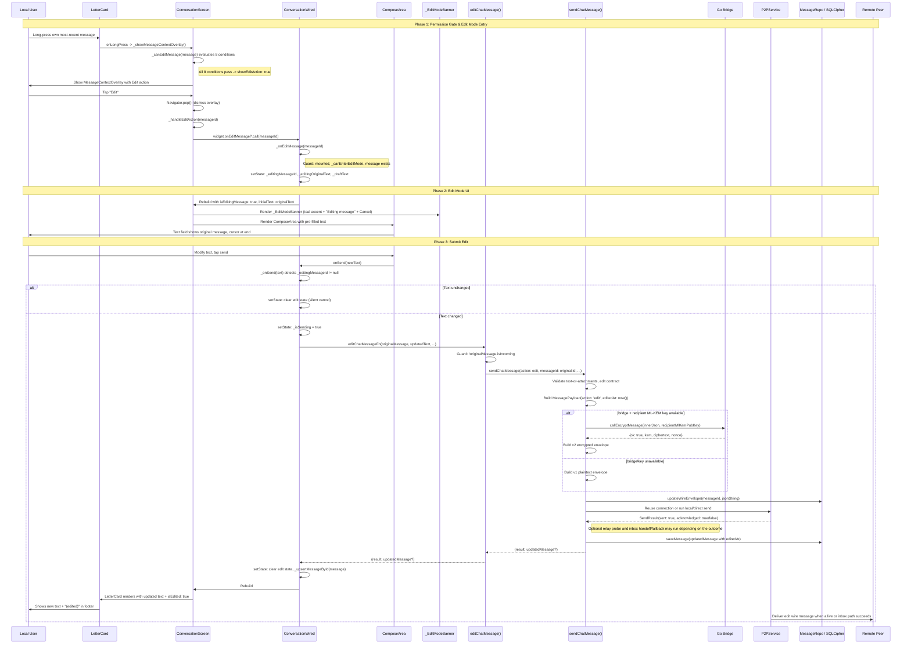
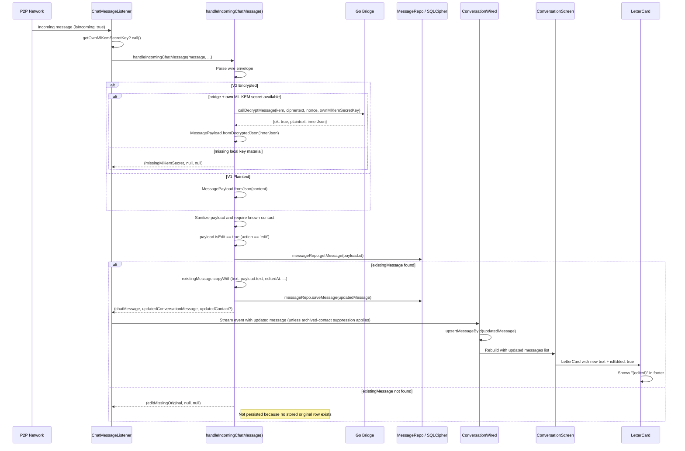
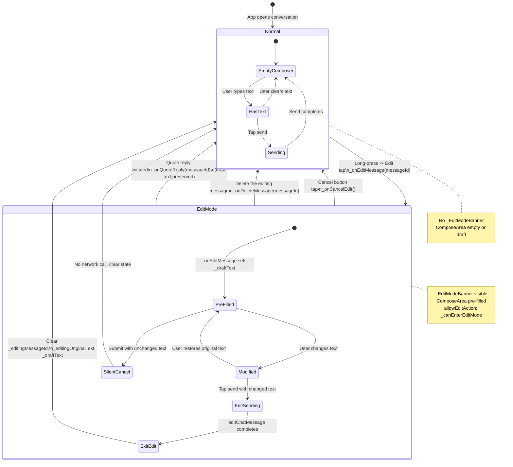

# C4 Model -- Edit Action (All 4 Levels)

## Feature: MessageContextOverlay -- Edit Action

**Scope:** The "Edit" action within the MessageContextOverlay context menu.
When a user long-presses a LetterCard and taps "Edit", the compose area
enters edit mode pre-filled with the original message text. On submit, the
shared chat send path reuses the original message ID, updates the local row,
and attempts to propagate the edit to the peer.

At the conversation-screen layer, Edit has the most constrained permission gate
of the context-menu actions -- it is only exposed when edit mode can be
entered, the message is the sender's own most-recent non-deleted outgoing
text row, and the callback chain is wired. `editChatMessage()` itself does
not independently re-check the "most recent" UI rule.

---

# Level 1 -- System Context

## 1.1 Diagram (PlantUML C4 Notation)

```plantuml
@startuml C4_Context_Edit
!include https://raw.githubusercontent.com/plantuml-stdlib/C4-PlantUML/master/C4_Context.puml

LAYOUT_WITH_LEGEND()

title System Context Diagram -- Edit Action

Person(user, "Local User", "Long-presses own most-recent message, taps Edit, modifies text, submits.")
Person(remote, "Remote Peer", "Receives the edit update via the normal chat wire format (v2 encrypted when available, otherwise v1 plaintext).")

System(mknoon_app, "mknoon Flutter App", "Permission checks, compose edit mode, send/edit flow, local persistence, and receive-side update handling.")

System_Ext(p2p_network, "P2P Network / libp2p", "Transports the edit wire message via connection reuse, local/direct send, optional relay probe, and inbox store paths.")
System_Ext(go_bridge, "Go Bridge (GoBridgeClient)", "Optionally encrypts/decrypts chat payloads using ML-KEM-768 + AES-256-GCM.")
System_Ext(db, "SQLCipher Database", "Persists the replacement message row and, for outgoing edits, can patch wire_envelope before transport.")
System_Ext(key_source, "Identity Key Source", "Supplies own ML-KEM secret key to the receive path when the app is configured for v2 decryption.")

Rel(user, mknoon_app, "Long-press -> tap Edit -> modify text -> submit", "Touch gesture + keyboard")
Rel(mknoon_app, user, "Shows edit mode banner, pre-fills text, shows (edited) indicator on success", "Flutter UI")
Rel(mknoon_app, go_bridge, "message.encrypt / message.decrypt when bridge + ML-KEM material are available", "MethodChannel")
Rel(mknoon_app, p2p_network, "Sends edit wire message over the standard chat transport flow", "libp2p streams")
Rel(mknoon_app, db, "saveMessage(...) and updateWireEnvelope(...)", "sqflite_sqlcipher")
Rel(key_source, mknoon_app, "Provides own ML-KEM secret key to ChatMessageListener / receive path", "App callback / repository")
Rel(p2p_network, remote, "Delivers edit message when a live or inbox path succeeds", "libp2p")

@enduml
```

## 1.2 System Involvement Summary

| System | Involvement |
|--------|-------------|
| P2P Network / libp2p | Attempts live delivery first and may perform inbox handoff/fallback depending on ACK/failure outcomes |
| Go Bridge / Native Layer | Optionally encrypts outgoing edits and decrypts incoming v2 edits |
| SQLCipher Database | Persists the replacement message row and wire envelope state |
| Identity Key Source | Provides `ownMlKemSecretKey` to the receive path when v2 decryption is enabled |
| Remote Peer | Receives a same-ID edit and updates the stored row when the original exists locally |

## 1.3 Actors

| Actor | Role |
|-------|------|
| **Local User** | Initiates edit: long-press own most-recent message, tap Edit, modify text, submit |
| **Remote Peer** | Passive receiver: sees updated text when the original row exists; deleted rows still render as deleted |

## 1.4 Key Constraints (System Level)

1. **Sender-side ownership gate** -- `ConversationScreen._canEditMessage()` only exposes Edit for outgoing rows owned by the local peer.
2. **Most-recent-only at the UI layer** -- the overlay only exposes Edit for `_lastSentMessageId()`. Lower layers do not re-check this.
3. **Text-required at the UI layer** -- the overlay hides Edit when `message.text.trim().isEmpty`. The send use case still allows empty text when attachments exist.
4. **Not-deleted in the overlay** -- deleted rows do not expose Edit, and deleted rows suppress the `(edited)` indicator.
5. **Best-effort durable delivery** -- the edit reuses the normal send flow: connection reuse or local/direct race first, optional relay probe, then inbox handoff/fallback. If all delivery paths fail, the edited row is still saved locally with status and retry metadata.

---

# Level 2 -- Containers

## 2.1 Container Diagram

```plantuml
@startuml C4_Container_Edit
!include https://raw.githubusercontent.com/plantuml-stdlib/C4-PlantUML/master/C4_Container.puml

LAYOUT_WITH_LEGEND()

title Container Diagram -- Edit Action

Person(user, "Local User")
Person(remote, "Remote Peer")

System_Boundary(app, "mknoon Flutter App") {
  Container(overlay, "MessageContextOverlay", "Flutter Widget", "Shows Edit action (icon: edit_rounded) when showEditAction is true")
  Container(screen, "ConversationScreen", "Flutter Widget", "_canEditMessage() strict permission gate, _handleEditAction() delegates to Wired")
  Container(wired, "ConversationWired", "StatefulWidget", "_onEditMessage() enters edit mode, _onSend() dispatches editChatMessage()")
  Container(compose, "ComposeArea", "Flutter Widget", "Pre-filled text field with _EditModeBanner cancel affordance")
  Container(usecase, "editChatMessage()", "Use Case", "Guards against editing incoming rows, delegates to sendChatMessage() with action: edit")
  Container(send_uc, "sendChatMessage()", "Use Case", "Optionally encrypts, runs the normal transport flow, persists the edited row")
  Container(handle_uc, "handleIncomingChatMessage()", "Use Case", "Receiver side: detects action: edit, updates existing message row")
  Container(payload, "MessagePayload", "Model", "Wire-format: type=chat_message, action=edit, editedAt=timestamp")
  Container(message, "ConversationMessage", "Model", "Domain model with editedAt: String? field")
  Container(letter, "LetterCard", "Flutter Widget", "Renders (edited) indicator in footer when isEdited: true")
}

Container_Ext(bridge, "Go Bridge", "Native", "ML-KEM-768 + AES-256-GCM crypto when bridge + key material are available")
Container_Ext(p2p, "P2PService", "Dart service", "Connection reuse, local/direct send, optional relay probe, inbox store")
Container_Ext(db, "SQLCipher DB", "Database", "messages table: text, edited_at columns")
Container_Ext(repo, "MessageRepositoryImpl", "Repository", "saveMessage() upserts row with updated text + edited_at")

Rel(user, overlay, "Long-press -> context menu appears")
Rel(overlay, screen, "onEditTap callback fires")
Rel(screen, wired, "widget.onEditMessage?.call(messageId)")
Rel(wired, compose, "Sets _editingMessageId, pre-fills _draftText")
Rel(compose, wired, "onSend(newText) in edit mode")
Rel(wired, usecase, "editChatMessageFn(originalMessage, updatedText, ...)")
Rel(usecase, send_uc, "Delegates with action: MessagePayload.actionEdit")
Rel(send_uc, bridge, "callEncryptMessage() when bridge + recipient ML-KEM key are available")
Rel(send_uc, p2p, "Connection reuse, local/direct send, optional relay probe, inbox handoff/fallback")
Rel(send_uc, repo, "saveMessage(updatedMessage)")
Rel(p2p, remote, "Delivers edit wire message")
Rel(remote, handle_uc, "Incoming message stream")
Rel(handle_uc, db, "saveMessage(updatedMessage)")
Rel(wired, letter, "isEdited: message.editedAt != null && !message.isDeleted")

@enduml
```

## 2.2 Presentation Layer

### MessageContextOverlay / _ContextMenuCard

- `showEditAction: bool` controls whether the Edit menu item is rendered.
- When visible, renders `_ContextMenuAction` with `icon: Icons.edit_rounded` and `label: l10n.conversation_context_edit` ("Edit").
- `key: MessageContextOverlay.editActionKey` (= `ValueKey('message-context-edit-action')`).
- `onEditTap` is injected by the caller; in `ConversationScreen`, the supplied callback dismisses the overlay first via `Navigator.of(dialogContext).pop()`.

### ConversationScreen._canEditMessage()

The most constrained permission gate of all overlay actions. Controls `showEditAction`. See Level 3 for detailed breakdown.

### ConversationScreen._handleEditAction()

Minimal passthrough: calls `widget.onEditMessage?.call(messageId)` then requests composer focus.

### ConversationWired._onEditMessage()

Sets `_editingMessageId` and `_editingOriginalText` in state, clears any active quote, pre-fills `_draftText` with the original message text.
It relies on `ConversationScreen._canEditMessage()` for the deleted/ownership/most-recent gate and only re-checks `_canEnterEditMode`, message existence, incoming status, and non-empty text.

### ComposeArea + _EditModeBanner

When `isEditingMessage: true`, the `_EditModeBanner` widget appears above the ComposeArea:
- Teal accent bar (3px wide, `Color(0xFF4ECDC4)`)
- "Editing message" label
- "Cancel" TextButton that calls `onCancelEdit`

The ComposeArea itself receives `initialText` set to the original message text.

### ConversationWired._onSend() (edit branch)

When `_editingMessageId` is non-null:
1. Resolves the `editingMessage` from `_messages` list.
2. If text is unchanged from original, silently cancels edit mode (no send).
3. Otherwise, calls `widget.editChatMessageFn(...)`.
4. After `editChatMessageFn(...)` returns, clears edit state and upserts any returned message into `_messages`.
5. Shows a SnackBar only when the use case returns `result != success` **and** `message == null`.

## 2.3 Application Layer

### editChatMessage() Use Case

Thin wrapper around `sendChatMessage()`:
- Guards: if `originalMessage.isIncoming`, returns `invalidMessage` immediately.
- Delegates to `sendChatMessage()` passing:
  - `action: MessagePayload.actionEdit`
  - `messageId: originalMessage.id`
  - `timestamp: originalMessage.timestamp` (preserves original)
  - `createdAt: originalMessage.createdAt` (preserves original)
  - `quotedMessageId: originalMessage.quotedMessageId` (preserves quote link)
  - `mediaAttachments: originalMessage.media` (preserves existing media)

### sendChatMessage() with action=edit

1. Validates sanitized text is non-empty unless attachments exist.
2. Validates edit contract: `messageId`, `timestamp`, `createdAt` must all be non-null.
3. Resolves `editedAt` to current UTC ISO-8601 timestamp.
4. Builds `MessagePayload` with `action: 'edit'` and `editedAt`.
5. Serializes to a v2 encrypted envelope only when both `bridge` and `recipientMlKemPublicKey` are non-null; otherwise serializes a v1 plaintext envelope.
6. Persists `wireEnvelope` to DB via `messageRepo.updateWireEnvelope()` before transport.
7. Attempts connection reuse first, then local/direct send, optional relay probe, and finally inbox storage fallback / handoff.
8. Persists the edited row with `editedAt`, transport, and status (`delivered`, `sent`, or `failed` depending on the outcome).

### handleIncomingChatMessage() (Receiver)

When an incoming message has `action: 'edit'`:
1. `ChatMessageListener` obtains `ownMlKemSecretKey` through its injected provider (if configured) and calls `handleIncomingChatMessage(...)`.
2. `handleIncomingChatMessage(...)` parses the v2/v1 wire envelope; missing bridge/key returns `missingMlKemSecret`, and invalid payloads return `notChatMessage`.
3. Sanitizes incoming text/username and requires the sender to already exist in `contactRepo`.
4. Looks up `existingMessage` by ID.
5. If `existingMessage == null` and `payload.isEdit`, returns `editMissingOriginal`.
6. If `existingMessage != null` and `payload.isEdit`, creates and saves the updated row via `existingMessage.copyWith(text: payload.text, editedAt: ...)`.

## 2.4 Domain Layer

### ConversationMessage.editedAt

- Type: `String?` -- null for original messages, ISO-8601 timestamp when edited.
- Mapped to `edited_at` column in the `messages` table.
- The `isEdited` check is done at the presentation layer: `message.editedAt != null && !message.isDeleted`.

### MessagePayload

- `static const actionEdit = 'edit'`
- `bool get isEdit => action == actionEdit`
- `editedAt: String?` field included in wire format when non-null.
- Inner JSON includes `"action": "edit"` and `"editedAt": "2026-04-09T..."`.

## 2.5 Infrastructure Layer

### MessageRepositoryImpl

- `saveMessage()` performs an UPSERT: inserts or replaces the row by primary key `id`.
- On edit, the whole row map is rewritten via `dbInsertMessage(..., conflictAlgorithm: replace)` rather than a narrow SQL `UPDATE`.
- `updateWireEnvelope()` patches the `wire_envelope` column for crash-safe retryability.

### P2PService

- Sends the edit via the same transport flow as regular messages: connection reuse first, then local/direct, optional relay probe, then inbox storage.
- No special handling for edit vs. send -- the wire envelope is opaque to the transport layer.

### Bridge

- `callEncryptMessage()` can encrypt the inner JSON payload (which contains `action: "edit"`) using ML-KEM-768 + AES-256-GCM.
- The send path also supports a plaintext v1 envelope when bridge crypto is unavailable.
- Incoming v2 edits use `callDecryptMessage()` and require `ownMlKemSecretKey`; otherwise the receive path returns `missingMlKemSecret`.

---

# Level 3 -- Components

## 3.1 Permission Gate: _canEditMessage (Most Constrained in the Overlay)

This method is the core conversation-screen gatekeeper for the Edit action. Each condition is
evaluated in short-circuit order. If any condition fails, `showEditAction`
is `false` and the Edit menu item is not rendered.

### Condition Table

| # | Condition | Code | Rationale |
|---|-----------|------|-----------|
| 1 | Feature flag enabled | `widget.allowEditAction` | Global kill switch; ConversationWired computes `_canEnterEditMode` which requires: no pending attachments, not processing, not uploading, not recording, not sending. |
| 2 | Edit callback wired | `widget.onEditMessage != null` | If the parent (ConversationWired) has not provided the callback, editing is structurally impossible. |
| 3 | Not deleted | `!message.isDeleted` | A deleted message's text is gone (or replaced with "This message was deleted"). Editing it is nonsensical. |
| 4 | Own identity known | `widget.ownPeerId != null` | Without knowing our own peer ID, we cannot verify message ownership. |
| 5 | Not incoming | `!message.isIncoming` | Cannot edit someone else's message -- only the author can edit. |
| 6 | Ownership double-check | `message.senderPeerId == widget.ownPeerId` | Belt-and-suspenders: even after the `isIncoming` check, explicitly verify the sender matches our identity. |
| 7 | Has text content | `message.text.trim().isNotEmpty` | ConversationScreen intentionally hides Edit for text-empty rows. The use case layer does not independently enforce that UI rule. |
| 8 | Most recent sent message | `_lastSentMessageId() == message.id` | **The most restrictive condition.** Only the single most-recent non-deleted outgoing row can expose Edit at a time. |

### Why "Most Recent Only"?

The code does not document product rationale inline, but it does make these
observable behaviors true:

1. Exactly one non-deleted outgoing row can satisfy `_canEditMessage()` at a time.
2. A newer incoming message does **not** disqualify the most recent outgoing row.
3. Sending a newer outgoing message immediately removes Edit from the previous one.
4. Deleted outgoing rows are skipped when determining the editable target.
5. `editChatMessage()` and `sendChatMessage()` do not independently repeat the "most recent" check.

### _canEnterEditMode (ConversationWired)

Before `allowEditAction` reaches ConversationScreen, ConversationWired computes it:

```dart
bool get _canEnterEditMode =>
    _pendingAttachments.isEmpty &&
    !_composerViewState.isProcessing &&
    !_composerViewState.isUploading &&
    !_isRecording &&
    !_isSending;
```

This prevents entering edit mode while the composer is busy with another operation.

## 3.2 _lastSentMessageId() Scanning Logic

Scans the `messages` list from **newest to oldest** (reverse index order):

```dart
String? _lastSentMessageId() {
  for (var i = widget.messages.length - 1; i >= 0; i--) {
    final message = widget.messages[i];
    if (message.isDeleted) continue;
    if (!message.isIncoming && message.senderPeerId == widget.ownPeerId) {
      return message.id;
    }
  }
  return null;
}
```

Key behaviors:
- Skips deleted messages (they no longer count as "most recent").
- Requires both `!isIncoming` and `senderPeerId == ownPeerId` for safety.
- Returns `null` if there are no non-deleted outgoing messages (edit is impossible).
- The first match from the end of the list IS the most recent sent message.

## 3.3 Edit Mode in ComposeArea

### State Transition Flow

```
ConversationWired._onEditMessage(messageId):
  1. Find message in _messages by ID
  2. Guard: mounted, _canEnterEditMode, message exists, !message.isIncoming, text.isNotEmpty
  3. setState:
     - _activeQuoteMessageId = null  (clear any active quote)
     - _editingMessageId = message.id
     - _editingOriginalText = message.text
     - _draftText = message.text  (pre-fill compose area)
```

### Visual Indicators

When `isEditingMessage: true`, the UI shows:
- **_EditModeBanner** above the ComposeArea:
  - Glassmorphic card (blur=20, dark background)
  - Teal accent bar (3px x 28px, `Color(0xFF4ECDC4)`)
  - "Editing message" label (`conversation_editing_message` l10n key)
  - "Cancel" TextButton (`conversation_cancel_edit` l10n key, `cancelEditKey`)
- **ComposeArea** text field is pre-filled with `_draftText` (original message text)
- Composer focus is automatically requested

### Cancel Flow

```
ConversationWired._onCancelEdit():
  setState:
    _editingMessageId = null
    _editingOriginalText = null
    _draftText = ''
```

### Submit Flow (No-Change Detection)

If the user submits with text identical to the original:
```dart
if (sanitizedText == originalText) {
  setState(() {
    _editingMessageId = null;
    _editingOriginalText = null;
    _draftText = '';
  });
  return;  // Silent cancel, no network call
}
```

## 3.4 Send Flow (editChatMessage)

### Component Interaction Sequence

1. **ConversationWired._onSend(text)**
   - Detects `_editingMessageId != null` -> enters edit branch
   - Resolves `editingMessage` from `_messages` list
   - Checks for no-change (silent cancel)
   - Sets `_isSending = true`

2. **editChatMessage() use case**
   - Guards: `originalMessage.isIncoming` -> returns `invalidMessage`
   - Delegates to `sendChatMessage()` with:
     - `action: MessagePayload.actionEdit`
     - `messageId: originalMessage.id`
     - `timestamp: originalMessage.timestamp`
     - `createdAt: originalMessage.createdAt`

3. **sendChatMessage() use case**
   - Validates edit contract: messageId, timestamp, createdAt must be non-null
   - Builds `MessagePayload` with `action: 'edit'`, resolves `editedAt` to now()
   - Encrypts via bridge (`callEncryptMessage`) only when bridge + recipient ML-KEM key are available; otherwise emits a v1 plaintext envelope
   - Updates `wireEnvelope` on existing DB row (crash-safe)
   - Runs connection reuse / local-direct / optional relay probe / inbox fallback
   - Persists the returned message row with updated text, `editedAt`, transport, and status

4. **ConversationWired (post-send)**
   - Clears `_editingMessageId`, `_editingOriginalText`, `_draftText`
   - Upserts returned message into `_messages` via `_upsertMessageById()`
   - Scrolls to bottom

### Error Handling

- If `editChatMessageFn` returns a non-success result with null message, a SnackBar is shown: "Failed to save edit."
- For normal returned results, the edit state is cleared before the UI refreshes. If `editChatMessageFn` throws, `_isSending` is still reset in `finally`, but the edit draft is not explicitly cleared in a `catch`.

## 3.5 Receive Side (handleIncomingChatMessage)

When the remote side processes the edit:

1. `ChatMessageListener` obtains `ownMlKemSecretKey` through its injected provider (if configured) and calls `handleIncomingChatMessage(...)`.
2. `handleIncomingChatMessage(...)` parses the wire envelope (v2 encrypted -> decrypt -> inner JSON when bridge + `ownMlKemSecretKey` are available, otherwise `missingMlKemSecret`; or v1 plaintext).
3. Sanitizes incoming text/username and requires the sender to exist in `contactRepo`.
4. Detects `payload.isEdit` (action == 'edit').
5. Looks up `existingMessage` by `payload.id`:
   - If not found: returns `editMissingOriginal` (the original was never received or was deleted locally).
   - If found: creates updated message via `existingMessage.copyWith(...)`:
     - `text: payload.text` (new text)
     - `editedAt: payload.editedAt ?? DateTime.now().toUtc().toIso8601String()`
     - `status: 'delivered'`
     - Preserves `quotedMessageId` from payload or existing
     - Preserves/updates `transport`
6. Saves updated message to DB via `messageRepo.saveMessage()`.

### Edge Cases

| Scenario | Behavior |
|----------|----------|
| Edit arrives before original | `editMissingOriginal` -- the row is not persisted, and ChatMessageListener reports that process state |
| Edit arrives for a previously deleted row | If the row still exists as a tombstone (`deletedAt` set), the edit updates the stored row but deletion still wins visually. If the row was removed entirely, the result is `editMissingOriginal`. |
| Multiple edits to same message | Each edit overwrites the previous; stored `editedAt` becomes `payload.editedAt` or current UTC time if the payload omits it |
| Edit payload with same text | No-op detection is sender-side only; receiver always applies the update |

## 3.6 LetterCard "(edited)" Indicator

The LetterCard footer renders the edited indicator when `isEdited: true`:

```dart
if (isEdited && l10n != null) ...[
  const SizedBox(width: 6),
  Text(
    l10n.conversation_edited_indicator,  // "(edited)"
    style: const TextStyle(
      fontSize: 11,
      fontWeight: FontWeight.w400,
      color: Color.fromRGBO(255, 255, 255, 0.35),
    ),
  ),
],
```

The `isEdited` prop is computed in ConversationScreen:
```dart
isEdited: message.editedAt != null && !message.isDeleted,
```

This ensures deleted messages do not show "(edited)" even if they were edited before deletion.

---

# Level 4 -- Code

## 4.1 Static Test Keys

```dart
// MessageContextOverlay
static const editActionKey = ValueKey('message-context-edit-action');

// ConversationScreen
static const editModeBannerKey = ValueKey('conversation-edit-mode-banner');
static const cancelEditKey = ValueKey('conversation-cancel-edit-action');
```

## 4.2 _canEditMessage (Complete Method)

```dart
// lib/features/conversation/presentation/screens/conversation_screen.dart

bool _canEditMessage(ConversationMessage message) {
  if (!widget.allowEditAction || widget.onEditMessage == null) return false;
  if (message.isDeleted) return false;
  if (widget.ownPeerId == null || message.isIncoming) return false;
  if (message.senderPeerId != widget.ownPeerId) return false;
  if (message.text.trim().isEmpty) return false;
  return _lastSentMessageId() == message.id;
}
```

## 4.3 _lastSentMessageId (Complete Method)

```dart
// lib/features/conversation/presentation/screens/conversation_screen.dart

String? _lastSentMessageId() {
  for (var i = widget.messages.length - 1; i >= 0; i--) {
    final message = widget.messages[i];
    if (message.isDeleted) continue;
    if (!message.isIncoming && message.senderPeerId == widget.ownPeerId) {
      return message.id;
    }
  }
  return null;
}
```

## 4.4 _handleEditAction (ConversationScreen)

```dart
// lib/features/conversation/presentation/screens/conversation_screen.dart

void _handleEditAction(String messageId) {
  widget.onEditMessage?.call(messageId);
  _requestComposerFocus();
}
```

## 4.5 ConversationWired._onEditMessage

```dart
// lib/features/conversation/presentation/screens/conversation_wired.dart

void _onEditMessage(String messageId) {
  if (!mounted || !_canEnterEditMode) return;
  final message = _messages.where((m) => m.id == messageId).firstOrNull;
  if (message == null || message.isIncoming || message.text.trim().isEmpty) {
    return;
  }

  setState(() {
    _activeQuoteMessageId = null;
    _editingMessageId = message.id;
    _editingOriginalText = message.text;
    _draftText = message.text;
  });
}
```

## 4.6 ConversationWired._onCancelEdit

```dart
// lib/features/conversation/presentation/screens/conversation_wired.dart

void _onCancelEdit() {
  if (!mounted) return;
  setState(() {
    _editingMessageId = null;
    _editingOriginalText = null;
    _draftText = '';
  });
}
```

## 4.7 ConversationWired._canEnterEditMode

```dart
// lib/features/conversation/presentation/screens/conversation_wired.dart

bool get _canEnterEditMode =>
    _pendingAttachments.isEmpty &&
    !_composerViewState.isProcessing &&
    !_composerViewState.isUploading &&
    !_isRecording &&
    !_isSending;
```

## 4.8 ConversationWired._onSend (Edit Branch)

```dart
// lib/features/conversation/presentation/screens/conversation_wired.dart

// Inside _onSend(String text):
final editingMessage = _editingMessageId == null
    ? null
    : _messages.where((m) => m.id == _editingMessageId).firstOrNull;

if (editingMessage != null) {
  final originalText = _editingOriginalText ?? editingMessage.text;
  if (sanitizedText == originalText) {
    if (!mounted) return;
    setState(() {
      _editingMessageId = null;
      _editingOriginalText = null;
      _draftText = '';
    });
    return;
  }

  setState(() => _isSending = true);

  try {
    final (result, message) = await widget.editChatMessageFn(
      p2pService: widget.p2pService,
      messageRepo: widget.messageRepo,
      originalMessage: editingMessage,
      updatedText: sanitizedText,
      senderUsername: identity.username,
      bridge: widget.bridge,
      recipientMlKemPublicKey: _contact.mlKemPublicKey,
      mediaAttachmentRepo: widget.mediaAttachmentRepo,
    );

    if (!mounted) return;

    setState(() {
      _editingMessageId = null;
      _editingOriginalText = null;
      _draftText = '';
      if (message != null) {
        _upsertMessageById(message);
      }
    });

    if (message != null) {
      _scrollToBottom();
    }

    if (result != SendChatMessageResult.success && message == null) {
      messenger
        ?..hideCurrentSnackBar()
        ..showSnackBar(
          const SnackBar(
            content: Text('Failed to save edit.'),
            behavior: SnackBarBehavior.floating,
          ),
        );
    }
  } finally {
    if (mounted) {
      setState(() => _isSending = false);
    }
  }
  return;
}
```

## 4.9 EditChatMessageFn Typedef

```dart
// lib/features/conversation/presentation/screens/conversation_wired.dart

typedef EditChatMessageFn =
    Future<(SendChatMessageResult, ConversationMessage?)> Function({
      required P2PService p2pService,
      required MessageRepository messageRepo,
      required ConversationMessage originalMessage,
      required String updatedText,
      required String senderUsername,
      Bridge? bridge,
      String? recipientMlKemPublicKey,
      MediaAttachmentRepository? mediaAttachmentRepo,
      bool emitTimingEvent,
    });
```

## 4.10 editChatMessage Use Case (Complete)

```dart
// lib/features/conversation/application/send_chat_message_use_case.dart

Future<(SendChatMessageResult, ConversationMessage?)> editChatMessage({
  required P2PService p2pService,
  required MessageRepository messageRepo,
  required ConversationMessage originalMessage,
  required String updatedText,
  required String senderUsername,
  Bridge? bridge,
  String? recipientMlKemPublicKey,
  MediaAttachmentRepository? mediaAttachmentRepo,
  bool emitTimingEvent = true,
}) {
  if (originalMessage.isIncoming) {
    return Future.value((SendChatMessageResult.invalidMessage, null));
  }

  return sendChatMessage(
    p2pService: p2pService,
    messageRepo: messageRepo,
    targetPeerId: originalMessage.contactPeerId,
    text: updatedText,
    senderPeerId: originalMessage.senderPeerId,
    senderUsername: senderUsername,
    action: MessagePayload.actionEdit,
    messageId: originalMessage.id,
    timestamp: originalMessage.timestamp,
    createdAt: originalMessage.createdAt,
    quotedMessageId: originalMessage.quotedMessageId,
    mediaAttachments: originalMessage.media,
    mediaAttachmentRepo: mediaAttachmentRepo,
    bridge: bridge,
    recipientMlKemPublicKey: recipientMlKemPublicKey,
    emitTimingEvent: emitTimingEvent,
  );
}
```

## 4.11 MessagePayload Wire Format (Edit)

### V1 Plaintext Envelope (Edit)

```json
{
  "type": "chat_message",
  "version": "1",
  "payload": {
    "id": "abc-123-original-uuid",
    "text": "Updated message text",
    "senderPeerId": "12D3KooW...",
    "senderUsername": "alice",
    "timestamp": "2026-04-09T10:00:00.000Z",
    "action": "edit",
    "editedAt": "2026-04-09T10:05:00.000Z"
  }
}
```

### V2 Encrypted Envelope (Edit)

Only used when both `bridge` and `recipientMlKemPublicKey` are non-null on the send path.

```json
{
  "type": "chat_message",
  "version": "2",
  "id": "abc-123-original-uuid",
  "senderPeerId": "12D3KooW...",
  "senderUsername": "alice",
  "encrypted": {
    "kem": "<base64-ML-KEM-768-ciphertext>",
    "ciphertext": "<base64-AES-256-GCM-ciphertext>",
    "nonce": "<base64-nonce>"
  }
}
```

The inner plaintext (before encryption) is:
```json
{
  "id": "abc-123-original-uuid",
  "text": "Updated message text",
  "senderPeerId": "12D3KooW...",
  "senderUsername": "alice",
  "timestamp": "2026-04-09T10:00:00.000Z",
  "action": "edit",
  "editedAt": "2026-04-09T10:05:00.000Z"
}
```

### Key Wire Format Details

- The `"action": "edit"` field is only included when action is not `"send"` (the default).
- The `"editedAt"` field is only included when non-null.
- The `id` matches the **original message ID** (not a new UUID). This is how the receiver finds the message to update.
- The `timestamp` is preserved from the original message (not a new timestamp).
- The examples above omit optional `quotedMessageId` and `media` fields for brevity; both are supported by `MessagePayload`.

## 4.12 MessagePayload Model (Edit-Relevant Parts)

```dart
// lib/features/conversation/domain/models/message_payload.dart

class MessagePayload {
  static const actionSend = 'send';
  static const actionEdit = 'edit';

  final String action;
  final String? editedAt;

  bool get isEdit => action == actionEdit;

  // In toJson() and toInnerJson():
  //   if (action != actionSend) 'action': action,
  //   if (editedAt != null) 'editedAt': editedAt,
}
```

## 4.13 handleIncomingChatMessage (Edit Path)

```dart
// lib/features/conversation/application/handle_incoming_chat_message_use_case.dart

// 3. Check for duplicate / same-ID edit update
final existingMessage = await messageRepo.getMessage(payload.id);
if (existingMessage != null && !payload.isEdit) {
  // Duplicate -- ignore
  return (HandleChatMessageResult.duplicate, null, null);
}
if (existingMessage == null && payload.isEdit) {
  // Edit for message we don't have -- ignore
  return (HandleChatMessageResult.editMissingOriginal, null, null);
}

// 5. Persist message
final conversationMessage = payload.isEdit && existingMessage != null
    ? existingMessage.copyWith(
        senderPeerId: payload.senderPeerId,
        text: payload.text,
        status: 'delivered',
        editedAt:
            payload.editedAt ?? DateTime.now().toUtc().toIso8601String(),
        quotedMessageId:
            payload.quotedMessageId ?? existingMessage.quotedMessageId,
        transport: transport ?? existingMessage.transport,
      )
    : payload.toConversationMessage(
        contactPeerId: payload.senderPeerId,
        isIncoming: true,
        status: 'delivered',
        editedAt: payload.editedAt,
        transport: transport,
      );
await messageRepo.saveMessage(conversationMessage);
```

## 4.14 ConversationMessage.editedAt (Domain Model)

```dart
// lib/features/conversation/domain/models/conversation_message.dart

class ConversationMessage {
  /// ISO-8601 timestamp when the message was last edited. NULL means original.
  final String? editedAt;

  // In copyWith():
  Object? editedAt = _sentinel,
  // ...
  editedAt: editedAt == _sentinel ? this.editedAt : editedAt as String?,

  // In fromMap():
  editedAt: map['edited_at'] as String?,

  // In toMap():
  'edited_at': editedAt,
}
```

## 4.15 LetterCard "(edited)" Rendering

```dart
// lib/features/conversation/presentation/widgets/letter_card.dart

// In the footer Row:
if (isEdited && l10n != null) ...[
  const SizedBox(width: 6),
  Text(
    l10n.conversation_edited_indicator,  // "(edited)"
    style: const TextStyle(
      fontSize: 11,
      fontWeight: FontWeight.w400,
      color: Color.fromRGBO(255, 255, 255, 0.35),
    ),
  ),
],
```

isEdited is passed from ConversationScreen:
```dart
// lib/features/conversation/presentation/screens/conversation_screen.dart
isEdited: message.editedAt != null && !message.isDeleted,
```

## 4.16 _EditModeBanner Widget

```dart
// lib/features/conversation/presentation/screens/conversation_screen.dart

class _EditModeBanner extends StatelessWidget {
  final VoidCallback onCancel;

  const _EditModeBanner({super.key, required this.onCancel});

  @override
  Widget build(BuildContext context) {
    final l10n = AppLocalizations.of(context)!;

    return Padding(
      padding: const EdgeInsets.fromLTRB(16, 0, 16, 8),
      child: ClipRRect(
        borderRadius: BorderRadius.circular(20),
        child: BackdropFilter(
          filter: ImageFilter.blur(sigmaX: 20, sigmaY: 20),
          child: Container(
            padding: const EdgeInsets.symmetric(horizontal: 14, vertical: 12),
            decoration: BoxDecoration(
              color: const Color.fromRGBO(18, 20, 28, 0.92),
              borderRadius: BorderRadius.circular(20),
              border: Border.all(
                color: const Color.fromRGBO(255, 255, 255, 0.10),
              ),
            ),
            child: Row(
              children: [
                Container(
                  width: 3,
                  height: 28,
                  decoration: BoxDecoration(
                    color: const Color(0xFF4ECDC4),
                    borderRadius: BorderRadius.circular(3),
                  ),
                ),
                const SizedBox(width: 10),
                Expanded(
                  child: Text(
                    l10n.conversation_editing_message,
                    style: const TextStyle(
                      fontSize: 13,
                      fontWeight: FontWeight.w600,
                      color: Color.fromRGBO(255, 255, 255, 0.88),
                    ),
                  ),
                ),
                TextButton(
                  key: ConversationScreen.cancelEditKey,
                  onPressed: onCancel,
                  style: TextButton.styleFrom(
                    foregroundColor: const Color(0xFF4ECDC4),
                    visualDensity: VisualDensity.compact,
                  ),
                  child: Text(l10n.conversation_cancel_edit),
                ),
              ],
            ),
          ),
        ),
      ),
    );
  }
}
```

## 4.17 _ContextMenuCard Edit Action Rendering

```dart
// lib/features/conversation/presentation/widgets/message_context_overlay.dart

// Inside _ContextMenuCard.build():
if (showEditAction)
  _ContextMenuAction(
    key: MessageContextOverlay.editActionKey,
    icon: Icons.edit_rounded,
    label: l10n.conversation_context_edit,  // "Edit"
    onTap: onEditTap,
  ),
```

## 4.18 Overlay Show Logic (Edit Tap Handler)

```dart
// lib/features/conversation/presentation/screens/conversation_screen.dart

// Inside _showMessageContextOverlay():
final hasEditAction = _canEditMessage(message);

// ...in MessageContextOverlay constructor:
showEditAction: hasEditAction,
onEditTap: hasEditAction
    ? () {
        Navigator.of(dialogContext).pop();
        _handleEditAction(message.id);
      }
    : null,
```

## 4.19 Localization Keys

```json
// lib/l10n/app_en.arb
{
  "conversation_context_edit": "Edit",
  "conversation_editing_message": "Editing message",
  "conversation_cancel_edit": "Cancel",
  "conversation_edited_indicator": "(edited)"
}
```

## 4.20 Mermaid Sequence Diagram -- Full Edit Flow (Sender Side)



## 4.21 Mermaid Sequence Diagram -- Receive Side



## 4.22 Mermaid State Diagram -- Compose Area Mode Transitions



## 4.23 Edit Interaction with Delete

When a message that is currently being edited gets deleted:

```dart
// ConversationWired._onDeleteMessage():
if (_editingMessageId == messageId) {
  setState(() {
    _editingMessageId = null;
    _editingOriginalText = null;
    _draftText = '';
  });
}
```

This ensures the edit mode is cleanly exited if the user chooses to delete the message they were editing (via a separate long-press -> Delete flow).

## 4.24 File Reference Summary

| File | Role |
|------|------|
| `lib/features/conversation/presentation/widgets/message_context_overlay.dart` | Edit action rendering, `editActionKey` |
| `lib/features/conversation/presentation/screens/conversation_screen.dart` | `_canEditMessage()`, `_lastSentMessageId()`, `_handleEditAction()`, `_EditModeBanner`, `editModeBannerKey`, `cancelEditKey` |
| `lib/features/conversation/presentation/screens/conversation_wired.dart` | `_onEditMessage()`, `_onCancelEdit()`, `_onSend()` edit branch, `_canEnterEditMode`, `EditChatMessageFn` typedef |
| `lib/features/conversation/application/send_chat_message_use_case.dart` | `editChatMessage()` use case, `sendChatMessage()` with edit support |
| `lib/features/conversation/application/handle_incoming_chat_message_use_case.dart` | Receiver-side edit handling, `editMissingOriginal` result |
| `lib/features/conversation/domain/models/message_payload.dart` | `actionEdit`, `isEdit`, `editedAt` field, wire format |
| `lib/features/conversation/domain/models/conversation_message.dart` | `editedAt: String?` domain field, `edited_at` DB column |
| `lib/features/conversation/presentation/widgets/letter_card.dart` | `isEdited` prop, "(edited)" footer indicator |
| `lib/features/conversation/presentation/widgets/compose_area.dart` | Text field with `initialText` pre-fill support |
| `lib/l10n/app_en.arb` | `conversation_context_edit`, `conversation_editing_message`, `conversation_cancel_edit`, `conversation_edited_indicator` |
