# C4 Model -- Level 4 (Code): MessageContextOverlay Feature

## 1. Overview

The MessageContextOverlay feature provides a long-press context interaction for conversation messages. When a user long-presses a LetterCard, a glassmorphic overlay appears with three vertically stacked components: a ReactionBar (6 preset emojis + full picker), a scaled-down preview of the selected message, and a context menu (Reply, Edit, Copy, Delete). The overlay uses a blurred backdrop and viewport-aware positioning to keep all components visible regardless of where the message sits on screen.

---

## 2. Class Diagrams

### 2.1 MessageContextOverlay Widget Tree

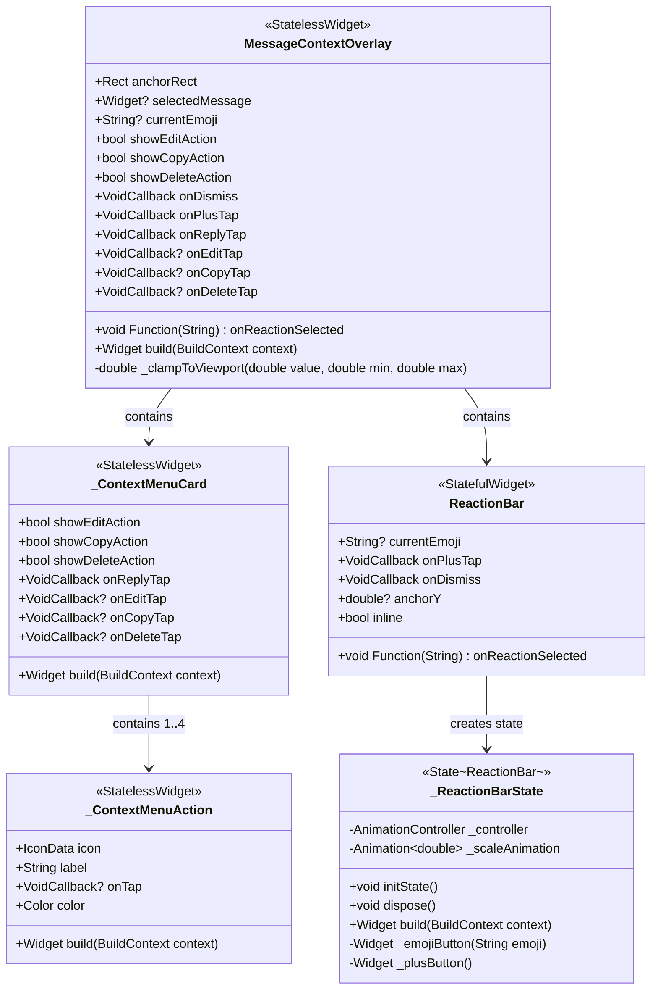

### 2.2 MessageReaction Model

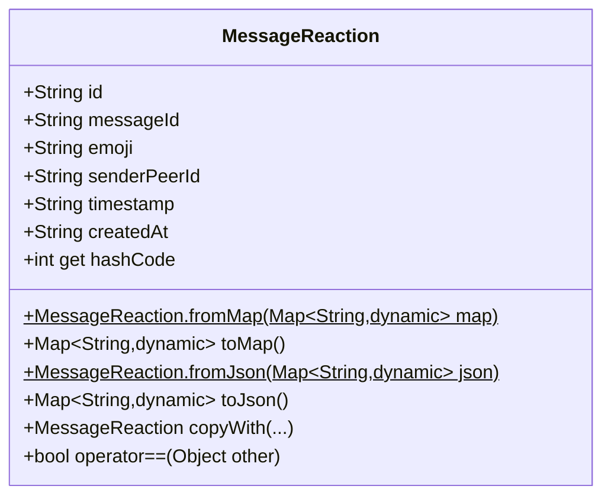

### 2.3 Integration Classes

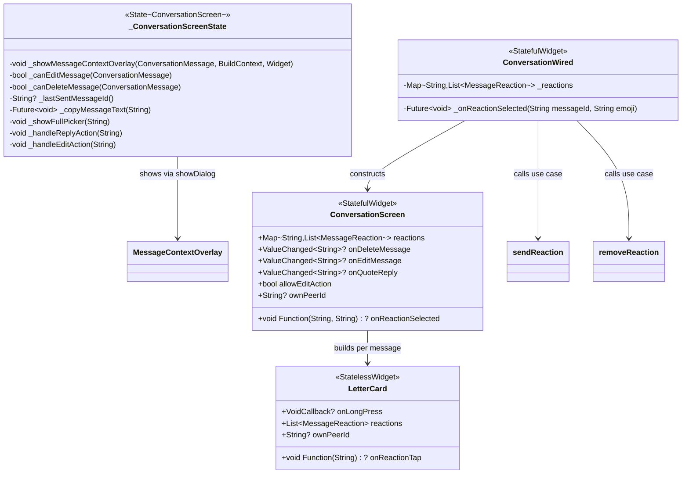

---

## 3. Static Test Keys

MessageContextOverlay defines `ValueKey` constants for widget testing:

| Key Constant | Value | Widget |
|---|---|---|
| `overlayKey` | `'message-context-overlay'` | Root Material widget |
| `backdropKey` | `'message-context-backdrop'` | Dismissible blur backdrop |
| `reactionBarKey` | `'message-context-reaction-bar'` | ReactionBar |
| `selectedMessageKey` | `'message-context-selected-message'` | Message preview |
| `menuKey` | `'message-context-menu'` | Context menu container |
| `replyActionKey` | `'message-context-reply-action'` | Reply menu item |
| `editActionKey` | `'message-context-edit-action'` | Edit menu item |
| `copyActionKey` | `'message-context-copy-action'` | Copy menu item |
| `deleteActionKey` | `'message-context-delete-action'` | Delete menu item |

---

## 4. Widget Tree Structure

### 4.1 MessageContextOverlay Build Layout

```
Material(color: transparent)
  Stack(children: [
    // Layer 1: Dismissible blurred backdrop
    Positioned.fill(
      GestureDetector(onTap: onDismiss, behavior: opaque,
        ClipRect(
          BackdropFilter(blur: 18x18,
            Container(color: RGBA(6,8,12, 0.24))))))

    // Layer 2: Selected message preview (conditional)
    if (selectedMessageTop != null && selectedMessage != null)
      Padding(top: selectedMessageTop,
        Align(alignment: anchorAlignment,
          SizedBox(width: selectedMessageWidth, height: selectedMessageHeight,
            KeyedSubtree(
              ClipRect(
                IgnorePointer(
                  FittedBox(fit: scaleDown, alignment: topCenter,
                    SizedBox(width: selectedMessageWidth,
                      selectedMessage))))))))

    // Layer 3: Reaction bar
    Padding(top: reactionBarTop,
      Align(alignment: anchorAlignment,
        ReactionBar(inline: true, ...)))

    // Layer 4: Context menu
    Padding(top: menuTop,
      Align(alignment: anchorAlignment,
        ConstrainedBox(maxWidth: 220,
          _ContextMenuCard(...))))
  ])
```

### 4.2 _ContextMenuCard Build Layout

```
ClipRRect(borderRadius: 24,
  BackdropFilter(blur: 20x20,
    Container(
      decoration: BoxDecoration(
        color: RGBA(18,20,28, 0.95),
        borderRadius: 24,
        border: RGBA(255,255,255, 0.10)),
      Column(mainAxisSize: min, children: [
        _ContextMenuAction(icon: reply_rounded, label: l10n.reply, onTap: onReplyTap),
        Divider(RGBA(255,255,255, 0.08)),  // between each item
        if (showEditAction)
          _ContextMenuAction(icon: edit_rounded, label: l10n.edit, onTap: onEditTap),
        if (showCopyAction)
          _ContextMenuAction(icon: copy_rounded, label: l10n.copy, onTap: onCopyTap),
        if (showDeleteAction)
          _ContextMenuAction(icon: delete_outline_rounded, label: l10n.delete,
            onTap: onDeleteTap, color: Color(0xFFFF8A80)),
      ]))))
```

### 4.3 _ContextMenuAction Build Layout

```
Material(color: transparent,
  InkWell(onTap: onTap,
    Padding(horizontal: 16, vertical: 14,
      Row(mainAxisSize: min, children: [
        Icon(icon, size: 18, color: color),
        SizedBox(width: 12),
        Flexible(Text(label, fontSize: 15, fontWeight: w500, color: color)),
      ]))))
```

### 4.4 ReactionBar Build Layout (inline mode)

```
ScaleTransition(scale: _scaleAnimation,
  ClipRRect(borderRadius: 28,
    BackdropFilter(blur: 24x24,
      Container(
        padding: H12 V8,
        decoration: BoxDecoration(
          color: RGBA(18,20,28, 0.95),
          borderRadius: 28,
          border: RGBA(255,255,255, 0.10)),
        Row(mainAxisSize: min, children: [
          _emojiButton('thumbs_up'),  // 44x44, highlight if selected
          _emojiButton('heart'),
          _emojiButton('laugh'),
          _emojiButton('surprised'),
          _emojiButton('sad'),
          _emojiButton('pray'),
          _plusButton(),              // 44x44, opens full picker
        ])))))
```

---

## 5. ReactionBar Animation State Machine

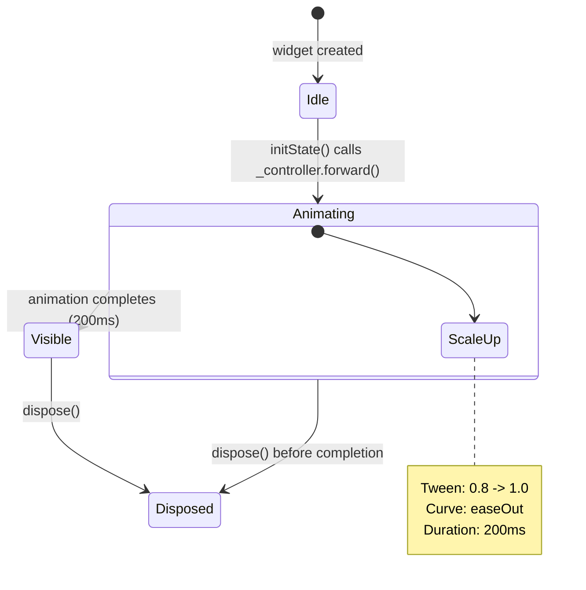

**Animation details:**
- `AnimationController`: duration 200ms, `SingleTickerProviderStateMixin` vsync
- `_scaleAnimation`: `Tween<double>(begin: 0.8, end: 1.0).animate(CurvedAnimation(parent: _controller, curve: Curves.easeOut))`
- Applied via `ScaleTransition(scale: _scaleAnimation, child: ...)`
- `initState()` calls `_controller.forward()` immediately
- `dispose()` calls `_controller.dispose()`

---

## 6. Positioning Algorithm

MessageContextOverlay uses a viewport-aware positioning algorithm that vertically stacks three components (reaction bar, message preview, context menu) while keeping them all within safe bounds.

### 6.1 Constants

```
_reactionBarHeight = 60.0    // height of the reaction bar
_menuActionHeight  = 58.0    // height of each context menu action row
_verticalGap       = 12.0    // gap between stacked components
```

### 6.2 Derived Values

```
topPadding    = MediaQuery.viewPadding.top + 8
bottomPadding = MediaQuery.viewPadding.bottom + 8
screenSize    = MediaQuery.size

actionCount = 1 (Reply always)
            + (showEditAction ? 1 : 0)
            + (showCopyAction ? 1 : 0)
            + (showDeleteAction ? 1 : 0)

menuHeight = actionCount * _menuActionHeight

selectedMessageWidth  = anchorRect.width > 0 ? anchorRect.width : screenSize.width - 32
selectedMessageHeight = anchorRect.height > 0 ? anchorRect.height : 120.0
```

### 6.3 Horizontal Alignment

```
anchorAlignment = Alignment(
  x: clamp((anchorRect.center.dx / screenSize.width) * 2 - 1, -1.0, 1.0),
  y: -1   // always align to top edge of the Padding
)
```

All three components (reaction bar, message preview, context menu) use the same `anchorAlignment` with `Align`, meaning they are horizontally centered on the original message's horizontal center, mapped to `[-1, 1]` alignment space. The context menu is additionally constrained to `maxWidth: 220`.

### 6.4 Vertical Positioning (with selected message)

```
minSelectedMessageTop = topPadding + _reactionBarHeight + _verticalGap
maxSelectedMessageTop = screenSize.height - bottomPadding - menuHeight - _verticalGap - selectedMessageHeight

selectedMessageTop = clampToViewport(anchorRect.top, min: minSelectedMessageTop, max: maxSelectedMessageTop)

reactionBarTop = selectedMessageTop - _reactionBarHeight - _verticalGap
menuTop        = selectedMessageTop + selectedMessageHeight + _verticalGap
```

### 6.5 Vertical Positioning (without selected message)

```
reactionBarTop = clampToViewport(
  anchorRect.top - _reactionBarHeight - _verticalGap,
  min: topPadding,
  max: screenSize.height - _reactionBarHeight - bottomPadding
)

menuTop = clampToViewport(
  anchorRect.bottom + _verticalGap,
  min: reactionBarTop + _reactionBarHeight + _verticalGap,
  max: screenSize.height - menuHeight - bottomPadding
)
```

### 6.6 Clamping Function

```dart
double _clampToViewport(double value, {required double min, required double max}) {
  if (max < min) return min;        // safety: collapsed range returns min
  return value.clamp(min, max);
}
```

### 6.7 Visual Stack (top to bottom)

```
+-------------------------------------+
| safe area top + 8px                  |
|                                      |
| +-------------------------------+    |
| |  ReactionBar (60px)           |    |
| +-------------------------------+    |
|          12px gap                    |
| +-------------------------------+    |
| | Selected Message Preview      |    |
| | (anchorRect dimensions)       |    |
| +-------------------------------+    |
|          12px gap                    |
| +-------------------------------+    |
| | Context Menu (max 220px wide) |    |
| |   Reply        (58px)        |    |
| |   Edit         (58px)        |    |
| |   Copy         (58px)        |    |
| |   Delete       (58px)        |    |
| +-------------------------------+    |
|                                      |
| safe area bottom + 8px              |
+-------------------------------------+
```

---

## 7. Sequence Diagrams

### 7.1 Overlay Trigger (Long Press)

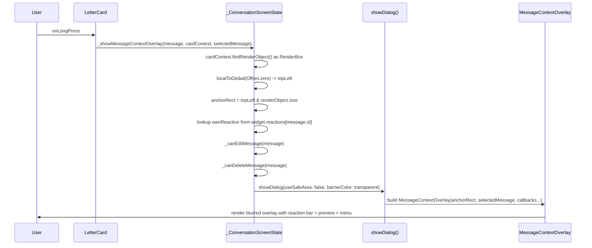

### 7.2 Reaction Flow (Preset Emoji)

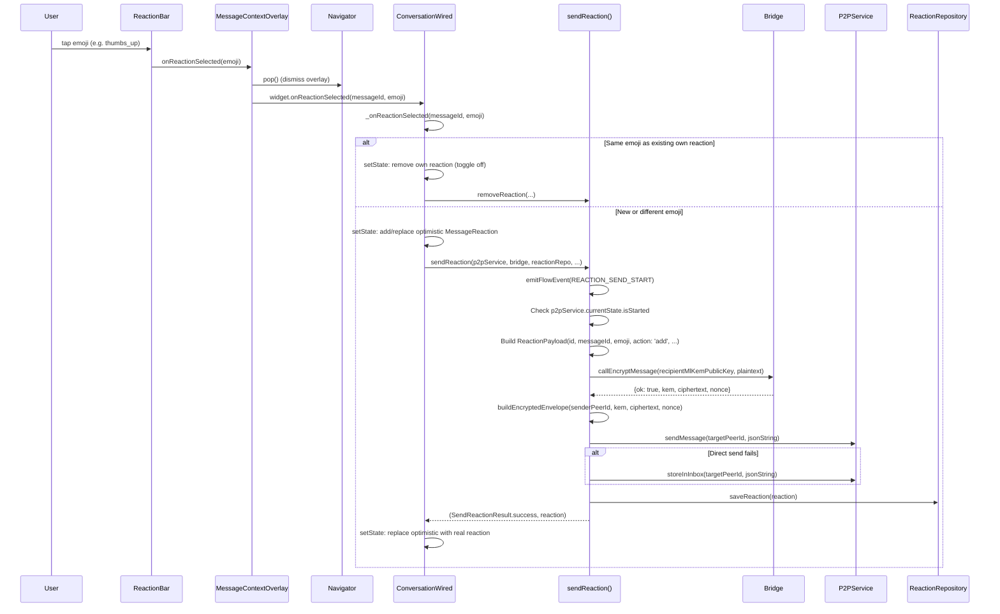

### 7.3 Full Emoji Picker Flow (Plus Button)

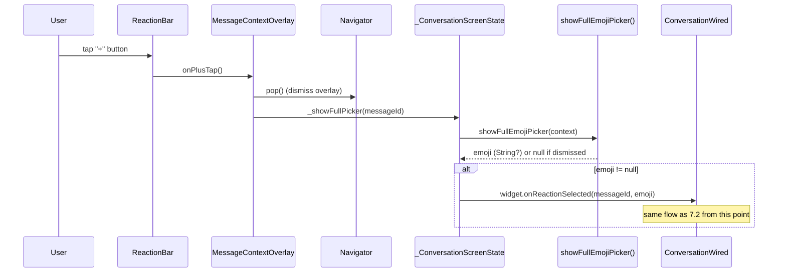

### 7.4 Reply Flow

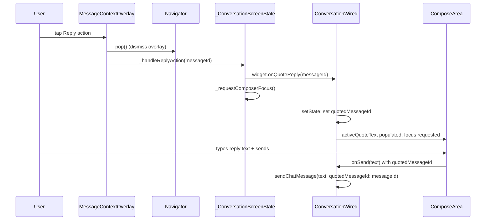

### 7.5 Edit Flow

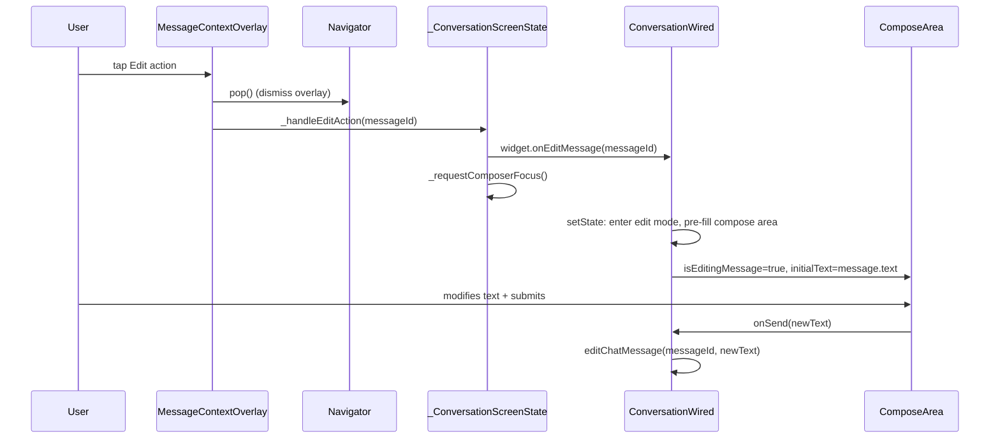

### 7.6 Copy Flow

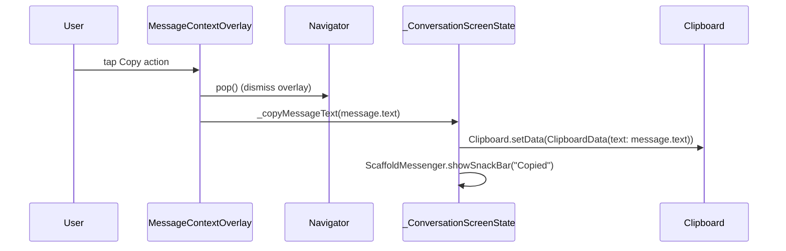

### 7.7 Delete Flow

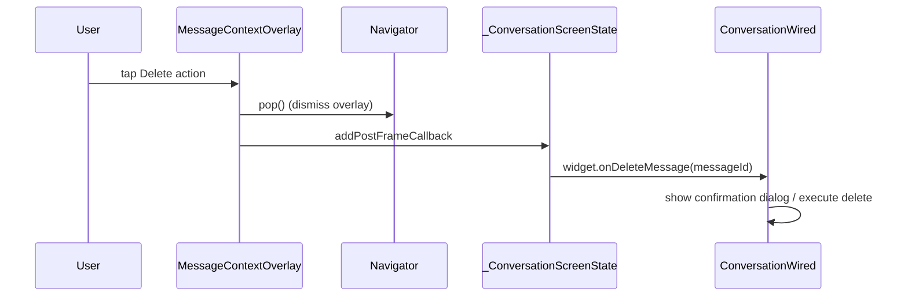

---

## 8. Permission Guard Logic

### 8.1 canOpenContextOverlay

Defined inline in `_ConversationScreenState._buildDisplayItems`:

```dart
final canOpenContextOverlay = !message.isDeleted;
```

A deleted message cannot be long-pressed to open the overlay.

### 8.2 _canEditMessage(ConversationMessage message)

```
RETURN false IF:
  - widget.allowEditAction == false
  - widget.onEditMessage == null
  - message.isDeleted == true
  - widget.ownPeerId == null
  - message.isIncoming == true
  - message.senderPeerId != widget.ownPeerId
  - message.text.trim().isEmpty
  - _lastSentMessageId() != message.id    // only the most recent own message
RETURN true OTHERWISE
```

`_lastSentMessageId()` scans `widget.messages` from newest to oldest, skipping deleted messages, and returns the `id` of the first non-deleted outgoing message where `senderPeerId == ownPeerId`.

### 8.3 _canDeleteMessage(ConversationMessage message)

```
RETURN false IF:
  - widget.onDeleteMessage == null
  - message.isDeleted == true
  - message.transport == 'system'
RETURN true OTHERWISE
```

### 8.4 Copy Availability

```dart
final hasCopyAction = !message.isDeleted && message.text.trim().isNotEmpty;
```

---

## 9. Glassmorphic Styling Constants

All overlay components share a consistent glassmorphic design language:

| Component | Background | Blur | Border Radius | Border |
|---|---|---|---|---|
| Backdrop | `RGBA(6, 8, 12, 0.24)` | `18 x 18` | -- | -- |
| ReactionBar | `RGBA(18, 20, 28, 0.95)` | `24 x 24` | `28` | `RGBA(255, 255, 255, 0.10)` |
| ContextMenuCard | `RGBA(18, 20, 28, 0.95)` | `20 x 20` | `24` | `RGBA(255, 255, 255, 0.10)` |
| Menu Dividers | `RGBA(255, 255, 255, 0.08)` | -- | -- | -- |
| Menu Action Text | `RGBA(255, 255, 255, 0.78)` | -- | -- | -- |
| Delete Action Text | `Color(0xFFFF8A80)` | -- | -- | -- |
| Selected Emoji Highlight | `RGBA(78, 205, 196, 0.20)` | -- | `22` | -- |
| Plus Button Background | `RGBA(255, 255, 255, 0.06)` | -- | `22` | -- |

---

## 10. File Inventory

| File | Lines | Role |
|---|---|---|
| `lib/features/conversation/presentation/widgets/message_context_overlay.dart` | 329 | MessageContextOverlay, _ContextMenuCard, _ContextMenuAction |
| `lib/features/conversation/presentation/widgets/reaction_bar.dart` | 153 | ReactionBar (StatefulWidget with scale animation) |
| `lib/features/conversation/presentation/widgets/letter_card.dart` | 520 | LetterCard with `onLongPress` callback |
| `lib/features/conversation/presentation/screens/conversation_screen.dart` | ~790 | Trigger flow: _showMessageContextOverlay, permission guards, clipboard, full picker |
| `lib/features/conversation/presentation/screens/conversation_wired.dart` | ~3300 | _onReactionSelected (optimistic update + use case call) |
| `lib/features/conversation/domain/models/message_reaction.dart` | 115 | MessageReaction model (fromMap/toMap, fromJson/toJson, copyWith) |
| `lib/features/conversation/application/send_reaction_use_case.dart` | 133 | sendReaction top-level function (encrypt + P2P send + persist) |
| `lib/features/conversation/presentation/widgets/full_emoji_picker.dart` | ~70 | showFullEmojiPicker (modal bottom sheet) |

---

## 11. Key Design Decisions

1. **StatelessWidget overlay.** MessageContextOverlay is a StatelessWidget -- all animation lives in ReactionBar's internal state. This keeps the overlay itself purely declarative and easy to test.

2. **Viewport-aware positioning.** The algorithm clamps all three stacked components within safe bounds, with the selected message preview as the anchor point. When the message preview position is computed, reaction bar and menu positions are derived relative to it, guaranteeing no component is clipped by notches or home indicators.

3. **Horizontal alignment via Alignment mapping.** Instead of absolute `Positioned(left: ...)`, the overlay maps the anchor's horizontal center to a `-1..1` alignment value, then uses `Align(alignment: anchorAlignment)` for all components. This naturally handles different screen widths and message positions.

4. **IgnorePointer on message preview.** The selected message widget is wrapped in `IgnorePointer` and `ClipRect` to prevent interaction -- it is purely a visual reference while the user interacts with the reaction bar and menu.

5. **Optimistic reaction updates.** `ConversationWired._onReactionSelected` calls `setState` to add/replace the reaction immediately, then fires the `sendReaction` use case asynchronously. On success, the optimistic reaction is replaced with the server-confirmed one. On toggle-off, the reaction is removed before calling `removeReaction`.

6. **Post-frame delete callback.** The delete action uses `WidgetsBinding.instance.addPostFrameCallback` to defer the `onDeleteMessage` call until after the dialog navigator pop has completed, avoiding framework conflicts.

7. **Localized menu labels.** All context menu action labels use `AppLocalizations` (`conversation_context_reply`, `conversation_context_edit`, `conversation_context_copy`, `conversation_context_delete`), not hardcoded English strings.
