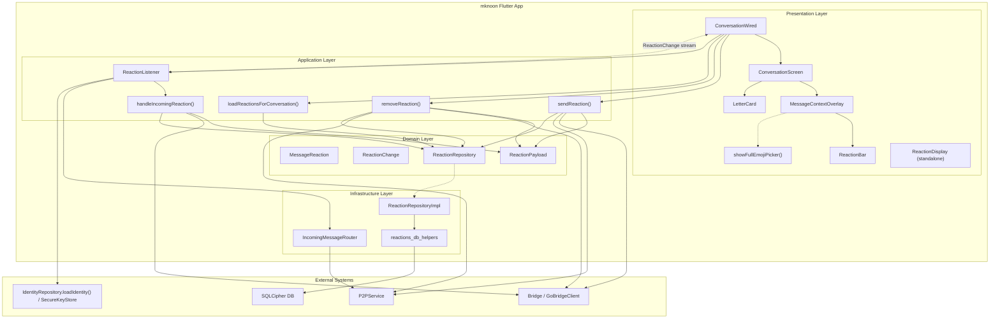
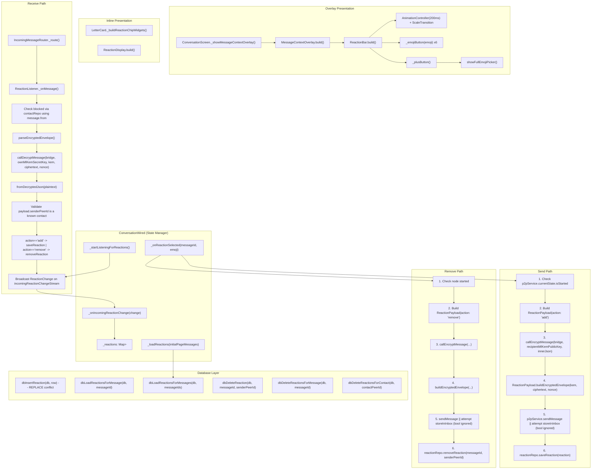
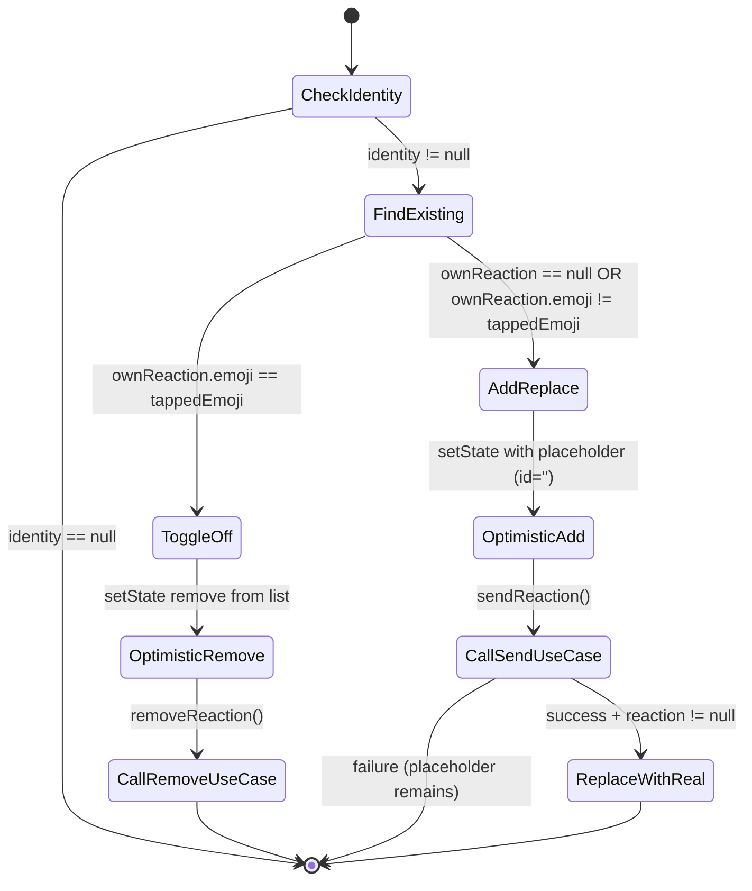
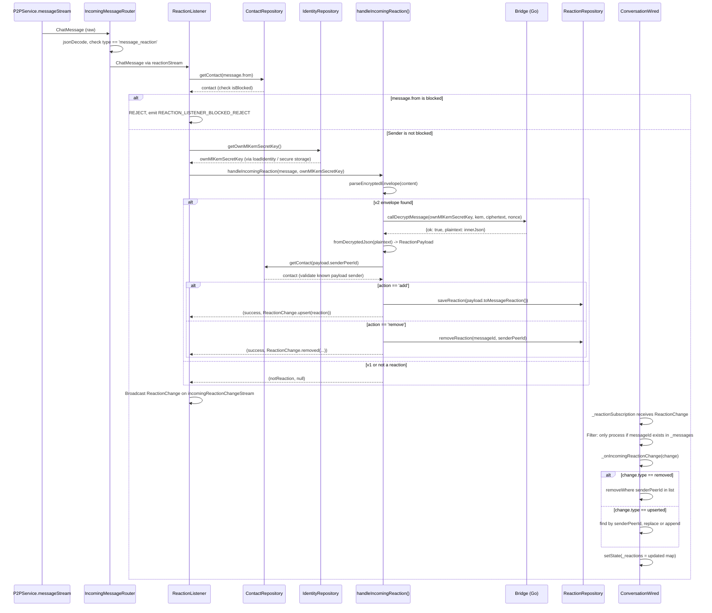
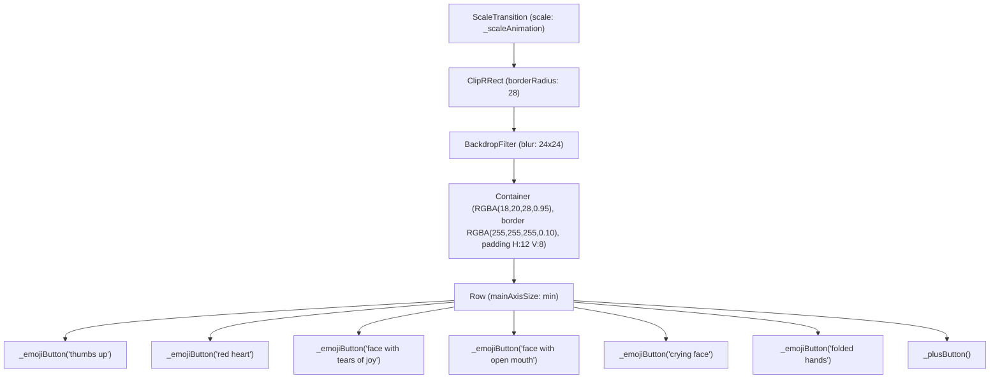
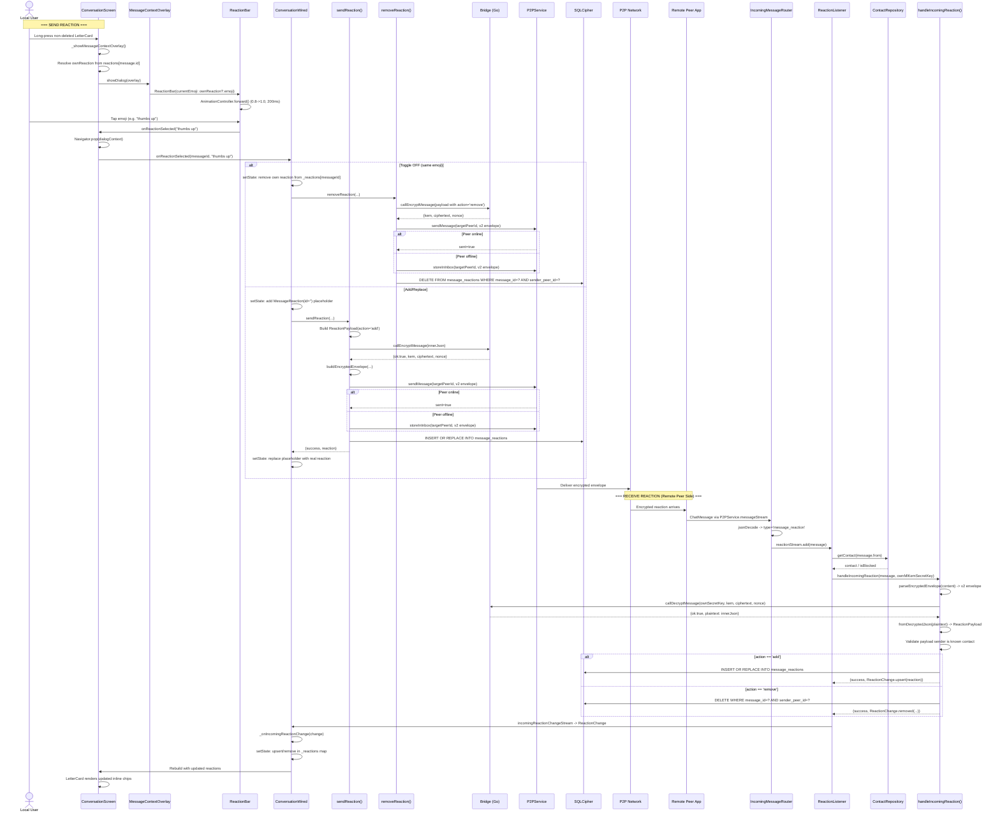
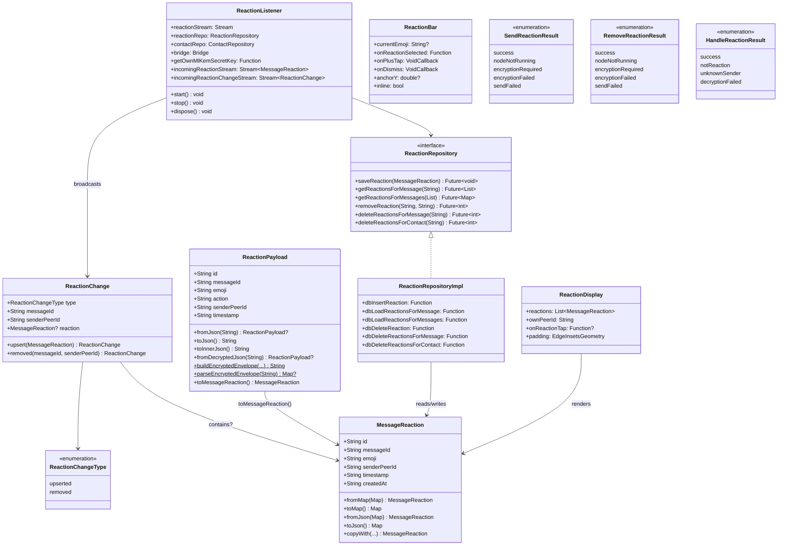

# C4 Model -- Reactions Action (MessageContextOverlay)

**Scope:** The complete Reactions subsystem of the MessageContextOverlay feature.
When a user long-presses a non-deleted `LetterCard`, the overlay appears with a
`ReactionBar` showing 6 preset emojis + a "+" button for the full emoji picker.
Presentation widgets only emit callbacks; add/replace/toggle-off behavior lives
in `ConversationWired`. Tapping the same emoji again toggles it off (removes
the reaction). One reaction per user per message (UNIQUE constraint on
`message_id + sender_peer_id`).

---

## Level 1 -- System Context

### 1.1 PlantUML C4 Context Diagram

```plantuml
@startuml C4_Context_Reactions
!include https://raw.githubusercontent.com/plantuml-stdlib/C4-PlantUML/master/C4_Context.puml

LAYOUT_WITH_LEGEND()

title System Context Diagram -- Reactions (MessageContextOverlay)

Person(local_user, "Local User", "Long-presses a non-deleted LetterCard to open the overlay, taps an emoji to react, taps same emoji to toggle off.")
Person(remote_peer, "Remote Peer", "Receives encrypted reaction payloads via P2P. Their app persists and renders the reaction on the matching message.")

System(mknoon_app, "mknoon Flutter App", "Houses overlay UI, reaction state, optimistic updates in ConversationWired, ReactionListener, sendReaction/removeReaction use cases, and ReactionRepository.")

System_Ext(p2p_network, "P2P Network / libp2p", "Transports reaction wire messages (v2 encrypted envelope). The app calls sendMessage(); when that returns false it attempts storeInInbox().")
System_Ext(go_bridge, "Go Bridge / Native Layer", "Encrypts reaction payload using ML-KEM-768 + AES-256-GCM via MethodChannel command 'message.encrypt'. Decrypts incoming reactions via 'message.decrypt'.")
System_Ext(sqlcipher_db, "SQLCipher DB", "Encrypted local database. Stores 'message_reactions' table with UNIQUE(message_id, sender_peer_id) constraint.")
System_Ext(secure_storage, "SecureKeyStore / flutter_secure_storage", "Holds identity secrets. On iOS this is Keychain-backed; on Android it is EncryptedSharedPreferences-backed.")

Rel(local_user, mknoon_app, "Long-press non-deleted message -> tap emoji", "Touch gesture")
Rel(mknoon_app, local_user, "Shows overlay with ReactionBar, inline reaction chips on LetterCard", "Flutter UI")

Rel(mknoon_app, go_bridge, "Encrypt reaction payload (ML-KEM-768 + AES-256-GCM)", "MethodChannel: message.encrypt")
Rel(go_bridge, mknoon_app, "Returns {kem, ciphertext, nonce}", "MethodChannel response")
Rel(mknoon_app, go_bridge, "Decrypt incoming reaction", "MethodChannel: message.decrypt")

Rel(mknoon_app, p2p_network, "Send v2 encrypted reaction envelope; if sendMessage() returns false, attempt storeInInbox()", "P2PService")
Rel(p2p_network, remote_peer, "Delivers encrypted reaction when the chosen transport succeeds", "Runtime transport path")
Rel(remote_peer, p2p_network, "Sends reaction back", "libp2p stream")
Rel(p2p_network, mknoon_app, "Delivers incoming reaction messages", "P2PService.messageStream")

Rel(mknoon_app, sqlcipher_db, "INSERT OR REPLACE / DELETE reaction rows", "sqflite_sqlcipher")
Rel(mknoon_app, secure_storage, "Load own ML-KEM secret key via IdentityRepository.loadIdentity()", "SecureKeyStore")

@enduml
```

### 1.2 Actors

| Actor | Role | Interactions |
|---|---|---|
| **Local User** | Initiates reactions by long-pressing a non-deleted LetterCard then tapping an emoji on the ReactionBar. Taps same emoji to toggle off. Can also tap "+" for full emoji picker. | Gesture -> overlay -> emoji tap -> optimistic UI update -> encrypted P2P send |
| **Remote Peer** | Receives reaction payloads over P2P. Their local app decrypts, persists, and renders the reaction. Can also send reactions back. | Receives v2 encrypted envelope via libp2p |

### 1.3 External Systems

| System | Protocol | Purpose |
|---|---|---|
| **P2P Network / libp2p** | `P2PService.sendMessage(...)` plus optional `storeInInbox(...)` attempt | Transports `message_reaction` type envelopes between peers |
| **Go Bridge** | MethodChannel (`message.encrypt`, `message.decrypt`) | ML-KEM-768 key encapsulation + AES-256-GCM symmetric encryption/decryption |
| **SQLCipher DB** | sqflite_sqlcipher | Persists `message_reactions` table with UNIQUE constraint enforcement |
| **Secure Storage** | `SecureKeyStore` via `flutter_secure_storage` | Stores `identity_ml_kem_secret_key` used by `IdentityRepository.loadIdentity()` for decryption |

### 1.4 Trust Boundaries

1. **Device boundary**: Reaction rows are stored in SQLCipher and reaction transport uses the v2 encrypted envelope. v1 plaintext reaction envelopes are rejected on receive.
2. **P2P boundary**: The code performs two separate trust checks: `ReactionListener` rejects blocked `message.from` contacts, and `handleIncomingReaction()` only accepts decrypted `payload.senderPeerId` values that exist in contacts. The code does not bind `message.from`, top-level envelope `senderPeerId`, and decrypted `payload.senderPeerId` together.
3. **Crypto boundary**: The Go bridge performs crypto operations. Dart obtains the ML-KEM secret key through `IdentityRepository.loadIdentity()` and passes it into `callDecryptMessage(...)`.

---

## Level 2 -- Containers

### 2.1 Mermaid Container Diagram



### 2.2 Container Details

#### Presentation Containers

| Container | Type | File | Responsibility |
|---|---|---|---|
| **MessageContextOverlay** | StatelessWidget | `presentation/widgets/message_context_overlay.dart` | Full-screen overlay: backdrop blur, positioned ReactionBar above anchor, selected message preview, context menu below. Forwards `currentEmoji` into `ReactionBar`; visible highlight exists only when that emoji is one of the 6 presets. |
| **ReactionBar** | StatefulWidget | `presentation/widgets/reaction_bar.dart` | 6 preset emojis + "+" button. Scale animation 0.8->1.0 (200ms, easeOut). Glassmorphic styling. `inline: true` mode is what the overlay uses. |
| **showFullEmojiPicker()** | Top-level function (internal `_FullEmojiPicker` StatefulWidget is private) | `presentation/widgets/full_emoji_picker.dart` | Modal bottom sheet with 7 categories (Smileys, People, Animals, Food, Travel, Objects, Symbols). GridView of emojis. Returns `Future<String?>` via `showModalBottomSheet<String>`. |
| **LetterCard** | StatelessWidget | `presentation/widgets/letter_card.dart` | Full-width glassmorphic card. Renders inline reaction chips in footer via `_buildReactionChipWidgets()`. Groups by emoji, shows count, own-reaction teal border. |
| **ReactionDisplay** | StatelessWidget | `presentation/widgets/reaction_display.dart` | Standalone reaction chip renderer. Groups reactions by emoji and highlights own reactions with teal border RGBA(78,205,196,0.30). It is currently not used by the active `ConversationScreen -> LetterCard` path. |
| **ConversationScreen** | StatefulWidget | `presentation/screens/conversation_screen.dart` | Screen-level overlay orchestration. `_showMessageContextOverlay()` resolves `ownReaction` from `widget.reactions[message.id]`, computes action availability, shows the dialog, and passes `message.id` back through callbacks. |
| **ConversationWired** | StatefulWidget | `presentation/screens/conversation_wired.dart` | State management. Owns `_reactions: Map<String, List<MessageReaction>>`. `_onReactionSelected()` implements optimistic update + toggle logic with no rollback on failure. `_loadReactions()` is only called after `_loadInitialPage()`. |

#### Application Containers

| Container | Type | File | Signature |
|---|---|---|---|
| **sendReaction()** | Top-level function | `application/send_reaction_use_case.dart` | `Future<(SendReactionResult, MessageReaction?)> sendReaction({p2pService, bridge, reactionRepo, targetPeerId, messageId, emoji, senderPeerId, recipientMlKemPublicKey})` |
| **removeReaction()** | Top-level function | `application/remove_reaction_use_case.dart` | `Future<RemoveReactionResult> removeReaction({p2pService, bridge, reactionRepo, targetPeerId, messageId, emoji, senderPeerId, recipientMlKemPublicKey})` |
| **loadReactionsForConversation()** | Top-level function | `application/load_reactions_use_case.dart` | `Future<Map<String, List<MessageReaction>>> loadReactionsForConversation({reactionRepo, messageIds})` |
| **ReactionListener** | Class with streams | `application/reaction_listener.dart` | Subscribes to `reactionStream` (from IncomingMessageRouter), checks whether `message.from` is blocked, resolves the local ML-KEM secret via `getOwnMlKemSecretKey()`, calls `handleIncomingReaction()`, and broadcasts `ReactionChange` on `incomingReactionChangeStream`. |
| **handleIncomingReaction()** | Top-level function | `application/handle_incoming_reaction_use_case.dart` | `Future<(HandleReactionResult, ReactionChange?)> handleIncomingReaction({message, reactionRepo, contactRepo, bridge, ownMlKemSecretKey})` |

#### Domain Containers

| Container | Type | File | Fields / Methods |
|---|---|---|---|
| **MessageReaction** | Model class | `domain/models/message_reaction.dart` | `id`, `messageId`, `emoji`, `senderPeerId`, `timestamp`, `createdAt`. Methods: `fromMap`/`toMap` (DB), `fromJson`/`toJson` (wire), `copyWith`. Equality by `id`. |
| **ReactionChange** | Algebraic type | `domain/models/reaction_change.dart` | `type` (upserted/removed), `messageId`, `senderPeerId`, `reaction?`. Named constructors: `ReactionChange.upsert(reaction)`, `ReactionChange.removed(messageId:, senderPeerId:)`. |
| **ReactionPayload** | Wire-format model | `domain/models/reaction_payload.dart` | `id`, `messageId`, `emoji`, `action`, `senderPeerId`, `timestamp`. Methods: `fromJson`, `toJson`, `toInnerJson`, `fromDecryptedJson`, `buildEncryptedEnvelope`, `parseEncryptedEnvelope`, `toMessageReaction`. The receive path treats exact `'remove'` specially; any other non-null action currently behaves like add. |
| **ReactionRepository** | Abstract interface | `domain/repositories/reaction_repository.dart` | `saveReaction`, `getReactionsForMessage`, `getReactionsForMessages`, `removeReaction`, `deleteReactionsForMessage`, `deleteReactionsForContact` |

#### Infrastructure Containers

| Container | Type | File | Details |
|---|---|---|---|
| **ReactionRepositoryImpl** | Concrete impl | `domain/repositories/reaction_repository_impl.dart` | Constructor-injected DB helper functions: `dbInsertReaction`, `dbLoadReactionsForMessage`, `dbLoadReactionsForMessages`, `dbDeleteReaction`, `dbDeleteReactionsForMessage`, `dbDeleteReactionsForContact`. Uses `emitFlowEvent()` in `saveReaction()` only (start/success/error); other operations are plain pass-through delegations. |
| **reactions_db_helpers** | Plain functions | `core/database/helpers/reactions_db_helpers.dart` | 6 functions taking `Database db` + args. Uses `ConflictAlgorithm.replace` for upsert. Parameterized queries throughout. |
| **IncomingMessageRouter** | Router class | `core/services/incoming_message_router.dart` | Parses JSON `type` field from P2P messages. Routes `message_reaction` type to `_reactionController` stream. |

---

## Level 3 -- Components

### 3.1 Component Diagram (Mermaid)



### 3.2 ConversationWired._onReactionSelected Flow

```dart
// File: lib/features/conversation/presentation/screens/conversation_wired.dart
// Lines: 2758-2840
```

**Step-by-step:**

1. **Resolve identity**: `_identity` must be non-null. Check `reactionRepo` and `bridge` availability.
2. **Find existing ownReaction**: Filter `_reactions[messageId]` for entries where `senderPeerId == identity.peerId`.
3. **Toggle off** (same emoji as existing):
   - Optimistic `setState`: remove own reaction from `_reactions[messageId]` list.
   - Call `removeReaction()` use case (async, fire-and-forget from UI perspective).
   - Early return.
4. **Add/replace** (new emoji or no existing reaction):
   - Create optimistic `MessageReaction(id: '', ...)` placeholder.
   - Optimistic `setState`: insert or replace own reaction in list by `senderPeerId`.
   - Call `sendReaction()` use case.
   - On success: `setState` replacing placeholder (id='') with real `MessageReaction` from server response.

**Notes:**

- The toggle/add/remove logic above lives in `ConversationWired`, not in `ReactionBar`, `LetterCard`, or `ConversationScreen`.
- There is no UI rollback when `removeReaction()` fails.
- Add failures leave the optimistic placeholder or optimistic replacement in `_reactions` until some later reload or incoming change overwrites it.



### 3.3 ReactionListener Incoming Flow



### 3.4 Component Constructor Params & Key Methods

#### MessageContextOverlay

```
Constructor:
  anchorRect: Rect           -- RenderBox position of the long-pressed LetterCard
  selectedMessage: Widget?   -- Cloned LetterCard rendered in overlay
  currentEmoji: String?      -- Existing own reaction emoji forwarded into ReactionBar
  showEditAction: bool
  showCopyAction: bool
  showDeleteAction: bool
  onDismiss: VoidCallback
  onReactionSelected: void Function(String emoji)
  onPlusTap: VoidCallback
  onReplyTap: VoidCallback
  onEditTap: VoidCallback?
  onCopyTap: VoidCallback?
  onDeleteTap: VoidCallback?

Key methods:
  build() -- Computes reactionBarTop, menuTop with viewport clamping.
             Stack: backdrop GestureDetector + selectedMessage + inline ReactionBar + ContextMenuCard
```

#### ReactionBar

```
Constructor:
  currentEmoji: String?              -- Emoji to highlight if it matches one of kPresetEmojis
  onReactionSelected: Function(emoji) -- Called when preset emoji tapped
  onPlusTap: VoidCallback            -- Opens full picker
  onDismiss: VoidCallback            -- Used only by standalone non-inline mode
  anchorY: double?                   -- Vertical position hint for standalone non-inline mode
  inline: bool = false               -- true when embedded in overlay (no dismiss wrapper)

Internal state:
  AnimationController _controller    -- 200ms duration
  Animation<double> _scaleAnimation  -- Tween(0.8, 1.0) + CurvedAnimation(easeOut)

Key methods:
  _emojiButton(emoji) -- 44x44 container, highlight color if selected
  _plusButton()       -- 44x44 container with add icon
```

#### ReactionListener

```
Constructor:
  reactionStream: Stream<ChatMessage>           -- From IncomingMessageRouter
  reactionRepo: ReactionRepository
  contactRepo: ContactRepository
  bridge: Bridge
  getOwnMlKemSecretKey: Future<String?> Function()

Internal state:
  StreamSubscription<ChatMessage>? _subscription
  StreamController<MessageReaction> _reactionController      -- emits upserts only
  StreamController<ReactionChange> _reactionChangeController -- primary stream

Key methods:
  start()   -- Begin listening
  stop()    -- Cancel subscription
  dispose() -- Stop + close controllers
  _onMessage(ChatMessage) -- Check blocked message.from, resolve own key, decrypt, broadcast change
```

#### ReactionRepositoryImpl

```
Constructor (6 injected DB helper functions):
  dbInsertReaction: Future<void> Function(Map<String, Object?> row)
  dbLoadReactionsForMessage: Future<List<Map<String, Object?>>> Function(String)
  dbLoadReactionsForMessages: Future<List<Map<String, Object?>>> Function(List<String>)
  dbDeleteReaction: Future<int> Function(String messageId, String senderPeerId)
  dbDeleteReactionsForMessage: Future<int> Function(String messageId)
  dbDeleteReactionsForContact: Future<int> Function(String contactPeerId)
```

#### ConversationWired (Reaction State)

```
Internal state:
  Map<String, List<MessageReaction>> _reactions = {}
  StreamSubscription<ReactionChange>? _reactionSubscription

Key methods:
  _startListeningForReactions()          -- Subscribes to ReactionListener, filters by conversation
  _onIncomingReactionChange(change)      -- Upsert/remove in _reactions map by senderPeerId
  _loadReactions(messages)               -- Batch-load via loadReactionsForConversation() after _loadInitialPage() only
  _onReactionSelected(messageId, emoji)  -- Toggle logic with optimistic updates and no rollback
```

---

## Level 4 -- Code

### 4.1 ReactionBar Widget Tree



**Preset emojis constant:**

```dart
const kPresetEmojis = ['👍', '❤️', '😂', '😮', '😢', '🙏'];
```

### 4.2 ReactionBar Animation

```dart
// AnimationController + ScaleTransition
_controller = AnimationController(
  duration: const Duration(milliseconds: 200),
  vsync: this,
);
_scaleAnimation = Tween<double>(
  begin: 0.8,
  end: 1.0,
).animate(CurvedAnimation(parent: _controller, curve: Curves.easeOut));
_controller.forward(); // Starts on initState
```

The animation is applied via `ScaleTransition(scale: _scaleAnimation, child: ...)` wrapping the entire ClipRRect bar. This creates a subtle pop-in effect when the overlay appears.

### 4.3 Emoji Button

```dart
Widget _emojiButton(String emoji) {
  final isSelected = widget.currentEmoji == emoji;
  return GestureDetector(
    onTap: () => widget.onReactionSelected(emoji),
    child: Container(
      width: 44,
      height: 44,
      alignment: Alignment.center,
      decoration: BoxDecoration(
        color: isSelected
            ? const Color.fromRGBO(78, 205, 196, 0.20)  // Teal highlight
            : Colors.transparent,
        borderRadius: BorderRadius.circular(22),
      ),
      child: Text(emoji, style: const TextStyle(fontSize: 24)),
    ),
  );
}
```

### 4.4 Plus Button

```dart
Widget _plusButton() {
  return GestureDetector(
    onTap: widget.onPlusTap,
    child: Container(
      width: 44,
      height: 44,
      alignment: Alignment.center,
      decoration: BoxDecoration(
        color: const Color.fromRGBO(255, 255, 255, 0.06),
        borderRadius: BorderRadius.circular(22),
      ),
      child: const Icon(
        Icons.add,
        size: 20,
        color: Color.fromRGBO(255, 255, 255, 0.5),
      ),
    ),
  );
}
```

### 4.5 FullEmojiPicker

Triggered by the "+" button tap. `ConversationScreen._showFullPicker(messageId)` calls:

```dart
void _showFullPicker(String messageId) async {
  final emoji = await showFullEmojiPicker(context);
  if (emoji != null) {
    widget.onReactionSelected?.call(messageId, emoji);
  }
}
```

`showFullEmojiPicker()` returns `Future<String?>` via `showModalBottomSheet<String>`. Categories: Smileys (48), People (32), Animals (32), Food (32), Travel (24), Objects (24), Symbols (32). 8-column GridView. Selection pops the sheet with the emoji string.

If the user chooses a non-preset emoji from the full picker, the next overlay still forwards that emoji as `currentEmoji`, but `ReactionBar` only renders the 6 preset buttons, so no quick-reaction button shows a selected fill for that case.

### 4.6 Inline Reaction Chips on LetterCard

```dart
// LetterCard._buildReactionChipWidgets()
List<Widget> _buildReactionChipWidgets() {
  final groups = <String, List<MessageReaction>>{};
  for (final r in reactions) {
    groups.putIfAbsent(r.emoji, () => []).add(r);
  }
  return groups.entries.map((entry) {
    final emoji = entry.key;
    final list = entry.value;
    final isOwn = ownPeerId != null &&
        list.any((r) => r.senderPeerId == ownPeerId);
    return GestureDetector(
      onTap: onReactionTap != null ? () => onReactionTap!(emoji) : null,
      child: Container(
        padding: const EdgeInsets.symmetric(horizontal: 8, vertical: 4),
        decoration: BoxDecoration(
          color: const Color.fromRGBO(255, 255, 255, 0.08),
          borderRadius: BorderRadius.circular(12),
          border: Border.all(
            color: isOwn
                ? const Color.fromRGBO(78, 205, 196, 0.30) // Teal border
                : Colors.transparent,
          ),
        ),
        child: Text(
          list.length > 1 ? '$emoji ${list.length}' : emoji,
          style: const TextStyle(fontSize: 14),
        ),
      ),
    );
  }).toList();
}
```

Rendered inside the LetterCard's footer area as a `Wrap(spacing: 6, runSpacing: 4, ...)`. This path does not instantiate `ReactionDisplay`; `LetterCard` renders the chips directly. Tapping an inline chip invokes `onReactionTap(emoji)`, and `ConversationScreen` then forwards that to `widget.onReactionSelected(message.id, emoji)` -- the same upstream toggle logic used by the overlay path.

### 4.7 Wire Format -- Reaction Payload

#### v1 Envelope (Rejected on receive -- encryption required)

```json
{
  "type": "message_reaction",
  "version": "1",
  "payload": {
    "id": "uuid-v4",
    "messageId": "target-message-uuid",
    "emoji": "👍",
    "action": "add",
    "senderPeerId": "12D3KooW...",
    "timestamp": "2026-04-09T12:00:00.000Z"
  }
}
```

#### v2 Encrypted Envelope (Active)

```json
{
  "type": "message_reaction",
  "version": "2",
  "senderPeerId": "12D3KooW...",
  "encrypted": {
    "kem": "<base64 ML-KEM-768 encapsulated key>",
    "ciphertext": "<base64 AES-256-GCM encrypted inner payload>",
    "nonce": "<base64 AES-256-GCM nonce>"
  }
}
```

#### Inner Payload (Encrypted as plaintext)

```json
{
  "id": "uuid-v4",
  "messageId": "target-message-uuid",
  "emoji": "👍",
  "action": "add",
  "senderPeerId": "12D3KooW...",
  "timestamp": "2026-04-09T12:00:00.000Z"
}
```

The `action` field is intended to be `"add"` or `"remove"`. For removals, the `emoji` field contains the emoji being removed (informational; the UNIQUE constraint on `message_id + sender_peer_id` means only one reaction per user per message exists). The current receive path treats exact `"remove"` specially; any other non-null action behaves like add.

The v2 envelope also carries a top-level `senderPeerId`, but the current receive path does not validate that field against `message.from` or the decrypted `payload.senderPeerId`.

### 4.8 Database Schema -- message_reactions

```sql
-- Migration 016: lib/core/database/migrations/016_message_reactions.dart

CREATE TABLE IF NOT EXISTS message_reactions (
  id TEXT PRIMARY KEY,
  message_id TEXT NOT NULL,
  emoji TEXT NOT NULL,
  sender_peer_id TEXT NOT NULL,
  timestamp TEXT NOT NULL,
  created_at TEXT NOT NULL,
  UNIQUE(message_id, sender_peer_id)
);

CREATE INDEX IF NOT EXISTS idx_message_reactions_message
  ON message_reactions(message_id);
```

**UNIQUE Constraint Enforcement Pattern:**

- `dbInsertReaction()` uses `ConflictAlgorithm.replace` -- inserting a new reaction for the same `(message_id, sender_peer_id)` pair silently replaces the existing row (including changing the emoji).
- `dbDeleteReaction()` deletes by `WHERE message_id = ? AND sender_peer_id = ?` -- removes at most one row due to UNIQUE.
- This enforces one-reaction-per-user-per-message at the database level. The application layer does not need to check for duplicates.

**Important schema note:** migration 016 does not declare a foreign key from `message_reactions.message_id` to `messages.id`, so orphan reaction rows are possible if code saves a reaction for a message row that is not present locally.

### 4.9 sendReaction() Use Case -- Full Flow

```dart
// File: lib/features/conversation/application/send_reaction_use_case.dart

Future<(SendReactionResult, MessageReaction?)> sendReaction({
  required P2PService p2pService,
  required Bridge bridge,
  required ReactionRepository reactionRepo,
  required String targetPeerId,
  required String messageId,
  required String emoji,
  required String senderPeerId,
  required String recipientMlKemPublicKey,
}) async {
  // 1. Check P2P node is running
  if (!p2pService.currentState.isStarted) return (nodeNotRunning, null);

  // 2. Build ReactionPayload(action: 'add')
  final payload = ReactionPayload(
    id: uuid.v4(), messageId: messageId, emoji: emoji,
    action: 'add', senderPeerId: senderPeerId,
    timestamp: DateTime.now().toUtc().toIso8601String(),
  );

  // 3. Encrypt via Go Bridge
  final innerJson = payload.toInnerJson();
  final encryptResult = await callEncryptMessage(
    bridge: bridge,
    recipientMlKemPublicKey: recipientMlKemPublicKey,
    plaintext: innerJson,
  );
  if (encryptResult['ok'] != true) return (encryptionFailed, null);

  // 4. Build v2 encrypted envelope
  final jsonString = ReactionPayload.buildEncryptedEnvelope(
    senderPeerId: senderPeerId,
    kem: encryptResult['kem'] as String,
    ciphertext: encryptResult['ciphertext'] as String,
    nonce: encryptResult['nonce'] as String,
  );

  // 5. Send -- try direct, then attempt inbox on false
  final sent = await p2pService.sendMessage(targetPeerId, jsonString);
  if (!sent) {
    await p2pService.storeInInbox(targetPeerId, jsonString);
  }

  // 6. Persist locally
  final reaction = payload.toMessageReaction();
  await reactionRepo.saveReaction(reaction);

  return (success, reaction);
}
```

**Notes:**

- The `bool` returned by `storeInInbox()` is currently ignored. If `sendMessage()` returns `false` and `storeInInbox()` also returns `false` without throwing, the use case still persists locally and returns `success`.
- Local repository failures are not converted into `SendReactionResult`; they can still throw because persistence happens after the guarded transport block.

### 4.10 Full Reaction Lifecycle -- Sequence Diagram

The UI path is optimistic. `ConversationWired` does not roll back local add/remove state if `sendReaction()` / `removeReaction()` fails.



### 4.11 DI Wiring (main.dart)

The reaction components are wired through the standard DI chain:

```
main.dart:
  Database db = await openEncryptedDatabase(...)

  // DB helpers (closures capturing db)
  final insertReaction = (row) => dbInsertReaction(db, row);
  final loadReactionsForMessage = (id) => dbLoadReactionsForMessage(db, id);
  final loadReactionsForMessages = (ids) => dbLoadReactionsForMessages(db, ids);
  final deleteReaction = (mid, spid) => dbDeleteReaction(db, mid, spid);
  final deleteReactionsForMessage = (mid) => dbDeleteReactionsForMessage(db, mid);
  final deleteReactionsForContact = (cpid) => dbDeleteReactionsForContact(db, cpid);

  // Repository
  final reactionRepo = ReactionRepositoryImpl(
    dbInsertReaction: insertReaction,
    dbLoadReactionsForMessage: loadReactionsForMessage,
    dbLoadReactionsForMessages: loadReactionsForMessages,
    dbDeleteReaction: deleteReaction,
    dbDeleteReactionsForMessage: deleteReactionsForMessage,
    dbDeleteReactionsForContact: deleteReactionsForContact,
  );

  // Listener
  final reactionListener = ReactionListener(
    reactionStream: messageRouter.reactionStream,  // From IncomingMessageRouter
    reactionRepo: reactionRepo,
    contactRepo: contactRepo,
    bridge: bridge,
    getOwnMlKemSecretKey: () async {
      final identity = await repository.loadIdentity();
      return identity?.mlKemSecretKey;
    },
  );

  reactionListener.start();

  // Threaded to ConversationWired via constructor
  ConversationWired(
    ...
    reactionRepo: reactionRepo,
    reactionListener: reactionListener,
    bridge: bridge,
    ...
  )
```

### 4.12 Class Diagram



---

## File Index

| Layer | File | Purpose |
|---|---|---|
| DB Migration | `lib/core/database/migrations/016_message_reactions.dart` | CREATE TABLE + index |
| DB Helpers | `lib/core/database/helpers/reactions_db_helpers.dart` | 6 plain functions (insert, load, delete) |
| Domain Model | `lib/features/conversation/domain/models/message_reaction.dart` | MessageReaction (fromMap/toMap/fromJson/toJson) |
| Domain Model | `lib/features/conversation/domain/models/reaction_change.dart` | ReactionChange (upserted/removed) |
| Domain Model | `lib/features/conversation/domain/models/reaction_payload.dart` | ReactionPayload (wire format, v1/v2 envelope) |
| Domain Repo | `lib/features/conversation/domain/repositories/reaction_repository.dart` | ReactionRepository interface |
| Domain Repo | `lib/features/conversation/domain/repositories/reaction_repository_impl.dart` | ReactionRepositoryImpl (6 injected helpers) |
| Application | `lib/features/conversation/application/send_reaction_use_case.dart` | sendReaction() |
| Application | `lib/features/conversation/application/remove_reaction_use_case.dart` | removeReaction() |
| Application | `lib/features/conversation/application/load_reactions_use_case.dart` | loadReactionsForConversation() |
| Application | `lib/features/conversation/application/reaction_listener.dart` | ReactionListener |
| Application | `lib/features/conversation/application/handle_incoming_reaction_use_case.dart` | handleIncomingReaction() |
| Presentation | `lib/features/conversation/presentation/widgets/reaction_bar.dart` | ReactionBar (6 emojis + plus) |
| Presentation | `lib/features/conversation/presentation/widgets/reaction_display.dart` | Standalone reaction chip widget; not wired into the active `LetterCard` path |
| Presentation | `lib/features/conversation/presentation/widgets/full_emoji_picker.dart` | FullEmojiPicker (modal bottom sheet) |
| Presentation | `lib/features/conversation/presentation/widgets/letter_card.dart` | LetterCard (inline chips via _buildReactionChipWidgets) |
| Presentation | `lib/features/conversation/presentation/widgets/message_context_overlay.dart` | MessageContextOverlay (hosts ReactionBar) |
| Presentation | `lib/features/conversation/presentation/screens/conversation_screen.dart` | ConversationScreen (_showMessageContextOverlay, action gating, messageId callback handoff) |
| Presentation | `lib/features/conversation/presentation/screens/conversation_wired.dart` | ConversationWired (_onReactionSelected, _reactions state, initial-page-only reaction preload) |
| Router | `lib/core/services/incoming_message_router.dart` | IncomingMessageRouter (routes 'message_reaction' type) |
