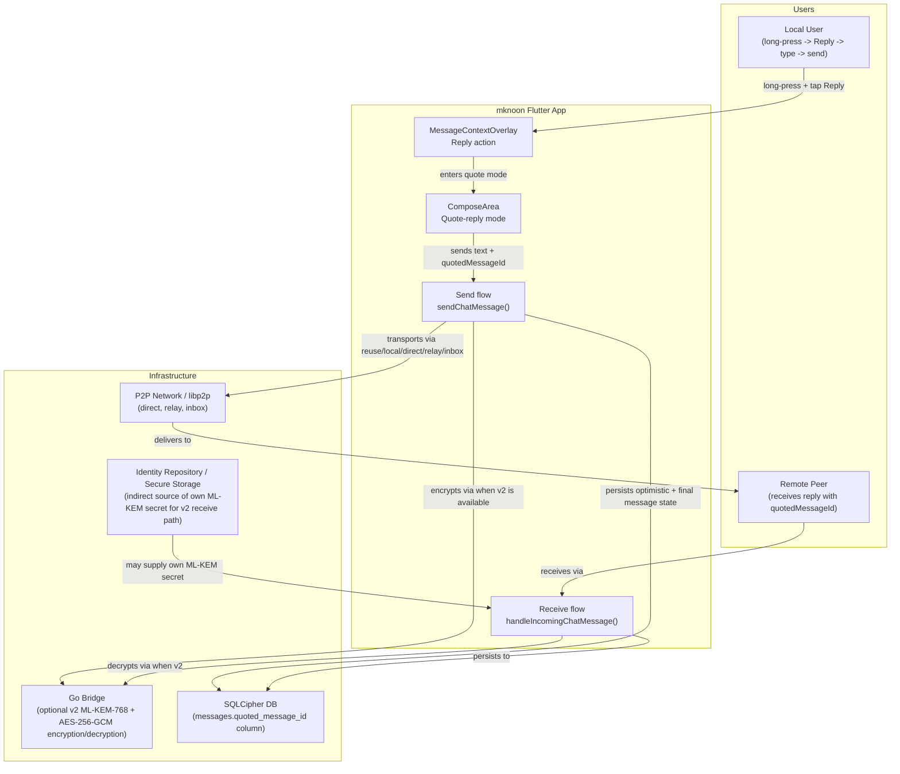
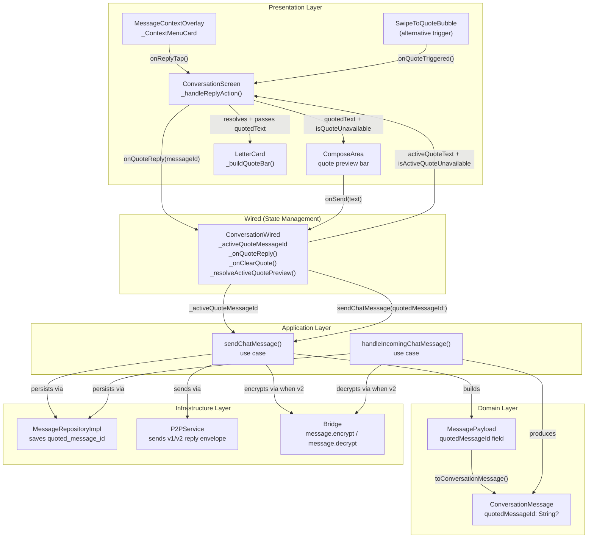
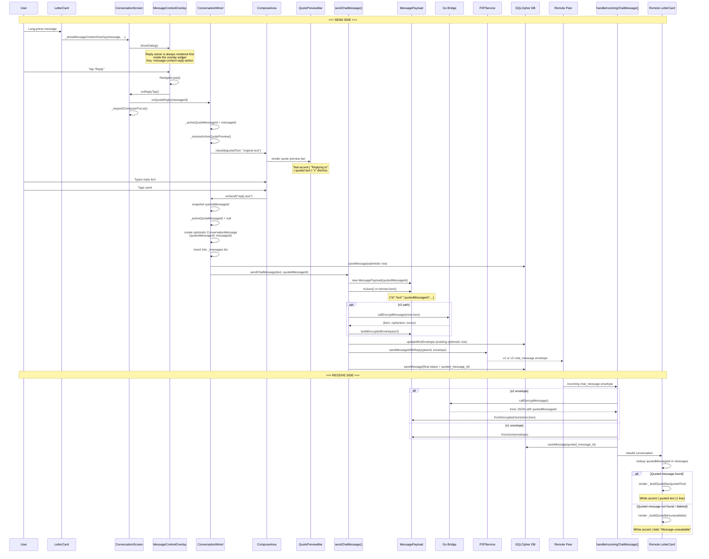
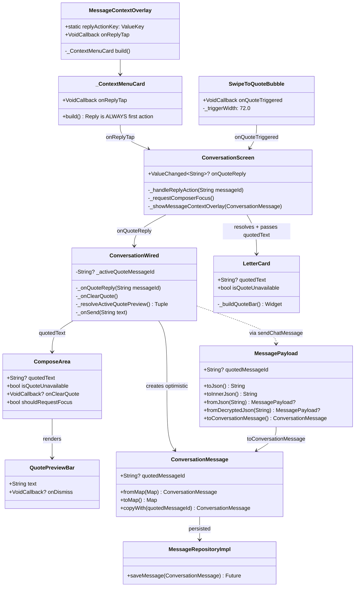

# C4 Model -- Reply (Quote-Reply) Action

This document covers all four C4 levels for the **Reply** action within the MessageContextOverlay feature. Reply allows a user to quote an existing message and send a new message referencing it via `quotedMessageId`.

The primary walkthrough below follows the direct-conversation `LetterCard` path, which is the original MessageContextOverlay scope. The same Reply primitives are also reused in direct Feed thread surfaces via `FeedScreen` / `FeedWired`.

> **Key invariant:** Inside `MessageContextOverlay`, Reply is always rendered as the first context-menu action. Overlay availability is still host-surface-dependent: deleted messages do not open the overlay, group feed cards use a different long-press path, and reply behavior depends on the host wiring `onQuoteReply`.

---

## Level 1 -- System Context



### External Actors

| Actor | Role |
|-------|------|
| **Local User** | Long-presses a LetterCard, taps Reply in the context menu, types a reply, sends it |
| **Remote Peer** | Receives the reply message containing `quotedMessageId` in the payload |

### Systems

| System | Role |
|--------|------|
| **mknoon Flutter App** | Houses the overlay hosts (`ConversationScreen`, shared direct-thread `FeedScreen`), composer quote mode, send flow, receive flow, and quote-bar rendering |
| **P2P Network / libp2p** | Transports the reply message via connection reuse, local, direct, relay, or inbox store-and-forward paths |
| **Go Bridge** | Optionally encrypts/decrypts the reply payload for v2 envelopes using ML-KEM-768 + AES-256-GCM |
| **SQLCipher DB** | Persists the reply message row, including `quoted_message_id`, status, and optional `wire_envelope` |
| **Identity Repository / Secure Storage** | Indirectly supplies the local ML-KEM secret key used by the receive path when a v2 envelope is decrypted |

---

## Level 2 -- Containers



### Presentation Container

| Widget | Responsibility |
|--------|---------------|
| `MessageContextOverlay` / `_ContextMenuCard` | Renders the Reply action. Reply is always the first action item (icon: `Icons.reply_rounded`) whenever the overlay is shown. The overlay widget itself does not gate Reply behind ownership or permission flags. |
| `ConversationScreen._handleReplyAction(messageId)` | Calls `widget.onQuoteReply?.call(messageId)` (nullable) + `_requestComposerFocus()` to focus the text field |
| `ComposeArea` | Enters quote-reply mode when `quotedText` is non-null or `isQuoteUnavailable` is true. Renders `QuotePreviewBar` above the text field with teal accent, "Replying to" label, quoted text (max 2 lines), and "x" dismiss button |
| `LetterCard._buildQuoteBar()` | When `ConversationScreen` resolves and passes `quotedText` or `isQuoteUnavailable`, renders a thin quote bar above the message body showing the provided text or italic "Message unavailable" |
| `SwipeToQuoteBubble` | Alternative trigger for incoming, non-deleted messages when `onQuoteReply` is wired. A right-swipe fires `onQuoteTriggered()` at 50% of the 72px drag threshold |

Shared reuse outside this focused direct-conversation view: `FeedScreen` / `FeedWired` direct threads use the same `MessageContextOverlay`, `SwipeToQuoteBubble`, `QuotePreviewBar`, and `quotedMessageId` propagation with feed-specific state and input widgets.

### Wired Container (State Management)

| Method / Field | Responsibility |
|----------------|---------------|
| `_activeQuoteMessageId` | Nullable String holding the ID of the message being quoted |
| `_onQuoteReply(messageId)` | Sets `_activeQuoteMessageId`, clears any active edit mode |
| `_onClearQuote()` | Nulls out `_activeQuoteMessageId` |
| `_resolveActiveQuotePreview()` | Returns `(String? text, bool isUnavailable)` by looking up the quoted message in `_messages`, preferring message text, then media preview text, otherwise unavailable. Passed to `ConversationScreen` as `activeQuoteText` / `isActiveQuoteUnavailable`, which re-maps to `quotedText` / `isQuoteUnavailable` for `ComposeArea` |

### Application Container

| Use Case | Responsibility |
|----------|---------------|
| `sendChatMessage()` | Accepts `quotedMessageId:` parameter. Builds `MessagePayload` with it, serializes to a v1 plaintext envelope or a v2 encrypted envelope, updates `wire_envelope` when an optimistic row already exists, sends via the direct-message transport race, and persists final message state |
| `handleIncomingChatMessage()` | Parses `quotedMessageId` from a v1 envelope or a decrypted v2 payload, then persists the incoming message with the `quoted_message_id` column |

### Domain Container

| Model | Responsibility |
|-------|---------------|
| `ConversationMessage` | `quotedMessageId: String?` field. Maps to `quoted_message_id` DB column. Populated via `fromMap()` / `toMap()` |
| `MessagePayload` | `quotedMessageId: String?` field. Serialized into the v1 payload and the v2 inner JSON. Parsed from both `fromJson()` and `fromDecryptedJson()` |

### Infrastructure Container

| Component | Responsibility |
|-----------|---------------|
| `MessageRepositoryImpl` | `saveMessage()` persists the full `ConversationMessage` including `quoted_message_id`; `updateWireEnvelope()` persists the serialized envelope onto an existing optimistic row |
| `P2PService` | Transports the envelope via connection reuse, local, direct, relay-probe, and inbox fallback paths |
| `Bridge` | Optional `message.encrypt` / `message.decrypt` bridge commands for ML-KEM-768 + AES-256-GCM |

---

## Level 3 -- Components

### 3.1 Reply Action in Context Menu

Reply is the **first** action in the `_ContextMenuCard` action list. It is unconditionally included inside the overlay widget -- no boolean flag gates it (compare with `showEditAction`, `showCopyAction`, `showDeleteAction`, which are all conditional).

```
actions = [
  _ContextMenuAction(reply_rounded, l10n.reply, onReplyTap),   // ALWAYS present
  if (showEditAction) _ContextMenuAction(edit_rounded, ...),     // conditional
  if (showCopyAction) _ContextMenuAction(copy_rounded, ...),     // conditional
  if (showDeleteAction) _ContextMenuAction(delete_outline_rounded, ...), // conditional
]
```

Static test key: `replyActionKey = ValueKey('message-context-reply-action')`

### 3.2 Trigger Flow (Overlay Path)

```mermaid
sequenceDiagram
    participant User as Local User
    participant LC as LetterCard
    participant CS as ConversationScreen
    participant MCO as MessageContextOverlay
    participant CW as ConversationWired
    participant CA as ComposeArea
    participant QPB as QuotePreviewBar
    participant SCM as sendChatMessage()
    participant MP as MessagePayload
    participant Bridge as Go Bridge
    participant P2P as P2PService
    participant DB as SQLCipher DB
    participant Remote as Remote Peer

    User->>LC: Long-press
    LC->>CS: _showMessageContextOverlay(message, ...)
    CS->>MCO: showDialog(MessageContextOverlay)
    Note over MCO: Reply is always the first action<br/>inside the overlay widget
    User->>MCO: Tap "Reply"
    MCO->>CS: onReplyTap()
    CS->>CS: Navigator.pop(dialogContext)
    CS->>CS: _handleReplyAction(messageId)
    CS->>CW: widget.onQuoteReply(messageId)
    CS->>CS: _requestComposerFocus()

    CW->>CW: setState(_activeQuoteMessageId = messageId)
    CW->>CW: _resolveActiveQuotePreview()
    CW->>CA: rebuild with quotedText + isQuoteUnavailable

    CA->>QPB: render QuotePreviewBar
    Note over QPB: Teal accent + "Replying to" label<br/>+ quoted text (max 2 lines) + "x" dismiss

    User->>CA: Types reply text
    User->>CA: Taps Send button

    CA->>CW: onSend(text)
    CW->>CW: capture _activeQuoteMessageId
    CW->>CW: setState(_activeQuoteMessageId = null)

    CW->>SCM: sendChatMessage(text, quotedMessageId: messageId)
    SCM->>MP: MessagePayload(quotedMessageId: messageId)
    SCM->>MP: toJson() or toInnerJson()
    Note over SCM,Bridge: v2 encryption is optional.<br/>When bridge + recipient ML-KEM key exist,<br/>sendChatMessage encrypts inner JSON into a v2 envelope;<br/>otherwise it sends a v1 envelope.
    opt v2 path
        SCM->>Bridge: callEncryptMessage(innerJson)
        Bridge-->>SCM: {kem, ciphertext, nonce}
        SCM->>MP: buildEncryptedEnvelope(v2)
    end
    SCM->>P2P: run reuse/local/direct/relay/inbox send path
    P2P-->>Remote: v1 or v2 chat_message envelope
    SCM->>DB: messageRepo.saveMessage(status + quotedMessageId)
```

### 3.3 Trigger Flow (Swipe Path -- Incoming Messages Only)

For incoming messages, `SwipeToQuoteBubble` wraps the `LetterCard`. A right-swipe beyond 36px (50% of 72px trigger width) fires `onQuoteTriggered()`, which calls `widget.onQuoteReply(message.id)`. The flow then joins the same path as the overlay trigger at step "CW sets _activeQuoteMessageId".

Condition for swipe availability (evaluated in `ConversationScreen`, not inside `SwipeToQuoteBubble` itself -- the bubble is a dumb gesture wrapper with no message awareness):
```
// conversation_screen.dart — decides whether to wrap in SwipeToQuoteBubble
if (message.isIncoming && !message.isDeleted && widget.onQuoteReply != null)
```

### 3.4 ComposeArea Quote Mode

When `quotedText` is non-null (or `isQuoteUnavailable` is true), `ComposeArea.build()` renders the `QuotePreviewBar` widget above the text input row.

**Quote preview bar structure:**
- Teal vertical accent bar (2px wide, 36px tall, `FeedColors.accentTeal` at 60% opacity)
- "Replying to" label (11px, teal, semi-bold)
- Quoted text snippet (12px, white 50% opacity, max 2 lines, ellipsis overflow)
- "x" close button (16px `close_rounded` icon, white 35% opacity) -- calls `onClearQuote`

When `isQuoteUnavailable` is true, `quotePreviewText` becomes `'Message unavailable'`.

**Focus behavior:** `_requestComposerFocus()` sets `_shouldRequestComposerFocus = true`, which triggers `_focusNode.requestFocus()` in `ComposeArea.didUpdateWidget()`.

### 3.5 Send Flow with quotedMessageId

1. `ConversationWired._onSend(text)` captures `_activeQuoteMessageId` before clearing it
2. Creates optimistic `ConversationMessage` with `quotedMessageId: quotedMessageId`
3. Inserts the optimistic message into `_messages` immediately (UI updates instantly)
4. Persists that optimistic row via `messageRepo.saveMessage()`
5. Calls `sendChatMessage()` with `quotedMessageId: quotedMessageId`
6. `sendChatMessage()` builds `MessagePayload` including the field
7. `payload.toJson()` serializes `quotedMessageId` for v1, or `payload.toInnerJson()` serializes it into the v2 inner JSON (only if non-null)
8. When `bridge` and `recipientMlKemPublicKey` are both available, the inner JSON is encrypted and wrapped as a v2 envelope; otherwise the send path keeps the v1 envelope
9. `sendChatMessage()` updates `wire_envelope` on the existing optimistic row before the transport race
10. The envelope is sent via connection reuse, local WiFi, direct dial/send, relay probe retry, and inbox fallback as needed
11. Final message state is persisted with the `quoted_message_id` column, and failed / retryable paths retain `wire_envelope` as needed

**On send failure:** `_activeQuoteMessageId` is restored via `_restoreComposerSnapshot()` so the user can retry without losing their quote context. The helper restores the captured draft text, active quote, and pending attachments from a snapshot:
```dart
// _restoreComposerSnapshot() — among other restorations:
setState(() => _activeQuoteMessageId = snapshot.quotedMessageId);
```

### 3.6 Receive Side

1. `ChatMessageListener` receives a P2P message, optionally fetches the local ML-KEM secret, and routes the message into `handleIncomingChatMessage()` for v2 decrypt-or-v1-parse handling
2. `handleIncomingChatMessage()` parses `quotedMessageId` from `MessagePayload`
3. For normal incoming messages, `payload.toConversationMessage()` maps it to `ConversationMessage.quotedMessageId`; same-ID incoming edits instead update `existingMessage.copyWith(...)`, preserving the existing quote when the edit payload omits it
4. `messageRepo.saveMessage()` persists with `quoted_message_id` column
5. `ConversationScreen` rebuilds → for each message with `quotedMessageId != null`:
   - Looks up the quoted message in the local `messages` list
   - If found and not deleted: extracts text (or media preview text)
   - If found but deleted/empty: sets `isQuoteUnavailable = true`
   - If not found locally: sets `isQuoteUnavailable = true`
6. `LetterCard` renders `_buildQuoteBar()` with resolved text or "Message unavailable"

### 3.7 LetterCard Quote Bar Rendering

The LetterCard renders the quote bar inside the card body, above the message text and media:

**Available state** (`quotedText != null`):
- White vertical accent (2px wide, 16px tall, white 15% opacity)
- Quoted text (13px, normal style, white 35% opacity, max 1 line, ellipsis)

**Unavailable state** (`isQuoteUnavailable == true`):
- Same accent bar
- "Message unavailable" (13px, italic, white 20% opacity)

---

## Level 4 -- Code

### 4.1 onReplyTap Callback in ConversationScreen

```dart
// conversation_screen.dart — inside _showMessageContextOverlay()
onReplyTap: () {
  Navigator.of(dialogContext).pop();
  _handleReplyAction(message.id);
},

// conversation_screen.dart
void _handleReplyAction(String messageId) {
  widget.onQuoteReply?.call(messageId);
  _requestComposerFocus();
}
```

### 4.2 ConversationWired State Management

```dart
// conversation_wired.dart — state field
String? _activeQuoteMessageId;

// conversation_wired.dart — sets quote mode, clears edit mode
void _onQuoteReply(String messageId) {
  if (!mounted) return;
  setState(() {
    _editingMessageId = null;
    _editingOriginalText = null;
    _activeQuoteMessageId = messageId;
  });
}

// conversation_wired.dart — clears quote mode
void _onClearQuote() {
  if (!mounted) return;
  setState(() => _activeQuoteMessageId = null);
}

// conversation_wired.dart — resolves preview text for ComposeArea
(String?, bool) _resolveActiveQuotePreview() {
  final quoteId = _activeQuoteMessageId;
  if (quoteId == null) return (null, false);

  final quoted = _messages.where((m) => m.id == quoteId).firstOrNull;
  if (quoted == null) return (null, true);
  if (quoted.text.isNotEmpty) return (quoted.text, false);
  if (quoted.media.isNotEmpty) return (mediaPreviewText(quoted.media), false);
  return (null, true);
}
```

### 4.3 Quote Preview Bar Widget (ComposeArea)

```dart
// compose_area.dart — inside build()
final showQuotePreview =
    widget.quotedText != null || widget.isQuoteUnavailable;
final quotePreviewText = widget.isQuoteUnavailable
    ? 'Message unavailable'
    : widget.quotedText;

// Renders above the text input row:
if (showQuotePreview)
  QuotePreviewBar(
    text: quotePreviewText!,
    onDismiss: widget.onClearQuote,
  ),
```

### 4.4 QuotePreviewBar Widget

```dart
// quote_preview_bar.dart
class QuotePreviewBar extends StatelessWidget {
  final String text;
  final VoidCallback? onDismiss;

  @override
  Widget build(BuildContext context) {
    return Padding(
      padding: const EdgeInsets.only(bottom: 8),
      child: Row(
        children: [
          Container(                                    // Teal accent bar
            width: 2, height: 36,
            decoration: BoxDecoration(
              color: FeedColors.accentTeal.withValues(alpha: 0.60),
              borderRadius: BorderRadius.circular(1),
            ),
          ),
          const SizedBox(width: 8),
          Expanded(
            child: Column(
              crossAxisAlignment: CrossAxisAlignment.start,
              mainAxisSize: MainAxisSize.min,
              children: [
                Text('Replying to', style: TextStyle(        // Label
                  fontSize: 11, fontWeight: FontWeight.w500,
                  color: FeedColors.accentTeal.withValues(alpha: 0.60),
                )),
                const SizedBox(height: 2),
                Text(text, maxLines: 2,                      // Quoted text
                  overflow: TextOverflow.ellipsis,
                  textDirection: detectTextDirection(text),
                  style: const TextStyle(fontSize: 12,
                    fontWeight: FontWeight.w400,
                    color: Color.fromRGBO(255, 255, 255, 0.50)),
                ),
              ],
            ),
          ),
          if (onDismiss != null) ...[                         // "x" dismiss
            const SizedBox(width: 8),
            GestureDetector(
              onTap: onDismiss,
              behavior: HitTestBehavior.opaque,
              child: Padding(
                padding: const EdgeInsets.all(4),
                child: Icon(Icons.close_rounded, size: 16,
                  color: Colors.white.withValues(alpha: 0.35)),
              ),
            ),
          ],
        ],
      ),
    );
  }
}
```

### 4.5 LetterCard Quote Bar

```dart
// letter_card.dart — inside the card body
if (quotedText != null || isQuoteUnavailable)
  Padding(
    padding: const EdgeInsets.fromLTRB(16, 0, 16, 4),
    child: _buildQuoteBar(),
  ),

Widget _buildQuoteBar() {
  final displayText = isQuoteUnavailable
      ? 'Message unavailable'
      : quotedText!;
  return Row(
    children: [
      Container(                                    // White accent bar
        width: 2, height: 16,
        decoration: BoxDecoration(
          color: const Color.fromRGBO(255, 255, 255, 0.15),
          borderRadius: BorderRadius.circular(1),
        ),
      ),
      const SizedBox(width: 8),
      Expanded(
        child: Text(
          displayText,
          maxLines: 1,
          overflow: TextOverflow.ellipsis,
          textDirection: detectTextDirection(displayText),
          style: TextStyle(
            fontSize: 13,
            fontWeight: FontWeight.w400,
            fontStyle: isQuoteUnavailable
                ? FontStyle.italic : FontStyle.normal,
            color: Color.fromRGBO(255, 255, 255,
                isQuoteUnavailable ? 0.20 : 0.35),
          ),
        ),
      ),
    ],
  );
}
```

### 4.6 Wire Format -- quotedMessageId in Payload JSON

**v1 plaintext envelope:**
```json
{
  "type": "chat_message",
  "version": "1",
  "payload": {
    "id": "a1b2c3d4-...",
    "text": "This is my reply",
    "senderPeerId": "12D3KooW...",
    "senderUsername": "alice",
    "timestamp": "2026-04-09T12:00:00.000Z",
    "quotedMessageId": "e5f6g7h8-..."
  }
}
```

**v2 encrypted envelope** (quotedMessageId is inside the encrypted `ciphertext`):
```json
{
  "type": "chat_message",
  "version": "2",
  "id": "a1b2c3d4-...",
  "senderPeerId": "12D3KooW...",
  "senderUsername": "alice",
  "encrypted": {
    "kem": "<base64 ML-KEM-768 encapsulated key>",
    "ciphertext": "<base64 AES-256-GCM ciphertext containing inner JSON with quotedMessageId>",
    "nonce": "<base64 nonce>"
  }
}
```

**Inner JSON (plaintext before encryption, or after decryption):**
```json
{
  "id": "a1b2c3d4-...",
  "text": "This is my reply",
  "senderPeerId": "12D3KooW...",
  "senderUsername": "alice",
  "timestamp": "2026-04-09T12:00:00.000Z",
  "quotedMessageId": "e5f6g7h8-..."
}
```

> **Note:** The inner JSON may also contain other conditional fields not shown here: `action` (for edit messages, value `"edit"`), `editedAt` (ISO-8601 string, edit messages only), and `media` (array, media messages only). These are omitted above as they are not relevant to the Reply action.

The `quotedMessageId` field is conditionally serialized -- it only appears when non-null:
```dart
// message_payload.dart — toInnerJson() and toJson()
if (quotedMessageId != null) 'quotedMessageId': quotedMessageId,
```

### 4.7 ConversationMessage Domain Model

```dart
// conversation_message.dart
class ConversationMessage {
  /// The ID of the message being quoted (quote-reply). NULL means no quote.
  final String? quotedMessageId;

  // fromMap: reads from 'quoted_message_id' DB column
  factory ConversationMessage.fromMap(Map<String, dynamic> map) {
    return ConversationMessage(
      // ...
      quotedMessageId: map['quoted_message_id'] as String?,
    );
  }

  // toMap: writes to 'quoted_message_id' DB column
  Map<String, dynamic> toMap() {
    return {
      // ...
      'quoted_message_id': quotedMessageId,
    };
  }
}
```

### 4.8 Static Test Keys

```dart
// message_context_overlay.dart
static const replyActionKey = ValueKey('message-context-reply-action');
```

### 4.9 Full Reply Flow -- Sequence Diagram



### 4.10 Class Diagram -- Reply Data Flow



---

## Key File Paths

| File | Role |
|------|------|
| `lib/features/conversation/presentation/widgets/message_context_overlay.dart` | Reply action in context menu |
| `lib/features/conversation/presentation/screens/conversation_screen.dart` | `_handleReplyAction`, `_showMessageContextOverlay`, quote text resolution per LetterCard |
| `lib/features/conversation/presentation/screens/conversation_wired.dart` | `_activeQuoteMessageId` state, `_onQuoteReply`, `_onClearQuote`, `_resolveActiveQuotePreview`, send integration |
| `lib/features/conversation/presentation/widgets/compose_area.dart` | Quote-reply mode rendering, `QuotePreviewBar` integration |
| `lib/features/feed/presentation/screens/feed_screen.dart` | Shared direct-thread overlay host and direct-thread quote-text resolution in feed surfaces |
| `lib/features/feed/presentation/screens/feed_wired.dart` | Feed-thread reply state, focus routing, and `quotedMessageId` propagation for shared direct-thread reuse |
| `lib/features/feed/presentation/widgets/quote_preview_bar.dart` | Teal accent + "Replying to" + quoted text + dismiss |
| `lib/features/feed/presentation/widgets/swipe_to_quote_bubble.dart` | Swipe-to-reply gesture on incoming messages |
| `lib/features/conversation/presentation/widgets/letter_card.dart` | `_buildQuoteBar()` renders quoted text / "Message unavailable" |
| `lib/features/conversation/domain/models/conversation_message.dart` | `quotedMessageId: String?` field, `fromMap`/`toMap` |
| `lib/features/conversation/domain/models/message_payload.dart` | `quotedMessageId` in wire format (v1, v2, inner JSON) |
| `lib/features/conversation/application/send_chat_message_use_case.dart` | `quotedMessageId:` parameter in send flow |
| `lib/features/conversation/application/handle_incoming_chat_message_use_case.dart` | Parses + persists `quotedMessageId` from incoming messages |
