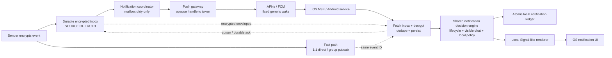

# Private and Reliable Notifications

**Product Requirements Document for Mknoon**  
**Version:** 1.2  
**Date:** 4 August 2026  
**Status:** Proposed target state; OQ-01 through OQ-05 must be resolved before story creation

> **Decision summary:** Direct connections and pubsub remain low-latency paths, but the encrypted per-device inbox is the durable source of truth. APNs and FCM carry only a fixed generic wake-up. The recipient device fetches, decrypts, deduplicates, applies local policy and renders the final notification. Notification presentation is decided from the current app lifecycle and visible conversation, never from the transport that delivered the event.

> **Version 1.2 change:** The PRD now distinguishes an OS notification, a locally posted OS notification and a remote push/wake. It also adds a story-creation gate: OQ-01 through OQ-05 must map the current same-chat cue, chat-open cleanup, local read predicate, linked-device read clearing and any existing mute components before the affected clauses become final stories.

> **Implementation-economy addendum (8 August 2026):** Close the requirements through the smallest dependency-ordered vertical slices that produce usable behavior. Reuse existing custody, retry, ledger, platform-adapter and test-harness owners by default. A new durable owner requires evidence of a different authority, lifetime or atomic transition; a new protocol, scheduler, queue or harness requires a concrete compatibility or otherwise unprovable execution boundary.

> **Privacy limit:** Apple or Google must receive a device push token to route a push. They can observe that this app sent a push to a device at a certain time. This design prevents the push payload from revealing sender, conversation, group, message type, content or media URL. It does not eliminate timing correlation.

## 1. Executive summary

Mknoon needs reliable notifications when a recipient is offline, backgrounded, suspended or terminated, while preserving the privacy expected from an end-to-end encrypted messenger.

The target architecture has four independent responsibilities:

1. **Durable delivery:** commit every notification-worthy encrypted event to the recipient device inbox.
2. **Fast delivery:** use direct 1:1 transport or group pubsub when the device is connected.
3. **Wake-up:** use a fixed generic APNs/FCM signal when native background work is needed.
4. **Local presentation:** decrypt, deduplicate, inspect current app state and render or suppress the notification on the recipient device.

A direct connection proves that a device is reachable. It does **not** prove that the app is visible. A message may arrive after the user presses Home but before iOS or Android suspends the process. That event must still produce an OS notification, or remain owned by the APNs/FCM path.



### Core invariants

- The inbox event is committed before push generation.
- Direct, relay, pubsub and inbox copies use one authenticated `event_id`.
- APNs/FCM payloads contain no sender, user, chat, group, content, event type, media URL or unread count.
- Transport type does not decide whether a notification appears.
- Only a fresh `FOREGROUND_ACTIVE` state plus the matching frontmost conversation may suppress that conversation’s banner.
- Suppressing a notification, dismissing it and marking a message read are separate state transitions.
- Main app, iOS Notification Service Extension, Android receiver and inbox reconciler use one atomic local notification ledger.

### 1.1 Notification terminology

The delivery path and the user-visible result are different concepts. The same iOS or Android notification UI can be initiated by APNs/FCM or posted locally by device code.

| Term | Meaning in this PRD |
|---|---|
| **OS notification** | Any user-visible banner, card or notification-center item shown by iOS or Android, regardless of which delivery path caused it. |
| **Locally posted OS notification** | An OS notification scheduled on the device by the main app or a native background service after local processing. Android data-push and direct-delivery handling commonly use this model. |
| **Provider-initiated notification / remote wake** | An APNs or FCM request initiated by the server. It may initiate an OS notification or only wake native processing. On iOS, an NSE may replace generic content before the OS presents it. The push is not the authoritative chat event. |
| **In-app cue** | A sound, banner or other indication produced inside the open app. It is not an OS notification. |

“Normal system notification” is not a technical category. Use **OS notification** for the user-visible result, and add **locally posted** or **provider-initiated** only when the creation path matters.

## 2. Goals

| ID | Goal |
|---|---|
| G-01 | No event is lost because a push is missing, delayed, collapsed or throttled. |
| G-02 | APNs/FCM payloads reveal no sender, application user, conversation, group, content or event type. |
| G-03 | Notifications use native conversation presentation and user privacy settings. |
| G-04 | Direct, relay, pubsub and inbox delivery produce one local event, one unread transition, one current conversation notification and normally one user alert. |
| G-05 | Same-chat, other-chat, other-screen and foreground-to-background behaviour is deterministic and testable. |
| G-06 | A still-live direct connection cannot cause a message to be silently persisted after the app has left the foreground. |
| G-07 | Failures and suppressions are diagnosable without logging private content or social-graph identifiers. |

## 3. Non-goals

- Hiding from the platform provider that a device token received a push.
- Eliminating all timing correlation.
- Using push as authoritative message transport.
- Depending on iOS silent pushes or a permanent background libp2p listener.
- Incoming-call architecture.
- Cloud-side generation of plaintext previews.
- Claiming distributed visual notification delivery is mathematically exactly-once. The hard guarantee is one local event and one unread transition; visual duplicates must be minimized, measured and promptly coalesced rather than allowing message loss.
- Building a separate inbox/outbox, ledger, retry scheduler, provider adapter or device harness for every message modality, audit item, platform entry point or gap number when one existing owner can satisfy the same contract.

### 3.1 Implementation economy and finish line

These rules constrain how the target architecture is delivered; they do not weaken its privacy, durability, acknowledgement, lifecycle or local-idempotence requirements.

- Plan an owner-aligned vertical slice around the smallest coherent set of related reliability or privacy outcomes, not around every PRD sentence, event subtype or test permutation.
- Prefer an adopter that extends an existing authenticated event, custody owner, retry cadence, notification ledger, platform adapter or test fixture. Introduce a new persistent state owner only when the required lifetime or atomic transition cannot be represented safely by an existing owner.
- Do not create parallel modality-specific pipelines for text, media, reactions, edits, deletes and groups. Normalize them at the earliest contract they genuinely share; keep a specialized owner only where the authority or lifetime is materially different.
- An enabling primitive may be default-off for compatibility, but it must have a named near-term adopter and does not count as closing user-visible acceptance until adopted. Do not accumulate unadopted primitives within the same dependency chain.
- Stop a slice when its named PRD risk and preservation boundary pass. Unrelated cleanup, speculative generalization, aesthetic symmetry and infrastructure for hypothetical future requirements go to a later backlog only when concrete evidence justifies them.
- Do not fully specify downstream execution plans against moving interfaces. Retain lightweight dependency and risk outlines until prerequisite APIs and evidence boundaries stabilize.
- Use focused causal tests, exact preservation sentinels and only the affected curated/family gates during a slice. Reuse existing Android automation and defer irreducible Apple device evidence to the consolidated iOS closure phase; do not construct a new cross-platform lab per gap.
- “Done for this slice” means the scoped production behavior and its proportional evidence are complete and the remaining exclusions are truthful. It does not require solving every later modality, retiring all legacy code or designing the final universal framework in advance.

## 4. Privacy contract

### APNs/FCM may necessarily observe

- app package/topic
- recipient device push token
- send time, payload size and provider connection metadata

### Platform payload must not contain

- sender identity, peer ID, user ID or contact name
- recipient application user ID or mailbox ID
- conversation/group ID, pubsub topic, title or membership
- message ID, reaction target ID or media object ID unless inside approved authenticated ciphertext
- message text, reaction, event type, count or attachment details
- media/avatar URL, deep link or relay/inbox address
- analytics labels with stable user or conversation IDs

Use the same small payload shape for text, media, reactions, mentions and groups.

## 5. Target architecture requirements

1. Commit the encrypted event to the recipient device inbox before generating a push.
2. Use one authenticated `event_id` and content hash across direct, pubsub, relay and inbox paths.
3. Remove an inbox event only after the recipient device decrypts, persists and acknowledges it, or after expiry.
4. Message code emits `mailbox_dirty(push_handle)`; it does not construct platform payloads from message objects.
5. The push gateway maps an opaque handle to an encrypted provider token and stores no conversation data.
6. App launch, resume, network reconnection and push receipt always reconcile the inbox.
7. Direct, pubsub, inbox and push entry points normalize into one local notification decision engine.
8. The decision engine receives a fresh app lifecycle state, visible local conversation key, block policy, verified read state, any mute policy confirmed under OQ-05 and the notification ledger.
9. Lifecycle, visible conversation and local event state are checked again immediately before posting, suppressing, updating or cancelling.

### 5.1 Delivery acknowledgement is not notification outcome

A durable delivery acknowledgement means the event was authenticated and persisted. It does not prove that:

- the user was looking at the message;
- an OS notification was posted;
- the app was still foreground-active; or
- local block/read policy and any mute behavior confirmed under OQ-05 were evaluated.

A direct or pubsub delivery acknowledgement must therefore **not** cancel the generic wake by itself.

The coordinator may use a bounded 300–800 ms debounce, but it may suppress the wake only after receiving an opaque `wake_not_required` outcome. That outcome is sent after one of these completed local results:

- the matching chat was foreground-active and updated in place;
- a locally posted OS notification was posted or updated; or
- local block/read policy, or an existing mute policy confirmed under OQ-05, intentionally suppressed the event.

The outcome must not include a conversation ID, screen name or detailed suppression reason.

If the app becomes inactive, enters background, is suspended or crashes before the outcome is recorded, the wake remains required.

## 6. Required notification decision matrix

Signal’s public clients use **thread-specific**, not app-wide, foreground suppression: Signal iOS derives suppression only when the main app is active and the visible thread matches; Signal Android tracks a visible thread and continues to notify non-visible conversations. Mknoon should follow the same product principle while retaining its own inbox and libp2p design.

| App lifecycle | Visible destination | Required result | Read/cancel effect |
|---|---|---|---|
| `FOREGROUND_ACTIVE` | Same chat A | Persist and update A; no OS banner; same-chat cue follows OQ-01. | Do not mark read merely because the banner was suppressed; use the predicate resolved under OQ-03. |
| `FOREGROUND_ACTIVE` | Chat B | Post/update an OS notification for A; keep B open. | Read state follows OQ-03; chat-open cleanup follows OQ-02. |
| `FOREGROUND_ACTIVE` | Chat list, settings, media or other screen | Post/update an OS notification for A. | Unread state remains until verified read rule. |
| `INACTIVE` / transition | Any | OS notification required; ignore the previous visible-thread value. | No automatic read. |
| `BACKGROUND_RUNNING` | Any | Post a locally posted OS notification or retain confirmed APNs/FCM presentation ownership. | Direct reachability is not visibility. |
| Suspended / terminated | None | Generic push wakes native processing; render locally or leave the generic fallback. | Reconcile inbox and local ledger before alert. |
| Unknown or stale snapshot | Unknown | Fail toward notification, subject to block, verified read state and any mute behavior confirmed under OQ-05. | No automatic read. |
| Any | Event already read/handled | After OQ-03/OQ-04 confirm the state source, do not alert; cancel/update stale notification. | Keep the verified read state. |
| Any | Muted or blocked | Apply block policy and, only if OQ-05 confirms it, the existing mute policy without changing provider payload. | Read state remains separate. |

### 6.1 Foreground same chat

When chat A is genuinely frontmost and the app is foreground-active:

- persist and deduplicate the event;
- update the open conversation;
- suppress A’s OS banner; Signal’s reference behavior uses a settings-dependent cue: a quieter notification sound on iOS while active and a configurable, rate-limited in-chat sound on Android;
- treat Mknoon’s cue as provisional pending OQ-01 and do not assume a new haptic or setting;
- do not mark the message read merely because the banner was suppressed; use the predicate resolved under OQ-03;
- record `IN_CHAT` in the local ledger;
- send `wake_not_required` only after the completed local outcome.

### 6.2 Foreground another chat or screen

When chat B, settings, the chat list or another screen is visible and A sends a message:

- keep the current screen unchanged;
- update A’s unread state;
- post/update an OS notification for A;
- record the visible outcome in the local ledger;
- send `wake_not_required` only after that outcome completes.

The application being open is not proof that A’s message is visible.

### 6.3 Foreground-to-background transition

When the user presses Home or switches apps:

1. Invalidate same-chat suppression immediately when the app resigns active or pauses.
2. If a direct/pubsub event arrives before suspension, persist it normally.
3. Treat the event as background notification-eligible.
4. On iOS, APNs/NSE should remain the default presentation owner unless an on-device notification outcome has explicitly completed.
5. On Android, direct and FCM processing may use the same ledger and stable notification ID.
6. Delivery acknowledgement alone cannot suppress the wake.
7. If the process suspends or crashes before completion, the inbox and generic push recover the path.

### 6.4 Read, dismiss and cancel semantics

- Notification suppression does not automatically mark read.
- Notification dismissal does not mark read.
- `Mark Read` changes unread state and clears the conversation notification.
- Target outcome: stale notifications for chat A are removed or updated without clearing unrelated chats. The exact trigger, stable-ID mapping, pending/delivered cleanup and owner are provisional pending OQ-02.
- Opening A does not itself define the read predicate; OQ-03 resolves that separately.
- Do not assume that reading on another linked device clears this device’s notification. OQ-04 must confirm the existing read/control event and cleanup capability first.
- A delayed push must not recreate a notification for an event already read, deleted, expired or handled.
- Badge count, unread state and notification presence are related views, not the same database field.

## 7. Platform payloads

### 7.1 iOS

```text
Headers
  apns-push-type: alert
  apns-priority: 10
  apns-topic: <bundle-id>
  apns-expiration: <short bounded expiry>
  apns-collapse-id: mailbox
```

```json
{
  "aps": {
    "alert": {
      "title-loc-key": "NEW_MESSAGE_TITLE",
      "loc-key": "NEW_MESSAGE_BODY"
    },
    "mutable-content": 1,
    "sound": "default",
    "category": "MESSAGE_WAKE"
  },
  "v": "1"
}
```

The Notification Service Extension fetches and decrypts the inbox, applies local policy and replaces the generic notification. It must not depend on starting the Flutter UI engine. If it cannot finish, the generic content remains.

Additional state requirements:

- The main app and `UNUserNotificationCenterDelegate` use the same decision engine.
- An `AppVisibilitySnapshot` is written to the App Group on active, frontmost-chat change, resign-active and background transitions.
- Only a fresh `FOREGROUND_ACTIVE` snapshot is suppression-eligible.
- Main app and NSE share an atomic notification ledger in the App Group.
- Direct persistence while iOS is inactive/background-running cannot suppress APNs based only on delivery acknowledgement.
- The target is to prevent stale pending/delivered notifications after the relevant chat becomes active, but the exact opening/resume trigger, stable-ID mapping and cancellation owner are provisional pending OQ-02.

### 7.2 Android

```json
{
  "message": {
    "token": "<provider-token>",
    "data": { "w": "1", "v": "1" },
    "android": {
      "priority": "HIGH",
      "ttl": "300s",
      "collapse_key": "mailbox"
    }
  }
}
```

Use `FirebaseMessagingService`, local inbox sync/decryption and `NotificationCompat.MessagingStyle`. If work may exceed the initial processing window, continue through expedited WorkManager. Post a generic local fallback if private rendering cannot finish, then update the same stable conversation notification ID.

Additional state requirements:

- A visible conversation may suppress only its own notification while its Activity is resumed.
- Direct delivery, FCM service, WorkManager and inbox reconciliation share the same persistent ledger.
- All paths recheck lifecycle immediately before notify/cancel.

## 8. Device-local state contracts

```text
AppVisibilitySnapshot {
  lifecycle: FOREGROUND_ACTIVE | INACTIVE | BACKGROUND
  visible_conversation_key: local bytes?
  updated_monotonic_at: monotonic timestamp
}

LocalNotificationRecord {
  event_id: authenticated bytes
  conversation_key: local bytes
  read_state: UNREAD | READ
  presentation_state:
      NOT_EVALUATED | IN_CHAT | OS_POSTED |
      SUPPRESSED_POLICY | CANCELLED
  presentation_owner:
      MAIN_APP | IOS_NSE | ANDROID_PUSH_SERVICE |
      INBOX_RECONCILER
  notification_key: local stable identifier
  last_evaluated_lifecycle: enum
  revision: uint64
}

WakeOutcomeAck {
  event_id_or_generation: opaque correlation value
  wake_not_required: true
  // no conversation ID, screen name or detailed reason
}
```

The visibility snapshot is valid for suppression only when it is fresh and `FOREGROUND_ACTIVE`. Updates to the notification ledger must be atomic across the main app and native background entry points.

## 9. Transition and multi-path race rules

| Race | Required behaviour |
|---|---|
| Direct first, inbox later | One local event. Inbox replay updates delivery state only. |
| Push/NSE or FCM first, direct later | Both paths use the shared ledger; the losing path exits or updates without a second alert. |
| User opens A while A notification is being built | Recheck state immediately before post; suppress or promptly cancel A’s pending notification. |
| User backgrounds app between decision and post | Final recheck posts or preserves push-owned presentation. |
| Direct event persists while app is background-running | Persistence acknowledgement does not cancel push; complete local presentation or leave push as owner. |
| Late push after a locally posted OS notification | Update the current conversation notification and avoid another audible alert. |
| Late push after event was read | Do not recreate the notification; cancel stale requests. |
| Process crashes after persistence but before outcome | No `wake_not_required` is sent; inbox and generic push recover delivery. |

## 10. Codebase audit checklist

For each item, record status, exact file/function, current behaviour, risk, required change and acceptance test.

| ID | Inspect |
|---|---|
| A-01 | One authenticated event ID across direct, relay, pubsub and inbox. |
| A-02 | Inbox commit completes before push generation. |
| A-03 | Inbox removal requires durable device persistence acknowledgement or expiry. |
| A-04 | Group offline delivery does not depend on pubsub. |
| A-05 | Message code emits mailbox-dirty instead of building APNs/FCM payloads. |
| A-06 | Payload builders contain none of the forbidden fields. |
| A-07 | Push tokens are separated from user/contact/conversation data. |
| A-08 | Token refresh, invalidation, logout and environment separation are complete. |
| A-09 | iOS does not rely only on silent push. |
| A-10 | iOS NSE can sync/decrypt without Flutter UI startup. |
| A-11 | App Group, Keychain, SQLCipher/file protection and concurrency are tested. |
| A-12 | Android uses high-priority data messages for private rendering. |
| A-13 | Every legitimate high-priority wake has a visible, locally suppressed or failed outcome. |
| A-14 | iOS communication notifications and Android MessagingStyle are used. |
| A-15 | Generic fallback and local rich processing cannot create two alerts for the same event. |
| A-16 | Media URLs and event types are absent from push payloads; asset work is bounded. |
| A-17 | Reactions use the same inbox/dedupe/render pipeline. |
| A-18 | Multi-device cursors and acknowledgements are independent. |
| A-19 | Logs and analytics contain no tokens, plaintext or social-graph IDs. |
| A-20 | Deterministic event/state fixtures and real-iPhone APNs tests exist. |
| A-21 | One authoritative lifecycle source records foreground-active, inactive and background-running state with freshness checks. |
| A-22 | Foreground suppression applies only to the exact frontmost conversation. |
| A-23 | Chat B and non-chat screens still notify for incoming chat A text, media and reactions. |
| A-24 | A direct event arriving after background transition produces an OS notification or confirmed push-owned result. |
| A-25 | Direct/pubsub/inbox/push paths call one normalized notification decision engine. |
| A-26 | Durable delivery acknowledgement cannot cancel push before completed local outcome. |
| A-27 | Main app, iOS NSE, Android receiver and reconciler atomically share the notification ledger. |
| A-28 | Lifecycle/read state is checked immediately before post; OQ-02 first identifies the existing chat-open cleanup mechanism and stable IDs. |
| A-29 | Suppression and dismissal do not incorrectly mark messages read. |
| A-30 | Race tests cover direct→push, push→direct, open-during-build, background-during-build and late-wake-after-read. |

## 11. Immediate red flags

- Push payload includes sender, peer ID, chat/group ID, text, reaction, media type or URL.
- Push is generated only after direct delivery times out.
- Pubsub is the only group path for offline devices.
- Inbox data is deleted when APNs/FCM accepts the request.
- iOS uses silent push as the sole notification mechanism.
- NSE requires Flutter UI startup.
- Android uses a plaintext FCM notification payload.
- Different delivery paths create different event IDs or notification records.
- Every notification is suppressed merely because the app is foregrounded.
- A direct socket or persistence acknowledgement is treated as proof that no notification is needed.
- A stale visible-chat value remains valid after resign-active/onPause/background.
- Suppression or dismissal automatically marks read.
- A delayed wake recreates a notification after the chat was opened or marked read.
- Main app and background components maintain independent or non-atomic notification flags.

## 12. Core acceptance criteria

- **AC-01:** Same-chat A while foreground-active updates A without an OS banner; cue and read behavior match the approved OQ-01 and OQ-03 resolutions.
- **AC-02:** Chat B while foreground-active still produces A’s notification and leaves B open.
- **AC-03:** Chat list/settings/media viewer still produces A’s notification.
- **AC-04:** A direct event received after the app becomes inactive/background-running cannot end as persistence-only.
- **AC-05:** Delivery acknowledgement without `wake_not_required` does not suppress generic push.
- **AC-06:** After OQ-02 defines the cleanup mechanism, opening A while its notification is being built prevents a stale A notification without clearing unrelated chats.
- **AC-07:** Backgrounding between decision and post causes an OS notification after final state recheck.
- **AC-08:** A delayed wake after the verified local or linked-device read/open/delete state does not recreate an alert; linked-device behavior follows OQ-04.
- **AC-09:** Dismiss does not change read state; Mark Read and chat visibility change it only through the predicate resolved under OQ-03.
- **AC-10:** Direct, push and inbox arrival orders produce one local event, one unread transition, one current conversation notification and normally one audible alert.
- **AC-11:** Captured APNs/FCM requests contain none of the forbidden fields and have the same shape for text, image, voice, reaction and group events.
- **AC-12:** On app launch after missed pushes, all retained inbox events synchronize without duplicate local events.

## 13. Required tests

- Payload forbidden-field and fixed-shape tests.
- Event identity and idempotency tests for every path order.
- Visible-thread isolation: same chat suppresses; chat B and non-chat screens still notify for A.
- Lifecycle transition: deliver immediately before and after resign-active/onPause/background.
- Final gate: open A or background between decision and post.
- Acknowledgement separation: delivery ack without outcome still causes generic wake.
- Shared-ledger concurrency: main app, NSE/FCM receiver and reconciler race on one event.
- Read/cancel: after OQ-02 through OQ-04 are resolved, test dismiss, open, mark read, linked-device read and delayed wake.
- iOS real-device cases: foreground, inactive, background-running, suspended, terminated, locked, before-first-unlock and force-quit.
- Android real-device cases: Doze, WorkManager continuation, permission denied, channel disabled, token refresh and OEM restrictions.

## 14. Open questions before story creation

Answer OQ-01 through OQ-05 before turning the affected clauses into final implementation stories. Use exact repository paths, runtime traces and real-device evidence. These questions do not weaken the P0 inbox, privacy, event-identity or deduplication invariants; they determine how the target design should reuse or change components that already exist.

| ID | Topic | Investigation and evidence required | Affected PRD parts and required update |
|---|---|---|---|
| **OQ-01** | Same-chat sound / haptic | Trace text, media, reaction and mention events while chat A is frontmost on iOS and Android. Identify existing Flutter/native handlers, sound or haptic components, settings, mute/channel interactions, ringer/Focus behavior and throttling. Record current defaults and real-device evidence. | Full PRD: FR-006, FR-018; §§6.1, 7.4, 8.3, 9.4–9.5, 12.1, AC-11, Matrix A and automated tests. Replace all provisional same-chat cue clauses with the approved behavior. Do not add a new haptic or setting without a decision. |
| **OQ-02** | Chat-open notification cleanup | Trace opening chat A from the chat list, an in-app route and a notification tap. Identify stable notification IDs, pending/delivered stores, cancellation calls, navigation hooks, main-app/NSE/Android ownership and open-during-post races. | Full PRD: FR-021, FR-022, FR-024, FR-025; §§7.4, 8.3, 9.3, 9.5–9.7, 11.4, 12.1–12.3; A-28, A-30; AC-16, AC-18. Define the exact cleanup trigger and which component cancels or updates A without clearing other chats. |
| **OQ-03** | Local read predicate | Determine what currently marks text, media and reactions read: opening the chat, active lifecycle, reaching the latest item, scroll position, explicit Mark Read or another rule. Identify database fields, UI observers and encrypted read-state messages. | Full PRD: FR-024, FR-025; §§6.1, 9.3–9.7, 11.4, 12.1–12.2; A-29, A-30; AC-11, AC-16, AC-19. Replace generic “explicit read predicate” or “verified read rule” language with the actual rule, keeping notification cleanup separate from read state. |
| **OQ-04** | Linked-device read and clearing | Determine whether Mknoon has linked-device read/control events, how they are delivered online and offline, whether they are per-device or account-wide, and whether a device can map a remote read to its OS notification, badge and inbox state. Test delayed and out-of-order reads. | Full PRD: FR-004, FR-007, FR-024, FR-025; §§6.1, 9.3, 9.6–9.7, 11.2–11.4, 12, 15.2–15.3; A-18, A-28, A-30; AC-18, AC-19; D-09. Do not require cross-device notification clearing until this question is resolved. |
| **OQ-05** | Existing mute behavior | First determine whether mute settings exist. If present, describe the existing UI, data model, storage/sync, per-chat/global scope, native channels and enforcement components. Record whether mute suppresses sound, vibration, banner, badge, reactions and mentions. If absent, state that clearly. | Full PRD: FR-006, FR-012; §§6.1, 7.4, 8.3, 9.2–9.5, 11.4, 14, 15.2–15.3; D-06 and every Mute-action reference. Reuse and document existing components. Do not create a new mute subsystem or setting unless separately approved. |

For each answer, record the current behavior, evidence, recommendation and exact PRD wording to retain, replace, narrow or remove.

## 15. Code-review prompt

```text
Use “Mknoon Private and Reliable Notifications PRD” version 1.2 as the target state.

Before converting findings into stories, answer OQ-01 through OQ-05.
For each open question:
- cite exact files, classes, functions, settings, schemas and platform configuration;
- describe current iOS and Android behavior in simple English;
- include deterministic or real-device evidence;
- recommend preserve, align, narrow or remove;
- list every affected PRD section and FR/AC/A/D ID with proposed wording.

Do not invent a mute feature, linked-device clearing, chat-open cancellation
mechanism, read predicate, in-chat haptic or new setting when the codebase
does not prove it exists.

Then inspect the repository end to end. Trace text, media, reaction and group
events through direct/pubsub, relay/inbox, push generation, iOS/Android
background processing, local persistence, notification decision, rendering,
tap/actions, cancellation, read state and acknowledgement.

For A-01 through A-30:
- status: Compliant, Partial, Missing, Risky or Unknown
- exact files, classes, functions, schemas and configuration
- current runtime flow in simple English
- privacy, reliability, lifecycle, duplicate or stale-notification gaps
- smallest safe change
- automated or real-device acceptance test

Group findings by shared production owner and dependency order; do not create
one story, table, queue, scheduler, protocol or harness per A-control or event
type. For every proposed new durable owner or infrastructure surface, state why
the current owner cannot satisfy the required authority, atomicity, privacy or
recovery boundary. Otherwise reuse it. Keep downstream work as lightweight
dependency/risk outlines until its interfaces stabilize, and stop each
executable slice when its named risk and preservation tests pass.

Explicitly trace:
1. foreground-active on the same chat;
2. foreground-active on another chat or screen;
3. just moved to background but receives through a still-live direct
   connection before suspension.

Report P0 findings first: message loss, metadata leakage to APNs/FCM,
global foreground suppression, stale visible-thread state, duplicate alerts,
incorrect read transitions and unsupported background behaviour.
```

## 16. References

1. [Apple: Implementing communication notifications](https://developer.apple.com/documentation/usernotifications/implementing-communication-notifications)
2. [Apple: Modifying content in newly delivered notifications](https://developer.apple.com/documentation/usernotifications/modifying-content-in-newly-delivered-notifications)
3. [Apple: Pushing background updates to your app](https://developer.apple.com/documentation/usernotifications/pushing-background-updates-to-your-app)
4. [Apple: Sending notification requests to APNs](https://developer.apple.com/documentation/usernotifications/sending-notification-requests-to-apns)
5. [Firebase: Secure message data with end-to-end encryption](https://firebase.google.com/docs/cloud-messaging/encryption)
6. [Firebase: Android message priority](https://firebase.google.com/docs/cloud-messaging/android-message-priority)
7. [Firebase: Receive messages in Android apps](https://firebase.google.com/docs/cloud-messaging/android/receive-messages)
8. [Android: MessagingStyle and direct reply](https://developer.android.com/develop/ui/compose/notifications/create-notification)
9. [Android: Lock-screen notification sensitivity](https://developer.android.com/design/ui/mobile/guides/home-screen/notifications)
10. [Firebase: FCM registration management](https://firebase.google.com/docs/cloud-messaging/manage-tokens)
11. [libp2p: gossipsub v1.1 specification](https://github.com/libp2p/specs/blob/master/pubsub/gossipsub/gossipsub-v1.1.md)
12. [Signal: Sealed sender](https://signal.org/blog/sealed-sender/)
13. [Signal iOS: active-app visible-thread suppression rule](https://github.com/signalapp/Signal-iOS/blob/bbc985dba9f4195f071772f9242ec47a59c5a492/SignalServiceKit/Notifications/NotificationPresenterImpl.swift)
14. [Signal iOS: matching-thread presentation suppression](https://github.com/signalapp/Signal-iOS/blob/bbc985dba9f4195f071772f9242ec47a59c5a492/SignalServiceKit/Notifications/UserNotificationsPresenter.swift)
15. [Signal Android: visible-thread notification state](https://github.com/signalapp/Signal-Android/blob/7a10915733352d3a354522ee8827d50ba9fc582e/app/src/main/java/org/thoughtcrime/securesms/notifications/v2/DefaultMessageNotifier.kt)
16. [Signal Android: in-thread cue and non-visible conversation notification](https://github.com/signalapp/Signal-Android/blob/7a10915733352d3a354522ee8827d50ba9fc582e/app/src/main/java/org/thoughtcrime/securesms/notifications/v2/NotificationFactory.kt)
17. [Signal iOS: quiet notification-sound variants used while the app is active](https://github.com/signalapp/Signal-iOS/blob/bbc985dba9f4195f071772f9242ec47a59c5a492/SignalServiceKit/Util/Sounds.swift)
