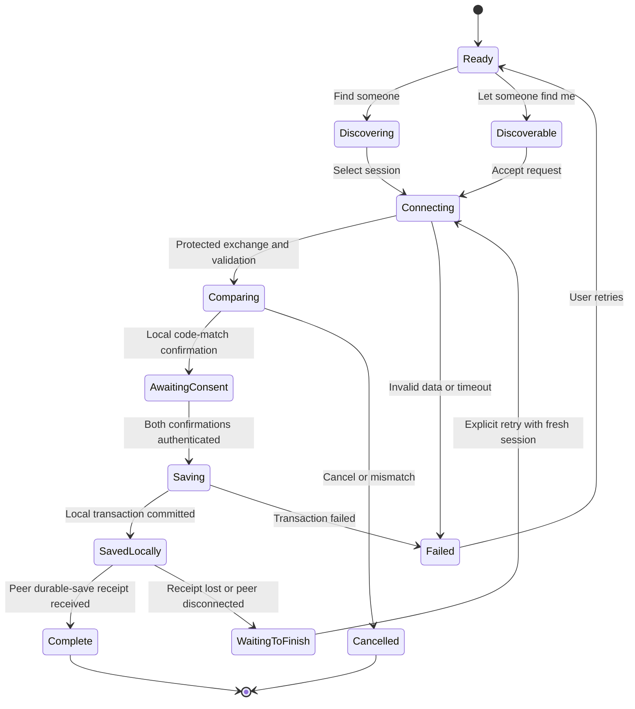

# PRD: Add nearby contacts offline

| Field | Value |
| --- | --- |
| Product | Mknoon |
| Feature | Add nearby |
| Version / date | 1.1 / 2026-09-11 |
| Status | Proposed requirements; implementation and device validation have not started |
| Implementation roadmap | [ROADMAP.md](ROADMAP.md) |
| Source baseline | Inspected working tree based on `f1761aa17e782283f734200f969a9622f3f837ce`, including existing local changes |

## 1. Product outcome

Two people with existing Mknoon identities can open **Add nearby**, confirm each other, and save each other's identity and complete public-key information without internet access. Bluetooth Low Energy (BLE) carries the entire friend-add exchange directly between their phones: discovery, handshake, required contact/profile and routing information, public keys, consent, save receipts, and any retry/recovery exchange. Local cryptography and persistence stay on the device. The BLE module makes no internet, relay, DNS/HTTP, or local Wi-Fi requests and queues no online step to finish adding the friend.

The intended combinations are Android–Android, Android–iPhone, and iPhone–iPhone on compatible devices. This is a capability-based feature, not a promise that every handset or operating condition supports it. Android and iOS expose the necessary BLE roles and data-transfer APIs; their interoperability in Mknoon remains work to implement and verify. See [Android BLE](https://developer.android.com/develop/connectivity/bluetooth/ble/ble-overview) and [Apple's two-device BLE example](https://developer.apple.com/documentation/corebluetooth/transferring-data-between-bluetooth-low-energy-devices).

The feature completes contact onboarding while both phones remain offline. It does not introduce Bluetooth chat, calls, media transfer, or mesh networking. Subsequent use of those separate features follows Mknoon's existing transports; none is a prerequisite, deferred completion stage, or acknowledgement channel for BLE friend addition.

**Module boundary:** Add nearby is an independent friend-add module. Normal QR generation, scanning, parsing, verification, user flow, and contact-request behavior remain unchanged. Both entry methods operate on the same existing contact records and respect the same identity, duplicate, block, and key-continuity rules. The BLE module owns its own transport, consent, retry state, and pairing receipts; it does not create a second friends list or retrofit the QR workflow.

## 2. Problem and current foundation

People meeting in person should be able to establish their Mknoon connection even when neither has mobile data or access to Wi-Fi. Exchanging a display name or incomplete identity card is insufficient: both devices need the public keys used by the existing encrypted communication system.

The current code provides useful pieces, but they need deliberate integration:

| Current source evidence | Consequence for this feature |
| --- | --- |
| [QR construction](../../lib/features/qr_code/application/build_qr_payload_use_case.dart#L54) deliberately omits the ML-KEM public key. | Reusing the existing QR payload alone cannot fulfill complete offline key exchange. |
| [Contact request construction](../../lib/features/contact_request/application/send_contact_request_use_case.dart#L159) signs identity, username, rendezvous information, and the ML-KEM key when available. Its [entry path](../../lib/features/contact_request/application/send_contact_request_use_case.dart#L104) requires the P2P node to be running. | Use the contact-field contract as reference and available pure crypto primitives as-is. Build the BLE bundle in its own module; do not refactor or call this network workflow to implement BLE pairing. |
| [Accept and reciprocate](../../lib/features/contact_request/application/accept_and_reciprocate_use_case.dart#L36) adds the contact, then starts profile download and a reciprocal contact request. | BLE must not invoke this use case. Its local commit and reciprocal information/receipts are handled entirely by the BLE module. |
| [Incoming v2 requests](../../lib/features/contact_request/application/handle_incoming_message_use_case.dart#L554) can qualify for automatic contact addition. | BLE packets must not enter this listener/automatic-add workflow, either before or after nearby consent. |
| [Existing key updates](../../lib/features/contact_request/application/handle_incoming_message_use_case.dart#L471) guard against ML-KEM rollback. | Nearby must preserve key continuity and cannot become an alternate silent key-replacement path. |
| [Existing retry selection](../../lib/features/contact_request/application/retry_incomplete_key_exchanges_use_case.dart#L65) includes pending key re-announcements and wake-capability distribution even for contacts whose ML-KEM key is complete. | Nearby success must not clear those independent obligations or treat its receipt as proof of capability distribution. |
| [Contact safety numbers](../../lib/features/contacts/domain/models/contact_safety_number.dart) describe an account's keys and optionally its device roster. | A new pairing-session comparison code must bind both participants and the current handshake; simply displaying each person's individual safety number is insufficient. |

These are source observations, not proof that nearby exchange is implemented. Existing [mutual contact tests](../../test/features/contact_request/integration/contact_request_one_scan_mutual_test.dart#L150) assert one row per side and no reciprocal loop through a fake network; they do not test BLE or a real cryptographic handshake.

## 3. Scope and priorities

| Priority | Included |
| --- | --- |
| P0 | Foreground BLE discovery, connection, authenticated exchange, explicit comparison and consent, complete public-key storage, recovery, and all three phone combinations subject to capabilities. |
| P0 | Bluetooth capability/permission guidance; blocked and existing-contact handling; accessible English, German, and Arabic UI. |
| P0 | Independent BLE module and entry route, using the common contact store and atomic duplicate/key checks across BLE and QR. |
| P0 | An optional explicit exit to the existing QR flow, with its existing completion semantics explained before switching. |
| P1, later | Fully offline mutual QR exchange, if desired, including the full key bundle and reciprocal confirmation. This is additional protocol/UI work. |
| Later | NFC initiation for supported phone combinations, reusing the same verified exchange and acceptance rules. |

V1 excludes automatic addition merely because phones are close, background discovery, exact-distance or touch detection, OS address-book access, identity creation/restoration, account migration, linked-device enrollment, and bulk contact sharing. It does not require Bluetooth pairing through system settings.

**QR alternative boundary:** the existing QR screen remains available when BLE is denied or unsupported. “Use QR instead” is an explicit user choice to leave BLE and start the existing separate flow. End the BLE session first; preserve any already committed contact, but pass no BLE transcript, incomplete bundle, or consent into the QR scanner. Explain the existing QR connectivity limits on the BLE exit screen without changing QR itself. Never use QR, a relay, or internet as an automatic fallback or completion step inside a BLE operation.

### Module ownership and common contact checks

The BLE module owns its screens, versioned bundle, native adapters, protected exchange, consent state, receipt/recovery records, and feature flag. The parent app may expose Scan QR and Add nearby as separate choices. QR does not import BLE services or wait for their initialization, permissions, radio state, or feature flag. Bluetooth denial, unavailable hardware, disabled BLE, and handled BLE initialization/connection errors must leave normal QR scanning operable.

Reuse the existing local identity store, vetted crypto primitives, and common contact repository through narrow interfaces. Do not fork the friends database. Any necessary shared persistence extension must be backwards-compatible and leave existing QR/contact-request signatures and behavior intact. BLE-specific verification and pending-operation state belong to module-owned records associated with the canonical contact.

Check duplicates by the local account plus the remote canonical peer identity, never by username, Bluetooth address, or temporary label. Cover QR-first/BLE-second, BLE-first/QR-second, repeated attempts, and concurrent ordinary QR/contact-request writes. Re-read contact/block/key state and enforce uniqueness inside the transaction: a preflight `contactExists` check alone is insufficient. Identical keys reuse the contact; missing keys may be filled only after verified consent; conflicting keys stop the BLE operation under the existing authority rules. Preserve aliases, archive/block state, and history.

## 4. User journey

1. Open the existing add-contact area and choose **Add nearby**. Explain: “Add someone beside you using Bluetooth. Keep both apps open.”
2. Choose **Find someone** or **Let someone find me**. One phone discovers; the other becomes discoverable. Both will exchange their information over the resulting connection. If a device cannot become discoverable, guide its user to Find someone and have the other phone take the discoverable role.
3. Request only the necessary OS permissions. Show Bluetooth-off, permission-denied, restricted, and unsupported states separately. Do not repeatedly prompt after denial.
4. The discoverable phone shows a temporary label, such as `Nearby K7M2`. The finding phone lists matching nearby sessions, and its user selects that label. The discoverable user accepts the connection request before identity information is released. The label is a convenience, not proof of identity.
5. Establish the protected session, exchange and validate complete contact bundles, and display the peer's signed username and the same six-digit comparison code on both screens. Names are self-asserted; the people compare the code face to face.
6. Each person chooses **Codes match — Add contact**, or cancels. One person's confirmation cannot substitute for the other's.
7. Each device stores the agreed contact locally and exchanges a receipt. Show **Contact added** only when local storage and the peer's durable-storage receipt are both established. Provide **Open conversation**, while reflecting the existing connection/send state accurately.

If both users choose Find someone, guide one to Let someone find me. If both choose Let someone find me, guide one to Find someone. V1 uses these explicit choices to avoid depending on simultaneous scanning/advertising and connection-election behavior across devices.

## 5. Functional requirements

| ID | Requirement |
| --- | --- |
| NC-01 | Finish and recover the complete friend-add exchange over BLE with both phones disconnected from WAN and Wi-Fi and local identities already available. All inter-phone pairing data, consent, acknowledgements, and retries use BLE. The module must perform no internet/relay/DNS/HTTP/local-Wi-Fi calls, start no P2P node, and enqueue no online completion work, even when internet happens to be available. |
| NC-02 | Support the three phone combinations through one versioned protocol. Detect scan, advertise, and connection capabilities at runtime. Retain the current project platform floors unless a separately justified product decision changes them. |
| NC-03 | Start discovery/advertising only through Add nearby and only in the foreground. Permit one active pairing session per app instance. Stop on exit, cancellation, lock/background, timeout, or Bluetooth loss. |
| NC-04 | Advertise only the app service identifier and a short-lived anonymous label where supported. Do not advertise usernames, account peer IDs, public keys, push tokens, device rosters, or stable app-level tracking identifiers. |
| NC-05 | Let users select a session and accept the request before disclosing identity information. Never select or approve a contact solely from signal strength, a Bluetooth address, a device name, or the temporary label. |
| NC-06 | Establish an encrypted session with a reviewed authentication and comparison-code protocol. Bind identities, ephemeral material, both fresh challenges, roles, protocol version, and capability negotiation to the authenticated transcript. Reject downgrade and replay. |
| NC-07 | Require each participant's explicit code-match confirmation. Exchange authenticated consent messages bound to the exact session and key fingerprints. Discovery, connection, or OS permission approval is not contact consent. |
| NC-08 | Transfer, validate, and durably store both identity and ML-KEM public keys. If required keys are missing or invalid, fail with an actionable setup error; do not report partial keys as success or silently rotate identity material. |
| NC-09 | Make local acceptance atomic across the common contact change, BLE pairing state, and verification evidence. Enforce uniqueness and current block/key policy in that transaction, including concurrent QR/contact-request writes. Emit a BLE storage receipt only after commit. Repeated frames, receipts, retries, taps, or cross-method addition must not create duplicate contacts. |
| NC-10 | Distinguish local save from confirmed mutual save. Support retry after a lost receipt or interruption without deleting an already committed contact or claiming that the remote device saved it. |
| NC-11 | Reject self-addition. Preserve block state, aliases, archive state, conversation history, and existing key authority. A blocked peer requires the existing explicit unblock flow. A previously declined peer requires a fresh deliberate local decision; nearby must not silently resurrect it. |
| NC-12 | For an existing contact with identical keys, return an idempotent already-added/finish-pairing result. For missing keys, allow a verified fill. For changed keys or conflicting identity/routing authority, stop the new-contact flow and use the established key-change resolution path. |
| NC-13 | Keep comparison evidence in BLE-owned records bound to specific local and remote key fingerprints. Derive its current validity from the existing contact/roster state when used, so later accepted key changes invalidate the claim without adding BLE hooks to QR. Do not set a permanent blanket verified flag. |
| NC-14 | Send every field required to finish adding the friend inside the BLE exchange. Use the transferred username and a local placeholder for an absent avatar; do not fetch profile data or distribute capabilities online as part of pairing. Preserve pre-existing independent key/wake obligations without creating, clearing, or awaiting them merely because BLE pairing completed. |
| NC-15 | Handle denial, cancellation, mismatch, malformed/oversized data, incompatible versions, storage failure, connection loss, app termination, and radio changes with clear states and bounded retries. |
| NC-16 | Offer QR only as an explicit exit to the existing independent route. Explain its offline limits before leaving BLE. Keep QR generation, scanning, parsing, verification, introduction, and normal contact-request behavior unchanged; never pass BLE state into those flows. |
| NC-17 | Support screen readers, large text, reduced motion, and RTL layouts. Keep comparison digits readable and consistently grouped on both devices. Errors identify a next action without exposing technical protocol details. |
| NC-18 | Ship behind a local build/configuration feature flag that works without remote configuration. Collect only bounded, redacted diagnostics and stage activation using the roadmap's evidence gates. |
| NC-19 | Implement Add nearby as a separate module with its own protocol/coordinator, native adapters, lifecycle, and pairing records. Neither the QR module nor its normal contact-request path may depend on BLE initialization, permissions, runtime state, or feature enablement. |
| NC-20 | Share the existing contacts and identity authority rather than maintaining BLE-specific friend records. Provide atomic deduplication and safe existing-contact handling across both entry methods and concurrent writes, with no QR workflow refactor as a dependency. |

### Platform requirements

Android 12+ needs the applicable Nearby devices permissions for scanning, connecting, and advertising. Earlier supported Android versions need the applicable legacy Bluetooth/location requirements for scanning. Request the minimum for the selected role, handle location-service dependencies where applicable, and do not collect location. A denied permission must leave QR usable. See [Android permission requirements](https://developer.android.com/develop/connectivity/bluetooth/bt-permissions).

An Android device may support BLE scanning without supporting advertising. Capability checks and role switching are mandatory; two devices that cannot advertise need fallback. See [Android advertising availability](https://developer.android.com/reference/android/bluetooth/BluetoothAdapter#getBluetoothLeAdvertiser()).

On iOS, provide the Bluetooth usage description, handle the Core Bluetooth authorization and powered-on states, and keep the initial feature foreground-only. Use supported service UUID/local-name advertisements; do not depend on arbitrary manufacturer/service-data advertising through Core Bluetooth. Keep identity payloads in the connected channel. See [Apple peripheral advertising guidance](https://developer.apple.com/library/archive/documentation/NetworkingInternetWeb/Conceptual/CoreBluetooth_concepts/BestPracticesForSettingUpYourIOSDeviceAsAPeripheral/BestPracticesForSettingUpYourIOSDeviceAsAPeripheral.html).

The inspected project currently sets Android `minSdk = 24` and iOS deployment target `15.0` in [Android build configuration](../../android/app/build.gradle.kts#L268) and [Podfile](../../ios/Podfile#L1). Unavailable older devices are covered through applicable native/host tests and availability checks; they are not mandatory hardware purchases.

## 6. Data and security contract

| Data | Rule |
| --- | --- |
| Account peer ID and identity public key | Required; verify the signature and that the public key derives/binds to the claimed account identity. A valid signature alone is not a trusted display name. |
| ML-KEM public key and existing key-version metadata | Required for completed onboarding; signed/bound to the same identity and session. Preserve current anti-rollback rules. |
| Username and supported rendezvous/routing information | Transfer all locally available fields required by the current contact model over BLE. Validate size/type; no URL, server lookup, or online follow-up may supply missing required data. If required local data is unavailable, fail locally with a setup error. |
| Session version, suite/capabilities, roles, fresh challenges, and ephemeral public material | Required by the reviewed protocol; bind negotiation and both participants. Do not trust fields merely because they arrived over BLE. |
| Signature, consent, durable-save receipts | Bound to both parties, operation/session identifiers, and the exact accepted bundle fingerprints. A Bluetooth write completion is not a durable-save receipt. |
| Private keys, recovery phrase, database secrets, existing chat/session secrets | Never transferred. Ephemeral secrets are transient and cleared when the session ends. |
| Push/wake capabilities, avatars, account migration bundles, linked-device credentials | Not required for v1 friend addition and excluded from its bundle; use initials for the absent avatar. The BLE module performs no fetch/registration/distribution job for these fields and does not confer linked-device trust. Existing unrelated app services retain their own behavior. If a future revision makes extra contact data part of this exchange, it must transfer that data over BLE rather than add an internet dependency. |

Use existing vetted cryptographic primitives and a reviewed authenticated handshake/SAS construction; define the exact suite and canonical wire format in milestone R0 before implementation. A homegrown six-digit hash of freely chosen public fields is not an acceptable substitute. The design must address active substitution, reflection, transcript manipulation, and attempts to grind matching short codes, including commitment ordering where required by the chosen protocol.

Exchanging an ML-KEM public key does not by itself establish post-quantum confidentiality for the pairing channel. Document the chosen handshake's actual guarantees and preserve the existing messaging cryptography. Do not add stronger marketing claims than the reviewed protocol supports.

Before final contact consent, a selected and accepted connection may already have received the minimal identity bundle. Cancellation prevents a contact write; it cannot retract public information already disclosed to that participant. Passive advertisements must remain anonymous at the application level. V1 does not claim resistance to all radio tracking or prove physical distance.

Use fresh challenges and local monotonic session deadlines for new-session replay protection. Offline operation must not depend on obtaining trusted time from a server. Existing key-change timestamp/ordering rules remain authoritative; a clock conflict must not force acceptance of a changed key.

## 7. Completion and interruption semantics

| Observed state | Product behavior |
| --- | --- |
| Either confirmation is missing | No contact/key change from this session. Show waiting, cancel, or retry. |
| Both confirmed, local transaction not committed | Never show added; preserve retry context only as specified by the protocol. |
| Local commit succeeded, peer receipt absent | Show “Saved on this phone. Finish connecting with the other person.” Persist the pending status. |
| Local commit and authenticated peer durable receipt established | Show “Contact added.” Both key bundles are locally available. |
| Process ends before local commit | Clear transient material. Reopen with a fresh session and compare again. |
| Process ends after local commit | Keep the contact and receipt state. A fresh authenticated session can finish acknowledgement without duplicate rows. |

There is no atomic transaction spanning two disconnected phones. One may commit while the other crashes or loses a receipt. The implementation must provide truthful local state and idempotent recovery, not promise simultaneous all-or-nothing storage. A retry must not restore cancelled consent for different keys or a different participant.

Foreground interruption ends active discovery/transfer and clears ephemeral secrets; durable progress remains. Permission sheets before a session and brief OS transitions need explicit lifecycle handling so they do not accidentally report success or restart advertising. Returning to the app requires the user to continue/retry. No background mode or Live Activity is required for v1; [Apple documents distinct background behavior](https://developer.apple.com/library/archive/documentation/NetworkingInternetWeb/Conceptual/CoreBluetooth_concepts/CoreBluetoothBackgroundProcessingForIOSApps/PerformingTasksWhileYourAppIsInTheBackground.html).

## 8. Quality targets and diagnostics

These are proposed acceptance targets, not measurements. R0 must measure feasibility and document any revisions before implementation acceptance.

| Measure | Initial target and definition |
| --- | --- |
| Discovery | p95 at most 10 seconds from compatible scan + advertising readiness to listing the intended peer, with phones 0.5–2 m apart. |
| Machine exchange time | p95 at most 10 seconds for handshake, bundle transfer, consent-message delivery, storage, and receipts combined; exclude time waiting for human decisions or OS permission prompts. |
| Supported-pair success | At least 19 of 20 controlled attempts per executable pair/role configuration reach mutual completion without a manual retry. Report failures and sample size; this is a smoke qualification, not a population reliability estimate. |
| Integrity | Zero wrong-peer acceptance, unauthorized key replacement, duplicate contact rows, or false-complete states in the adversarial/failure campaign. |
| Resource limits | Proposed ceilings: 16 KiB per contact bundle, 128 KiB cumulative session input, one active peer, 60 seconds discovery, 120 seconds user comparison, 5 minutes total session. Bound allocations before decoding. |
| Cleanup | Stop feature-owned scan/advertising and close connections promptly on termination; native tests verify cancellation even when callbacks arrive late. |

Chunking, flow control, and bounded retransmission must work at the minimum supported characteristic payload as well as larger negotiated sizes. Never assume the entire key bundle fits in an advertisement or one GATT write. At most one automatic reconnection is attempted within a live session; further attempts require a deliberate retry and fresh authentication as specified in R0.

Diagnostics record stage, duration, coarse byte counts, role/platform capability, result, and a bounded reason code. Exclude usernames, peer IDs (including prefixes), Bluetooth addresses, temporary labels, comparison codes, keys, full transcripts, and packet contents. Any synthetic raw QA evidence belongs in ignored run artifacts. Do not introduce remote analytics or require internet to record local outcomes.

## 9. Acceptance criteria

| ID | Required observation | Requirements |
| --- | --- | --- |
| AC-01 | With WAN/Wi-Fi unavailable and feature-owned network operations forbidden, both peers receive all required contact data, save complete valid keys, and exchange mutual-save receipts over BLE. Restart and finish a partial operation over BLE while still offline. Exercise every available applicable pair/role configuration. | NC-01, NC-02, NC-08, NC-09, NC-14 |
| AC-02 | No matching-code confirmation on either side, mismatch, or cancellation produces no new local contact/key write before commit. Discovery alone never adds a contact. | NC-05–NC-07 |
| AC-03 | Tampered bundles, invalid signatures, wrong peer/key binding, stale-session traffic, role reflection, unsupported versions, downgrade, and malformed/oversized frames are rejected. | NC-06, NC-08, NC-15 |
| AC-04 | Kill/disconnect before and after each consent, transaction, and receipt boundary. Reopen offline and observe truthful state and one row per peer after recovery. | NC-09, NC-10, NC-15 |
| AC-05 | Self, blocked, previously declined, already-added, missing-key, and conflicting-key cases follow their defined policy. Aliases, history, block/archive state, and newer keys survive. | NC-11–NC-13 |
| AC-06 | Bluetooth off, permission denied/permanently denied/restricted, unavailable advertising, both users choosing the same role, and multiple nearby sessions produce an actionable UI and no unintended identity disclosure. | NC-02–NC-05, NC-15 |
| AC-07 | Background/lock, back navigation, timeout, Bluetooth off mid-transfer, repeated entry, and late callbacks leave no continuing feature-owned discovery or unintended contact write. | NC-03, NC-15 |
| AC-08 | Existing QR and normal one-scan mutual addition preserve behavior. Choosing QR explicitly exits BLE without carrying its protocol/consent state. BLE neither queues online completion jobs nor alters pre-existing independent profile/key/wake work. | NC-14, NC-16 |
| AC-09 | Compare keys, restart, change a bound fingerprint through an existing accepted update path, and verify that any current-key comparison claim becomes invalid. | NC-13 |
| AC-10 | English/German/Arabic, RTL, large text, screen readers, progress, errors, and offline conversation entry remain understandable and operable. | NC-17 |
| AC-11 | Measure the quality targets, inspect redacted logs, test flag-off rollback, and bind rollout evidence to the tested source/configuration/artifact. | NC-18 |
| AC-12 | With BLE disabled, uninitialized, denied permissions, unsupported, or in a handled error state, normal QR generation/scanning/verification/addition behaves as before and requests no Bluetooth permission. Dependency checks confirm the QR workflow imports no BLE coordinator/protocol types. | NC-16, NC-19 |
| AC-13 | Add the same identity QR→BLE, BLE→QR, repeatedly, and through concurrent writes. Observe exactly one canonical contact, preserved aliases/history/block/archive state, verified missing-key fill, and safe conflict rejection. Neither method creates a parallel friend record. | NC-09, NC-11, NC-12, NC-20 |
| AC-14 | With internet available as well as unavailable, deny/spy on every BLE-module network boundary and assert zero internet/relay/local-Wi-Fi calls and zero queued online completion jobs. Record that all protocol messages and retries use BLE; network failure cannot trigger an automatic QR switch. | NC-01, NC-14, NC-16, NC-19 |

Use synthetic accounts and an automated harness for setup, permissions, navigation, actions, and assertions. An emulator/fake-channel pass does not certify physical-radio behavior. The [roadmap's live matrix](ROADMAP.md#5-device-proof-matrix) defines currently available targets and distinguishes host, simulated, native, radio, and signed-artifact evidence.

Unavailable models, API bands, or a missing second physical Android phone are **N/A (target unavailable by project policy)**. They do not block plan closure. Preserve applicable code branches with deterministic tests and report the exact hardware scope that was actually exercised. Failures on an available applicable target remain failures.

## 10. Decisions and remaining implementation questions

The working product decisions are an independent BLE friend-add module, the entire exchange and recovery over BLE with zero online completion work, unchanged normal QR behavior, one shared canonical contact store with atomic cross-method duplicate checks, foreground-only operation, two explicit discovery roles, comparison and consent on both phones, and full ML-KEM exchange. Existing QR is an optional separate user choice. NFC and a new fully offline QR protocol are later work.

R0 resolves the exact reviewed handshake/SAS suite, canonical encoding, UUID/characteristic layout, frame limits, and native adapter approach through a small interoperability prototype. R2/R3 settle storage integration and idempotent completion using the existing repository boundaries. These are implementation decisions to record, not missing user input that prevents writing or beginning the roadmap.

The main risks are role availability, native callback/lifecycle differences, insecure short-code construction, consent bypass through existing automatic acceptance, incomplete distributed completion, and shared key-state regressions. Each has a corresponding milestone exit test in [ROADMAP.md](ROADMAP.md).
