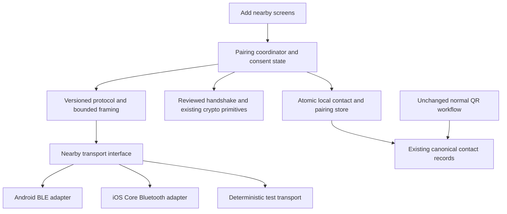

# Implementation roadmap: Add nearby contacts offline

| Field | Value |
| --- | --- |
| Requirements | [PRD.md](PRD.md) |
| Date / status | 2026-09-11 / Proposed implementation sequence; no feature code or device proof completed |
| Scope | Independent foreground friend-add module; complete exchange/recovery over BLE, shared canonical contacts and duplicate checks, unchanged normal QR workflow |
| Baseline | Inspected working tree at `f1761aa17e782283f734200f969a9622f3f837ce` plus pre-existing local edits; re-resolve the actual implementation baseline |

## 1. Delivery strategy

Deliver one independent BLE friend-add module with Android and iOS transport adapters. All pairing communication, required contact data, consent, receipts, and recovery use BLE. The module must make zero internet/relay/DNS/HTTP/local-Wi-Fi requests and enqueue no online completion work, whether or not internet is available. Local identity access, cryptography, and durable storage remain local operations.

Normal QR generation, scanning, parsing, verification, and contact-request behavior stay unchanged. Do not refactor the QR workflow, route BLE through its parser/listener/accept-and-reciprocate use cases, or make it depend on BLE initialization. Both entry routes use the existing canonical contacts and identity authority. The permitted shared integration is a narrow, backwards-compatible local persistence/validation boundary with atomic duplicate, block, and key checks.

Start with a small real-platform prototype, then implement the protocol, adapters, persistence, and product flow. Put the independent new entry point behind a local feature flag until the available-device evidence and affected regression gates pass. A user may explicitly exit BLE and open the existing QR route; this is not a transport fallback within pairing.

This document is a roadmap, not an instruction to run an implementation orchestrator or divide work into agent sessions. New module/test names below are proposed; existing linked paths are inspected integration points. Executable check selection remains owned by [selection.json](../../tool/testing/selection.json), not by this document.

## 2. Architecture and integration boundaries



| Responsibility | Existing anchor | Planned change |
| --- | --- | --- |
| Contact payload and signing | [send_contact_request_use_case.dart](../../lib/features/contact_request/application/send_contact_request_use_case.dart#L159) | Treat the contact-field/signature contract as reference. Build the versioned BLE bundle in its own module using existing pure crypto APIs as-is; do not extract/refactor or call the normal network-send workflow. |
| Incoming verification and key continuity | [handle_incoming_message_use_case.dart](../../lib/features/contact_request/application/handle_incoming_message_use_case.dart#L346) | Preserve the same identity/key authority through local BLE validation and shared pure interfaces where available. Keep this listener/automatic-add workflow unchanged and never feed it BLE packets. |
| Persistence | [accept_contact_request_use_case.dart](../../lib/features/contact_request/application/accept_contact_request_use_case.dart), [ContactRepository](../../lib/features/contacts/domain/repositories/contact_repository.dart), [ContactModel](../../lib/features/contacts/domain/models/contact_model.dart) | Add a transactional nearby operation/receipt store. Current contact and request-status writes are separate awaited operations; do not assume they already form the required transaction. |
| Network side effects | [accept_and_reciprocate_use_case.dart](../../lib/features/contact_request/application/accept_and_reciprocate_use_case.dart#L36) | Exclude this use case from BLE composition. Required reciprocal information and save receipts travel over BLE; no profile fetch, network retry, or deferred online completion stage is introduced. |
| Key comparison | [ContactSafetyNumber](../../lib/features/contacts/domain/models/contact_safety_number.dart) | Add a session-bound SAS through the reviewed protocol and fingerprint-scoped comparison evidence. Preserve existing profile safety-number semantics. |
| Independent entry routes | [qr_scanner_wired.dart](../../lib/features/qr_code/presentation/screens/qr_scanner_wired.dart), [qr_display_screen.dart](../../lib/features/qr_code/presentation/screens/qr_display_screen.dart) | These are preservation anchors, not BLE integration/edit points. Add a separate app-level Add nearby route alongside Scan QR. An optional navigation callback exits BLE and opens QR without importing its parser or passing pairing state. |
| Dart/native registration | [GoBridgeClient](../../lib/core/bridge/go_bridge_client.dart#L27), [MainActivity](../../android/app/src/main/kotlin/com/mknoon/app/MainActivity.kt#L77), [AppDelegate](../../ios/Runner/AppDelegate.swift#L1111) | Follow existing method/event-channel conventions. Prefer a dedicated nearby channel/adapter so radio lifecycle does not become part of relay/P2P startup. |
| Permissions and build | [AndroidManifest.xml](../../android/app/src/main/AndroidManifest.xml), [Info.plist](../../ios/Runner/Info.plist), [pubspec.yaml](../../pubspec.yaml) | Add only required permissions/descriptions and an optional hardware declaration. Evaluate any package dependency in R0; do not assume a central-only Flutter BLE package also supports peripheral mode. |
| Regression selection | [TESTING.md](../testing/TESTING.md), [selection.json](../../tool/testing/selection.json) | Register new feature/native/protocol tests and affected mappings, including shared consumers. Keep existing mandatory release membership. |

Proposed feature home: `lib/features/nearby_contacts/` with domain protocol/state types, application coordinator, data adapters/repositories, and presentation screens. Proposed native adapters: `android/app/src/main/kotlin/com/mknoon/app/nearby/` and `ios/Runner/Nearby/`. If new crypto operations are needed, put primitive operations in the existing native Go crypto/bridge boundary rather than implementing competing cryptography in Kotlin, Swift, and Dart.

**Dependency contract:** QR must not import BLE feature types. BLE must not call QR generation/scanning/parsing, normal network contact-request orchestration, or online profile/capability services. Allow existing local identity/crypto APIs, a narrow transaction port into the common contact store, BLE-owned sidecar pairing records, and parent-app navigation. Initialize the BLE runtime lazily when its own flow is opened. Any necessary shared persistence extension must preserve existing callers and be proven with QR regression and concurrent-write tests; it is not a reason to redesign the QR flow.

## 3. Milestones and dependencies

| Milestone | Result | Dependencies | Indicative engineering effort |
| --- | --- | --- | --- |
| R0 | Capability prototype and reviewed protocol contract | None | 4–6 person-days |
| R1 | Deterministic pairing protocol and real crypto boundary | R0 | 7–10 person-days |
| R2 | Android and iOS native BLE adapters | R0; integrate with R1 | 8–12 person-days |
| R3 | Durable contact acceptance and recovery | R1 | 5–8 person-days |
| R4 | Complete foreground product flow and fallback | R1–R3 | 5–8 person-days |
| R5 | Available-device qualification and staged activation | R4 | 5–8 person-days |

Planning range: **34–52 person-days**, roughly 7–11 engineering weeks for one engineer, excluding external review/distribution scheduling. These are estimates; recalibrate after R0. R1 and the R2 adapter work have independent portions after their contract is fixed. No particular staffing or calendar date is assumed.

### R0 — Verify the transport and define the protocol

**Work**

- Re-resolve the live device matrix and platform floors. Probe scan, advertise, connect, notify, write, MTU/payload, and cancellation capability rather than treating the presence of Bluetooth as proof of every role.
- Build a disposable debug-only exchange using synthetic bounded data through Android GATT and Core Bluetooth. Exercise both roles on each available native platform and the executable physical pairings in section 5.
- Check whether the current Android emulator provides a usable BLE test path. Separate its virtual controller from an actual link to a physical phone; do not assume a host-radio bridge exists.
- Choose dedicated native adapters or a demonstrably suitable maintained package. Require both central/peripheral roles, controllable lifecycle, Android/iOS support at the project floors, test injection, and no embedded network service dependency. Record the choice and dependency/license implications if adding a package.
- Define the versioned service/characteristics, canonical encoding, bounds, fragmentation, ordering, duplicate handling, flow control, timeouts, and explicit protocol errors. Fix machine/human time measurement points.
- Specify and review the authenticated key agreement and six-digit SAS construction, including transcript binding, challenge freshness, downgrade prevention, reflection, commitment ordering, rate limits, and active code-grinding resistance. Produce cross-language/bridge vectors; do not implement an ad hoc short-code hash.
- Verify that the production local identity and crypto bridge are usable with the network node stopped. Define the exact missing-key/setup error instead of starting networking or silently rotating keys.
- Freeze the independent module/import boundary and the complete list of locally sourced fields needed for friend addition. Every required field and every recovery/receipt message must travel over BLE. Use an absent-avatar placeholder; do not design a URL fetch or a queued online task to complete the bundle.

**Exit evidence**

Capability results identify real versus simulated boundaries and supported roles. The protocol contract fixes all security-critical fields and consent/commit semantics. A trace through the prototype demonstrates data in both directions without WAN/Wi-Fi where the radio path is available. Network-boundary spies also fail on any attempted network request when connectivity is available. The module boundary requires no QR workflow refactor. Revisions to PRD quality targets are explicit. No prototype discovery action can add a real contact.

**Requirements:** NC-01–NC-08, NC-14, NC-19, NC-20; prepares AC-01–AC-03, AC-06, AC-12–AC-14.

### R1 — Implement a deterministic protocol core

**Work**

- Add the nearby transport interface and immutable states/events under `lib/features/nearby_contacts/`; inject clock, randomness, transport, crypto, and persistence ports for exact failure control.
- Implement version/capability negotiation, the reviewed protected handshake, bounded bundle codec, key/peer binding, session code, authenticated consent, and durable-save receipt messages.
- Transport only complete identity/ML-KEM bundles. Treat unsupported versions, missing keys, invalid lengths, signature errors, stale/reordered messages, and conflicting transcript information as explicit failures.
- Keep framing reliable at a 20-byte characteristic payload as well as larger effective sizes; obey native backpressure. Cap memory, input bytes, active peers, and retries before parsing untrusted allocations.
- Add real crypto tests through the chosen native Go/bridge primitive boundary, plus deterministic fake-transport tests. Inject network operations that fail the test if the nearby core attempts to invoke them.
- Add a dependency contract that excludes QR parsers/generators, normal contact-request send/reciprocal orchestration, and network clients from the BLE core. Verify that retries and missing receipts remain BLE-only and do not schedule an online job.

**Proposed tests**

`nearby_pairing_protocol_test.dart`, `nearby_bundle_codec_test.dart`, `nearby_pairing_consent_test.dart`, `nearby_transport_framing_test.dart`, and real crypto vectors in the selected crypto module. Cover two simultaneous incoming attempts, repeated local confirmation, stale callbacks from a prior session, modified negotiation, identity substitution, invalid ML-KEM data, replay, reflection, and all timeout boundaries.

**Exit evidence**

Two independent protocol instances finish the happy path; adversarial and boundary cases cannot cause unauthorized writes or false success. Real signature/handshake vectors pass independently of mocks. No state treats GATT delivery as remote persistence. Review the implementation against the R0 contract before binding production storage.

**Requirements:** NC-01, NC-04–NC-10, NC-14, NC-15, NC-19; AC-02–AC-04, AC-12, AC-14.

### R2 — Implement native Android and iOS adapters

**Work**

- Implement Android scan/advertise and GATT client/server roles, applicable permission handling, write/notification queueing, effective payload sizing, service cleanup, disconnect, radio-state changes, and callback generation IDs.
- Implement Core Bluetooth central/peripheral managers, authorization/powered-state handling, service publication, supported advertisements, write/notification backpressure, unsubscribe, disconnect, and foreground cancellation.
- Expose typed capability and transport events through a dedicated Dart/native interface. Serialize native operations as required; reject callbacks belonging to a closed session.
- Register adapters with the existing engine lifecycle without changing the ownership of Go networking, calls, notifications, or account migration. Test repeated app entry and engine teardown.
- Make BLE initialization and permission requests lazy and scoped to Add nearby. A handled BLE adapter failure, unsupported role, disabled feature, or denied permission cannot become a prerequisite/failure for opening normal QR scanning.
- Add native fake-manager/controller tests for supported Android API branches and iOS availability/lifecycle handling. Keep the feature foreground-only; do not add background Bluetooth modes or location collection to make discovery seem more reliable.
- Evaluate dependency/build configuration impact and register native tests in the current runners and selection manifest.

**Exit evidence**

Each platform conforms to the same transport contract. Payloads larger than one characteristic value transfer exactly under backpressure and disconnect/retry. Denial, unsupported advertising, radio off, screen lock, background, and teardown close resources with no late cross-session effects. Real available-platform smoke tests supplement native fakes; neither substitutes for the other.

**Requirements:** NC-02–NC-05, NC-15, NC-18, NC-19; AC-01, AC-06, AC-07, AC-12.

### R3 — Make acceptance durable and recoverable

**Work**

- Introduce a transactional nearby persistence operation. One local transaction stores the accepted contact/key changes, pairing operation identity, comparison fingerprints, consent evidence needed for recovery, and a receipt-ready state. Store no ephemeral session secrets.
- Preserve the signature semantics expected by existing contact-model consumers. Store the nearby transcript/consent proof separately; do not put a signature over a different wire structure into a legacy contact-signature field.
- Use the existing contact records; only pairing/verification/recovery state is BLE-owned. Enforce uniqueness/idempotency for the local account and remote canonical peer inside the transaction, as well as operation/receipt identity. Re-read block/key state there so a QR/contact-request write between discovery and commit cannot bypass the checks. Define safe local staging cleanup and keep the operation account-scoped across logout, restore, and migration.
- Commit only after both authenticated confirmations apply to the exact bundles. Emit the durable-save receipt after the transaction returns successfully; receiving the peer receipt establishes mutual completion locally.
- Persist `saved locally / awaiting peer receipt` separately from completed pairing. A fresh explicitly confirmed nearby session can reconcile the same identities and fingerprints after restart without duplicating rows or retaining old ephemeral keys.
- Preserve aliases, archive/block state, history, and key continuity. Reject self and blocked peers. Require explicit reconsideration of declined requests. Do not overwrite a conflicting established key through the new-contact path.
- Scope comparison evidence to both key fingerprints and relevant roster state. Compute its current validity against the common contact state when read; do not add BLE invalidation hooks to normal QR or change its verification behavior.
- Finish the entire reciprocal friend-add operation and any pending-receipt recovery over BLE. Add no deferred profile fetch, capability distribution, network retry, or online completion marker. Required fields must already be received over BLE; an absent optional avatar uses a local placeholder.
- Leave pre-existing key re-announcement, notification wake-token, and call-wake-handle distribution state under its existing ownership. The [current retrier](../../lib/features/contact_request/application/retry_incomplete_key_exchanges_use_case.dart#L65) intentionally selects some contacts with complete ML-KEM keys. BLE must not call the retrier or create/clear its markers as a pairing stage. Test that existing independent work remains intact without being awaited by BLE completion.

**Proposed tests**

Real SQLite transaction/migration tests under `test/core/database/` where shared schema changes require them; `nearby_contact_acceptance_test.dart`, `nearby_contact_recovery_test.dart`, `nearby_contact_key_continuity_test.dart`, and `nearby_qr_contact_deduplication_test.dart`. Inject failure before/after each write and receipt, app restart at every boundary, duplicate sessions, local account changes, blocking during pairing, existing-contact fill versus conflict, and concurrent ordinary QR/contact-request writes. Exercise QR→BLE, BLE→QR, repeated attempts, and races with identical versus conflicting keys.

**Exit evidence**

Every failure boundary yields the PRD's truthful state. No partial local transaction, duplicate row, unauthorized key replacement, or false mutual-success badge survives restart. All cross-method sequences converge on one canonical contact with preserved history and user settings. Older database contents and already established contacts remain usable. No online job is created to complete the friend addition.

**Requirements:** NC-08–NC-14, NC-20; AC-04, AC-05, AC-08, AC-09, AC-13, AC-14.

### R4 — Integrate the product flow

**Work**

- Add the entry point, Find someone / Let someone find me choices, anonymous session list, request approval, peer preview, comparison, waiting, retry, partial-save, completed, and fallback screens.
- Wire the feature flag, active identity/setup and account-migration guards, app foreground lifecycle, coordinator, native transport, and local persistence. A disabled flag must prevent scan/advertise and incoming session admission.
- Bind Add contact to explicit code-match confirmation on both sides. Keep the full identity bundle off advertisements and expose meaningful retry/fallback guidance without Bluetooth implementation terminology in the normal product flow.
- Keep normal QR code/screens and contact-request behavior unchanged. Put any “Use QR instead” explanation in the BLE exit UI; explicitly end BLE before invoking a parent-app callback that opens the existing QR route. Transfer no BLE session, consent, or incomplete bundle into it, and do not switch automatically on failure.
- Add English/German/Arabic strings and verify RTL digit isolation, large text, accessibility labels, focus order, and progress/error announcements. Keep scan labels separate from claimed usernames and never rank signal strength as identity verification.
- On completed pairing, expose the normal contact/conversation surfaces. Let the existing transport state explain whether a message can currently be delivered; do not imply BLE messaging now exists.
- Add bounded, redacted stage/outcome diagnostics. Existing normal logs must not accidentally record newly introduced bundle, identifier, or code values.

**Proposed tests**

`nearby_contacts_screen_test.dart`, `nearby_contacts_wired_test.dart`, `nearby_qr_isolation_test.dart`, and a two-peer integration harness under `integration_test/` with an explicitly injectable transport. Test normal QR with BLE off/uninitialized/denied/unsupported/in a handled error state, zero Bluetooth prompts from QR, and explicit navigation without state leakage. The default harness uses the Android physical device plus Android emulator. It drives all permissions, setup, navigation, actions, and assertions; it must not require the user to tap through a second phone.

**Exit evidence**

Every PRD screen/state is reachable and actionable; comparisons require two decisions. The default automated topology proves integration and restart behavior at its declared transport boundary. Existing QR, contact, and introduction paths retain their exact preservation assertions, including when BLE is disabled or unavailable. No new permission prompt appears until the BLE feature is deliberately opened. Both friend addition and receipt recovery remain fully offline over BLE.

**Requirements:** NC-01–NC-05, NC-07, NC-10, NC-14–NC-20; AC-06–AC-14.

### R5 — Qualify and activate in stages

**Work**

- Run the acceptance matrix with synthetic identities, disabled WAN/Wi-Fi for offline legs, explicit target IDs, and recorded source/configuration. Require zero BLE-module internet/relay/local-Wi-Fi calls and zero queued online completion tasks; repeat with internet available to detect opportunistic network use.
- On executable real-radio pairs, test both selected discovery roles where supported, both exchange directions, full required contact/key bundle equality, code confirmation, durable storage, restart, and radio/foreground interruption. Finish partial receipts over BLE with internet still unavailable. Run QR isolation and cross-method duplicate cases separately as preservation evidence.
- Run the 20-attempt qualification per executable pair/role, with the declared distance/setup and separately measured human wait time. Preserve every initial failure; reruns are diagnostic evidence, not replacements for the original result.
- Run the affected manifest selection and justified wave/final gates in section 6. Resolve failures on available applicable targets and keep unrelated pre-existing failures visible with evidence.
- Start with flag-off production code and internal flag-on builds, then an available-device beta, then wider activation in a release candidate. Use local build/configuration control so offline use does not depend on fetching a remote flag.
- For release closure, bind evidence to the actual previous published revision and the exact candidate source, configuration, native artifacts, and signed app. Follow existing release checks without dropping mandatory membership.

**Exit evidence**

All applicable PRD acceptance cases and required selected checks have explicit results. Unavailable hardware legs use the project-policy N/A status, not a fabricated pass or a demand for more hardware. The release record states which physical pairings/roles were exercised and which guarantees are based on deterministic/native evidence. Required evidence for an available signed-candidate leg cannot be replaced by debug or host results.

**Requirements:** NC-01–NC-20; AC-01–AC-14.

## 4. Protocol and persistence decisions to freeze

Before completing R0/R1, record a concrete wire contract covering:

1. Discovery service UUID and supported characteristic directions; the short anonymous label's role and lifetime. Keep the iOS advertisement within supported service UUID/local-name fields.
2. Exact handshake suite, domain separation, canonical bytes, fresh challenges, ephemeral-secret handling, role binding, negotiation authentication, code generation, and adversarial-security rationale.
3. Required public-key bundle fields and validation bounds, including identity-to-peer binding and ML-KEM validation. Never accept a missing ML-KEM key as a fully added nearby contact.
4. Frame sequence/length bounds, MTU-independent chunking, acknowledgement meanings, queue/backpressure limits, and duplicate/retry semantics.
5. Authenticated consent and durable-save receipt format; receipt identity must refer to both participants and their exact agreed fingerprints.
6. Local database transaction and unique keys; pre-commit cancellation, post-commit pending status, safe retry/reconciliation, cleanup, and app/account lifecycle behavior.
7. Atomic duplicate/block/key checks against canonical contacts, cross-method races with unchanged QR/contact requests, linked-device authority, and BLE-only receipt recovery. No online completion work or QR workflow dependency may be added.

The contract must explicitly acknowledge that distributed atomic commit is unavailable across a broken link. A stored contact plus a missing remote receipt is a recoverable state, not proof of remote failure or permission to silently roll back a committed contact.

## 5. Device proof matrix

### Selected live targets observed on 2026-09-10

Discovery used `flutter devices --machine`, `adb devices -l`, `xcrun simctl list devices available --json`, and `xcrun xcdevice list`. The selected physical iPhones were reported available over USB by Xcode as well as by Flutter. This is an availability snapshot, not feature-test evidence.

| Role | Explicit target ID | Observed platform | Intended proof |
| --- | --- | --- | --- |
| Android physical | `21071FDF600CSC` | Pixel 6, Android 17 / API 37, USB | Android native/radio and default automated peer A |
| Android emulator | `emulator-5554` | Android 15 / API 35 | Default automated peer B; controlled integration and virtual BLE where demonstrated |
| iPhone A | `00008110-00184D622289801E` | iOS 26.5, USB | Separate Android/iOS parity and iOS radio/lifecycle proof |
| iPhone B | `00008030-001A6D2801BB802E` | iOS 26.5, USB | Separate iPhone/iPhone radio proof |
| Selected iOS simulator | `674DFFF6-5F38-4235-93F6-AF7FBF86AE65` | iPhone 17 Pro, iOS 26.5, available/shutdown | UI, lifecycle injection, and adapter contract tests; not assumed to expose a physical BLE radio |

The Android physical device and emulator both report `android.hardware.bluetooth_le`; this does not establish peripheral advertising or a shared physical-radio path. Current [Android emulator documentation](https://developer.android.com/studio/run/emulator-networking) lists virtual Bluetooth capabilities. R0 must probe this particular installed environment and record what it can actually demonstrate.

Re-run discovery at execution time. Pin every device command to the discovered ID, including Flutter `-d`, ADB `-s`, and Xcode `-destination id=...`. Store names/IDs and fixture details in ignored run evidence as needed; do not use a remembered target without checking availability. Do not change a user's current account or disrupt unrelated live QA to prepare fixtures.

### Required boundaries, bounded by availability

| Configuration | Execution policy | What a pass establishes |
| --- | --- | --- |
| Android physical + Android emulator | Default for the automated two-peer functional harness. Use an explicitly injected local test transport if a usable native BLE path is unavailable. | Protocol/UI/storage/recovery behavior at the declared boundary; never relabel a fake or virtual transport as physical BLE. |
| Android physical + iPhone A | Separate explicit cross-platform parity campaign; automate both endpoints and test Android scanning/iPhone advertising and the reverse where supported. | Actual interoperability and each available platform's physical role behavior. |
| iPhone A + iPhone B | Separate iOS/iOS campaign; automate both endpoints and role reversal. | Real iOS pair behavior, permissions, lifecycle, and persistence. |
| Two physical Android phones | Execute only if two USB Android phones are present at execution time. One is present in this snapshot. | Actual Android/Android physical-radio behavior. Otherwise **N/A (target unavailable by project policy)**; preserve native role and deterministic Android-pair coverage. |
| Older Android/iOS versions or other models | Use only devices/emulators/simulators currently available. Cover unavailable version branches with native/host fakes and compile/availability checks. | Exact scope declared by each test; absent hardware is **N/A (target unavailable by project policy)**. |

The available iPhones are used because this PRD makes explicit Android/iOS and iOS/iOS parity claims. They do not replace the default automated Android topology merely to supply a second endpoint. No test requires the user to navigate an iPhone manually; implement the required harness controls.

Missing hardware must not become an `environment_blocker`, `evidence_gap`, or failed gate. State N/A and narrow the **evidence claim**, without claiming a radio result that was not observed. Conversely, a failing supported role on an available applicable target is a real implementation/qualification failure.

### Offline campaign assertions

- Use two independent synthetic existing identities and make WAN/Wi-Fi unavailable on both endpoints while keeping Bluetooth active. Control test-account/permission setup through the harness and preserve unrelated accounts.
- Fail on any BLE-module relay discovery/send, P2P start, DNS/HTTP/local-Wi-Fi use, push registration, profile fetch, remote-flag fetch, or queued online completion task. Repeat with network connectivity available. Separate unrelated pre-existing app background services from the BLE module's calls; those services cannot satisfy a BLE receipt or missing-data requirement.
- Read each peer's persisted public keys through test-only redacted/fingerprint assertions after restart; a screenshot of an “added” label alone is insufficient.
- Drop the link and terminate each endpoint at the handshake, local/remote confirmation, transaction, and receipt boundaries. Verify one contact row, truthful completion status, and deterministic recovery.
- Record actual transport mode (`fake`, `virtual BLE`, or `physical BLE`), role, platform, source/configuration/artifact identity, initial result, and assertion receipts. Raw synthetic evidence belongs under ignored `.codex-test-logs/`.

## 6. Regression and validation cadence

Follow [TESTING.md](../testing/TESTING.md) and inspect [selection.json](../../tool/testing/selection.json) before choosing tests for each code-changing milestone. The current `identity` area covers contact requests, contacts, identity, and QR, and selects dependent messaging/group/call/media checks. Native/build, shared storage, bridge, localization, and fixture changes have wider mappings. A new `nearby_contacts` directory needs an explicit affected mapping; omission is not permission to skip checks.

### Focused preservation anchors

These inspected/named tests help choose causal assertions; they do not replace the manifest's actual selection:

| Existing test | Preservation question |
| --- | --- |
| [contact_request_one_scan_mutual_test.dart](../../test/features/contact_request/integration/contact_request_one_scan_mutual_test.dart#L150) | Does the existing fake-network one-scan path still create one row each and stop after one reciprocal? |
| [handle_incoming_message_use_case_test.dart](../../test/features/contact_request/application/handle_incoming_message_use_case_test.dart) | Do signature rejection, older-key rejection, blocked peers, and declined-request guards still hold? |
| [send_contact_request_use_case_test.dart](../../test/features/contact_request/application/send_contact_request_use_case_test.dart) and [accept_and_reciprocate_use_case_test.dart](../../test/features/contact_request/application/accept_and_reciprocate_use_case_test.dart) | Are existing send/reciprocal and optional capability behaviors preserved, with no BLE workflow dependency or refactor of their entry points? |
| [retry_incomplete_key_exchanges_use_case_test.dart](../../test/features/contact_request/application/retry_incomplete_key_exchanges_use_case_test.dart) | Are complete keys skipped when no work is pending, while independent key re-announcement and wake/call-capability markers still retry and settle under their original rules? |
| [parse_qr_payload_use_case_test.dart](../../test/features/qr_code/application/parse_qr_payload_use_case_test.dart) and [contact_safety_number_test.dart](../../test/features/contacts/domain/models/contact_safety_number_test.dart) | Are QR parsing/signatures and current safety-number semantics preserved? |
| [full_migration_chain_test.dart](../../test/core/database/integration/full_migration_chain_test.dart) | Do existing data and post-upgrade writes survive a shared schema change? |
| [go_bridge_client_test.dart](../../test/core/bridge/go_bridge_client_test.dart) | Do existing method/event mappings survive any crypto-bridge additions? Native binding remains a separate proof. |

For implementation working-tree changes, first resolve the actual PR target and merge base; the planning snapshot above is not automatically the comparison base. Example commands, to execute later with verified values:

```bash
NEARBY_TARGET_REF='<verified actual PR target ref>'
NEARBY_BASE_REF="$(git merge-base HEAD "$NEARBY_TARGET_REF")"
git rev-parse --verify "${NEARBY_BASE_REF}^{commit}"
python3 scripts/mknoon_checks.py validate
python3 scripts/mknoon_checks.py plan --mode change --base "$NEARBY_BASE_REF" --local
python3 scripts/mknoon_checks.py run --mode change --base "$NEARBY_BASE_REF" --local
```

`--local` includes all staged, unstaged, and untracked changes. If unrelated work is present, isolate the authorized implementation before claiming a feature-specific selection; otherwise disclose the broader scope. Do not bypass required checks with `--only`: diagnostic subsets retain omitted checks as NOT RUN.

After each coherent app-owned code batch, run Graphify `affected` for **all changed app paths** before broad/curated gates, then refresh the architecture graph incrementally once. These steps are not needed for this document-only task. Update executable mappings when adding/moving tests or changing dependencies, and update testing knowledge only with confirmed explanations/evidence, not a session diary.

Milestone closure runs focused causal tests, exact applicable preservation sentinels, the affected curated lane (including `1to1` when contact behavior changes), and only justified `core-host-all`, `feature-host-all`, or performance family sweeps for surfaces actually changed. The wrapper's required selection remains mandatory. Do not add a full `host-all` run to every milestone.

Treat R1–R4 as the feature implementation dependency wave. Run full `host-all` once at that wave's completion and again at final rollout/release closure. Shared tests outside core/feature globs run by exact command during the relevant milestone and remain registered for the later full wave gate. Serialize native build artifact mutations or isolate their outputs.

For release, use the actual previous published revision and exact signed candidate/configuration with the existing release wrapper and required device evidence. A successful source build or debug BLE test does not certify an untested signed artifact. Retain first-attempt failures and explicitly list required checks that were not executed.

## 7. Traceability and rollout controls

| Acceptance criteria | Primary milestones | Main proof boundary |
| --- | --- | --- |
| AC-01 | R0, R2, R4, R5 | Available physical pairings, complete BLE-only data/receipts, offline restart/recovery |
| AC-02, AC-03 | R0, R1, R4, R5 | Reviewed protocol, real crypto vectors, adversarial transport, two-sided UI consent |
| AC-04 | R1, R3, R5 | Real local transactions, process restart, lost/duplicate receipts |
| AC-05, AC-09 | R3, R5 | Existing key/block authority and fingerprint-scoped verification |
| AC-06, AC-07 | R2, R4, R5 | Native permissions/radio/lifecycle, UI recovery, cleanup |
| AC-08 | R3, R4, R5 | Unchanged QR/contact behavior, explicit exit without state leakage, no online completion jobs |
| AC-10 | R4, R5 | Widgets, localization, and available native accessibility journeys |
| AC-11 | R4, R5 | Measured campaign, diagnostics inspection, flag rollback, signed provenance |
| AC-12 | R0, R1, R2, R4, R5 | Module/import isolation and normal QR operating with BLE disabled/unavailable/denied/in a handled failure state |
| AC-13 | R3, R4, R5 | One canonical contact across QR-first, BLE-first, repeats, and concurrent duplicate/conflict cases |
| AC-14 | R0, R1, R3, R4, R5 | Zero BLE-module network calls or online completion tasks even with internet available; all protocol/retry messages over BLE |

Activation sequence: disabled production integration → internal enabled builds → available-device beta → enabled release candidate. The initial flag can be a proposed local `MKNOON_ENABLE_NEARBY_CONTACTS` define wired through the project's build configuration; freeze its exact ownership in R4. An offline device cannot be assumed to receive an instant remote disable, so rollback must include a tested flag-off build path.

Stop wider activation for a QR regression or new QR dependency on BLE, any BLE-module network call/online completion task, wrong-peer acceptance, unconsented writes, silent key replacement, false mutual-complete state, leaked sensitive diagnostics, or unresolved failures in required checks on available targets. Disable new BLE discovery/admission while preserving normal QR, already committed contacts, and local receipt state. Recovery after re-enabling remains idempotent and BLE-only. A shared schema change needs a compatible rollback/read strategy; disabling the feature must not require deleting contact data.

## 8. Deferred work

**Fully offline QR exchange:** a separate enhancement must carry both complete signed bundles, consent, and confirmation through a deliberate bidirectional scan sequence, potentially using multiple/animated frames. Validate capacity, camera usability, authenticity, and incomplete exchange recovery. Do not claim that scanning the existing compact QR twice provides ML-KEM or mutual durable completion.

**NFC initiation:** after BLE ships, evaluate Android reader/card-emulation roles and iPhone reader interoperability using the same protocol. General iPhone/iPhone contact exchange cannot assume access to Apple's restricted card-emulation programs. Keep BLE discovery available and scope NFC claims to demonstrated supported combinations. See [Android HCE](https://developer.android.com/develop/connectivity/nfc/hce) and [Apple HCE eligibility](https://developer.apple.com/support/hce-transactions-in-apps/).

Bluetooth messaging/media, background discovery, exact proximity, and account/linked-device migration require separate product scope. They are not hidden dependencies of offline contact addition.
